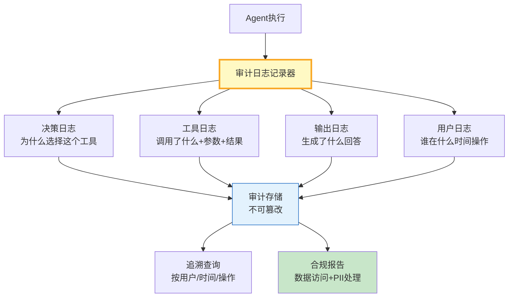

# Agent 审计日志与合规追溯指南

> Agent 做了什么决策、用了什么工具、回答了什么——这些操作必须可追溯。这篇指南讲透审计日志设计、合规记录和追溯查询。

---

## 一、审计日志架构



---

## 二、审计日志实现

```python
from dataclasses import dataclass, field
from datetime import datetime
from enum import Enum
from typing import Any, Optional
from collections import defaultdict
import json
import hashlib

class AuditAction(str, Enum):
    USER_INPUT = "user_input"          # 用户输入
    TOOL_CALL = "tool_call"            # 工具调用
    TOOL_RESULT = "tool_result"        # 工具结果
    LLM_CALL = "llm_call"              # LLM调用
    LLM_RESPONSE = "llm_response"      # LLM响应
    DECISION = "decision"              # 决策
    OUTPUT = "output"                  # 最终输出
    ERROR = "error"                    # 错误
    PII_REDACTED = "pii_redacted"      # PII脱敏
    ACCESS_DENIED = "access_denied"    # 访问拒绝

@dataclass
class AuditEntry:
    """审计日志条目。"""
    entry_id: str
    timestamp: str
    action: AuditAction
    user_id: str
    session_id: str
    details: dict = field(default_factory=dict)
    tool_name: str = ""
    input_summary: str = ""    # 输入摘要（已脱敏）
    output_summary: str = ""   # 输出摘要（已脱敏）
    duration_ms: float = 0.0
    status: str = "ok"
    hash: str = ""             # 用于完整性校验

    def compute_hash(self, previous_hash: str = "") -> str:
        """计算链式哈希——不可篡改。"""
        content = f"{self.entry_id}{self.timestamp}{self.action.value}{self.user_id}{previous_hash}"
        self.hash = hashlib.sha256(content.encode()).hexdigest()[:16]
        return self.hash


class AuditLogger:
    """审计日志记录器。"""

    def __init__(self):
        self._entries: list[AuditEntry] = []
        self._last_hash: str = ""
        self._counter = 0

    def log(self, action: AuditAction, user_id: str, session_id: str,
            details: dict = None, tool_name: str = "",
            input_summary: str = "", output_summary: str = "",
            duration_ms: float = 0.0, status: str = "ok") -> AuditEntry:
        """记录审计日志。"""
        self._counter += 1
        entry = AuditEntry(
            entry_id=f"audit-{datetime.now().strftime('%Y%m%d%H%M%S')}-{self._counter:06d}",
            timestamp=datetime.now().isoformat(),
            action=action,
            user_id=user_id,
            session_id=session_id,
            details=details or {},
            tool_name=tool_name,
            input_summary=self._redact_pii(input_summary),
            output_summary=self._redact_pii(output_summary),
            duration_ms=duration_ms,
            status=status,
        )
        entry.compute_hash(self._last_hash)
        self._last_hash = entry.hash
        self._entries.append(entry)
        return entry

    def _redact_pii(self, text: str) -> str:
        """脱敏PII。"""
        import re
        # 手机号
        text = re.sub(r'1[3-9]\d{9}', '[手机号]', text)
        # 邮箱
        text = re.sub(r'[\w.-]+@[\w.-]+\.\w+', '[邮箱]', text)
        # 身份证
        text = re.sub(r'\d{17}[\dXx]', '[身份证]', text)
        return text[:200]  # 限制长度

    def query(self, user_id: str = None, session_id: str = None,
              action: AuditAction = None, start_time: str = None,
              limit: int = 50) -> list[dict]:
        """查询审计日志。"""
        results = self._entries

        if user_id:
            results = [e for e in results if e.user_id == user_id]
        if session_id:
            results = [e for e in results if e.session_id == session_id]
        if action:
            results = [e for e in results if e.action == action]
        if start_time:
            results = [e for e in results if e.timestamp >= start_time]

        return [
            {
                "entry_id": e.entry_id,
                "timestamp": e.timestamp,
                "action": e.action.value,
                "user_id": e.user_id,
                "session_id": e.session_id,
                "tool": e.tool_name,
                "input": e.input_summary,
                "output": e.output_summary,
                "duration_ms": e.duration_ms,
                "status": e.status,
            }
            for e in results[-limit:]
        ]

    def get_session_trace(self, session_id: str) -> list[dict]:
        """获取一个会话的完整操作轨迹。"""
        return self.query(session_id=session_id, limit=200)

    def get_compliance_report(self, user_id: str = None, days: int = 7) -> dict:
        """生成合规报告。"""
        entries = self._entries
        if user_id:
            entries = [e for e in entries if e.user_id == user_id]

        action_dist = defaultdict(int)
        tool_dist = defaultdict(int)
        pii_count = 0
        denied_count = 0
        error_count = 0

        for e in entries:
            action_dist[e.action.value] += 1
            if e.tool_name:
                tool_dist[e.tool_name] += 1
            if e.action == AuditAction.PII_REDACTED:
                pii_count += 1
            if e.action == AuditAction.ACCESS_DENIED:
                denied_count += 1
            if e.status == "error":
                error_count += 1

        return {
            "report_date": datetime.now().isoformat(),
            "user_id": user_id or "all",
            "total_entries": len(entries),
            "action_distribution": dict(action_dist),
            "tool_usage": dict(tool_dist),
            "pii_redacted_count": pii_count,
            "access_denied_count": denied_count,
            "error_count": error_count,
            "unique_sessions": len(set(e.session_id for e in entries)),
        }

    def verify_integrity(self) -> bool:
        """验证日志链完整性。"""
        prev_hash = ""
        for entry in self._entries:
            expected = hashlib.sha256(
                f"{entry.entry_id}{entry.timestamp}{entry.action.value}{entry.user_id}{prev_hash}".encode()
            ).hexdigest()[:16]
            if entry.hash != expected:
                return False
            prev_hash = entry.hash
        return True


# 全局审计器
audit = AuditLogger()
```

### 与 Agent 集成

```python
from langchain_core.tools import tool
from langgraph.prebuilt import create_react_agent
from langchain_openai import ChatOpenAI
import time

llm = ChatOpenAI(model="gpt-4o-mini", temperature=0)

@tool
async def search_records(query: str, user_id: str = "user", session_id: str = "session") -> dict:
    """搜索记录。"""
    start = time.monotonic()
    audit.log(AuditAction.TOOL_CALL, user_id, session_id,
              tool_name="search_records", input_summary=f"query={query}",
              details={"query_length": len(query)})
    result = {"results": [f"记录: {query}"], "count": 1}
    audit.log(AuditAction.TOOL_RESULT, user_id, session_id,
              tool_name="search_records", output_summary=str(result)[:100],
              duration_ms=round((time.monotonic() - start) * 1000, 1))
    return result

# 审计中间件
class AuditedAgent:
    """带审计的Agent包装器。"""

    def __init__(self, agent):
        self.agent = agent

    async def ainvoke(self, messages: list, user_id: str = "user", session_id: str = "session"):
        # 记录用户输入
        user_input = messages[0].get("content", "") if isinstance(messages[0], dict) else str(messages[0])
        audit.log(AuditAction.USER_INPUT, user_id, session_id, input_summary=user_input[:200])

        # 记录LLM调用
        start = time.monotonic()
        result = await self.agent.ainvoke({"messages": messages})
        duration = (time.monotonic() - start) * 1000

        # 记录LLM响应
        response = result["messages"][-1].content
        audit.log(AuditAction.LLM_RESPONSE, user_id, session_id,
                  output_summary=response[:200], duration_ms=round(duration, 1))

        # 记录最终输出
        audit.log(AuditAction.OUTPUT, user_id, session_id,
                  output_summary=response[:100])

        return result
```

---

## 三、审计字段标准

| 字段 | 说明 | 必填 | 示例 |
|------|------|------|------|
| entry_id | 唯一ID | 是 | audit-20260827-000001 |
| timestamp | 精确时间 | 是 | 2026-08-27T14:00:00 |
| action | 操作类型 | 是 | tool_call |
| user_id | 用户标识 | 是 | user123 |
| session_id | 会话标识 | 是 | sess456 |
| tool_name | 工具名 | 否 | search_records |
| input_summary | 输入摘要(脱敏) | 否 | query=天气 |
| output_summary | 输出摘要(脱敏) | 否 | result=晴25度 |
| hash | 完整性校验 | 是 | a1b2c3d4e5f6 |

---

## 四、最佳实践

| 实践 | 说明 | 优先级 |
|------|------|--------|
| 链式哈希 | 防篡改 | ★★★ |
| PII自动脱敏 | 日志不存原始PII | ★★★ |
| 记录完整轨迹 | 每次操作都有记录 | ★★★ |
| 输入输出摘要 | 不存全文但可追溯 | ★★☆ |
| 合规报告 | 定期生成 | ★★☆ |
| 独立存储 | 审计日志不与应用日志混 | ★★☆ |

---

## 五、检查清单

| 检查项 | 状态 |
|--------|------|
| 有审计记录器 | ☐ |
| 有PII脱敏 | ☐ |
| 有链式哈希 | ☐ |
| 有追溯查询 | ☐ |
| 有合规报告 | ☐ |
| 有完整性校验 | ☐ |
