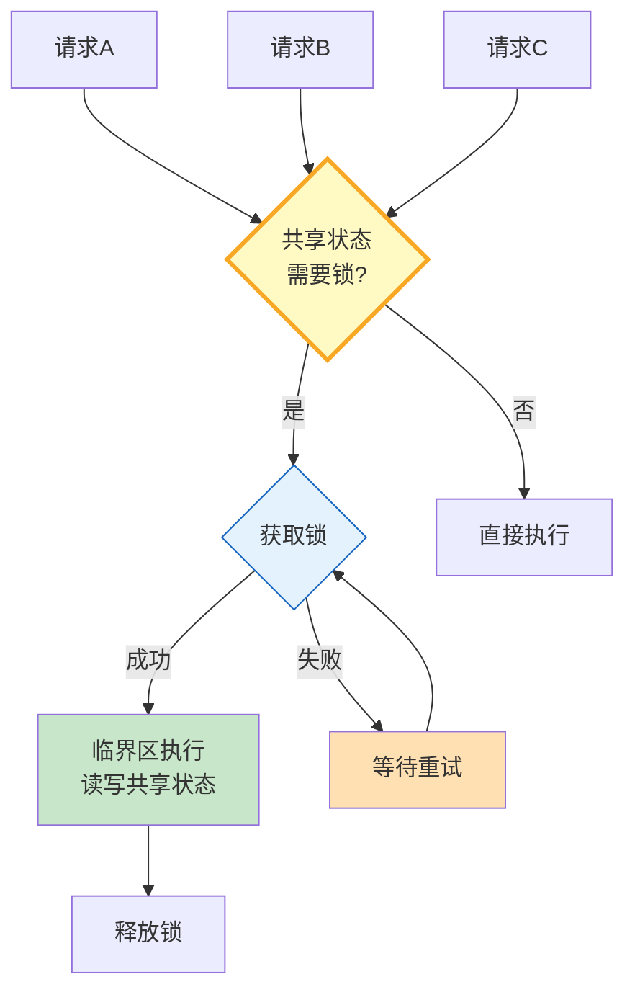

# Agent 并发安全与锁机制指南

> 多个请求同时修改同一个共享状态——数据被覆盖、工具被重复调用、缓存被打穿。这篇指南讲透并发安全、分布式锁和乐观/悲观锁选型。

---

## 一、并发安全架构



---

## 二、锁机制实现

```python
from dataclasses import dataclass, field
from datetime import datetime, timedelta
from enum import Enum
from typing import Any, Optional
import asyncio
import time
from collections import defaultdict

class LockType(str, Enum):
    OPTIMISTIC = "optimistic"  # 乐观锁：先执行后检查冲突
    PESSIMISTIC = "pessimistic"  # 悲观锁：先锁后执行
    DISTRIBUTED = "distributed"  # 分布式锁：跨进程

@dataclass
class LockConfig:
    """锁配置。"""
    lock_type: LockType = LockType.PESSIMISTIC
    acquire_timeout: float = 10.0   # 获取超时
    ttl: float = 30.0               # 锁TTL（防死锁）
    retry_interval: float = 0.1     # 重试间隔
    max_retries: int = 100           # 最大重试


class AsyncLock:
    """异步锁——悲观锁实现。"""

    def __init__(self, name: str, config: LockConfig = LockConfig()):
        self.name = name
        self.config = config
        self._locked = False
        self._owner: Optional[str] = None
        self._acquired_at: float = 0
        self._waiters: list[asyncio.Future] = []

    async def acquire(self, owner: str = "default") -> bool:
        """获取锁。"""
        deadline = time.monotonic() + self.config.acquire_timeout

        while time.monotonic() < deadline:
            if not self._locked:
                self._locked = True
                self._owner = owner
                self._acquired_at = time.monotonic()
                return True

            # 检查TTL——锁是否过期
            if self._locked and (time.monotonic() - self._acquired_at) > self.config.ttl:
                # 强制释放（防死锁）
                self._locked = False
                self._owner = owner
                self._acquired_at = time.monotonic()
                self._locked = True
                return True

            await asyncio.sleep(self.config.retry_interval)

        return False

    def release(self, owner: str = "default"):
        """释放锁。"""
        if self._owner == owner:
            self._locked = False
            self._owner = None

    @property
    def is_locked(self) -> bool:
        return self._locked

    def get_info(self) -> dict:
        return {
            "name": self.name,
            "locked": self._locked,
            "owner": self._owner,
            "held_seconds": round(time.monotonic() - self._acquired_at, 2) if self._locked else 0,
        }


class OptimisticLock:
    """乐观锁——版本号机制。"""

    def __init__(self, name: str):
        self.name = name
        self._version: int = 0

    def read(self) -> int:
        """读取当前版本。"""
        return self._version

    def write(self, expected_version: int) -> bool:
        """写入——如果版本不匹配则失败。"""
        if self._version != expected_version:
            return False  # 冲突
        self._version += 1
        return True

    @property
    def version(self) -> int:
        return self._version


class DistributedLock:
    """分布式锁——模拟Redis实现。"""

    def __init__(self, name: str, ttl: float = 30.0):
        self.name = name
        self.ttl = ttl
        self._store: dict[str, dict] = {}  # 模拟Redis: key -> {owner, expires_at}

    async def acquire(self, owner: str = "default") -> bool:
        """获取分布式锁。"""
        key = self.name
        now = time.monotonic()

        # 检查是否已被锁定
        existing = self._store.get(key)
        if existing and existing["expires_at"] > now:
            return False  # 已被锁定

        # 设置锁
        self._store[key] = {
            "owner": owner,
            "expires_at": now + self.ttl,
        }
        return True

    async def release(self, owner: str = "default") -> bool:
        """释放锁。"""
        key = self.name
        existing = self._store.get(key)

        if not existing:
            return True  # 已释放

        if existing["owner"] != owner:
            return False  # 不是锁的持有者

        del self._store[key]
        return True

    async def extend(self, owner: str = "default", seconds: float = 10.0) -> bool:
        """续期锁。"""
        key = self.name
        existing = self._store.get(key)

        if not existing or existing["owner"] != owner:
            return False

        existing["expires_at"] = time.monotonic() + seconds
        return True


class LockManager:
    """锁管理器。"""

    def __init__(self):
        self._local_locks: dict[str, AsyncLock] = {}
        self._optimistic_locks: dict[str, OptimisticLock] = {}
        self._distributed_locks: dict[str, DistributedLock] = {}
        self._stats = defaultdict(int)

    def local_lock(self, name: str, config: LockConfig = LockConfig()) -> AsyncLock:
        if name not in self._local_locks:
            self._local_locks[name] = AsyncLock(name, config)
        return self._local_locks[name]

    def optimistic_lock(self, name: str) -> OptimisticLock:
        if name not in self._optimistic_locks:
            self._optimistic_locks[name] = OptimisticLock(name)
        return self._optimistic_locks[name]

    def distributed_lock(self, name: str, ttl: float = 30.0) -> DistributedLock:
        if name not in self._distributed_locks:
            self._distributed_locks[name] = DistributedLock(name, ttl)
        return self._distributed_locks[name]

    def get_stats(self) -> dict:
        return {
            "local_locks": {n: l.get_info() for n, l in self._local_locks.items()},
            "optimistic_versions": {n: l.version for n, l in self._optimistic_locks.items()},
            "distributed_locks": {n: {"locked": bool(l._store.get(n))} for n, l in self._distributed_locks.items()},
            "stats": dict(self._stats),
        }


# 全局锁管理器
lock_manager = LockManager()


# ===== Agent并发安全场景 =====

class SafeSharedState:
    """线程安全的共享状态——用于多请求并发访问。"""

    def __init__(self):
        self._data: dict = {}
        self._lock = lock_manager.local_lock("shared_state")

    async def get(self, key: str) -> Any:
        """安全读取。"""
        return self._data.get(key)

    async def set(self, key: str, value: Any) -> bool:
        """安全写入。"""
        acquired = await self._lock.acquire(f"write_{key}")
        if not acquired:
            return False
        try:
            self._data[key] = value
            return True
        finally:
            self._lock.release(f"write_{key}")

    async def update(self, key: str, update_fn) -> Any:
        """安全更新——读-改-写。"""
        acquired = await self._lock.acquire(f"update_{key}")
        if not acquired:
            raise TimeoutError(f"获取锁超时: {key}")
        try:
            current = self._data.get(key)
            new_value = update_fn(current)
            self._data[key] = new_value
            return new_value
        finally:
            self._lock.release(f"update_{key}")
```

### 使用示例

```python
import asyncio

async def main():
    state = SafeSharedState()

    # 并发写入测试
    async def writer(writer_id: int):
        for i in range(3):
            await state.update("counter", lambda x: (x or 0) + 1)
            print(f"Writer{writer_id}: counter={await state.get('counter')}")
            await asyncio.sleep(0.01)

    # 5个并发写入
    await asyncio.gather(*[writer(i) for i in range(5)])

    final = await state.get("counter")
    print(f"\n最终counter: {final}")  # 应为15（无丢失更新）

    # 锁状态
    print(f"锁状态: {lock_manager.get_stats()['local_locks']}")

asyncio.run(main())
```

---

## 三、锁类型对比

| 锁类型 | 原理 | 优点 | 缺点 | 适用 |
|--------|------|------|------|------|
| 悲观锁 | 先锁后操作 | 无冲突 | 降低并发 | 写频繁 |
| 乐观锁 | 先操作后检查 | 高并发 | 需重试 | 读多写少 |
| 分布式锁 | 跨进程锁 | 跨服务 | 延迟高 | 多实例 |

---

## 四、最佳实践

| 实践 | 说明 | 优先级 |
|------|------|--------|
| 共享状态加锁 | 防止丢失更新 | ★★★ |
| 锁有TTL | 防止死锁 | ★★★ |
| 读多写少用乐观锁 | 高并发友好 | ★★☆ |
| 临界区尽量短 | 减少锁持有时间 | ★★★ |
| 锁要释放 | finally中释放 | ★★★ |
| 分布式用Redis锁 | 跨进程安全 | ★★☆ |

---

## 五、检查清单

| 检查项 | 状态 |
|--------|------|
| 有悲观锁 | ☐ |
| 有乐观锁 | ☐ |
| 有分布式锁 | ☐ |
| 有TTL防死锁 | ☐ |
| 有锁管理器 | ☐ |
| 有锁统计 | ☐ |
