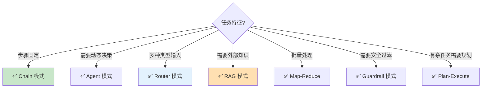

# LLM 应用设计模式

> 从"能跑"到"好维护"需要正确的设计模式。本指南总结 LLM 应用中反复验证的架构模式。

---

## 一、设计模式全景

```mermaid
graph TB
    subgraph LLM应用设计模式 {"六大设计模式"}
        P1["🔄 Router 路由模式<br/>根据输入分派到不同处理"]
        P2["⛓️ Chain 链模式<br/>固定步骤顺序执行"]
        P3["🤖 Agent 代理模式<br/>LLM动态决策"]
        P4["📚 RAG 检索增强模式<br/>外挂知识库"]
        P5["🔁 Map-Reduce 模式<br/>分而治之"]
        P6["🛡️ Guardrail 护栏模式<br/>输入输出双重过滤"]
    end

    style P1 fill:#E3F2FD
    style P2 fill:#C8E6C9
    style P3 fill:#FFF9C4
    style P4 fill:#FFE0B2
    style P5 fill:#F3E5F5
    style P6 fill:#FFCDD2
```

## 二、Router 路由模式

### 2.1 问题与方案

```mermaid
graph TB
    subgraph 问题 {"问题：一个Chain处理所有类型"}
        U["用户输入"] --> ONE["万能Chain<br/>(500字System Prompt)"]
        ONE --> BAD["❌ Prompt过长<br/>❌ 不同类型互相干扰<br/>❌ 难以维护"]
    end

    subgraph 方案 {"方案：Router模式"}
        U2["用户输入"] --> RT["路由判断"]
        RT -->|"类型A"| CA["Chain A<br/>(专注A的Prompt)"]
        RT -->|"类型B"| CB["Chain B<br/>(专注B的Prompt)"]
        RT -->|"类型C"| CC["Chain C<br/>(专注C的Prompt)"]
    end

    style 问题 fill:#FFCDD2
    style 方案 fill:#C8E6C9
```

### 2.2 实现

```python
from langchain_openai import ChatOpenAI
from langchain_core.prompts import ChatPromptTemplate
from langchain_core.output_parsers import StrOutputParser
from langchain_core.runnables import RunnableLambda

llm = ChatOpenAI(model="gpt-4o-mini", temperature=0)

# 定义不同类型的处理链
tech_chain = (
    ChatPromptTemplate.from_template("你是技术专家。回答：{input}")
    | llm | StrOutputParser()
)
chat_chain = (
    ChatPromptTemplate.from_template("你是友好的聊天伙伴。回应：{input}")
    | llm | StrOutputParser()
)
translate_chain = (
    ChatPromptTemplate.from_template("翻译为英文：{input}")
    | llm | StrOutputParser()
)

# 路由函数
def route(input_data: dict) -> str:
    text = input_data["input"]
    # 简单关键词路由（实际可用LLM分类）
    if any(w in text for w in ["代码", "bug", "编程", "技术"]):
        return "tech"
    elif any(w in text for w in ["翻译", "translate"]):
        return "translate"
    else:
        return "chat"

# 用RunnableBranch实现路由
from langchain_core.runnables import RunnableBranch

router = RunnableBranch(
    (lambda x: route(x) == "tech", tech_chain),
    (lambda x: route(x) == "translate", translate_chain),
    chat_chain,  # 默认
)
```

### 2.3 LangGraph 中的 Router

```python
from langgraph.graph import StateGraph, START, END
from typing import TypedDict

class RouterState(TypedDict):
    input: str
    category: str
    output: str

def classify_node(state: RouterState) -> dict:
    # 用LLM分类
    prompt = ChatPromptTemplate.from_template(
        "判断类型(tech/chat/translate)：{input}\n类型："
    )
    category = (prompt | llm | StrOutputParser()).invoke({"input": state["input"]})
    return {"category": category.strip()}

def route(state: RouterState) -> str:
    return state.get("category", "chat")

graph = StateGraph(RouterState)
graph.add_node("classify", classify_node)
graph.add_node("tech", tech_node)
graph.add_node("chat", chat_node)
graph.add_node("translate", translate_node)

graph.add_edge(START, "classify")
graph.add_conditional_edges("classify", route, {
    "tech": "tech", "chat": "chat", "translate": "translate"
})
for n in ["tech", "chat", "translate"]:
    graph.add_edge(n, END)
```

## 三、Chain 链模式

### 3.1 何时使用

```mermaid
graph LR
    subgraph 适合Chain {"适合 Chain 模式"}
        S1["步骤固定且可预测"]
        S2["每步输入输出类型明确"]
        S3["不需要动态决策"]
        S4["性能优先"]
    end

    style 适合Chain fill:#C8E6C9
```

### 3.2 多级链模式

```python
# 两级链：先提取→后生成
extract_chain = (
    ChatPromptTemplate.from_template("从以下文本提取关键词：{text}")
    | llm | StrOutputParser()
)

summary_chain = (
    ChatPromptTemplate.from_template("基于关键词写摘要：{keywords}")
    | llm | StrOutputParser()
)

# 串联
full_chain = (
    {"keywords": extract_chain, "text": lambda x: x["text"]}
    | RunnableLambda(lambda x: {"keywords": x["keywords"]})
    | summary_chain
)
```

## 四、Agent 代理模式

### 4.1 Agent 模式的变体

```mermaid
graph TB
    subgraph Agent变体 {"Agent 模式变体"}
        A1["ReAct Agent<br/>思考-行动-观察循环<br/>最通用"]
        A2["Plan-and-Execute<br/>先规划全部步骤→再执行<br/>适合复杂任务"]
        A3["Supervisor<br/>主控Agent调度子Agent<br/>适合多Agent"]
        A4["Reflection<br/>生成→自我评价→改进<br/>适合高质量输出"]
    end

    style A1 fill:#C8E6C9
    style A2 fill:#E3F2FD
    style A3 fill:#FFF9C4
    style A4 fill:#FFE0B2
```

### 4.2 Plan-and-Execute 模式

```python
from langgraph.graph import StateGraph, START, END
from typing import TypedDict, Annotated
from operator import add

class PlanExecuteState(TypedDict):
    input: str
    plan: list[str]        # 计划步骤列表
    past_steps: Annotated[list, add]  # 已完成步骤
    response: str

def plan_node(state: PlanExecuteState) -> dict:
    """规划阶段：LLM生成完整计划"""
    prompt = ChatPromptTemplate.from_template(
        """为以下任务制定2-4个步骤的计划，每步一句话：
        任务：{input}
        计划："""
    )
    result = (prompt | llm | StrOutputParser()).invoke({"input": state["input"]})
    steps = [s.strip() for s in result.split("\n") if s.strip()]
    return {"plan": steps}

def execute_node(state: PlanExecuteState) -> dict:
    """执行阶段：执行计划的第一个未完成步骤"""
    remaining = [s for s in state["plan"] if s not in state.get("past_steps", [])]
    if not remaining:
        return {"response": "所有步骤已完成"}

    current_step = remaining[0]
    prompt = ChatPromptTemplate.from_template("执行步骤：{step}\n结果：")
    result = (prompt | llm | StrOutputParser()).invoke({"step": current_step})
    return {"past_steps": [f"{current_step}: {result}"]}

def should_continue(state: PlanExecuteState) -> str:
    remaining = [s for s in state["plan"] if s not in state.get("past_steps", [])]
    return "continue" if remaining else "done"

graph = StateGraph(PlanExecuteState)
graph.add_node("plan", plan_node)
graph.add_node("execute", execute_node)
graph.add_edge(START, "plan")
graph.add_edge("plan", "execute")
graph.add_conditional_edges("execute", should_continue, {
    "continue": "execute", "done": END
})
app = graph.compile()
```

## 五、模式组合：真实应用架构

```mermaid
graph TB
    subgraph 真实应用 {"真实LLM应用 = 多种模式组合"}
        U["用户输入"] --> GUARD_IN["🛡️ 输入护栏<br/>过滤恶意输入"]
        GUARD_IN --> ROUTER["🔄 Router<br/>意图分类"]
        ROUTER -->|"知识查询"| RAG["📚 RAG<br/>检索+生成"]
        ROUTER -->|"任务执行"| AGENT["🤖 Agent<br/>工具调用"]
        ROUTER -->|"闲聊"| CHAIN["⛓️ Chain<br/>简单回复"]
        RAG & AGENT & CHAIN --> GUARD_OUT["🛡️ 输出护栏<br/>过滤不当输出"]
        GUARD_OUT --> OUT["返回用户"]
    end

    style GUARD_IN fill:#FFCDD2
    style ROUTER fill:#E3F2FD
    style RAG fill:#FFE0B2
    style AGENT fill:#FFF9C4
    style GUARD_OUT fill:#FFCDD2
    style OUT fill:#C8E6C9
```

## 六、模式选择决策



## 七、反模式：何时不用这些模式

| 不要用... | 当... | 改用... |
|-----------|-------|--------|
| Agent 模式 | 步骤固定可预测 | Chain 模式 |
| Router 模式 | 只有一种输入类型 | 直接 Chain |
| RAG 模式 | 模型已有足够知识 | 直接调用 LLM |
| Map-Reduce | 数据量小（<5块） | 直接处理 |
| 多Agent | 任务简单（1-2步） | 单Agent 或 Chain |
| Plan-Execute | 任务只有2步 | 直接Chain串联 |
