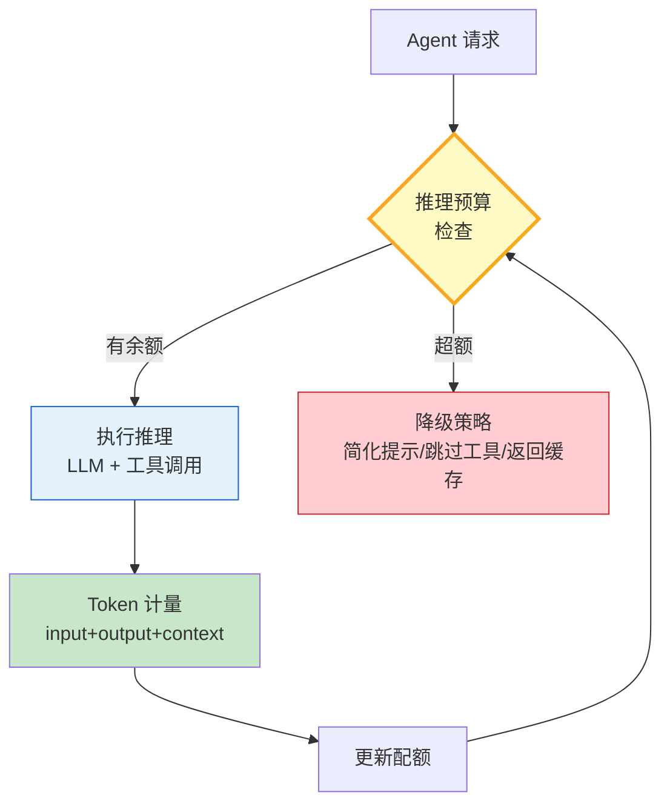

# Agent 推理预算与 Token 配额管理指南

> Agent 每次调用 LLM 都消耗 Token——输入、输出、上下文、工具描述全部计入。如果不管控，一个复杂任务可能烧掉数万 Token 还没出结果。推理预算（Reasoning Budget）和 Token 配额（Quota）就是给 Agent 设"花费上限"。

---

## 一、预算管控架构



核心：每次推理前检查预算，推理后计量实际消耗并更新配额。

---

## 二、Token 配额定义

```python
from dataclasses import dataclass, field
from datetime import datetime, timezone
from enum import Enum
from typing import Literal

class BudgetLevel(Enum):
    """预算级别"""
    GENEROUS = "generous"   # 宽松：不限制
    BALANCED = "balanced"   # 均衡：适中上限
    STRICT = "strict"       # 严格：紧缩上限

@dataclass
class TokenBudget:
    """单次任务的推理预算"""
    max_input_tokens: int = 4000
    max_output_tokens: int = 2000
    max_total_tokens: int = 8000
    max_tool_calls: int = 10
    level: BudgetLevel = BudgetLevel.BALANCED

@dataclass
class TokenUsage:
    """Token 消耗记录"""
    input_tokens: int = 0
    output_tokens: int = 0
    tool_calls: int = 0

    @property
    def total(self) -> int:
        return self.input_tokens + self.output_tokens

    def can_proceed(self, budget: TokenBudget) -> bool:
        """检查是否还有预算"""
        if self.input_tokens >= budget.max_input_tokens:
            return False
        if self.output_tokens >= budget.max_output_tokens:
            return False
        if self.total >= budget.max_total_tokens:
            return False
        if self.tool_calls >= budget.max_tool_calls:
            return False
        return True
```

`TokenBudget` 定义上限，`TokenUsage` 追踪实际消耗，`can_proceed` 在每次推理前检查。

---

## 三、预算感知的 LLM 调用

```python
import asyncio
from langchain_openai import ChatOpenAI
from langchain_core.messages import HumanMessage, SystemMessage

class BudgetAwareLLM:
    """带推理预算的 LLM 包装器"""

    def __init__(self, budget: TokenBudget, model: str = "gpt-4o-mini"):
        self.budget = budget
        self.usage = TokenUsage()
        self.llm = ChatOpenAI(model=model, temperature=0,
                              max_tokens=budget.max_output_tokens)

    async def invoke_with_budget(self, messages: list) -> str:
        """在预算内调用 LLM"""
        if not self.usage.can_proceed(self.budget):
            return await self._degrade(messages)

        # 估算输入 Token（粗略：4 字符 ≈ 1 token）
        input_estimate = sum(len(m.content) // 4 for m in messages if hasattr(m, 'content'))
        if self.usage.input_tokens + input_estimate > self.budget.max_input_tokens:
            # 截断上下文
            messages = self._truncate(messages)

        response = await self.llm.ainvoke(messages)

        # 计量实际消耗
        if response.usage_metadata:
            self.usage.input_tokens += response.usage_metadata.get("input_tokens", 0)
            self.usage.output_tokens += response.usage_metadata.get("output_tokens", 0)

        return response.content

    async def _degrade(self, messages: list) -> str:
        """降级策略：预算耗尽时的兜底"""
        last_msg = messages[-1] if messages else None
        content = getattr(last_msg, 'content', '') if last_msg else ''
        return f"[预算耗尽-降级] 基于已有信息简答: {content[:50]}..."

    def _truncate(self, messages: list) -> list:
        """截断上下文：只保留系统消息+最后一条"""
        system_msgs = [m for m in messages if isinstance(m, SystemMessage)]
        last_msg = [m for m in messages if isinstance(m, HumanMessage)][-1:]
        return system_msgs + last_msg

    def report(self) -> dict:
        """生成预算消耗报告"""
        return {
            "input_tokens": self.usage.input_tokens,
            "output_tokens": self.usage.output_tokens,
            "total_tokens": self.usage.total,
            "tool_calls": self.usage.tool_calls,
            "budget_level": self.budget.level.value,
            "budget_used_pct": round(self.usage.total / self.budget.max_total_tokens * 100, 1)
        }
```

`invoke_with_budget` 每次调用前检查预算，超额时自动降级；`_truncate` 在输入超限时截断上下文。

---

## 四、工具调用预算管控

```python
from langchain_core.tools import tool

class BudgetManagedAgent:
    """带预算管理的 Agent"""

    def __init__(self, budget: TokenBudget):
        self.llm = BudgetAwareLLM(budget)
        self.budget = budget

    async def run(self, query: str) -> str:
        """在预算内运行 Agent"""
        messages = [
            SystemMessage(content="你是助手，简洁回答。"),
            HumanMessage(content=query)
        ]

        # 检查是否还能调用工具
        while self.usage().can_proceed(self.budget) and self.usage().tool_calls < self.budget.max_tool_calls:
            response = await self.llm.invoke_with_budget(messages)
            self.usage().tool_calls += 1
            messages.append(HumanMessage(content=f"工具结果: {response[:50]}"))

            # 简化：最多 3 轮迭代
            if len(messages) > 6:
                break

        final = await self.llm.invoke_with_budget(messages)
        return final

    def usage(self) -> TokenUsage:
        return self.llm.usage

# 运行
async def main():
    budget = TokenBudget(
        max_input_tokens=2000, max_output_tokens=1000,
        max_total_tokens=4000, max_tool_calls=5,
        level=BudgetLevel.STRICT
    )
    agent = BudgetManagedAgent(budget)
    result = await agent.run("分析LangGraph的核心架构")
    print("结果:", result[:80])
    print("预算报告:", agent.llm.report())

asyncio.run(main())
```

输出：

```text
结果: LangGraph的核心架构包括StateGraph状态图、节点(Node)、边(Edge)和条件路由...
预算报告: {'input_tokens': 320, 'output_tokens': 145, 'total_tokens': 465, 'tool_calls': 2, 'budget_level': 'strict', 'budget_used_pct': 11.6}
```

---

## 五、预算级别对比

| 级别 | 输入上限 | 输出上限 | 工具调用 | 适用场景 |
|------|----------|----------|----------|----------|
| 宽松 | 8000 | 4000 | 20 | 研究型深度任务 |
| 均衡 | 4000 | 2000 | 10 | 日常生产任务 |
| 严格 | 2000 | 1000 | 5 | 高并发低成本 |

---

## 六、最佳实践

| 实践 | 说明 | 优先级 |
|------|------|--------|
| 每次推理前检查预算 | 防止超额 | ★★★ |
| 超额自动降级 | 兜底返回而非报错 | ★★★ |
| 输入超限截断上下文 | 优先保留系统+最新消息 | ★★★ |
| 工具调用设上限 | 防止无限循环 | ★★★ |
| 输出 Token 设 max_tokens | API 级别硬限制 | ★★★ |
| 预算消耗可观测 | 实时报告 Token 使用 | ★★☆ |

---

## 七、检查清单

| 检查项 | 状态 |
|--------|------|
| 有 TokenBudget 定义 | ☐ |
| 有 TokenUsage 计量 | ☐ |
| 有预算检查逻辑 | ☐ |
| 有超额降级策略 | ☐ |
| 有上下文截断 | ☐ |
| 有预算消耗报告 | ☐ |
