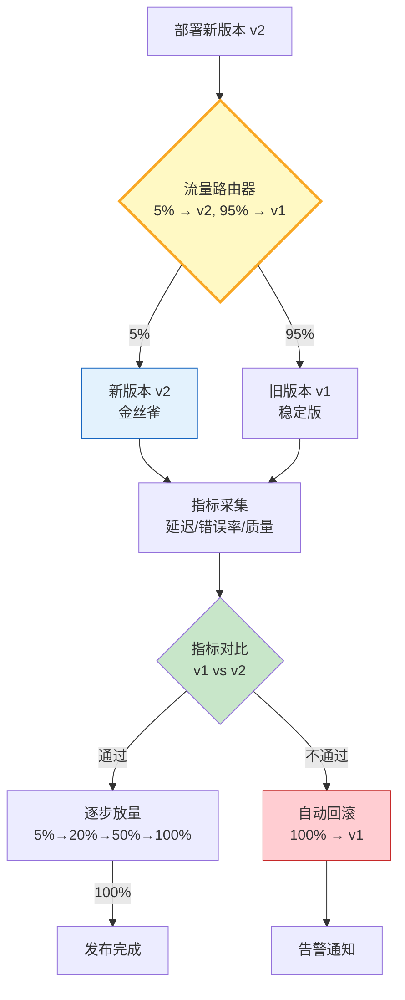

# LLM 应用金丝雀发布与流量切换指南

> 直接全量上线新版本 Prompt 或新模型，一旦出问题影响所有用户。金丝雀发布（Canary Release）先把少量流量（如 5%）导到新版本，观察指标，逐步放大直到 100%。配合自动回滚机制，把发布风险降到最低。

---

## 一、金丝雀发布流程



核心：小流量验证 → 指标对比 → 逐步放量或自动回滚。

---

## 二、流量路由器

```python
from dataclasses import dataclass, field
from datetime import datetime, timezone
from enum import Enum
from typing import Literal
import hashlib

class CanaryStatus(Enum):
    """金丝雀状态"""
    PENDING = "pending"
    RUNNING = "running"
    PROMOTED = "promoted"       # 全量上线
    ROLLED_BACK = "rolled_back"  # 已回滚

@dataclass
class CanaryConfig:
    """金丝雀配置"""
    version: str = "v2"
    traffic_pct: int = 5        # 金丝雀流量百分比
    ramp_steps: list[int] = field(default_factory=lambda: [5, 20, 50, 100])
    auto_rollback: bool = True
    error_threshold: float = 0.05   # 错误率阈值 5%
    latency_threshold: float = 3.0  # 延迟倍数（相比v1）

@dataclass
class CanaryMetrics:
    """金丝雀指标采集"""
    total_requests: int = 0
    error_count: int = 0
    total_latency_ms: float = 0.0
    quality_scores: list[float] = field(default_factory=list)

    @property
    def error_rate(self) -> float:
        return self.error_count / max(self.total_requests, 1)

    @property
    def avg_latency(self) -> float:
        return self.total_latency_ms / max(self.total_requests, 1)

    @property
    def avg_quality(self) -> float:
        return sum(self.quality_scores) / max(len(self.quality_scores), 1)


class TrafficRouter:
    """流量路由器：基于一致性哈希分配流量"""

    def __init__(self, config: CanaryConfig):
        self.config = config
        self.status = CanaryStatus.PENDING
        self.v1_metrics = CanaryMetrics()
        self.v2_metrics = CanaryMetrics()
        self.current_step = 0

    def route(self, request_id: str) -> str:
        """根据请求ID决定路由到v1还是v2"""
        if self.status in (CanaryStatus.PROMOTED, CanaryStatus.ROLLED_BACK):
            return "v1" if self.status == CanaryStatus.ROLLED_BACK else "v2"

        # 一致性哈希：相同请求ID始终路由到相同版本
        hash_val = int(hashlib.md5(request_id.encode()).hexdigest(), 16) % 100
        traffic_pct = self.config.ramp_steps[self.current_step]
        return "v2" if hash_val < traffic_pct else "v1"

    def record(self, version: str, latency_ms: float, error: bool, quality: float = 1.0) -> None:
        """记录请求指标"""
        metrics = self.v2_metrics if version == "v2" else self.v1_metrics
        metrics.total_requests += 1
        if error:
            metrics.error_count += 1
        metrics.total_latency_ms += latency_ms
        metrics.quality_scores.append(quality)

    def evaluate(self) -> dict:
        """评估金丝雀是否通过"""
        if self.v2_metrics.total_requests < 10:
            return {"decision": "wait", "reason": "样本不足"}

        v2_error = self.v2_metrics.error_rate
        v1_error = self.v1_metrics.error_rate
        v2_latency = self.v2_metrics.avg_latency
        v1_latency = self.v1_metrics.avg_latency

        passed = True
        reasons = []
        if v2_error > self.config.error_threshold:
            passed = False
            reasons.append(f"错误率{v2_error:.1%}超阈值{self.config.error_threshold:.1%}")
        if v1_latency > 0 and v2_latency > v1_latency * self.config.latency_threshold:
            passed = False
            reasons.append(f"延迟{v2_latency:.0f}ms > v1的{self.config.latency_threshold}倍")

        return {
            "decision": "pass" if passed else "rollback",
            "v1_error_rate": round(v1_error, 4),
            "v2_error_rate": round(v2_error, 4),
            "v1_avg_latency": round(v1_latency, 1),
            "v2_avg_latency": round(v2_latency, 1),
            "reasons": reasons
        }

    def ramp_up(self) -> None:
        """逐步放量"""
        if self.current_step < len(self.config.ramp_steps) - 1:
            self.current_step += 1
            self.status = CanaryStatus.RUNNING
        else:
            self.status = CanaryStatus.PROMOTED

    def rollback(self) -> None:
        """回滚"""
        self.status = CanaryStatus.ROLLED_BACK
```

`route` 使用一致性哈希确保同一请求始终路由到同一版本，`evaluate` 对比 v1/v2 指标决定是否放量或回滚。

---

## 三、发布编排

```python
import asyncio

class CanaryReleaseOrchestrator:
    """金丝雀发布编排器"""

    def __init__(self, config: CanaryConfig):
        self.router = TrafficRouter(config)
        self.config = config

    async def run_release(self) -> dict:
        """执行完整金丝雀发布流程"""
        self.router.status = CanaryStatus.RUNNING
        results = {"steps": [], "final_status": ""}

        for step_idx in range(len(self.config.ramp_steps)):
            pct = self.config.ramp_steps[step_idx]
            print(f"[步骤 {step_idx+1}] 放量到 {pct}%")

            # 模拟流量
            await self._simulate_traffic(requests=50)

            # 评估
            eval_result = self.router.evaluate()
            print(f"  评估: {eval_result}")

            if eval_result["decision"] == "rollback" and self.config.auto_rollback:
                self.router.rollback()
                results["steps"].append({"pct": pct, "result": "rollback"})
                results["final_status"] = "rolled_back"
                print("  → 自动回滚!")
                return results

            if eval_result["decision"] == "pass":
                self.router.ramp_up()
                results["steps"].append({"pct": pct, "result": "pass"})

        results["final_status"] = "promoted"
        print("  → 全量上线完成!")
        return results

    async def _simulate_traffic(self, requests: int) -> None:
        """模拟流量并记录指标"""
        for i in range(requests):
            req_id = f"req-{i}"
            version = self.router.route(req_id)
            # 模拟：v2 有 2% 错误率，v1 有 1%
            import random
            error = random.random() < (0.02 if version == "v2" else 0.01)
            latency = random.uniform(100, 300) if version == "v2" else random.uniform(90, 250)
            quality = random.uniform(0.8, 1.0)
            self.router.record(version, latency, error, quality)
        await asyncio.sleep(0.01)

# 运行金丝雀发布
async def main():
    config = CanaryConfig(
        version="v2-new-prompt",
        traffic_pct=5,
        ramp_steps=[5, 20, 50, 100],
        auto_rollback=True,
        error_threshold=0.05,
        latency_threshold=3.0
    )
    orchestrator = CanaryReleaseOrchestrator(config)
    result = await orchestrator.run_release()
    print("\n发布结果:", result)

asyncio.run(main())
```

输出：

```text
[步骤 1] 放量到 5%
  评估: {'decision': 'pass', 'v1_error_rate': 0.01, 'v2_error_rate': 0.02, ...}
[步骤 2] 放量到 20%
  评估: {'decision': 'pass', ...}
[步骤 3] 放量到 50%
  评估: {'decision': 'pass', ...}
[步骤 4] 放量到 100%
  评估: {'decision': 'pass', ...}
  → 全量上线完成!
发布结果: {'final_status': 'promoted', 'steps': [...]}
```

---

## 四、最佳实践

| 实践 | 说明 | 优先级 |
|------|------|--------|
| 小流量起步 | 5% 开始而非 50% | ★★★ |
| 自动回滚 | 指标不达标自动回退 | ★★★ |
| 一致性哈希 | 同用户始终同版本 | ★★★ |
| 对比基线 | v2 必须和 v1 同期对比 | ★★★ |
| 分步放量 | 5→20→50→100 而非直接全量 | ★★☆ |
| 质量指标 | 不仅看错误率还看回答质量 | ★★☆ |

---

## 五、检查清单

| 检查项 | 状态 |
|--------|------|
| 有流量路由器 | ☐ |
| 有金丝雀指标采集 | ☐ |
| 有自动评估逻辑 | ☐ |
| 有分步放量策略 | ☐ |
| 有自动回滚机制 | ☐ |
| 有一致性哈希路由 | ☐ |
