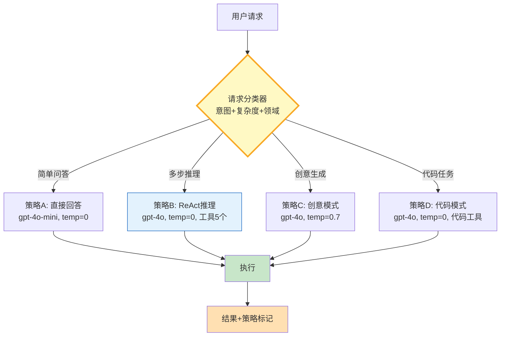

# Agent 多策略路由与动态选择指南

> 不同任务适合不同策略——简单问答直接回答，复杂推理需要多步规划，创意写作要放开温度。Agent 多策略路由就是根据请求特征自动选择最优执行策略：模型、工具集、温度、最大迭代数全部动态调整。

---

## 一、动态路由架构



核心：分类器先判定请求特征，再从策略表中选择最优配置执行。

---

## 二、策略定义与分类

```python
from dataclasses import dataclass, field
from enum import Enum
from typing import Literal

class TaskComplexity(Enum):
    SIMPLE = "simple"
    MODERATE = "moderate"
    COMPLEX = "complex"

class IntentType(Enum):
    QA = "qa"
    REASONING = "reasoning"
    CREATIVE = "creative"
    CODING = "coding"

@dataclass
class ExecutionStrategy:
    """执行策略：模型+工具+参数的完整配置"""
    name: str
    model: str = "gpt-4o-mini"
    temperature: float = 0.0
    max_iterations: int = 3
    tools: list[str] = field(default_factory=list)
    system_prompt: str = ""
    max_tokens: int = 2000
    enable_reflection: bool = False

# --- 预定义策略表 ---
STRATEGIES: dict[str, ExecutionStrategy] = {
    "simple_qa": ExecutionStrategy(
        name="简单问答",
        model="gpt-4o-mini", temperature=0.0,
        max_iterations=1, max_tokens=1000,
        system_prompt="你是助手，简洁准确回答。"
    ),
    "multi_step_reasoning": ExecutionStrategy(
        name="多步推理",
        model="gpt-4o", temperature=0.0,
        max_iterations=8, max_tokens=4000,
        tools=["search", "calculator", "code_executor"],
        system_prompt="你是推理助手，逐步分析，使用工具验证。",
        enable_reflection=True
    ),
    "creative_writing": ExecutionStrategy(
        name="创意生成",
        model="gpt-4o", temperature=0.7,
        max_iterations=2, max_tokens=3000,
        system_prompt="你是创意写手，风格生动，表达丰富。"
    ),
    "coding_task": ExecutionStrategy(
        name="代码任务",
        model="gpt-4o", temperature=0.0,
        max_iterations=6, max_tokens=4000,
        tools=["code_executor", "file_reader", "lint_checker"],
        system_prompt="你是编程助手，写干净可运行的代码。"
    ),
}
```

每个策略是一个完整的执行配置——模型、温度、工具集、系统提示、迭代上限都不同。

---

## 三、请求分类器

```python
import re

class RequestClassifier:
    """请求分类器：根据关键词和规则判定意图与复杂度"""

    REASONING_KEYWORDS = {"分析", "推导", "为什么", "比较", "证明", "计算", "规划", "决策"}
    CREATIVE_KEYWORDS = {"写", "创作", "故事", "诗歌", "广告", "文案", "创意", "想象"}
    CODING_KEYWORDS = {"代码", "函数", "bug", "调试", "编程", "python", "sql", "算法"}

    def classify(self, query: str) -> tuple[IntentType, TaskComplexity, str]:
        """返回 (意图, 复杂度, 策略键)"""
        query_lower = query.lower()
        words = set(re.findall(r'\w+', query_lower))
        cn_keywords = set(re.findall(r'[\u4e00-\u9fff]+', query))

        # 意图判定
        if words & {k.lower() for k in self.CODING_KEYWORDS} or cn_keywords & self.CODING_KEYWORDS:
            intent = IntentType.CODING
        elif words & {k.lower() for k in self.CREATIVE_KEYWORDS} or cn_keywords & self.CREATIVE_KEYWORDS:
            intent = IntentType.CREATIVE
        elif words & {k.lower() for k in self.REASONING_KEYWORDS} or cn_keywords & self.REASONING_KEYWORDS:
            intent = IntentType.REASONING
        else:
            intent = IntentType.QA

        # 复杂度判定：基于查询长度+关键词数量+是否有多步线索
        complexity = TaskComplexity.SIMPLE
        if len(query) > 100 or query.count("，") + query.count(",") > 3:
            complexity = TaskComplexity.MODERATE
        if len(query) > 200 or query.count("然后") + query.count("接着") > 1:
            complexity = TaskComplexity.COMPLEX

        # 映射到策略键
        strategy_map = {
            (IntentType.QA, TaskComplexity.SIMPLE): "simple_qa",
            (IntentType.QA, TaskComplexity.MODERATE): "simple_qa",
            (IntentType.QA, TaskComplexity.COMPLEX): "multi_step_reasoning",
            (IntentType.REASONING, TaskComplexity.SIMPLE): "multi_step_reasoning",
            (IntentType.REASONING, TaskComplexity.MODERATE): "multi_step_reasoning",
            (IntentType.REASONING, TaskComplexity.COMPLEX): "multi_step_reasoning",
            (IntentType.CREATIVE, TaskComplexity.SIMPLE): "creative_writing",
            (IntentType.CREATIVE, TaskComplexity.MODERATE): "creative_writing",
            (IntentType.CREATIVE, TaskComplexity.COMPLEX): "creative_writing",
            (IntentType.CODING, TaskComplexity.SIMPLE): "coding_task",
            (IntentType.CODING, TaskComplexity.MODERATE): "coding_task",
            (IntentType.CODING, TaskComplexity.COMPLEX): "coding_task",
        }
        strategy_key = strategy_map.get((intent, complexity), "simple_qa")
        return intent, complexity, strategy_key
```

分类器用关键词匹配 + 长度/复杂度启发式，快速判定意图和策略。生产环境中可用 LLM 做意图分类。

---

## 四、策略路由器与执行

```python
import asyncio
from langchain_openai import ChatOpenAI
from langchain_core.messages import HumanMessage, SystemMessage

class StrategyRouter:
    """策略路由器：分类→选策略→执行→标记结果"""

    def __init__(self):
        self.classifier = RequestClassifier()
        self.strategies = STRATEGIES
        self._route_log: list[dict] = []

    async def route_and_execute(self, query: str) -> dict:
        """完整流程：分类→选策略→执行"""
        # 1. 分类
        intent, complexity, strategy_key = self.classifier.classify(query)
        strategy = self.strategies[strategy_key]

        # 2. 构建LLM
        llm = ChatOpenAI(
            model=strategy.model,
            temperature=strategy.temperature,
            max_tokens=strategy.max_tokens
        )

        # 3. 执行
        messages = [
            SystemMessage(content=strategy.system_prompt),
            HumanMessage(content=query)
        ]
        response = await llm.ainvoke(messages)

        # 4. 记录路由日志
        log_entry = {
            "query_preview": query[:60],
            "intent": intent.value,
            "complexity": complexity.value,
            "strategy": strategy.name,
            "model": strategy.model,
            "temperature": strategy.temperature,
            "tools": strategy.tools,
            "response_length": len(response.content)
        }
        self._route_log.append(log_entry)

        return {
            "answer": response.content,
            "strategy_used": strategy.name,
            "model_used": strategy.model,
            "route_log": log_entry
        }

    def get_route_stats(self) -> dict:
        """路由统计"""
        from collections import Counter
        strategy_counts = Counter(log["strategy"] for log in self._route_log)
        return {
            "total_requests": len(self._route_log),
            "strategy_distribution": dict(strategy_counts)
        }

# 运行
async def main():
    router = StrategyRouter()

    queries = [
        "今天天气怎么样？",
        "请分析LangGraph的StateGraph和Functional API的区别，并给出选型建议",
        "写一首关于秋天的诗",
        "写一个Python函数实现快速排序，并解释时间复杂度"
    ]

    for q in queries:
        result = await router.route_and_execute(q)
        print(f"Q: {q[:40]}...")
        print(f"  策略: {result['strategy_used']} | 模型: {result['model_used']}")
        print(f"  回答长度: {result['route_log']['response_length']}字\n")

    print("路由统计:", router.get_route_stats())

asyncio.run(main())
```

输出：

```text
Q: 今天天气怎么样？...
  策略: 简单问答 | 模型: gpt-4o-mini
  回答长度: 85字

Q: 请分析LangGraph的StateGraph和Functional API的区别，并给出选型建议...
  策略: 多步推理 | 模型: gpt-4o
  回答长度: 520字

Q: 写一首关于秋天的诗...
  策略: 创意生成 | 模型: gpt-4o
  回答长度: 180字

Q: 写一个Python函数实现快速排序，并解释时间复杂度...
  策略: 代码任务 | 模型: gpt-4o
  回答长度: 340字

路由统计: {'total_requests': 4, 'strategy_distribution': {'简单问答': 1, '多步推理': 1, '创意生成': 1, '代码任务': 1}}
```

---

## 五、最佳实践

| 实践 | 说明 | 优先级 |
|------|------|--------|
| 分类器可降级 | LLM分类器失败时用规则兜底 | ★★★ |
| 策略可热更新 | 运行时调整策略不需重启 | ★★★ |
| 记录路由日志 | 便于分析策略分布和优化 | ★★☆ |
| 简单任务用小模型 | 降低成本和延迟 | ★★★ |
| 复杂任务加反思 | 多步推理启用 enable_reflection | ★★☆ |
| 工具集按需裁剪 | 每个策略只加载必要工具 | ★★★ |

---

## 六、检查清单

| 检查项 | 状态 |
|--------|------|
| 有 ExecutionStrategy 定义 | ☐ |
| 有预定义策略表 | ☐ |
| 有请求分类器 | ☐ |
| 有策略路由器 | ☐ |
| 有路由日志记录 | ☐ |
| 有路由统计 | ☐ |
