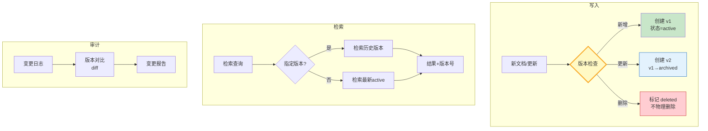

# RAG 知识库版本管理与文档变更追踪指南

> 知识库不是静态的——文档会更新、删除、新增。如果直接覆盖，旧版本的回答无法复现，被删的文档导致引用断裂。版本管理给知识库加上"时间轴"：每次变更记录版本号，检索可指定版本，变更可追溯。

---

## 一、版本管理架构



核心：文档不覆盖，每次变更创建新版本；删除只是标记状态；检索可指定版本。

---

## 二、文档版本模型

```python
from dataclasses import dataclass, field
from datetime import datetime, timezone
from enum import Enum
from typing import Any
from uuid import uuid4

class DocStatus(Enum):
    ACTIVE = "active"         # 当前生效
    ARCHIVED = "archived"     # 历史归档
    DELETED = "deleted"       # 软删除

class ChangeType(Enum):
    CREATED = "created"
    UPDATED = "updated"
    DELETED = "deleted"
    REACTIVATED = "reactivated"

@dataclass
class DocumentVersion:
    """文档版本：一个文档的一个版本快照"""
    version_id: str = field(default_factory=lambda: str(uuid4()))
    doc_id: str = ""                 # 文档唯一ID（跨版本不变）
    version_number: int = 1          # 版本号，递增
    content: str = ""                # 文档内容
    embedding: list[float] = field(default_factory=list)
    status: DocStatus = DocStatus.ACTIVE
    created_at: str = field(default_factory=lambda: datetime.now(timezone.utc).isoformat())
    metadata: dict[str, Any] = field(default_factory=dict)

@dataclass
class ChangeRecord:
    """变更记录：记录每次操作的审计日志"""
    record_id: str = field(default_factory=lambda: str(uuid4()))
    doc_id: str = ""
    change_type: ChangeType = ChangeType.CREATED
    from_version: int | None = None   # 从哪个版本变更
    to_version: int | None = None     # 变更到哪个版本
    changed_at: str = field(default_factory=lambda: datetime.now(timezone.utc).isoformat())
    changed_by: str = "system"
    reason: str = ""
```

`DocumentVersion` 是不可变快照，每次更新创建新版本；`ChangeRecord` 记录每次操作的审计日志。

---

## 三、版本化知识库实现

```python
from collections import defaultdict

class VersionedKnowledgeBase:
    """版本化知识库：支持版本追踪、历史检索、变更审计"""

    def __init__(self):
        # doc_id → [版本列表，按版本号排序]
        self._versions: dict[str, list[DocumentVersion]] = defaultdict(list)
        self._change_log: list[ChangeRecord] = []

    def add_document(self, doc_id: str, content: str,
                     embedding: list[float] | None = None,
                     metadata: dict | None = None) -> DocumentVersion:
        """新增文档（如果doc_id已存在则创建新版本）"""
        existing = self._versions.get(doc_id, [])
        version_number = len(existing) + 1

        # 如果已有active版本，先归档
        if existing and existing[-1].status == DocStatus.ACTIVE:
            existing[-1].status = DocStatus.ARCHIVED

        version = DocumentVersion(
            doc_id=doc_id,
            version_number=version_number,
            content=content,
            embedding=embedding or [],
            status=DocStatus.ACTIVE,
            metadata=metadata or {}
        )
        self._versions[doc_id].append(version)

        # 记录变更
        change_type = ChangeType.CREATED if version_number == 1 else ChangeType.UPDATED
        self._change_log.append(ChangeRecord(
            doc_id=doc_id,
            change_type=change_type,
            from_version=version_number - 1 if version_number > 1 else None,
            to_version=version_number,
            reason=metadata.get("reason", "") if metadata else ""
        ))
        return version

    def delete_document(self, doc_id: str, reason: str = "") -> None:
        """软删除：标记为deleted，不物理删除"""
        versions = self._versions.get(doc_id, [])
        if not versions:
            return
        latest = versions[-1]
        if latest.status == DocStatus.DELETED:
            return
        latest.status = DocStatus.DELETED
        self._change_log.append(ChangeRecord(
            doc_id=doc_id,
            change_type=ChangeType.DELETED,
            from_version=latest.version_number,
            to_version=None,
            reason=reason
        ))

    def get_latest(self, doc_id: str) -> DocumentVersion | None:
        """获取文档最新版本"""
        versions = self._versions.get(doc_id, [])
        return versions[-1] if versions else None

    def get_version(self, doc_id: str, version_number: int) -> DocumentVersion | None:
        """获取指定版本"""
        for v in self._versions.get(doc_id, []):
            if v.version_number == version_number:
                return v
        return None

    def search_active(self, query_embedding: list[float], top_k: int = 5) -> list[tuple[DocumentVersion, float]]:
        """只检索active文档"""
        import numpy as np
        q = np.array(query_embedding)
        results = []
        for doc_id, versions in self._versions.items():
            latest = versions[-1]
            if latest.status != DocStatus.ACTIVE or not latest.embedding:
                continue
            score = float(np.dot(q, np.array(latest.embedding)))
            results.append((latest, score))
        results.sort(key=lambda x: x[1], reverse=True)
        return results[:top_k]

    def get_change_log(self, doc_id: str | None = None) -> list[ChangeRecord]:
        """获取变更日志"""
        if doc_id:
            return [r for r in self._change_log if r.doc_id == doc_id]
        return list(self._change_log)

    def diff_versions(self, doc_id: str, v1: int, v2: int) -> dict:
        """对比两个版本的差异"""
        ver1 = self.get_version(doc_id, v1)
        ver2 = self.get_version(doc_id, v2)
        if not ver1 or not ver2:
            return {"error": "版本不存在"}
        return {
            "doc_id": doc_id,
            "v1_content_len": len(ver1.content),
            "v2_content_len": len(ver2.content),
            "content_changed": ver1.content != ver2.content,
            "metadata_changed": ver1.metadata != ver2.metadata,
            "v1_created": ver1.created_at,
            "v2_created": ver2.created_at
        }
```

---

## 四、使用示例

```python
import asyncio

async def main():
    kb = VersionedKnowledgeBase()

    # v1: 新增文档
    kb.add_document("doc-001", "LangGraph使用StateGraph构建工作流",
                    embedding=[0.1, 0.2, 0.3], metadata={"source": "guide.md"})

    # v2: 更新文档
    kb.add_document("doc-001", "LangGraph使用StateGraph和Functional API构建工作流",
                    embedding=[0.15, 0.2, 0.35], metadata={"source": "guide.md", "reason": "补充Functional API"})

    # 新增另一文档
    kb.add_document("doc-002", "RAG检索增强生成最佳实践",
                    embedding=[0.2, 0.1, 0.4], metadata={"source": "rag.md"})

    # 删除文档
    kb.delete_document("doc-002", reason="内容过时")

    # 检索active文档
    results = kb.search_active([0.1, 0.2, 0.3], top_k=5)
    print(f"Active文档数: {len(results)}")
    for doc, score in results:
        print(f"  [{doc.doc_id} v{doc.version_number}] score={score:.3f} | {doc.content[:40]}...")

    # 查看变更日志
    print("\n变更日志:")
    for record in kb.get_change_log():
        print(f"  {record.change_type.value}: {record.doc_id} v{record.from_version}→v{record.to_version} ({record.reason})")

    # 版本对比
    diff = kb.diff_versions("doc-001", v1=1, v2=2)
    print(f"\n版本对比: {diff}")

asyncio.run(main())
```

输出：

```text
Active文档数: 1
  [doc-001 v2] score=0.155 | LangGraph使用StateGraph和Functional API构建工作...

变更日志:
  created: doc-001 vNone→v1 ()
  updated: doc-001 v1→v2 (补充Functional API)
  created: doc-002 vNone→v1 ()
  deleted: doc-002 v1→None (内容过时)

版本对比: {'doc_id': 'doc-001', 'v1_content_len': 23, 'v2_content_len': 36, 'content_changed': True, ...}
```

---

## 五、最佳实践

| 实践 | 说明 | 优先级 |
|------|------|--------|
| 不物理删除 | 软删除保留审计追溯 | ★★★ |
| 版本号递增 | 不复用已删除版本号 | ★★★ |
| 变更记录原因 | 每次更新标注变更原因 | ★★☆ |
| 检索默认走latest | 不指定版本时查active | ★★★ |
| 定期归档旧版本 | 防止版本数膨胀 | ★★☆ |
| 向量重新编码 | 内容变更后重新生成embedding | ★★★ |

---

## 六、检查清单

| 检查项 | 状态 |
|--------|------|
| 有 DocumentVersion 模型 | ☐ |
| 有 ChangeRecord 审计 | ☐ |
| 有版本化知识库 | ☐ |
| 有软删除 | ☐ |
| 有版本对比 | ☐ |
| 有变更日志 | ☐ |
