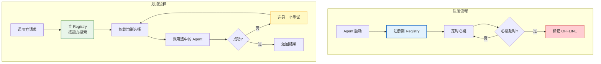

# Agent 注册中心与服务发现指南

> 微服务架构有 Nacos/Consul 做 服务注册与发现，多 Agent 系统同样需要——Agent 上线后要在注册中心登记"我是谁、我能做什么、在哪找到我"，其他 Agent 才能动态发现并调用它。

---

## 1. 为什么需要注册中心

### 无注册中心的问题

```
Agent A 想调用搜索 Agent
  → 硬编码地址 http://search-agent:8000
  → 搜索 Agent 换了端口/地址/实例 → 调用失败
  → 搜索 Agent 扩容到 3 个实例 → 只用了 1 个
  → 搜索 Agent 下线了 → Agent A 不知道，还在调用
```

### 有注册中心

```
搜索 Agent → 启动 → 注册到注册中心
  {id: "search-1", capabilities: ["search", "crawl"], address: "10.0.1.5:8000", status: "healthy"}

Agent A → 查注册中心 → "谁有 search 能力？"
  → 注册中心返回 [search-1, search-2, search-3]
  → Agent A 负载均衡选择 search-2 调用

搜索 Agent 停止 → 注销或心跳超时
  → 注册中心标记 search-3 为 offline
  → Agent A 下次调用时不会选到 search-3
```

---

## 2. Agent 注册信息

```python
from dataclasses import dataclass, field
from enum import Enum
from typing import Any
import time
import uuid

class AgentStatus(Enum):
    ONLINE = "online"           # 在线可用
    DEGRADED = "degraded"       # 降级（部分功能不可用）
    OFFLINE = "offline"         # 离线
    DRAINING = "draining"       # 排空中（不再接新请求）


@dataclass
class AgentEndpoint:
    """Agent 端点"""
    protocol: str = "http"      # http / grpc / websocket
    host: str = "localhost"
    port: int = 8000
    path: str = "/"

    @property
    def url(self) -> str:
        return f"{self.protocol}://{self.host}:{self.port}{self.path}"


@dataclass
class AgentRegistration:
    """Agent 注册信息"""
    # 标识
    id: str = field(default_factory=lambda: str(uuid.uuid4())[:8])
    name: str = ""                      # Agent 名称 "search-agent"
    version: str = "1.0.0"             # Agent 版本
    # 能力
    capabilities: list[str] = field(default_factory=list)  # ["search", "crawl"]
    description: str = ""
    # 网络
    endpoint: AgentEndpoint = field(default_factory=AgentEndpoint)
    # 状态
    status: AgentStatus = AgentStatus.ONLINE
    # 负载
    current_load: int = 0              # 当前并发请求数
    max_load: int = 100               # 最大并发
    # 健康
    last_heartbeat: float = field(default_factory=time.time)
    health_check_url: str = ""
    # 元数据
    metadata: dict[str, Any] = field(default_factory=dict)
    registered_at: float = field(default_factory=time.time)


class AgentRegistry:
    """Agent 注册中心"""

    def __init__(self, heartbeat_timeout: float = 30):
        self.agents: dict[str, AgentRegistration] = {}
        self.capability_index: dict[str, list[str]] = {}  # capability → [agent_ids]
        self.heartbeat_timeout = heartbeat_timeout
        self.event_log: list[dict] = []

    def register(self, agent: AgentRegistration) -> str:
        """注册 Agent"""
        self.agents[agent.id] = agent

        # 更新能力索引
        for cap in agent.capabilities:
            if cap not in self.capability_index:
                self.capability_index[cap] = []
            if agent.id not in self.capability_index[cap]:
                self.capability_index[cap].append(agent.id)

        self._log("register", agent.id, agent.name)
        return agent.id

    def deregister(self, agent_id: str):
        """注销 Agent"""
        agent = self.agents.pop(agent_id, None)
        if agent:
            for cap in agent.capabilities:
                if cap in self.capability_index:
                    self.capability_index[cap] = [
                        a for a in self.capability_index[cap] if a != agent_id
                    ]
            self._log("deregister", agent_id, agent.name)

    def heartbeat(self, agent_id: str, load: int = 0):
        """心跳更新"""
        if agent_id in self.agents:
            self.agents[agent_id].last_heartbeat = time.time()
            self.agents[agent_id].current_load = load

    def discover(self, capability: str) -> list[AgentRegistration]:
        """根据能力发现 Agent"""
        agent_ids = self.capability_index.get(capability, [])
        return [
            self.agents[aid] for aid in agent_ids
            if aid in self.agents and self._is_healthy(self.agents[aid])
        ]

    def discover_one(
        self,
        capability: str,
        strategy: str = "round_robin",
    ) -> AgentRegistration | None:
        """发现单个 Agent（负载均衡）"""
        agents = self.discover(capability)
        if not agents:
            return None

        if strategy == "round_robin":
            # 轮询：选下一个
            idx = int(time.time()) % len(agents)
            return agents[idx]
        elif strategy == "least_load":
            # 最少负载
            return min(agents, key=lambda a: a.current_load)
        elif strategy == "random":
            import random
            return random.choice(agents)
        else:
            return agents[0]

    def discover_all(self) -> list[AgentRegistration]:
        """发现所有在线 Agent"""
        return [a for a in self.agents.values() if self._is_healthy(a)]

    def _is_healthy(self, agent: AgentRegistration) -> bool:
        """检查 Agent 是否健康"""
        if agent.status == AgentStatus.OFFLINE:
            return False
        if time.time() - agent.last_heartbeat > self.heartbeat_timeout:
            agent.status = AgentStatus.OFFLINE
            return False
        if agent.status == AgentStatus.DRAINING:
            return False
        return True

    def check_health(self):
        """健康检查：标记超时 Agent"""
        now = time.time()
        for agent in self.agents.values():
            if now - agent.last_heartbeat > self.heartbeat_timeout:
                if agent.status != AgentStatus.OFFLINE:
                    agent.status = AgentStatus.OFFLINE
                    self._log("timeout", agent.id, agent.name)

    def _log(self, event: str, agent_id: str, agent_name: str):
        self.event_log.append({
            "event": event,
            "agent_id": agent_id,
            "agent_name": agent_name,
            "timestamp": time.time(),
        })

    def registry_snapshot(self) -> dict:
        """注册中心快照"""
        return {
            "total_agents": len(self.agents),
            "online": len([a for a in self.agents.values() if self._is_healthy(a)]),
            "offline": len([a for a in self.agents.values() if not self._is_healthy(a)]),
            "capabilities": {
                cap: len(ids) for cap, ids in self.capability_index.items()
            },
            "agents": [
                {
                    "id": a.id,
                    "name": a.name,
                    "status": a.status.value,
                    "capabilities": a.capabilities,
                    "load": f"{a.current_load}/{a.max_load}",
                    "endpoint": a.endpoint.url,
                }
                for a in self.agents.values()
            ],
        }
```

---

## 3. 负载均衡策略

```python
class LoadBalancer:
    """Agent 负载均衡器"""

    def __init__(self, registry: AgentRegistry):
        self.registry = registry
        self.rr_counters: dict[str, int] = {}  # capability → counter
        self.weights: dict[str, dict[str, float]] = {}  # capability → {agent_id: weight}

    def select(self, capability: str, strategy: str = "round_robin") -> AgentRegistration | None:
        """选择一个 Agent"""
        agents = self.registry.discover(capability)
        if not agents:
            return None

        if strategy == "round_robin":
            return self._round_robin(capability, agents)
        elif strategy == "least_load":
            return self._least_load(agents)
        elif strategy == "weighted":
            return self._weighted(capability, agents)
        elif strategy == "random":
            import random
            return random.choice(agents)
        return agents[0]

    def _round_robin(self, cap: str, agents: list) -> AgentRegistration:
        counter = self.rr_counters.get(cap, 0)
        selected = agents[counter % len(agents)]
        self.rr_counters[cap] = counter + 1
        return selected

    def _least_load(self, agents: list) -> AgentRegistration:
        return min(agents, key=lambda a: a.current_load / max(a.max_load, 1))

    def _weighted(self, cap: str, agents: list) -> AgentRegistration:
        import random
        weights = self.weights.get(cap, {})
        # 如果没有权重，用 1/负载 作为权重
        if not weights:
            total = sum(1 / max(a.current_load, 1) for a in agents)
            r = random.uniform(0, total)
            upto = 0
            for a in agents:
                upto += 1 / max(a.current_load, 1)
                if upto >= r:
                    return a
            return agents[-1]
        # 用预设权重
        total = sum(weights.get(a.id, 1) for a in agents)
        r = random.uniform(0, total)
        upto = 0
        for a in agents:
            upto += weights.get(a.id, 1)
            if upto >= r:
                return a
        return agents[-1]
```

---

## 4. Agent 自动注册

```python
import asyncio
import httpx

class AutoRegisteringAgent:
    """自动注册的 Agent"""

    def __init__(
        self,
        name: str,
        capabilities: list[str],
        port: int,
        registry_url: str = "http://localhost:9000",
    ):
        self.name = name
        self.capabilities = capabilities
        self.port = port
        self.registry_url = registry_url
        self.agent_id: str | None = None
        self.current_load = 0
        self.running = False

    async def register(self):
        """向注册中心注册"""
        async with httpx.AsyncClient() as client:
            resp = await client.post(f"{self.registry_url}/register", json={
                "name": self.name,
                "capabilities": self.capabilities,
                "endpoint": {
                    "protocol": "http",
                    "host": "localhost",
                    "port": self.port,
                    "path": "/invoke",
                },
                "max_load": 100,
            })
            data = resp.json()
            self.agent_id = data.get("agent_id")
            print(f"[{self.name}] 注册成功，ID: {self.agent_id}")

    async def send_heartbeat(self):
        """发送心跳"""
        if not self.agent_id:
            return
        async with httpx.AsyncClient() as client:
            await client.post(f"{self.registry_url}/heartbeat", json={
                "agent_id": self.agent_id,
                "load": self.current_load,
            })

    async def deregister(self):
        """注销"""
        if not self.agent_id:
            return
        async with httpx.AsyncClient() as client:
            await client.post(f"{self.registry_url}/deregister", json={
                "agent_id": self.agent_id,
            })
        print(f"[{self.name}] 已注销")

    async def start_heartbeat_loop(self, interval: float = 10):
        """启动心跳循环"""
        self.running = True
        while self.running:
            try:
                await self.send_heartbeat()
            except Exception as e:
                print(f"[{self.name}] 心跳失败: {e}")
                # 心跳失败，重新注册
                try:
                    await self.register()
                except Exception:
                    pass
            await asyncio.sleep(interval)

    def stop(self):
        self.running = False
```

---

## 5. 注册中心 HTTP 服务

```python
# 使用 FastAPI 实现注册中心 HTTP 接口
from fastapi import FastAPI
from pydantic import BaseModel

app = FastAPI(title="Agent Registry")
registry = AgentRegistry(heartbeat_timeout=30)
load_balancer = LoadBalancer(registry)

class RegisterRequest(BaseModel):
    name: str
    capabilities: list[str]
    endpoint: dict
    max_load: int = 100
    version: str = "1.0.0"

class HeartbeatRequest(BaseModel):
    agent_id: str
    load: int = 0

class DiscoverRequest(BaseModel):
    capability: str
    strategy: str = "round_robin"

@app.post("/register")
def register_agent(req: RegisterRequest):
    agent = AgentRegistration(
        name=req.name,
        capabilities=req.capabilities,
        endpoint=AgentEndpoint(**req.endpoint),
        max_load=req.max_load,
        version=req.version,
    )
    agent_id = registry.register(agent)
    return {"agent_id": agent_id, "status": "registered"}

@app.post("/heartbeat")
def heartbeat(req: HeartbeatRequest):
    registry.heartbeat(req.agent_id, req.load)
    return {"status": "ok"}

@app.post("/discover")
def discover(req: DiscoverRequest):
    agent = load_balancer.select(req.capability, req.strategy)
    if agent:
        return {
            "found": True,
            "agent_id": agent.id,
            "name": agent.name,
            "endpoint": agent.endpoint.url,
            "load": agent.current_load,
        }
    return {"found": False}

@app.post("/deregister")
def deregister(agent_id: str):
    registry.deregister(agent_id)
    return {"status": "deregistered"}

@app.get("/registry")
def get_registry():
    registry.check_health()
    return registry.registry_snapshot()

# 启动: uvicorn registry_server:app --port 9000
```

---

## 6. 服务发现流程



---

## 7. 负载均衡策略对比

| 策略 | 方式 | 优点 | 缺点 |
|------|------|------|------|
| 轮询 | 依次选择 | 简单公平 | 不考虑负载差异 |
| 最少负载 | 选 load 最低 | 负载均匀 | 需要实时负载 |
| 加权 | 按权重选择 | 灵活 | 需要手动配权重 |
| 随机 | 随机选择 | 无状态 | 可能不均匀 |
| 一致性哈希 | 同 key 同 Agent | 缓存友好 | 扩缩容时重分布 |

---

## 8. 配置参考

| 配置 | 推荐值 | 说明 |
|------|--------|------|
| 心跳间隔 | 10s | 太短浪费带宽，太长检测慢 |
| 心跳超时 | 30s | 3 次心跳未到标记离线 |
| 健康检查 | 定时全量 | 每 60s 检查所有 Agent |
| 最大负载 | 按 Agent 能力 | CPU 密集设低，IO 密集设高 |
| 注册中心 HA | 3 实例 | 避免单点故障 |

---

## 检查清单

| 检查项 | 状态 |
|--------|------|
| 有注册中心 | ☐ |
| 有自动注册 | ☐ |
| 有心跳机制 | ☐ |
| 有能力索引 | ☐ |
| 有负载均衡 | ☐ |
| 有健康检查 | ☐ |
| 有离线自动标记 | ☐ |
| 有注册快照 | ☐ |
| 有事件日志 | ☐ |
