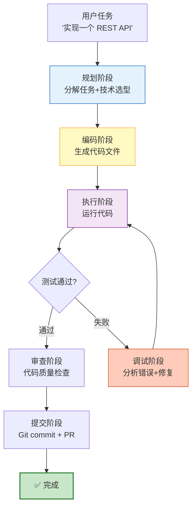

# AI 编程 Agent 与代码自动化指南

> GitHub Copilot 开启了 AI 辅助编程的时代，Cursor 把它推到了新高度，Devin 声称"第一个 AI 软件工程师"。这些工具背后的核心是什么？是能够理解代码、编写代码、运行代码、调试代码的 Agent。本指南详解 AI 编程 Agent 的架构设计、LangChain/LangGraph 实现方案，以及代码自动化的生产实践。

---

## 1. AI 编程 Agent 的层次

### 三个层次

```
层次 1：代码补全（Copilot 式）
  用户写代码 → AI 补全下一行
  辅助角色，人主导

层次 2：对话式编程（Cursor Chat 式）
  用户描述需求 → AI 生成完整代码 → 用户审查采纳
  人机协作，AI 主导生成

层次 3：自主编程 Agent（Devin 式）
  用户给任务 → Agent 理解需求 → 规划方案 → 编写代码 → 运行测试 → 修复错误 → 提交 PR
  AI 主导全流程，人审批
```

### 能力矩阵

| 能力 | 补全式 | 对话式 | Agent 式 |
|------|--------|--------|---------|
| 生成代码 | 单行/函数 | 整文件 | 多文件/项目级 |
| 理解上下文 | 当前文件 | 多文件 | 整个代码库 |
| 运行代码 | ❌ | ❌ | ✅ |
| 调试错误 | ❌ | 有限 | ✅ 自主调试 |
| 写测试 | ❌ | ✅ | ✅ 自主写+跑 |
| 提交代码 | ❌ | ❌ | ✅ Git 操作 |
| 自主规划 | ❌ | ❌ | ✅ 任务分解 |
| 安装依赖 | ❌ | ❌ | ✅ |

---

## 2. 编程 Agent 核心架构

### 工作循环



### 核心工具集

```python
from langchain_core.tools import tool
import subprocess
import os
import tempfile

@tool
def read_file(filepath: str) -> str:
    """读取文件内容"""
    try:
        with open(filepath, "r") as f:
            return f.read()
    except FileNotFoundError:
        return f"文件不存在: {filepath}"
    except Exception as e:
        return f"读取错误: {e}"

@tool
def write_file(filepath: str, content: str) -> str:
    """写入文件内容"""
    os.makedirs(os.path.dirname(filepath), exist_ok=True)
    with open(filepath, "w") as f:
        f.write(content)
    return f"已写入 {filepath} ({len(content)} 字符)"

@tool
def list_directory(path: str = ".") -> str:
    """列出目录内容"""
    try:
        entries = os.listdir(path)
        result = []
        for entry in sorted(entries):
            full_path = os.path.join(path, entry)
            if os.path.isdir(full_path):
                result.append(f"📁 {entry}/")
            else:
                size = os.path.getsize(full_path)
                result.append(f"📄 {entry} ({size}B)")
        return "\n".join(result)
    except Exception as e:
        return f"错误: {e}"

@tool
def run_command(command: str, workdir: str = ".") -> str:
    """运行 shell 命令"""
    try:
        result = subprocess.run(
            command, shell=True, capture_output=True, text=True,
            cwd=workdir, timeout=30
        )
        output = ""
        if result.stdout:
            output += result.stdout
        if result.stderr:
            output += f"\n[stderr]\n{result.stderr}"
        output += f"\n[exit code: {result.returncode}]"
        return output[:5000]  # 截断
    except subprocess.TimeoutExpired:
        return "命令超时（30秒）"
    except Exception as e:
        return f"执行错误: {e}"

@tool
def run_python(code: str) -> str:
    """运行 Python 代码并返回输出"""
    with tempfile.NamedTemporaryFile(mode="w", suffix=".py", delete=False) as f:
        f.write(code)
        temp_path = f.name
    try:
        result = subprocess.run(
            ["python", temp_path], capture_output=True, text=True, timeout=30
        )
        output = result.stdout + result.stderr
        return output[:5000]
    finally:
        os.unlink(temp_path)

@tool
def run_tests(test_path: str = ".") -> str:
    """运行测试"""
    return run_command(f"python -m pytest {test_path} -v --tb=short 2>&1")

@tool
def git_operation(action: str, args: str = "") -> str:
    """Git 操作"""
    allowed = ["status", "add", "commit", "diff", "log", "branch", "checkout"]
    if action not in allowed:
        return f"不允许的 Git 操作: {action}"
    return run_command(f"git {action} {args}")

@tool
def install_package(package: str) -> str:
    """安装 Python 包"""
    return run_command(f"pip install {package}")
```

---

## 3. LangGraph 编程 Agent 实现

### 状态定义

```python
from typing import TypedDict

class CodingAgentState(TypedDict):
    task: str              # 用户任务描述
    plan: str             # 执行计划
    files_created: list    # 已创建的文件列表
    files_modified: list   # 已修改的文件列表
    test_results: str      # 测试结果
    errors: list           # 错误历史
    iterations: int        # 迭代次数
    max_iterations: int    # 最大迭代次数
    status: str            # planning | coding | testing | debugging | done
    project_dir: str       # 项目目录
```

### 节点实现

```python
from langgraph.graph import StateGraph, START, END
from langgraph.prebuilt import create_react_agent
from langchain_openai import ChatOpenAI
from langchain_core.messages import SystemMessage, HumanMessage

# 模型配置
planner_model = ChatOpenAI(model="o3-mini", reasoning_effort="medium", temperature=0)
coder_model = ChatOpenAI(model="gpt-4o", temperature=0.2)
reviewer_model = ChatOpenAI(model="gpt-4o", temperature=0)

# === 规划节点 ===
async def plan_node(state: CodingAgentState):
    """规划阶段：分解任务，制定技术方案"""
    system_prompt = """你是一个资深软件架构师。分析用户需求，制定实施计划。

要求：
1. 列出需要创建的文件和目录结构
2. 说明技术选型和依赖
3. 给出实施步骤（有序号）
4. 列出测试策略

输出格式：
## 文件结构
- src/main.py
- src/utils.py
- tests/test_main.py
- requirements.txt

## 实施步骤
1. 创建项目结构
2. 实现核心逻辑
3. 编写测试
4. 运行测试验证

## 测试策略
- 单元测试覆盖核心函数
- 集成测试验证端到端"""

    response = await planner_model.ainvoke([
        SystemMessage(content=system_prompt),
        HumanMessage(content=f"任务: {state['task']}\n项目目录: {state['project_dir']}")
    ])

    return {"plan": response.content, "status": "coding", "iterations": 0}

# === 编码节点（使用 ReAct Agent）===
code_tools = [read_file, write_file, list_directory, run_command, install_package]
code_agent = create_react_agent(coder_model, code_tools)

async def code_node(state: CodingAgentState):
    """编码阶段：按计划编写代码"""
    prompt = f"""根据以下计划编写代码。

计划:
{state['plan']}

已创建的文件: {state.get('files_created', [])}
错误历史: {state.get('errors', [])}
当前迭代: {state['iterations']}/{state['max_iterations']}

请继续执行计划中的下一步。创建需要的文件，实现代码逻辑。
工作目录: {state['project_dir']}"""

    result = await code_agent.ainvoke({"messages": [
        {"role": "user", "content": prompt}
    ]})

    # 提取最新消息
    last_msg = result["messages"][-1].content

    return {
        "status": "testing",
        "files_created": state.get("files_created", []),
        "files_modified": state.get("files_modified", []),
    }

# === 测试节点 ===
test_agent = create_react_agent(coder_model, [run_command, run_tests, run_python])

async def test_node(state: CodingAgentState):
    """测试阶段：运行测试并收集结果"""
    prompt = f"""运行项目测试。

项目目录: {state['project_dir']}
计划中的测试策略: {state['plan']}

请：
1. 如果没有测试文件，创建测试
2. 运行测试
3. 报告测试结果

如果测试失败，记录错误信息。"""

    result = await test_agent.ainvoke({"messages": [
        {"role": "user", "content": prompt}
    ]})

    last_msg = result["messages"][-1].content

    # 判断测试是否通过
    all_passed = "passed" in last_msg.lower() and "failed" not in last_msg.lower()

    return {
        "test_results": last_msg,
        "status": "done" if all_passed else "debugging",
        "iterations": state["iterations"] + 1,
    }

# === 调试节点 ===
async def debug_node(state: CodingAgentState):
    """调试阶段：分析错误并修复"""
    if state["iterations"] >= state["max_iterations"]:
        return {"status": "done", "errors": state.get("errors", []) + ["达到最大迭代次数"]}

    prompt = f"""测试失败了，请分析并修复。

测试结果:
{state['test_results']}

项目目录: {state['project_dir']}
已创建的文件: {state.get('files_created', [])}

请：
1. 分析错误原因
2. 修复代码
3. 重新运行测试验证

注意：不要重写整个文件，只修改有问题的部分。"""

    result = await test_agent.ainvoke({"messages": [
        {"role": "user", "content": prompt}
    ]})

    last_msg = result["messages"][-1].content
    all_passed = "passed" in last_msg.lower() and "failed" not in last_msg.lower()

    return {
        "test_results": last_msg,
        "status": "done" if all_passed else "debugging",
        "iterations": state["iterations"] + 1,
        "errors": state.get("errors", []) + [f"迭代{state['iterations']}: 见测试结果"],
    }

# === 路由 ===
def route_by_status(state: CodingAgentState):
    status = state.get("status", "planning")
    if status == "done":
        return END
    return status
```

### 组装完整图

```python
graph = StateGraph(CodingAgentState)

graph.add_node("planning", plan_node)
graph.add_node("coding", code_node)
graph.add_node("testing", test_node)
graph.add_node("debugging", debug_node)

graph.add_edge(START, "planning")
graph.add_edge("planning", "coding")
graph.add_edge("coding", "testing")
graph.add_conditional_edges("testing", route_by_status, {
    "debugging": "debugging",
    "done": END,
    END: END,
})
graph.add_conditional_edges("debugging", route_by_status, {
    "debugging": "debugging",
    "testing": "testing",
    "done": END,
    END: END,
})

coding_agent = graph.compile()

# 使用
result = await coding_agent.ainvoke({
    "task": "创建一个 Python REST API 项目，用 FastAPI 实现待办事项 CRUD，包含测试",
    "project_dir": "/tmp/todo_api",
    "max_iterations": 5,
    "iterations": 0,
    "files_created": [],
    "files_modified": [],
    "errors": [],
    "status": "planning",
})
```

---

## 4. 代码沙箱安全

### 沙箱隔离方案

```python
# === 方案1：Docker 沙箱（推荐）===

@tool
def run_in_docker(code: str, image: str = "python:3.11-slim") -> str:
    """在 Docker 容器中运行代码（隔离环境）"""
    import docker
    client = docker.from_env()

    try:
        # 创建临时容器
        container = client.containers.run(
            image,
            command=f"python -c '{code}'",
            volumes={"/tmp/code": {"bind": "/code", "mode": "rw"}},
            working_dir="/code",
            mem_limit="512m",       # 内存限制
            cpu_period=100000,
            cpu_quota=50000,        # CPU 限制（50%）
            network_mode="none",    # 禁用网络
            timeout=30,
            remove=True,            # 运行后自动删除
        )
        return container.decode("utf-8")[:5000]
    except Exception as e:
        return f"Docker 执行错误: {e}"

# === 方案2：E2B 沙箱（云服务）===
# pip install e2b-code-interpreter

from e2b_code_interpreter import Sandbox

@tool
def run_in_e2b(code: str) -> str:
    """在 E2B 云沙箱中运行代码"""
    sbx = Sandbox()
    execution = sbx.run_code(code)
    results = []
    if execution.results:
        for r in execution.results:
            results.append(str(r))
    if execution.logs:
        results.append(execution.logs.stdout)
    sbx.close()
    return "\n".join(results)[:5000]

# === 方案3：受限 Python 执行 ===
@tool
def run_python_safe(code: str) -> str:
    """在受限环境中运行 Python（基础安全）"""
    # 禁止的模块
    BLOCKED_MODULES = {"os", "subprocess", "shutil", "socket", "http"}
    # 禁止的内置函数
    BLOCKED_BUILTINS = {"exec", "eval", "open", "__import__", "compile"}

    safe_globals = {
        "__builtins__": {
            k: v for k, v in __builtins__.__dict__.items()
            if k not in BLOCKED_BUILTINS
        },
        "print": print,
        "len": len,
        "range": range,
        "list": list,
        "dict": dict,
        "set": set,
        "sorted": sorted,
        "enumerate": enumerate,
        "sum": sum,
        "min": min,
        "max": max,
        "abs": abs,
        "round": round,
        "type": type,
        "isinstance": isinstance,
        "str": str,
        "int": int,
        "float": float,
        "bool": bool,
        "True": True,
        "False": False,
        "None": None,
    }

    try:
        local_ns = {}
        exec(code, safe_globals, local_ns)
        # 捕获 print 输出
        import io, contextlib
        output = io.StringIO()
        with contextlib.redirect_stdout(output):
            exec(code, safe_globals, local_ns)
        return output.getvalue()[:5000]
    except Exception as e:
        return f"执行错误: {e}"
```

---

## 5. 代码审查 Agent

### 自动代码审查

```python
@dataclass
class CodeReviewAgent:
    """AI 代码审查 Agent"""

    reviewer_model = ChatOpenAI(model="gpt-4o", temperature=0)

    async def review_file(self, filepath: str) -> dict:
        """审查单个文件"""
        with open(filepath, "r") as f:
            code = f.read()

        prompt = f"""请审查以下代码文件，从这些维度评分（1-5分）：

1. 代码质量：是否清晰、可读
2. 错误处理：异常处理是否完善
3. 安全性：是否有安全漏洞
4. 性能：是否有性能问题
5. 可维护性：是否易于维护和扩展
6. 测试覆盖：是否有测试

代码:
```
{code}
```

输出 JSON 格式的审查结果。"""

        structured = self.reviewer_model.with_structured_output(dict)
        result = await structured.ainvoke(prompt)
        return result

    async def review_pr(self, base_branch: str = "main") -> dict:
        """审查整个 PR（对比 base 分支的 diff）"""
        diff = run_command(f"git diff {base_branch}")

        prompt = f"""审查以下代码变更：

{diff}

请指出：
1. 潜在的 bug
2. 安全问题
3. 性能问题
4. 改进建议
5. 是否可以合并

给出是否批准合并的建议。"""

        response = await self.reviewer_model.ainvoke(prompt)
        return {"review": response.content}
```

---

## 6. 工具调用方案对比

### 方案全景

| 方案 | 优势 | 劣势 | 适用场景 |
|------|------|------|---------|
| ReAct Agent | 简单直接 | 可能陷入循环 | 简单任务 |
| Plan-Execute | 先规划后执行 | 规划可能不准 | 复杂多步任务 |
| Multi-Agent | 专业化分工 | 协调复杂 | 大型项目 |
| LATS (树搜索) | 探索多条路径 | 成本极高 | 高质量要求 |
| CodeAct | 代码即操作 | 需要沙箱 | 数据分析 |

### Plan-Execute 模式实现

```python
# Plan-Execute: 先规划再执行，适合复杂任务
from langgraph.prebuilt import create_react_agent

async def plan_execute_coding(task: str):
    """Plan-Execute 编码模式"""

    # Step 1: 规划
    planner = ChatOpenAI(model="o3-mini", reasoning_effort="medium")
    plan = await planner.ainvoke(
        f"分解以下编程任务为具体步骤。每步一个可独立执行的操作。\n\n任务: {task}"
    )

    # Step 2: 逐步执行
    executor = create_react_agent(
        ChatOpenAI(model="gpt-4o"),
        [read_file, write_file, run_command, run_tests]
    )

    steps = parse_steps(plan.content)
    results = []

    for i, step in enumerate(steps):
        result = await executor.ainvoke({
            "messages": [{"role": "user", "content": f"步骤 {i+1}/{len(steps)}: {step}"}]
        })
        results.append(result["messages"][-1].content)

    # Step 3: 最终验证
    verification = await executor.ainvoke({
        "messages": [{"role": "user", "content": "运行所有测试，确认项目完整可运行。"}]
    })

    return {
        "plan": plan.content,
        "results": results,
        "verification": verification["messages"][-1].content,
    }
```

---

## 7. 成本与性能分析

### 成本模型

```python
@dataclass
class CodingAgentCost:
    """编程 Agent 成本模型"""

    # 典型任务 Token 消耗
    simple_task_tokens = 5_000      # 简单函数/修 bug
    moderate_task_tokens = 20_000   # 完整模块
    complex_task_tokens = 80_000   # 多文件项目

    # GPT-4o 定价
    input_price = 2.50 / 1_000_000
    output_price = 10.00 / 1_000_000

    # 假设输入:输出 = 3:1
    def task_cost(self, tokens: int, model: str = "gpt-4o") -> float:
        input_tokens = tokens * 0.75
        output_tokens = tokens * 0.25
        pricing = {"gpt-4o": (2.50, 10.00), "gpt-4o-mini": (0.15, 0.60)}
        ip, op = pricing.get(model, (2.50, 10.00))
        return input_tokens / 1_000_000 * ip + output_tokens / 1_000_000 * op

    def task_time(self, tokens: int, iterations: int = 1) -> float:
        """预估耗时（秒）"""
        # GPT-4o 约 50 Token/s
        return tokens / 50 * iterations + iterations * 5  # 5s/迭代开销


cost = CodingAgentCost()
print(f"简单任务: ${cost.task_cost(5000):.4f}, {cost.task_time(5000):.0f}s")
# ~$0.015, ~100s
print(f"复杂任务: ${cost.task_cost(80000):.4f}, {cost.task_time(80000, 3):.0f}s")
# ~$0.25, ~5000s（含3次迭代调试）
```

---

## 8. 检查清单

| 检查项 | 状态 |
|--------|------|
| 理解 AI 编程 Agent 的三个层次 | ☐ |
| 实现了核心工具集（文件/命令/测试/Git） | ☐ |
| 在 LangGraph 中实现了规划-编码-测试-调试循环 | ☐ |
| 配置了代码沙箱（Docker/E2B/受限执行） | ☐ |
| 实现了自动代码审查功能 | ☐ |
| 理解不同 Agent 架构的适用场景 | ☐ |
| 知道成本模型和优化策略 | ☐ |
| 处理了安全风险（沙箱/权限/审计） | ☐ |

---

## 9. 与其他知识库的关联

| 关联编号 | 文档 | 关系 |
|----------|------|------|
| 06 | Agents 与 Tools-智能代理 | Agent 基础 |
| 22 | SQL 数据库 Agent | 代码执行场景 |
| 34 | 微调 vs RAG 选型 | 模型能力提升 |
| 102 | Agent 工具沙箱隔离机制 | 沙箱安全 |
| 134 | Agent 代码执行沙箱安全指南 | 沙箱深度 |
| 143 | Agent 测试自动化与 CI 集成 | 测试自动化 |
| 170 | Agent 任务分解策略 | 任务分解 |
| 174 | Agent 工具链设计深度 | 工具链设计 |
| 186 | Agent 安全沙箱深度指南 | 安全沙箱 |
| 191 | Agent 多模态交互指南 | 多模态编程 |
| 194 | Agent 推理链优化 | 推理链优化 |
| 256 | Agent 自愈 | 自主修复 |
| 427 | MCP 协议与 LangChain 工具集成 | MCP 提供代码工具 |
| 428 | 推理模型与 Agent 集成 | 推理模型用于规划 |
| 432 | Computer Use 与浏览器自动化 | Agent 操作能力扩展 |
