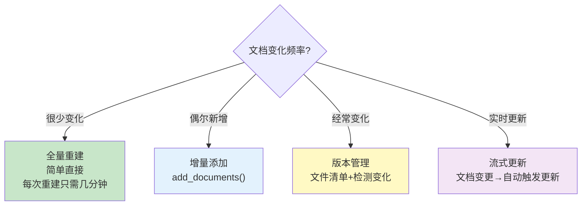

# 知识库增量更新

> 知识库不是一次建成就不变的。文档新增、修改、删除时如何高效更新向量库。

---

## 一、增量更新的挑战

```mermaid
graph TB
    subgraph 全量重建 {"全量重建的问题"}
        R1["每次新增文档→重建整个向量库"]
        R2["1000篇文档重建: ~5分钟"]
        R3["10000篇: ~50分钟"]
        R4["❌ 停机时间长"]
        R5["❌ 浪费已有计算"]
    end

    subgraph 增量更新 {"增量更新的优势"}
        I1["只处理新增/修改的文档"]
        I2["10篇新增: ~3秒"]
        I3["✅ 不影响现有检索"]
        I4["✅ 快速生效"]
    end

    style 全量重建 fill:#FFCDD2
    style 增量更新 fill:#C8E6C9
```

## 二、增量更新的三种场景

```mermaid
graph TB
    subgraph 场景 {"增量更新场景"}
        S1["➕ 新增文档<br/>向量化→追加到向量库"]
        S2["📝 修改文档<br/>删除旧向量→添加新向量"]
        S3["🗑️ 删除文档<br/>从向量库中移除对应向量"]
    end

    style S1 fill:#C8E6C9
    style S2 fill:#FFF9C4
    style S3 fill:#FFCDD2
```

## 三、实现方案

### 3.1 FAISS 增量添加

```python
from langchain_community.vectorstores import FAISS
from langchain_openai import OpenAIEmbeddings

embeddings = OpenAIEmbeddings()

# 初始构建
db = FAISS.from_documents(initial_chunks, embeddings)
db.save_local("my_index")

# === 增量添加新文档 ===
new_chunks = load_and_split("new_document.pdf")
db.add_documents(new_chunks)  # 直接追加
db.save_local("my_index")     # 保存

# === 合并另一个FAISS索引 ===
db2 = FAISS.from_documents(another_chunks, embeddings)
db.merge_from(db2)  # 合并两个索引
```

### 3.2 Chroma 增量更新

```python
from langchain_community.vectorstores import Chroma

db = Chroma(persist_directory="./chroma_db", embedding_function=embeddings)

# 增量添加
db.add_texts(
    ["新文档内容1", "新文档内容2"],
    metadatas=[{"source": "new1.txt"}, {"source": "new2.txt"}]
)

# 按条件删除
db.delete(
    collection_name="my_docs",
    filter={"source": "outdated.txt"}  # 删除来自outdated.txt的所有块
)
```

### 3.3 带版本管理的增量更新

```python
import os
import json
from datetime import datetime
from langchain_core.documents import Document

class VersionedVectorStore:
    """带版本管理的向量库"""

    def __init__(self, vectorstore, manifest_path: str = "data/manifest.json"):
        self.vectorstore = vectorstore
        self.manifest_path = manifest_path
        self.manifest = self._load_manifest()

    def _load_manifest(self) -> dict:
        """加载文件清单（记录哪些文件已入库）"""
        if os.path.exists(self.manifest_path):
            with open(self.manifest_path, "r") as f:
                return json.load(f)
        return {"files": {}}

    def _save_manifest(self):
        os.makedirs(os.path.dirname(self.manifest_path), exist_ok=True)
        with open(self.manifest_path, "w") as f:
            json.dump(self.manifest, f, indent=2, ensure_ascii=False)

    def sync(self, source_dir: str) -> dict:
        """同步：检测新增/修改/删除的文件"""
        current_files = {}
        for filename in os.listdir(source_dir):
            filepath = os.path.join(source_dir, filename)
            if os.path.isfile(filepath):
                stat = os.stat(filepath)
                current_files[filename] = {
                    "mtime": stat.st_mtime,
                    "size": stat.st_size,
                }

        registered = self.manifest.get("files", {})

        # 新增或修改的文件
        added_or_modified = []
        for filename, info in current_files.items():
            if filename not in registered:
                added_or_modified.append(("added", filename))
            elif registered[filename]["mtime"] != info["mtime"]:
                added_or_modified.append(("modified", filename))

        # 已删除的文件
        deleted = [f for f in registered if f not in current_files]

        return {
            "added_or_modified": added_or_modified,
            "deleted": deleted,
        }

    def update(self, source_dir: str) -> dict:
        """增量更新向量库"""
        changes = self.sync(source_dir)
        stats = {"added": 0, "modified": 0, "deleted": 0, "unchanged": 0}

        # 处理新增和修改
        for action, filename in changes["added_or_modified"]:
            filepath = os.path.join(source_dir, filename)

            if action == "modified":
                # 先删除旧的（按source元数据过滤）
                self._delete_by_source(filename)
                stats["modified"] += 1
            else:
                stats["added"] += 1

            # 加载并添加新内容
            from langchain_community.document_loaders import TextLoader
            loader = TextLoader(filepath, encoding="utf-8")
            docs = loader.load()
            for d in docs:
                d.metadata["source"] = filename

            from langchain_text_splitters import RecursiveCharacterTextSplitter
            splitter = RecursiveCharacterTextSplitter(chunk_size=500, chunk_overlap=50)
            chunks = splitter.split_documents(docs)
            self.vectorstore.add_documents(chunks)

            # 更新清单
            stat = os.stat(filepath)
            self.manifest["files"][filename] = {
                "mtime": stat.st_mtime,
                "size": stat.st_size,
            }

        # 处理删除
        for filename in changes["deleted"]:
            self._delete_by_source(filename)
            del self.manifest["files"][filename]
            stats["deleted"] += 1

        self._save_manifest()
        return stats

    def _delete_by_source(self, source: str):
        """按来源文件名删除向量"""
        # FAISS不支持直接删除，需要重建
        # Chroma支持: self.vectorstore.delete(filter={"source": source})
        # 这里简化处理
        pass

# 使用
db = Chroma(persist_directory="./chroma_db", embedding_function=embeddings)
versioned_db = VersionedVectorStore(db, "data/manifest.json")

# 第一次：全量入库
stats = versioned_db.update("docs/")
print(f"同步: 新增{stats['added']}, 修改{stats['modified']}, 删除{stats['deleted']}")

# 之后每次更新：只处理变化的文件
stats = versioned_db.update("docs/")
print(f"同步: 新增{stats['added']}, 修改{stats['modified']}, 删除{stats['deleted']}")
```

## 四、更新策略选择



## 五、FAISS vs Chroma 增量能力对比

| 能力 | FAISS | Chroma |
|------|-------|--------|
| 增量添加 | ✅ add_documents() | ✅ add_texts() |
| 按条件删除 | ❌ 需重建 | ✅ delete(filter=) |
| 合并索引 | ✅ merge_from() | ❌ |
| 持久化 | 手动save/load | 自动 |
| 适合增量更新 | ★★☆ | ★★★★ |
