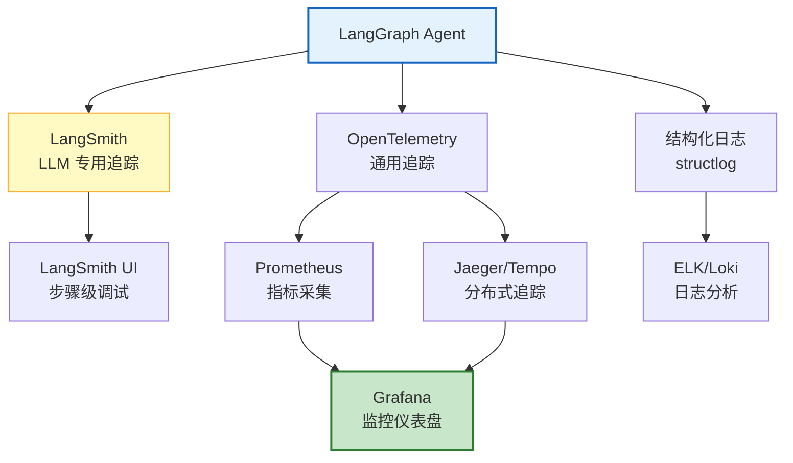

# Agent 调试与可观测工具链指南

> Agent 不像普通程序——它可能运行 20 步，调用 5 个工具，每步消耗 Token，偶尔还会"跑偏"。出了问题怎么定位？哪一步选错了工具？哪个 LLM 调用超时了？Token 花在哪了？本指南系统讲解 Agent 调试方法论、LangSmith 追踪、OpenTelemetry 集成，以及从开发到生产的完整可观测工具链。

---

## 1. Agent 可观测性的挑战

### 与传统应用的区别

```
传统 Web 应用：
  请求 → 处理 → 响应（1次调用，毫秒级）
  日志：1条

Agent 应用：
  请求 → LLM调用 → 工具调用 → LLM调用 → 工具调用 → ... → 响应
  - 多步骤（5-30步）
  - 每步异步
  - 每步消耗 Token（成本）
  - 每步可能失败
  - 步骤间有依赖
  - 需要追踪完整链路
  日志：10-100条
```

### 可观测性三支柱

```
1. 追踪（Tracing）
   一次完整请求的所有步骤和耗时
   
2. 指标（Metrics）
   聚合统计：成功率、延迟分布、Token消耗
   
3. 日志（Logging）
   每一步的详细输入输出
```

---

## 2. LangSmith 追踪

### 自动追踪

```python
# LangSmith 是 LangChain 官方的追踪平台
# 设置环境变量即可自动追踪

import os
os.environ["LANGCHAIN_TRACING_V2"] = "true"
os.environ["LANGCHAIN_API_KEY"] = "ls-xxx"
os.environ["LANGCHAIN_PROJECT"] = "my-agent"

# 之后所有 LangChain/LangGraph 调用自动被追踪
from langgraph.prebuilt import create_react_agent
from langchain_openai import ChatOpenAI
from langchain_core.tools import tool

@tool
def search(query: str) -> str:
    """搜索"""
    return f"结果: {query}"

agent = create_react_agent(
    ChatOpenAI(model="gpt-4o-mini"),
    [search],
)

result = agent.invoke({"messages": [{"role": "user", "content": "搜索 LangChain"}]})

# 在 LangSmith 平台可以看到完整追踪：
# - 每一步的输入输出
# - 每一步的耗时
# - 每一步的 Token 消耗
# - 工具调用链
# - 错误和重试
```

### 自定义追踪

```python
from langchain_core.tracers.context import tracing_v2_enabled
from langsmith import Client

# 方式1：上下文管理器
with tracing_v2_enabled(project_name="debug-session"):
    result = agent.invoke({"messages": [...]})

# 方式2：手动创建 trace
client = Client()

# 添加自定义标注
async def debug_node(state):
    """带调试标注的节点"""
    run = client.create_run(
        name="debug-search",
        run_type="chain",
        inputs={"query": state["query"]},
    )

    try:
        result = await search(state["query"])

        # 添加调试标签
        client.update_run(
            run.id,
            tags=["debug", "search"],
            metadata={
                "result_length": len(result),
                "query_type": "rag",
            },
            outputs={"result": result},
        )
        return {"search_result": result}
    except Exception as e:
        client.update_run(
            run.id,
            error=str(e),
            outputs={},
        )
        raise
```

### 追踪数据分析

```python
# 在 LangSmith 中分析追踪数据
from langsmith import Client

client = Client()

# 获取最近的运行
runs = list(client.list_runs(
    project_name="my-agent",
    limit=100,
    # 过滤条件
    execution_order="chain",  # 只看顶层链
    error=True,                # 只看错误的
))

for run in runs:
    print(f"Run ID: {run.id}")
    print(f"  名称: {run.name}")
    print(f"  耗时: {run.total_tokens}")
    print(f"  状态: {'❌' if run.error else '✅'}")
    print(f"  Token: input={run.prompt_tokens}, output={run.completion_tokens}")
    if run.error:
        print(f"  错误: {run.error}")

# 分析 Token 消耗分布
token_stats = {}
for run in runs:
    name = run.name
    if name not in token_stats:
        token_stats[name] = {"count": 0, "total_tokens": 0}
    token_stats[name]["count"] += 1
    token_stats[name]["total_tokens"] += run.total_tokens or 0

print("\n=== Token 消耗分布 ===")
for name, stats in sorted(token_stats.items(), key=lambda x: -x[1]["total_tokens"]):
    print(f"  {name}: {stats['count']}次, {stats['total_tokens']} tokens")
```

---

## 3. OpenTelemetry 集成

### 为什么需要 OpenTelemetry

```
LangSmith：
  - 专为 LLM 设计
  - 自动追踪 LangChain 调用
  - 但只覆盖 LLM 层

OpenTelemetry：
  - 通用可观测标准
  - 覆盖 LLM + 数据库 + 缓存 + API
  - 可对接 Grafana/Jaeger/Prometheus
  - 适合生产环境综合监控
```

### 配置 OpenTelemetry

```python
# pip install opentelemetry-api opentelemetry-sdk opentelemetry-exporter-otlp

from opentelemetry import trace
from opentelemetry.sdk.trace import TracerProvider
from opentelemetry.sdk.trace.export import BatchSpanProcessor
from opentelemetry.exporter.otlp.proto.grpc.trace_exporter import OTLPSpanExporter
from opentelemetry.sdk.resources import Resource

# 初始化
resource = Resource.create({
    "service.name": "agent-service",
    "service.version": "1.0.0",
})

provider = TracerProvider(resource=resource)
provider.add_span_processor(
    BatchSpanProcessor(
        OTLPSpanExporter(endpoint="http://localhost:4317")  # Jaeger/Tempo
    )
)
trace.set_tracer_provider(provider)

tracer = trace.get_tracer("agent")

# 在 Agent 节点中添加 span
async def traced_node(state):
    """带 OpenTelemetry 追踪的节点"""
    with tracer.start_as_current_span("llm_call") as span:
        span.set_attribute("query.length", len(state["messages"][-1].content))
        span.set_attribute("model", "gpt-4o-mini")

        try:
            response = await llm.ainvoke(state["messages"])

            span.set_attribute("response.tokens", response.usage_metadata.get("total_tokens", 0))
            span.set_attribute("response.length", len(response.content))
            span.set_status(trace.Status(trace.StatusCode.OK))

            return {"messages": [response]}

        except Exception as e:
            span.record_exception(e)
            span.set_status(trace.Status(trace.StatusCode.ERROR, str(e)))
            raise
```

### LangChain + OpenTelemetry 适配器

```python
# 使用 OpenLLMetry 自动注入 OpenTelemetry 追踪
# pip install opentelemetry-instrumentation-langchain

from opentelemetry.instrumentation.langchain import LangchainInstrumentor

# 一行代码自动追踪所有 LangChain 调用
LangchainInstrumentor().instrument()

# 之后所有 LangChain 调用自动生成 OpenTelemetry span
# 包括：LLM 调用、工具调用、链式调用、检索
```

---

## 4. 调试方法论

### 常见 Agent 问题分类

```
问题1：Agent 不调用工具
  原因：
    - 模型不支持 function calling
    - 工具描述不清晰
    - system prompt 没引导使用工具
  调试：
    - 检查模型是否支持工具调用
    - 检查工具 description 是否清晰
    - 打印模型返回的 tool_calls

问题2：Agent 调用了错误的工具
  原因：
    - 工具描述重叠
    - 模型理解偏差
  调试：
    - 检查工具描述是否区分度高
    - 添加 few-shot 示例
    - 用更强大的模型

问题3：Agent 陷入循环
  原因：
    - 工具调用结果不被模型接受
    - 条件路由逻辑有误
    - 缺少最大迭代限制
  调试：
    - 检查递归限制（recursion_limit）
    - 检查路由条件
    - 添加循环检测

问题4：Token 消耗异常
  原因：
    - 上下文不断积累
    - 工具返回过多内容
    - 无截断
  调试：
    - 分析每步 Token 消耗
    - 截断工具结果
    - 压缩对话历史
```

### 断点调试

```python
from langgraph.graph import StateGraph, START, END

# 方式1：interrupt_before 在指定节点暂停
graph = graph_builder.compile(
    interrupt_before=["tool_call"],  # 在工具调用前暂停
)

# 运行到 tool_call 前暂停
result = graph.invoke(input_state)

# 检查当前状态
state = graph.get_state()
print(f"当前节点: {state.next}")
print(f"当前状态: {state.values}")

# 可以修改状态后继续
graph.update_state({"modified_field": "new_value"})

# 继续执行
result = graph.invoke(None)  # None 表示从当前状态继续
```

### 单步执行

```python
async def step_through_debug(agent, initial_state):
    """单步调试 Agent"""
    config = {"configurable": {"thread_id": "debug-001"}}

    # 第一步
    result = await agent.ainvoke(initial_state, config=config)
    state = await agent.aget_state(config)

    print(f"Step 1: 执行了 {state.next}")
    print(f"  状态: {list(state.values.keys())}")

    step = 2
    while state.next:  # 还有待执行节点
        # 暂停检查
        user_input = input(f"\nStep {step}: 继续？(y/n/modify): ")

        if user_input == "n":
            break
        elif user_input == "modify":
            field = input("修改字段名: ")
            value = input("新值: ")
            await agent.aupdate_state(config, {field: value})
            print(f"  已修改 {field}")

        # 继续执行
        result = await agent.ainvoke(None, config=config)
        state = await agent.aget_state(config)

        print(f"Step {step}: 执行了 {state.next}")
        step += 1

    print(f"\n完成，共 {step-1} 步")
```

---

## 5. 生产可观测仪表盘

### 关键指标

```python
@dataclass
class AgentMetrics:
    """Agent 可观测指标"""

    # 性能指标
    p50_latency: float = 0     # 中位延迟
    p95_latency: float = 0     # 95分位延迟
    p99_latency: float = 0     # 99分位延迟

    # 成功率
    success_rate: float = 0    # 成功率
    error_rate: float = 0      # 错误率
    timeout_rate: float = 0    # 超时率

    # Token 消耗
    avg_tokens_per_request: int = 0
    avg_cost_per_request: float = 0

    # 工具调用
    avg_tools_per_request: float = 0
    tool_error_rate: float = 0

    # Agent 行为
    avg_steps_per_request: float = 0  # 平均步骤数
    loop_detected_rate: float = 0     # 循环检测率

    def to_prometheus(self) -> list:
        """转为 Prometheus 指标"""
        return [
            f'agent_latency_p50 {self.p50_latency}',
            f'agent_latency_p95 {self.p95_latency}',
            f'agent_success_rate {self.success_rate}',
            f'agent_error_rate {self.error_rate}',
            f'agent_avg_tokens {self.avg_tokens_per_request}',
            f'agent_avg_steps {self.avg_steps_per_request}',
        ]
```

### 告警规则

| 指标 | 阈值 | 告警级别 |
|------|------|----------|
| 错误率 | > 5% | P2 |
| 错误率 | > 15% | P1 |
| P95 延迟 | > 30s | P3 |
| P95 延迟 | > 60s | P2 |
| 平均 Token | > 10000/请求 | P3 |
| 工具错误率 | > 20% | P2 |
| 循环检测率 | > 5% | P2 |

### 结构化日志

```python
import structlog

logger = structlog.get_logger()

async def logged_node(state):
    """带结构化日志的节点"""
    logger.info("node.start",
        node="llm_call",
        query_length=len(state["messages"][-1].content),
        message_count=len(state["messages"]),
    )

    try:
        response = await llm.ainvoke(state["messages"])

        logger.info("node.complete",
            node="llm_call",
            tokens=response.usage_metadata.get("total_tokens", 0),
            latency_ms=response.response_metadata.get("elapsed_ms", 0),
            response_length=len(response.content),
        )

        return {"messages": [response]}

    except Exception as e:
        logger.error("node.error",
            node="llm_call",
            error_type=type(e).__name__,
            error_message=str(e),
        )
        raise
```

---

## 6. 工具链集成

### 完整可观测工具链



### 工具选型

| 工具 | 用途 | 适用阶段 | 成本 |
|------|------|---------|------|
| LangSmith | LLM 追踪 | 开发+生产 | 按量 |
| Jaeger/Tempo | 分布式追踪 | 生产 | 自托管 |
| Prometheus | 指标采集 | 生产 | 免费 |
| Grafana | 可视化 | 生产 | 免费 |
| ELK/Loki | 日志分析 | 生产 | 自托管 |
| OpenLLMetry | 自动注入 | 开发+生产 | 免费 |

---

## 7. 检查清单

| 检查项 | 状态 |
|--------|------|
| 启用了 LangSmith 自动追踪 | ☐ |
| 能查看完整步骤追踪 | ☐ |
| 集成了 OpenTelemetry | ☐ |
| 配置了结构化日志 | ☐ |
| 实现了断点调试 | ☐ |
| 实现了单步执行 | ☐ |
| 配置了 Prometheus 指标 | ☐ |
| 配置了 Grafana 仪表盘 | ☐ |
| 设置了告警规则 | ☐ |
| 会分析 Token 消耗分布 | ☐ |

---

## 8. 与其他知识库的关联

| 关联编号 | 文档 | 关系 |
|----------|------|------|
| 17 | LangSmith 可观测性 | LangSmith 基础 |
| 20 | 调试工具箱 | 调试工具 |
| 87 | Agent 决策回放与调试 | 决策回放 |
| 88 | Agent 决策回放与调试 | 回放 |
| 123 | LLM 应用可观测性体系 | 可观测性 |
| 134 | Agent 可观测性 | 可观测性 |
| 166 | Agent 可观测性深度 | 可观测性深度 |
| 168 | 日志分析 | 日志分析 |
| 200 | 日志分析与智能诊断 | 日志诊断 |
| 305 | 调试可视化 | 调试可视化 |
| 335 | LangGraph 调试与可视化 | LangGraph 调试 |
| 349 | 断点调试 | 断点 |
| 360 | 分布式追踪 | 分布式追踪 |
| 362 | Agent 工具调用链追踪 | 调用链 |
| 380 | Agent 指标采集与监控面板 | 指标采集 |
| 387 | Agent 监控与可观测性 | 监控 |
| 417 | Agent 监控与可观测性 | 可观测指南 |
| 444 | Agent 可解释性与 XAI | 可解释性 |
