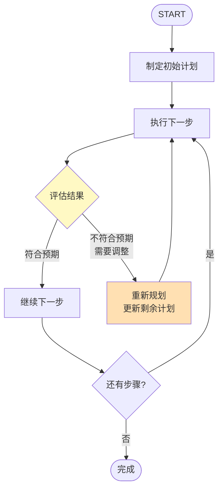

# Agent 记忆与规划

> Agent 不只是"调用工具"。高级 Agent 需要记住历史决策、规划未来步骤、从错误中学习。

---

## 一、Agent 记忆的层次

```mermaid
graph TB
    subgraph Agent记忆层次 {"Agent 记忆的三层模型"}
        L1["Layer 1: 短期记忆<br/>当前对话上下文<br/>(对话历史)"]
        L2["Layer 2: 工作记忆<br/>当前任务的关键信息<br/>(提取的实体/中间结果)"]
        L3["Layer 3: 长期记忆<br/>跨会话的知识和经验<br/>(向量库/知识图谱)"]
    end

    L1 --> L2 --> L3

    style L1 fill:#C8E6C9
    style L2 fill:#FFF9C4
    style L3 fill:#F3E5F5
```

### 1.1 短期记忆（对话历史）

```python
from typing import TypedDict, Annotated
from operator import add
from langchain_core.messages import AnyMessage

class AgentState(TypedDict):
    # 短期记忆：对话历史
    messages: Annotated[list[AnyMessage], add]
    # 当前任务
    current_task: str
    # 重试计数
    retry_count: int
```

### 1.2 工作记忆（任务关键信息）

```python
class AdvancedAgentState(TypedDict):
    # 短期：对话历史
    messages: Annotated[list[AnyMessage], add]
    # 工作记忆：任务执行中提取的关键信息
    extracted_entities: dict      # 提取的实体
    intermediate_results: dict    # 中间结果
    pending_questions: list[str]   # 待确认的问题
    # 任务状态
    plan: list[str]               # 执行计划
    completed_steps: list[str]     # 已完成步骤
    current_step: str               # 当前步骤
```

### 1.3 长期记忆（跨会话）

```mermaid
graph LR
    subgraph 长期记忆 {"长期记忆实现方式"}
        S1["方案1: 向量库<br/>把历史经验存入向量库<br/>检索相关经验"]
        S2["方案2: 知识图谱<br/>存储实体-关系-结论<br/>结构化记忆"]
        S3["方案3: 摘要存档<br/>每次会话结束后<br/>生成摘要存档"]
    end

    style S1 fill:#E3F2FD
    style S2 fill:#F3E5F5
    style S3 fill:#C8E6C9
```

```python
from langchain_openai import ChatOpenAI, OpenAIEmbeddings
from langchain_community.vectorstores import FAISS
from langchain_core.documents import Document

class AgentMemory:
    """Agent 长期记忆系统"""

    def __init__(self):
        self.llm = ChatOpenAI(model="gpt-4o-mini", temperature=0)
        self.embeddings = OpenAIEmbeddings()
        self.experience_db = FAISS.from_documents(
            [Document(page_content="初始经验", metadata={"type": "init"})],
            self.embeddings
        )

    def remember(self, task: str, approach: str, outcome: str):
        """记住一次任务经验"""
        experience = f"任务: {task}\n方法: {approach}\n结果: {outcome}"
        self.experience_db.add_documents([
            Document(page_content=experience, metadata={
                "type": "experience",
                "task": task[:50],
                "outcome": outcome,
            })
        ])

    def recall(self, query: str, k: int = 3) -> list[str]:
        """回忆相关经验"""
        results = self.experience_db.similarity_search(query, k=k)
        return [d.page_content for d in results if d.metadata.get("type") == "experience"]

# 使用
memory = AgentMemory()

# 记住经验
memory.remember(
    task="分析销售数据",
    approach="用pandas读取CSV→分组统计→生成图表",
    outcome="成功，耗时30秒"
)

# 下次遇到类似任务时回忆
related = memory.recall("分析数据")
# → "任务: 分析销售数据\n方法: 用pandas..."
```

## 二、Agent 规划模式

### 2.1 规划的三个层次

```mermaid
graph TB
    subgraph 规划层次 {"Agent 规划层次"}
        P1["无规划: ReAct<br/>每步即时决策<br/>简单但可能走弯路"]
        P2["静态规划: Plan-Execute<br/>先制定完整计划<br/>再逐步执行"]
        P3["动态规划: Re-Plan<br/>执行中根据结果<br/>调整计划"]
    end

    P1 --> P2 --> P3

    style P1 fill:#C8E6C9
    style P2 fill:#FFF9C4
    style P3 fill:#FFE0B2
```

### 2.2 Plan-and-Execute 模式

```python
from langchain_core.prompts import ChatPromptTemplate
from langchain_core.output_parser import StrOutputParser
from langgraph.graph import StateGraph, START, END
from typing import TypedDict, Annotated
from operator import add

llm = ChatOpenAI(model="gpt-4o-mini", temperature=0)

class PlanExecuteState(TypedDict):
    input: str
    plan: list[str]
    past_steps: Annotated[list, add]
    response: str

def plan_node(state: PlanExecuteState) -> dict:
    """规划阶段"""
    prompt = ChatPromptTemplate.from_template(
        """为以下任务制定2-4个步骤的计划：
        任务：{input}

        格式：每行一个步骤，用数字编号。
        计划："""
    )
    result = (prompt | llm | StrOutputParser()).invoke({"input": state["input"]})
    steps = [s.strip() for s in result.split("\n") if s.strip()]
    return {"plan": steps}

def execute_node(state: PlanExecuteState) -> dict:
    """执行阶段"""
    plan = state["plan"]
    past = state.get("past_steps", [])

    # 找第一个未完成的步骤
    completed_texts = [p.split(":")[0] if ":" in p else p for p in past]
    remaining = [s for s in plan if s not in completed_texts]

    if not remaining:
        return {"response": "所有步骤已完成"}

    current = remaining[0]
    prompt = ChatPromptTemplate.from_template("执行步骤：{step}\n结果：")
    result = (prompt | llm | StrOutputParser()).invoke({"step": current})
    return {"past_steps": [f"{current}: {result}"]}

def should_continue(state: PlanExecuteState) -> str:
    plan = state["plan"]
    past = state.get("past_steps", [])
    remaining = [s for s in plan if s not in [p.split(":")[0] if ":" in p else p for p in past]]
    return "continue" if remaining else "done"

graph = StateGraph(PlanExecuteState)
graph.add_node("plan", plan_node)
graph.add_node("execute", execute_node)
graph.add_edge(START, "plan")
graph.add_edge("plan", "execute")
graph.add_conditional_edges("execute", should_continue, {
    "continue": "execute", "done": END
})
app = graph.compile()
```

### 2.3 Re-Plan 动态规划



```python
def replan_node(state: PlanExecuteState) -> dict:
    """重新规划：根据已执行结果调整计划"""
    prompt = ChatPromptTemplate.from_template(
        """根据已执行的步骤和结果，调整剩余计划。

        原始任务：{input}
        已完成步骤：{past_steps}
        原计划：{plan}

        请输出更新后的剩余步骤（每行一个）：
        """
    )
    result = (prompt | llm | StrOutputParser()).invoke({
        "input": state["input"],
        "past_steps": "\n".join(state.get("past_steps", [])),
        "plan": "\n".join(state.get("plan", [])),
    })
    new_plan = [s.strip() for s in result.split("\n") if s.strip()]
    return {"plan": new_plan}
```

## 三、反思与自我改进

```mermaid
graph TB
    subgraph 反思循环 {"Reflection 反思模式"}
        GEN["生成回答"] --> EVAL["自我评价"]
        EVAL --> SCORE{"评分≥4?"}
        SCORE -->|"否"| REFLECT["反思:<br/>哪里不好？怎么改进？"]
        REFLECT --> IMPROVE["改进回答"]
        IMPROVE --> EVAL
        SCORE -->|"是"| OUT["输出最终回答 ✅"]
    end

    style GEN fill:#E3F2FD
    style EVAL fill:#FFF9C4
    style REFLECT fill:#FFE0B2
    style OUT fill:#C8E6C9
```

```python
def reflection_node(state: dict) -> dict:
    """反思节点：评价自己的回答并改进"""
    answer = state.get("answer", "")
    question = state.get("question", "")

    # 自我评价
    eval_prompt = ChatPromptTemplate.from_template(
        """评价以下回答的质量（1-5分）：
        问题：{question}
        回答：{answer}

        评价标准：准确性、完整性、清晰度
        分数和改进建议："""
    )
    evaluation = (eval_prompt | llm | StrOutputParser()).invoke({
        "question": question, "answer": answer
    })

    # 如果评分低则改进
    if "1" in evaluation[:5] or "2" in evaluation[:5] or "3" in evaluation[:5]:
        improve_prompt = ChatPromptTemplate.from_template(
            """根据评价改进回答：
            原回答：{answer}
            评价：{eval}
            改进后的回答："""
        )
        improved = (improve_prompt | llm | StrOutputParser()).invoke({
            "answer": answer, "eval": evaluation
        })
        return {"answer": improved, "evaluation": evaluation}

    return {"evaluation": evaluation}
```

## 四、记忆与规划的协同

```mermaid
graph TB
    subgraph 协同 {"记忆+规划的协同架构"}
        INPUT["新任务输入"] --> RECALL["回忆相关经验<br/>(长期记忆)"]
        RECALL --> PLAN["基于经验制定计划"]
        PLAN --> EXEC["执行计划"]
        EXEC --> WORK["更新工作记忆<br/>(中间结果)"]
        WORK --> CHECK{"完成?"}
        CHECK -->|"否"| EXEC
        CHECK -->|"是"| REFLECT["反思+总结"]
        REFLECT --> REMEMBER["保存经验<br/>(长期记忆)"]
        REMEMBER --> OUT["输出结果"]
    end

    style RECALL fill:#E3F2FD
    style PLAN fill:#FFF9C4
    style REMEMBER fill:#C8E6C9
```

## 五、选型建议

| 场景 | 记忆策略 | 规划策略 |
|------|---------|---------|
| 简单工具调用 | 短期即可 | 无需规划（ReAct） |
| 多步任务 | 短期+工作记忆 | Plan-Execute |
| 复杂探索任务 | 短期+工作+长期 | Re-Plan |
| 高质量输出 | 短期即可 | Reflection |
| 跨会话学习 | 长期记忆 | 基于经验规划 |
