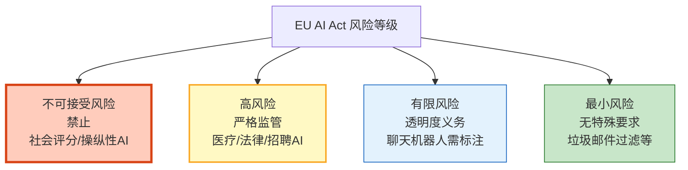

# LLM 应用合规与法律框架指南

> LLM 应用不是法外之地。欧盟 AI 法案已正式生效，中国生成式 AI 管理办法已实施，美国版权局对 AI 生成内容的版权态度逐渐明确。你的 Agent 采集了用户数据吗？生成的内容版权归谁？如果 Agent 给了错误建议导致损失，谁负责？本指南系统讲解全球 AI 法规要求、数据合规实践、知识产权边界，以及 Agent 合规工程化方案。

---

## 1. 全球 AI 法规全景

### 主要法规对比

| 法规 | 地区 | 生效时间 | 核心要求 | 违规后果 |
|------|------|---------|---------|---------|
| EU AI Act | 欧盟 | 2024-2026 分阶段 | 按风险分级管理 | 最高营收7% |
| 中国《生成式AI管理办法》 | 中国 | 2023.8 | 备案+内容标识 | 罚款+下架 |
| 美国 AI 行政令 | 美国 | 2023.10 | 安全测试报告 | 行政措施 |
| GDPR | 欧盟 | 2018.5 | 数据保护 | 最高营收4% |
| CCPA | 加州 | 2020.1 | 消费者数据权利 | 每条记录$7500 |
| 个保法（PIPL） | 中国 | 2021.11 | 个人信息保护 | 营收5%或5000万 |
| 数据安全法 | 中国 | 2021.9 | 数据分类分级 | 罚款+吊销 |

### EU AI Act 风险分级



### 你的 LLM 应用属于哪类

```
不可接受（禁止）：
  - 社会信用评分系统
  - 操纵人类行为的 AI
  - 实时生物特征远程识别（公共场所）

高风险（严格合规）：
  - 医疗诊断辅助 Agent
  - 招聘筛选 Agent
  - 信用评估 Agent
  - 法律建议 Agent
  - 司法决策辅助

有限风险（透明度）：
  - 客服聊天机器人（需标注"AI"）
  - 深度伪造内容（需标识）
  - 情感识别系统（需告知）

最小风险（一般要求）：
  - 通用问答助手
  - 编程辅助
  - 文档摘要
  - 翻译工具
```

---

## 2. 数据合规

### 数据采集合规

```python
@dataclass
class DataComplianceChecker:
    """数据合规检查器"""

    async def check_data_collection(self, data_type: str, purpose: str,
                                     has_consent: bool, region: str) -> dict:
        """检查数据采集是否合规"""
        issues = []

        # 1. 用户同意
        if not has_consent:
            issues.append("❌ 缺少用户明示同意")

        # 2. 目的限定
        if not purpose:
            issues.append("❌ 未声明数据使用目的")

        # 3. 敏感数据
        sensitive_types = ["身份证号", "人脸", "生物特征", "宗教", "政治", "健康"]
        if data_type in sensitive_types:
            issues.append(f"⚠️ 敏感数据 [{data_type}] 需要单独同意")

        # 4. 地区特殊要求
        if region == "EU" and not has_consent:
            issues.append("❌ GDPR 要求明示同意")
        if region == "CN" and data_type in sensitive_types:
            issues.append("❌ PIPL 要求单独同意")

        return {
            "compliant": len(issues) == 0,
            "issues": issues,
            "requirements": self._get_requirements(data_type, region),
        }

    def _get_requirements(self, data_type: str, region: str) -> list:
        """获取合规要求清单"""
        requirements = [
            "用户明示同意",
            "声明数据使用目的",
            "提供数据删除途径",
            "提供数据导出功能",
            "数据加密存储",
            "最小化采集原则",
        ]
        if data_type in ["身份证号", "人脸", "健康"]:
            requirements.extend([
                "单独同意",
                "数据保护影响评估（DPIA）",
                "指定数据保护官（DPO）",
                "定期安全审计",
            ])
        return requirements
```

### 数据处理记录

```python
@dataclass
class DataProcessingLog:
    """数据处理日志（GDPR/PIPL 要求）"""

    async def log_processing(self, operation: dict):
        """记录数据处理活动"""
        log = {
            "timestamp": datetime.utcnow().isoformat(),
            "data_type": operation["data_type"],
            "operation": operation["operation"],  # collect/store/use/delete
            "purpose": operation["purpose"],
            "data_subject": operation.get("user_id", "anonymous"),
            "legal_basis": operation["legal_basis"],  # consent/contract/legitimate_interest
            "retention_period": operation.get("retention", "90d"),
            "third_party_sharing": operation.get("third_party", False),
            "encryption": True,
        }
        await db.processing_logs.insert(log)

    async def handle_data_request(self, user_id: str, request_type: str):
        """处理用户数据权利请求"""
        if request_type == "access":
            # 数据访问权
            return await self._export_user_data(user_id)
        elif request_type == "deletion":
            # 被遗忘权
            return await self._delete_user_data(user_id)
        elif request_type == "correction":
            # 数据更正权
            return await self._correct_user_data(user_id)
        elif request_type == "portability":
            # 数据可携带权
            return await self._export_user_data(user_id, format="json")

    async def _delete_user_data(self, user_id: str):
        """删除用户所有数据（被遗忘权）"""
        # 向量库中的用户数据
        await vectorstore.delete(filter={"user_id": user_id})
        # 对话历史
        await db.conversations.delete_many({"user_id": user_id})
        # 用户偏好
        await db.preferences.delete_many({"user_id": user_id})
        # 审计日志中的个人数据
        await db.audit_logs.update_many(
            {"user_id": user_id},
            {"$set": {"user_id": "[deleted]", "content": "[deleted]"}}
        )
        return {"status": "deleted", "user_id": user_id}
```

---

## 3. 知识产权

### AI 生成内容的版权

```
核心问题：AI 生成的内容有版权吗？归谁？

当前共识（2024-2025）：
  - 纯 AI 生成内容：多数国家认为无版权（无人类创造性）
  - 人类+AI 协作内容：人类有创造性贡献的部分有版权
  - 训练数据版权：使用受版权材料训练可能侵权

各国立场：
  美国：纯AI生成无版权（2023 版权局声明）
  欧盟：AI生成内容无版权，但训练数据使用需授权
  中国：AI生成内容可受版权保护（北京互联网法院判例）
  日本：训练数据可合理使用（30条之4），但商业使用有限制
```

### 训练数据合规

```python
@dataclass
class TrainingDataCompliance:
    """训练数据合规检查"""

    async def check_training_data(self, data_source: str, license: str,
                                   contains_pii: bool) -> dict:
        """检查训练数据是否合规"""
        issues = []

        # 1. 数据来源合法性
        allowed_licenses = ["MIT", "Apache-2.0", "CC-BY", "CC0", "public_domain"]
        if license not in allowed_licenses:
            issues.append(f"⚠️ 数据许可证 [{license}] 可能不授权商用")

        # 2. PII 检查
        if contains_pii:
            issues.append("❌ 训练数据包含 PII，需要脱敏或获得用户同意")

        # 3. 版权内容检测
        copyright_indicators = ["©", "版权所有", "All Rights Reserved"]
        # 需要实际扫描数据
        # ...

        return {
            "compliant": len(issues) == 0,
            "issues": issues,
            "recommendations": [
                "使用公开数据集（如 Common Crawl）",
                "对 PII 数据进行脱敏",
                "保留数据来源和许可证记录",
                "考虑使用选择退出（opt-out）机制",
            ],
        }
```

### AI 生成内容标识

```python
@dataclass
class AIContentLabeler:
    """AI 生成内容标识（法规要求）"""

    def label_output(self, content: str, model: str = "AI") -> str:
        """为 AI 生成内容添加标识"""
        label = f"\n\n---\n⚠️ 本内容由 AI（{model}）生成，仅供参考。"
        return content + label

    def add_watermark(self, content: str) -> str:
        """添加隐形水印（用于溯源）"""
        # 在文本中嵌入不可见的标记
        # 实际中使用文本水印算法
        watermark = "\u200b\u200c\u200b"  # 零宽字符序列
        return content + watermark

    def metadata_label(self, response: dict) -> dict:
        """在响应元数据中标注"""
        response["metadata"] = {
            "ai_generated": True,
            "model": response.get("model", ""),
            "timestamp": datetime.utcnow().isoformat(),
            "disclaimer": "AI生成内容仅供参考，不构成专业建议",
        }
        return response
```

---

## 4. 责任与风险

### 责任分配框架

```
Agent 给了错误建议导致损失，谁负责？

分层责任：
  1. 开发者：系统设计缺陷、安全漏洞
  2. 运营方：内容审核缺失、运维不当
  3. 用户：明知AI建议不靠谱仍执行
  4. 模型提供商：模型本身的问题

免责条款（需显眼展示）：
  "本 AI 助手提供的信息仅供参考。
   重要决策请咨询专业人士。
   AI 不承担因建议导致的任何损失。"

高风险场景必须有人工审核：
  - 医疗诊断
  - 法律建议
  - 金融投资
  - 自动化决策（如贷款审批）
```

### 风险评估

```python
@dataclass
class RiskAssessment:
    """AI 应用风险评估"""

    async def assess(self, app_config: dict) -> dict:
        """评估应用风险等级"""
        risk_factors = {
            "domain": app_config.get("domain", "general"),
            "automation_level": app_config.get("automation", "advisory"),
            "data_sensitivity": app_config.get("data_sensitivity", "low"),
            "user_vulnerability": app_config.get("user_vulnerability", "normal"),
        }

        # 计算风险等级
        domain_scores = {
            "general": 1, "education": 2, "customer_service": 2,
            "finance": 4, "healthcare": 5, "legal": 4, "criminal_justice": 5,
        }
        automation_scores = {
            "advisory": 1, "semi_auto": 3, "fully_auto": 5,
        }
        data_scores = {"low": 1, "medium": 3, "high": 5}

        total = (
            domain_scores.get(risk_factors["domain"], 2) +
            automation_scores.get(risk_factors["automation_level"], 1) +
            data_scores.get(risk_factors["data_sensitivity"], 1)
        )

        if total >= 12:
            level = "高风险"
            requirements = ["DPIA", "人工审核", "审计日志", "透明度报告", "定期安全评估"]
        elif total >= 7:
            level = "中等风险"
            requirements = ["透明度标识", "用户反馈渠道", "定期评估"]
        else:
            level = "低风险"
            requirements = ["基本透明度"]

        return {
            "risk_level": level,
            "risk_score": total,
            "factors": risk_factors,
            "requirements": requirements,
            "needs_human_oversight": total >= 10,
        }
```

---

## 5. 合规工程化

### 合规检查中间件

```python
from langgraph.graph import StateGraph, START, END

async def compliance_check_node(state):
    """合规检查节点（Agent 流程的第一个节点）"""
    config = {
        "domain": state.get("domain", "general"),
        "automation": state.get("automation", "advisory"),
        "data_sensitivity": state.get("data_sensitivity", "low"),
    }

    # 风险评估
    assessment = await RiskAssessment().assess(config)

    if assessment["needs_human_oversight"]:
        # 高风险需要人工审核
        return {
            "messages": [{"role": "assistant", "content": "此请求需要人工审核，已转交。"}],
            "requires_human_review": True,
        }

    return {"risk_assessment": assessment, "requires_human_review": False}

async def label_output_node(state):
    """输出标识节点（Agent 流程的最后一个节点）"""
    content = state.get("response", "")

    # 添加 AI 生成标识
    labeled = AIContentLabeler().label_output(content, state.get("model", "AI"))

    # 添加元数据
    response = {
        "content": labeled,
        "metadata": AIContentLabeler().metadata_label({"model": state.get("model", "")})["metadata"],
    }

    # 记录数据处理日志
    await DataProcessingLog().log_processing({
        "data_type": "user_query",
        "operation": "use",
        "purpose": "AI assistant response",
        "legal_basis": "user_consent",
    })

    return {"final_response": response}

# 构建合规 Agent
graph = StateGraph(dict)
graph.add_node("compliance_check", compliance_check_node)
graph.add_node("agent_process", agent_process_node)
graph.add_node("output_label", label_output_node)
graph.add_edge(START, "compliance_check")
graph.add_edge("compliance_check", "agent_process")
graph.add_edge("agent_process", "output_label")
graph.add_edge("output_label", END)

compliant_agent = graph.compile()
```

---

## 6. 合规检查清单

### 上线前合规检查

| 检查项 | 说明 | 状态 |
|--------|------|------|
| 风险分级 | 确定应用风险等级 | ☐ |
| 用户同意 | 获取用户明示同意 | ☐ |
| 隐私政策 | 公开透明的隐私政策 | ☐ |
| 数据最小化 | 只采集必要数据 | ☐ |
| AI 标识 | 标注 AI 生成内容 | ☐ |
| 免责声明 | 展示风险提示 | ☐ |
| 数据处理记录 | 记录数据处理活动 | ☐ |
| 用户数据权利 | 提供访问/删除/更正途径 | ☐ |
| 高风险人工审核 | 高风险场景人工介入 | ☐ |
| 审计日志 | 完整操作审计追踪 | ☐ |
| 数据保留策略 | 明确保留期限和删除机制 | ☐ |
| 第三方数据共享 | 明确告知并获得同意 | ☐ |

---

## 7. 与其他知识库的关联

| 关联编号 | 文档 | 关系 |
|----------|------|------|
| 10 | 安全与合规指南 | 合规基础 |
| 39 | 数据隐私与合规 | 隐私合规 |
| 109 | 数据隐私技术 | 隐私技术 |
| 141 | OWASP LLM Top10 | 安全标准 |
| 151 | LLM 应用数据隐私技术 | 隐私 |
| 183 | 合规审计与日志追踪 | 审计 |
| 198 | 安全合规体系 | 安全合规 |
| 213 | 数据脱敏与 PII 防护 | PII 防护 |
| 230 | 安全合规体系 | 合规体系 |
| 303 | 安全审计框架 | 安全审计 |
| 395 | 审计日志与合规追溯 | 审计 |
| 424 | 数据脱敏管道与隐私保护 | 脱敏 |
| 438 | NeMo Guardrails | 护栏 |
| 439 | PEFT 微调 | 数据合规 |
| 442 | Agent 身份认证与授权 | 认证 |
| 447 | AI 伦理与偏见检测 | 伦理 |
| 449 | 隐私计算与联邦学习 | 隐私计算 |
