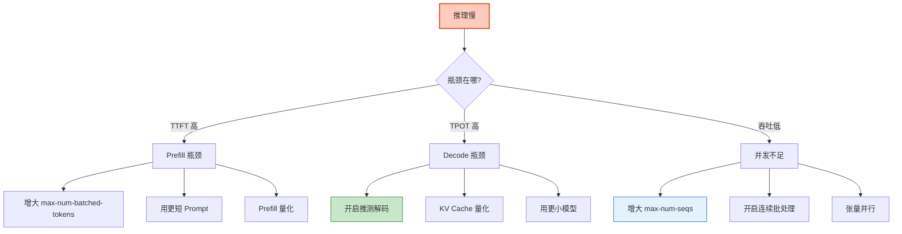

# LLM 推理引擎深度优化指南

> 同一个 7B 模型，未优化推理 50 Token/s，优化后 5000 Token/s——100 倍差距。秘密不在模型本身，而在推理引擎。PagedAttention、连续批处理、KV Cache 量化、推测解码——这些技术把 GPU 利用率从 10% 推到 90%。本指南系统讲解 LLM 推理的核心优化技术、各引擎对比，以及生产调优实践。

---

## 1. LLM 推理为什么慢

### 推理过程拆解

```
LLM 推理分两个阶段：

阶段1：Prefill（预填充）
  处理输入 Prompt → 生成 KV Cache → 输出第一个 Token
  - 计算密集型（并行处理所有输入 Token）
  - 决定首 Token 延迟（TTFT）

阶段2：Decode（解码）
  逐个生成 Token → 复用 KV Cache → 输出下一个 Token
  - 内存带宽密集型（每步只处理1个Token）
  - 决定每 Token 延迟和吞吐量

性能瓶颈：
  Prefill：GPU 计算能力
  Decode：GPU 显存带宽（KV Cache 读写）
```

### 关键指标

| 指标 | 含义 | 目标 |
|------|------|------|
| TTFT | 首 Token 延迟 | < 200ms |
| TPOT | 每 Token 延迟 | < 30ms |
| Throughput | 吞吐量（Token/s） | 越高越好 |
| GPU 利用率 | GPU 计算利用率 | > 80% |
| 显存利用率 | 显存占用比 | 85-95% |

---

## 2. 核心优化技术

### 2.1 KV Cache

```
没有 KV Cache：
  生成第 N 个 Token 时，需要重新计算前 N-1 个 Token 的 Key 和 Value
  → O(N²) 复杂度

有 KV Cache：
  缓存之前的 Key 和 Value，只计算当前 Token
  → O(N) 复杂度

问题：
  KV Cache 占用大量显存
  7B 模型 × 32层 × 4096维度 × 2(K+V) × 4096序列长度
  = 32 × 4096 × 2 × 4096 × 2字节(FP16)
  ≈ 2GB（单请求！）
  → 100 并发 = 200GB（超出单卡）

优化：
  PagedAttention：分页管理 KV Cache（vLLM）
  KV Cache 量化：FP16 → INT8/FP8
  KV Cache 压缩：淘汰不重要的 KV
```

### 2.2 PagedAttention（vLLM 核心）

```python
# PagedAttention 原理

"""
传统方式：
  每个请求预分配最大长度的连续显存
  → 碎片化严重、利用率低（~20-40%）

PagedAttention：
  借鉴操作系统虚拟内存
  KV Cache 分成固定大小的"页"（Block）
  按需分配、回收
  → 显存利用率 80-95%
  → 支持更多并发请求
"""

# vLLM 默认使用 PagedAttention，无需手动配置
# vllm serve Qwen/Qwen2.5-7B-Instruct --gpu-memory-utilization 0.9
```

### 2.3 连续批处理

```
传统批处理：
  等一个 batch 的所有请求都完成才处理下一批
  → 短请求等长请求 → GPU 空转

连续批处理（Continuous Batching）：
  每个步骤都动态加入新请求/移除已完成请求
  → GPU 始终满载
  → 吞吐量提升 5-10 倍

vLLM 默认启用，参数：
  --max-num-seqs 256  # 最大并发序列数
```

### 2.4 推测解码

```python
# Speculative Decoding 原理

"""
传统：
  大模型逐个 Token 生成 → 慢

推测解码：
  1. 小模型（Draft Model）快速生成 N 个候选 Token
  2. 大模型一次性验证这 N 个 Token
  3. 接受正确的，拒绝错误的
  → 大模型只需 1 次前向传播验证多个 Token
  → 2-3 倍加速

条件：
  - 需要一个兼容的小模型作为 Draft Model
  - 两个模型的 Tokenizer 必须相同
"""

# vLLM 推测解码配置
# vllm serve Qwen/Qwen2.5-14B-Instruct \
#   --speculative-model Qwen/Qwen2.5-0.5B-Instruct \
#   --num-speculative-tokens 5
```

### 2.5 量化

```python
# 量化：降低模型精度以节省显存和加速推理

"""
FP16（基准）：
  7B 模型 = 14GB 显存
  精度：100%

INT8 量化：
  7B 模型 = 7GB 显存
  精度：~99%

INT4/AWQ 量化：
  7B 模型 = 4GB 显存
  精度：~97%

FP8 量化：
  7B 模型 = 7GB 显存
  精度：~99%
  需要硬件支持（H100/A100）
"""

# vLLM 量化部署
# AWQ 量化
vllm serve Qwen/Qwen2.5-7B-Instruct-AWQ --quantization awq

# GPTQ 量化
vllm serve Qwen/Qwen2.5-7B-Instruct-GPTQ --quantization gptq

# FP8 量化
vllm serve Qwen/Qwen2.5-7B-Instruct --quantization fp8

# KV Cache 量化
vllm serve Qwen/Qwen2.5-7B-Instruct --kv-cache-dtype fp8
```

### 2.6 张量并行

```python
# 多 GPU 并行

"""
单 GPU 装不下大模型？张量并行：
  把模型的不同层分配到不同 GPU
  GPU 0: 层 0-15
  GPU 1: 层 16-31

  每个 GPU 同时计算各自的部分
  → 可以跑更大的模型
  → 但通信开销增加
"""

# 单 GPU
vllm serve Qwen/Qwen2.5-7B-Instruct

# 2 GPU 张量并行
vllm serve Qwen/Qwen2.5-72B-Instruct --tensor-parallel-size 2

# 4 GPU
vllm serve Qwen/Qwen2.5-72B-Instruct-AWQ --tensor-parallel-size 4 --quantization awq
```

---

## 3. 引擎性能对比

### 基准测试数据

```python
@dataclass
class InferenceBenchmark:
    """推理引擎性能基准（A100 80GB）"""

    benchmarks = {
        # (引擎, 模型) → 性能
        ("vllm", "Qwen2.5-7B"): {
            "throughput": 4000,       # Token/s
            "ttft_ms": 30,            # 首 Token 延迟
            "tpot_ms": 8,             # 每 Token 延迟
            "max_concurrent": 100,    # 最大并发
            "gpu_util": 0.85,        # GPU 利用率
        },
        ("vllm", "Qwen2.5-14B"): {
            "throughput": 2500,
            "ttft_ms": 50,
            "tpot_ms": 12,
            "max_concurrent": 60,
            "gpu_util": 0.85,
        },
        ("vllm", "Qwen2.5-72B-AWQ"): {
            "throughput": 1200,
            "ttft_ms": 100,
            "tpot_ms": 25,
            "max_concurrent": 30,
            "gpu_util": 0.80,
        },
        ("sglang", "Qwen2.5-7B"): {
            "throughput": 4500,       # SGLang 稍快
            "ttft_ms": 25,
            "tpot_ms": 7,
            "max_concurrent": 120,
            "gpu_util": 0.88,
        },
        ("tgi", "Qwen2.5-7B"): {
            "throughput": 3000,       # TGI 稍慢
            "ttft_ms": 40,
            "tpot_ms": 10,
            "max_concurrent": 80,
            "gpu_util": 0.75,
        },
        ("ollama", "Qwen2.5-7B"): {
            "throughput": 800,        # Ollama 适合单用户
            "ttft_ms": 80,
            "tpot_ms": 20,
            "max_concurrent": 5,
            "gpu_util": 0.50,
        },
    }

    def compare(self, model: str) -> dict:
        """对比各引擎对同一模型的性能"""
        results = {}
        for (engine, mdl), perf in self.benchmarks.items():
            if mdl == model:
                results[engine] = perf
        return results
```

### 引擎选型

| 引擎 | 吞吐量 | 易用性 | 适合场景 | 推荐指数 |
|------|--------|--------|---------|---------|
| vLLM | ★★★★★ | ★★★ | 生产高并发 | ★★★★★ |
| SGLang | ★★★★★ | ★★ | 极致性能 | ★★★★ |
| TGI | ★★★★ | ★★★★ | 企业生产 | ★★★★ |
| TensorRT-LLM | ★★★★★ | ★★ | NVIDIA 极致 | ★★★★ |
| Ollama | ★★ | ★★★★★ | 开发/个人 | ★★★★ |
| llama.cpp | ★ | ★★★★★ | 边缘/CPU | ★★★ |

---

## 4. 生产调优实践

### vLLM 调优指南

```bash
# === 生产级 vLLM 启动配置 ===

vllm serve Qwen/Qwen2.5-14B-Instruct \
  --port 8000 \
  \
  # 显存管理
  --gpu-memory-utilization 0.92 \        # GPU 显存利用率（留 8% 余量）
  --max-model-len 8192 \                 # 最大序列长度
  --swap-space 4 \                       # CPU 内存交换空间（GB）
  \
  # 批处理
  --max-num-seqs 256 \                   # 最大并发序列
  --max-num-batched-tokens 8192 \        # 单批次最大 Token
  \
  # 量化
  --quantization awq \                   # AWQ 量化
  --kv-cache-dtype fp8 \                 # KV Cache 量化
  \
  # 推测解码
  --speculative-model Qwen/Qwen2.5-0.5B \
  --num-speculative-tokens 5 \
  \
  # 并行
  --tensor-parallel-size 1 \             # 单 GPU
  \
  # API
  --served-model-name qwen2.5-14b \      # API 中的模型名
  --api-key sk-your-key \                # API Key 认证
  \
  # 超时
  --timeout-keep-alive 120               # 长连接超时
```

### 性能调优决策树



### 监控指标

```python
@dataclass
class InferenceMonitor:
    """推理引擎监控"""

    def metrics_to_track(self) -> dict:
        """关键监控指标"""
        return {
            # 性能指标
            "vllm:time_to_first_token_seconds": "首Token延迟",
            "vllm:time_per_output_token_seconds": "每Token延迟",
            "vllm:request_throughput_tokens_per_second": "吞吐量",

            # 资源指标
            "vllm:gpu_cache_usage_perc": "KV Cache利用率",
            "vllm:num_requests_running": "运行中请求数",
            "vllm:num_requests_waiting": "排队请求数",

            # 错误指标
            "vllm:request_error_count": "错误数",
        }

    def alert_rules(self) -> list:
        """告警规则"""
        return [
            {"metric": "ttft", "threshold": ">500ms", "severity": "P3"},
            {"metric": "ttft", "threshold": ">2000ms", "severity": "P1"},
            {"metric": "queue_size", "threshold": ">50", "severity": "P2"},
            {"metric": "error_rate", "threshold": ">5%", "severity": "P2"},
            {"metric": "gpu_memory", "threshold": ">95%", "severity": "P2"},
        ]

    # vLLM 内置 Prometheus 指标
    # 访问 http://localhost:8000/metrics 获取
```

---

## 5. SGLang 进阶

```python
# SGLang 是更新的推理引擎，部分场景比 vLLM 更快

# pip install sglang

# 启动
# python -m sglang.launch_server --model-path Qwen/Qwen2.5-7B-Instruct --port 8000

# SGLang 的核心优势：
# 1. RadixAttention：前缀共享（相同前缀的请求共享 KV Cache）
# 2. 并发 JSON 解码：结构化输出加速
# 3. 更好的多轮对话性能（前缀复用）

# 适用场景：
# - 大量请求有相同 system prompt（前缀共享效率高）
# - 需要频繁 JSON 结构化输出
# - 多轮对话场景
```

### RadixAttention 原理

```
传统方式：
  请求A: "你是助手。用户问1..." → 独立计算 KV Cache
  请求B: "你是助手。用户问2..." → 独立计算 KV Cache（重复！）

RadixAttention：
  共同前缀 "你是助手。" 共享同一份 KV Cache
  请求A: 前缀共享 + "用户问1..." 新增 KV
  请求B: 前缀共享 + "用户问2..." 新增 KV

  → 节省前缀计算
  → 多轮对话/相同系统提示场景大幅加速
```

---

## 6. 模型压缩技术

### 量化方法对比

| 方法 | 精度 | 速度 | 硬件要求 | 推荐度 |
|------|------|------|---------|--------|
| FP16 | 基准 | 基准 | 标准 GPU | ★★★★★ |
| BF16 | 基准 | 基准 | A100+ | ★★★★★ |
| FP8 | ~99% | 1.5x | H100 | ★★★★ |
| INT8 | ~99% | 1.3x | 标准 GPU | ★★★★ |
| AWQ INT4 | ~97% | 2x | 标准 GPU | ★★★★★ |
| GPTQ INT4 | ~96% | 1.8x | 标准 GPU | ★★★★ |
| INT4 原生 | ~95% | 2.5x | 特定硬件 | ★★★ |

### 模型蒸馏

```python
# 模型蒸馏：大模型→小模型

"""
教师模型：72B（质量高但慢）
学生模型：7B（质量中但快）

蒸馏过程：
  1. 用教师模型生成大量回答
  2. 用这些回答训练学生模型
  3. 学生模型学会模仿教师的行为

效果：
  7B 蒸馏模型 ≈ 14B 原始模型质量
  但推理速度快 2 倍
"""

# 使用蒸馏模型
# vllm serve Qwen/Qwen2.5-7B-Instruct-Distilled
```

---

## 7. 检查清单

| 检查项 | 状态 |
|--------|------|
| 理解 Prefill/Decode 两阶段 | ☐ |
| 理解 KV Cache 原理和显存影响 | ☐ |
| 理解 PagedAttention | ☐ |
| 理解连续批处理 | ☐ |
| 理解推测解码 | ☐ |
| 能选择合适的量化方案 | ☐ |
| 能配置 vLLM 生产参数 | ☐ |
| 理解张量并行 | ☐ |
| 能诊断推理性能瓶颈 | ☐ |
| 配置了推理监控指标 | ☐ |

---

## 8. 与其他知识库的关联

| 关联编号 | 文档 | 关系 |
|----------|------|------|
| 29 | 性能基准测试 | 基准测试 |
| 42 | 性能剖析 | 性能分析 |
| 59 | LLM 应用性能剖析 | 性能剖析 |
| 123 | 模型蒸馏与轻量化部署 | 蒸馏 |
| 128 | 性能调优系统 | 调优 |
| 152 | LLM 推理优化与部署加速 | 推理优化 |
| 155 | 模型蒸馏与轻量化部署 | 轻量化 |
| 160 | 性能调优系统指南 | 调优系统 |
| 184 | LLM 推理优化与部署加速 | 推理优化 |
| 228 | 性能基准测试 | 基准 |
| 343 | 编译优化与延迟降低 | 编译优化 |
| 388 | 推理加速与批处理 | 推理加速 |
| 418 | LLM 推理加速与批处理指南 | 加速方案 |
| 434 | 自托管 LLM 与本地推理部署 | 部署 |
| 439 | PEFT 微调与 DPO 对齐 | 微调后部署 |
