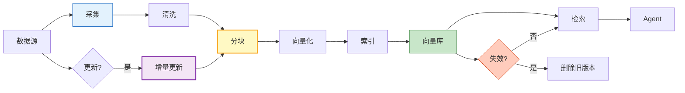

# Agent 数据管道与知识更新指南

> RAG 系统上线只是开始。知识库里的产品文档更新了，向量索引同步了吗？网页数据变了，Agent 还在用旧数据回答？用户反馈了错误信息，怎么反馈到知识库？本指南系统讲解 Agent 数据管道的完整架构：数据采集→清洗→分块→索引→更新→失效检测→质量监控，让知识库持续保鲜。

---

## 1. 数据管道全景

### 完整数据管线



### 数据源类型

| 数据源 | 更新频率 | 采集方式 | 挑战 |
|--------|---------|---------|------|
| 产品文档 | 周/月 | API/文件 | 版本管理 |
| 网页数据 | 实时/天 | 爬虫/API | 反爬/格式变化 |
| 数据库 | 实时 | CDC/查询 | 大数据量 |
| 用户反馈 | 实时 | API/消息队列 | 非结构化 |
| API 文档 | 周 | OpenAPI/手动 | 格式统一 |
| PDF/Office | 不定期 | 文件上传 | OCR/解析 |

---

## 2. 数据采集层

### 多源采集器

```python
from dataclasses import dataclass, field
from typing import List
import httpx
import asyncio

@dataclass
class MultiSourceCollector:
    """多源数据采集器"""

    async def collect_from_api(self, api_url: str, headers: dict = None) -> list:
        """从 REST API 采集"""
        async with httpx.AsyncClient() as client:
            response = await client.get(api_url, headers=headers, timeout=30)
            data = response.json()

        # 标准化为文档格式
        docs = []
        for item in data if isinstance(data, list) else [data]:
            docs.append({
                "content": self._extract_content(item),
                "metadata": {
                    "source": api_url,
                    "collected_at": datetime.utcnow().isoformat(),
                    "source_type": "api",
                    "raw_id": item.get("id", ""),
                },
            })
        return docs

    async def collect_from_files(self, directory: str) -> list:
        """从文件目录采集"""
        import os
        from langchain_community.document_loaders import (
            TextLoader, PyPDFLoader, CSVLoader, Docx2txtLoader,
        )

        docs = []
        loaders = {
            ".txt": TextLoader,
            ".pdf": PyPDFLoader,
            ".csv": CSVLoader,
            ".docx": Docx2txtLoader,
        }

        for root, dirs, files in os.walk(directory):
            for file in files:
                ext = os.path.splitext(file)[1].lower()
                loader_class = loaders.get(ext)
                if loader_class:
                    filepath = os.path.join(root, file)
                    loader = loader_class(filepath)
                    loaded = loader.load()
                    for doc in loaded:
                        doc.metadata["source_type"] = "file"
                        doc.metadata["collected_at"] = datetime.utcnow().isoformat()
                        doc.metadata["file_path"] = filepath
                    docs.extend(loaded)

        return docs

    async def collect_from_web(self, urls: list) -> list:
        """从网页采集"""
        from langchain_community.document_loaders import WebBaseLoader

        docs = []
        for url in urls:
            try:
                loader = WebBaseLoader(url)
                loaded = loader.load()
                for doc in loaded:
                    doc.metadata["source_type"] = "web"
                    doc.metadata["url"] = url
                    doc.metadata["collected_at"] = datetime.utcnow().isoformat()
                docs.extend(loaded)
            except Exception as e:
                print(f"采集失败 {url}: {e}")

        return docs

    async def collect_from_database(self, query: str, conn_str: str) -> list:
        """从数据库采集"""
        from langchain_community.utilities import SQLDatabase

        db = SQLDatabase.from_uri(conn_str)
        result = db.run(query)

        return [{
            "content": str(result),
            "metadata": {
                "source_type": "database",
                "query": query,
                "collected_at": datetime.utcnow().isoformat(),
            },
        }]

    def _extract_content(self, item: dict) -> str:
        """从 API 响应提取内容"""
        # 尝试常见字段
        for field in ["content", "text", "body", "description", "data"]:
            if field in item:
                return str(item[field])
        return str(item)
```

---

## 3. 数据清洗与分块

### 智能清洗

```python
@dataclass
class DataCleaner:
    """数据清洗器"""

    def clean(self, docs: list) -> list:
        """清洗文档"""
        cleaned = []
        for doc in docs:
            content = doc.get("content", doc.get("page_content", ""))

            # 1. 去除多余空白
            content = " ".join(content.split())

            # 2. 去除 HTML 标签
            import re
            content = re.sub(r'<[^>]+>', '', content)

            # 3. 去除特殊字符（保留中文）
            content = re.sub(r'[^\w\s\u4e00-\u9fff.,!?;:\-()（）《》""'']', '', content)

            # 4. 长度过滤
            if len(content) < 10:
                continue  # 太短，跳过

            # 5. 去重（内容哈希）
            content_hash = hash(content)
            if hasattr(self, '_seen_hashes') and content_hash in self._seen_hashes:
                continue

            cleaned.append({**doc, "content": content, "hash": content_hash})

        return cleaned
```

### 自适应分块

```python
from langchain_text_splitters import (
    RecursiveCharacterTextSplitter,
    MarkdownHeaderTextSplitter,
)

@dataclass
class AdaptiveChunker:
    """自适应分块器"""

    def chunk(self, docs: list) -> list:
        """根据文档类型选择分块策略"""
        chunks = []
        for doc in docs:
            content = doc["content"]
            source_type = doc.get("metadata", {}).get("source_type", "")

            if source_type == "web" or "<h1>" in content or "# " in content:
                # Markdown/HTML → 按标题分块
                chunks.extend(self._chunk_by_header(doc))
            elif "|" in content and content.count("|") > 5:
                # 表格数据 → 保留完整表格
                chunks.extend(self._chunk_preserve_tables(doc))
            else:
                # 普通文本 → 递归分块
                chunks.extend(self._chunk_recursive(doc))

        return chunks

    def _chunk_recursive(self, doc: dict) -> list:
        """递归字符分块"""
        splitter = RecursiveCharacterTextSplitter(
            chunk_size=500,
            chunk_overlap=50,
            separators=["\n\n", "\n", "。", "！", "？", ".", " ", ""],
        )

        texts = splitter.split_text(doc["content"])
        return [{**doc, "content": t, "chunk_index": i}
                for i, t in enumerate(texts)]

    def _chunk_by_header(self, doc: dict) -> list:
        """按 Markdown 标题分块"""
        splitter = RecursiveCharacterTextSplitter(
            chunk_size=800,
            chunk_overlap=100,
            separators=["\n## ", "\n### ", "\n#### ", "\n\n", "\n", "。"],
        )

        texts = splitter.split_text(doc["content"])
        return [{**doc, "content": t, "chunk_index": i}
                for i, t in enumerate(texts)]
```

---

## 4. 增量更新机制

### 变更检测

```python
@dataclass
class ChangeDetector:
    """文档变更检测"""

    async def detect_changes(self, source_docs: list,
                              existing_docs: list) -> dict:
        """检测新增、修改、删除的文档"""
        source_hashes = {d["hash"]: d for d in source_docs}
        existing_hashes = {d["hash"]: d for d in existing_docs}

        added = [d for h, d in source_hashes.items() if h not in existing_hashes]
        modified = []  # 如果有版本字段可检测修改
        deleted = [d for h, d in existing_hashes.items() if h not in source_hashes]

        return {
            "added": added,
            "modified": modified,
            "deleted": deleted,
            "total_source": len(source_docs),
            "total_existing": len(existing_docs),
        }
```

### 增量索引

```python
@dataclass
class IncrementalIndexer:
    """增量索引管理器"""

    def __init__(self, vectorstore):
        self.vectorstore = vectorstore

    async def update(self, changes: dict):
        """增量更新向量库"""
        stats = {"added": 0, "deleted": 0, "errors": 0}

        # 1. 添加新文档
        for doc in changes["added"]:
            try:
                await self._add_doc(doc)
                stats["added"] += 1
            except Exception as e:
                stats["errors"] += 1
                print(f"添加失败: {e}")

        # 2. 删除过期文档
        for doc in changes["deleted"]:
            try:
                await self._delete_doc(doc)
                stats["deleted"] += 1
            except Exception as e:
                stats["errors"] += 1

        # 3. 修改文档 = 删除旧 + 添加新
        for doc in changes["modified"]:
            try:
                await self._delete_doc(doc)
                await self._add_doc(doc)
                stats["added"] += 1
                stats["deleted"] += 1
            except Exception as e:
                stats["errors"] += 1

        return stats

    async def _add_doc(self, doc: dict):
        """添加文档到向量库"""
        self.vectorstore.add_texts(
            texts=[doc["content"]],
            metadatas=[doc.get("metadata", {})],
        )

    async def _delete_doc(self, doc: dict):
        """从向量库删除文档"""
        # 通过 metadata 中的 ID 删除
        doc_id = doc.get("metadata", {}).get("raw_id") or doc.get("hash")
        if doc_id:
            self.vectorstore.delete(filter={"raw_id": doc_id})
```

---

## 5. 定时调度

```python
from apscheduler.schedulers.asyncio import AsyncIOScheduler

@dataclass
class PipelineScheduler:
    """数据管道定时调度"""

    scheduler: AsyncIOScheduler = None

    def __post_init__(self):
        self.scheduler = AsyncIOScheduler()

    def setup(self, collector: MultiSourceCollector,
              cleaner: DataCleaner,
              chunker: AdaptiveChunker,
              indexer: IncrementalIndexer):
        """配置定时任务"""

        # 每天凌晨 2 点全量更新
        self.scheduler.add_job(
            self._full_refresh,
            "cron", hour=2, minute=0,
            args=[collector, cleaner, chunker, indexer],
            id="daily_full_refresh",
        )

        # 每小时增量更新
        self.scheduler.add_job(
            self._incremental_update,
            "interval", hours=1,
            args=[collector, cleaner, indexer],
            id="hourly_incremental",
        )

        # 每 5 分钟检查网页更新
        self.scheduler.add_job(
            self._check_web_changes,
            "interval", minutes=5,
            args=[collector, indexer],
            id="web_change_check",
        )

    async def _full_refresh(self, collector, cleaner, chunker, indexer):
        """全量刷新"""
        print(f"[{datetime.now()}] 开始全量刷新...")

        # 1. 采集全部数据
        docs = await collector.collect_from_files("/data/docs")

        # 2. 清洗
        docs = cleaner.clean(docs)

        # 3. 分块
        chunks = chunker.chunk(docs)

        # 4. 全量重建索引
        # 先删除旧索引，再重新建立
        await self._rebuild_index(chunks, indexer)

        print(f"[{datetime.now()}] 全量刷新完成: {len(chunks)} 个块")

    async def _incremental_update(self, collector, cleaner, indexer):
        """增量更新"""
        print(f"[{datetime.now()}] 开始增量更新...")

        # 1. 采集最新数据
        new_docs = await collector.collect_from_api("https://api.example.com/docs")

        # 2. 清洗
        new_docs = cleaner.clean(new_docs)

        # 3. 检测变更
        existing_docs = await self._get_existing_docs()
        changes = await ChangeDetector().detect_changes(new_docs, existing_docs)

        # 4. 增量更新
        stats = await indexer.update(changes)

        print(f"[{datetime.now()}] 增量更新: +{stats['added']} -{stats['deleted']}")

    def start(self):
        """启动调度器"""
        self.scheduler.start()
        print("数据管道调度器已启动")

    def stop(self):
        """停止调度器"""
        self.scheduler.shutdown()
        print("数据管道调度器已停止")
```

---

## 6. 失效检测

```python
@dataclass
class StalenessDetector:
    """知识库失效检测"""

    async def check_staleness(self):
        """检查知识库中过期的内容"""
        results = {
            "stale_docs": [],
            "broken_links": [],
            "low_quality": [],
        }

        # 1. 时间过期
        all_docs = await self._get_all_docs()
        for doc in all_docs:
            collected_at = doc.metadata.get("collected_at", "")
            if collected_at:
                age_days = (datetime.utcnow() - datetime.fromisoformat(collected_at)).days
                if age_days > 90:
                    results["stale_docs"].append({
                        "doc_id": doc.metadata.get("raw_id"),
                        "age_days": age_days,
                        "recommendation": "重新采集或删除",
                    })

        # 2. 链接失效
        for doc in all_docs:
            url = doc.metadata.get("url", "")
            if url:
                if not await self._check_url_alive(url):
                    results["broken_links"].append({"url": url})

        # 3. 质量检查
        for doc in all_docs:
            if len(doc.page_content) < 50:
                results["low_quality"].append({
                    "doc_id": doc.metadata.get("raw_id"),
                    "reason": "内容过短",
                })

        return results

    async def _check_url_alive(self, url: str) -> bool:
        """检查 URL 是否可访问"""
        try:
            async with httpx.AsyncClient() as client:
                response = await client.head(url, timeout=5, follow_redirects=True)
                return response.status_code < 400
        except:
            return False
```

---

## 7. 质量监控

```python
@dataclass
class KnowledgeQualityMonitor:
    """知识库质量监控"""

    async def daily_report(self) -> dict:
        """日质量报告"""
        return {
            "total_docs": await self._count_docs(),
            "avg_chunks_per_doc": await self._avg_chunks(),
            "stale_rate": await self._stale_rate(),
            "broken_link_rate": await self._broken_link_rate(),
            "avg_retrieval_score": await self._avg_retrieval_score(),
            "user_feedback_negative": await self._negative_feedback_count(),
        }

    async def retrieval_quality_check(self, test_queries: list):
        """检索质量检查"""
        results = []
        for query in test_queries:
            # 执行检索
            docs = await vectorstore.similarity_search_with_score(query, k=5)

            # 评估结果
            top_score = docs[0][1] if docs else 0
            avg_score = sum(s for _, s in docs) / len(docs) if docs else 0

            results.append({
                "query": query,
                "top_score": top_score,
                "avg_score": avg_score,
                "result_count": len(docs),
                "quality": "high" if top_score > 0.8 else "medium" if top_score > 0.5 else "low",
            })

        return results
```

---

## 8. 检查清单

| 检查项 | 状态 |
|--------|------|
| 实现了多源数据采集（API/文件/网页/DB） | ☐ |
| 实现了数据清洗（去重/去噪/过滤） | ☐ |
| 实现了自适应分块（按文档类型） | ☐ |
| 实现了增量更新机制 | ☐ |
| 配置了定时调度（全量+增量） | ☐ |
| 实现了失效检测（时间/链接/质量） | ☐ |
| 配置了质量监控仪表盘 | ☐ |
| 实现了用户反馈闭环 | ☐ |

---

## 9. 与其他知识库的关联

| 关联编号 | 文档 | 关系 |
|----------|------|------|
| 23 | 文档处理管线 | 文档处理 |
| 31 | 文档处理管线 | 管线 |
| 44 | 知识库增量更新 | 增量更新 |
| 68 | RAG 数据治理 | 数据治理 |
| 111 | RAG 文档失效检测与清理 | 失效检测 |
| 144 | 知识库 ETL 与数据摄入管线 | ETL |
| 169 | 文档更新策略 | 更新策略 |
| 201 | RAG 文档更新策略深度 | 更新策略 |
| 218 | 增量更新 | 增量更新 |
| 248 | 知识库冷启动策略 | 冷启动 |
| 250 | 知识库增量更新 | 增量 |
| 271 | 文档失效图解 | 失效 |
| 403 | RAG 知识库版本管理与文档变更追踪 | 版本管理 |
| 414 | 数据飞轮与持续学习 | 数据飞轮 |
