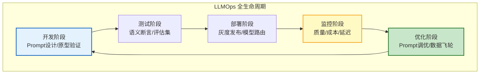

# LLMOps 与 Agent 全生命周期运维指南

> DevOps 管"代码部署"，MLOps 管"模型训练"，LLMOps 管"LLM 应用"——但 LLM 应用不是传统软件：没有固定版本、输出不确定、依赖外部 API、成本随用量波动。本指南系统讲解 LLMOps 的完整体系：从 Prompt 版本管理、模型 A/B 测试、线上监控、到持续优化的闭环。

---

## 1. LLMOps vs DevOps vs MLOps

### 三者对比

| 维度 | DevOps | MLOps | LLMOps |
|------|--------|-------|--------|
| 管理对象 | 代码 | 模型+代码 | Prompt+模型+Agent |
| 版本控制 | Git | Git+模型注册 | Git+Prompt注册+模型路由 |
| 测试方式 | 单元/集成 | 数据+模型评估 | 语义断言+LLM-as-Judge |
| 部署方式 | CI/CD | 模型服务化 | 多模型路由+灰度 |
| 监控对象 | 系统指标 | 数据漂移 | 输出质量+Token成本+延迟 |
| 回滚方式 | 代码回滚 | 模型回滚 | Prompt回滚+模型切换 |
| 持续优化 | 代码迭代 | 数据迭代 | Prompt+数据+模型三维迭代 |

### LLMOps 全生命周期



---

## 2. Prompt 版本管理

### Prompt 注册中心

```python
from dataclasses import dataclass, field
from datetime import datetime
import hashlib

@dataclass
class PromptRegistry:
    """Prompt 版本注册中心"""

    prompts: dict = field(default_factory=dict)  # {name: [versions]}

    def register(self, name: str, template: str, variables: list,
                 model: str = "gpt-4o-mini", tags: list = None) -> dict:
        """注册新版本 Prompt"""
        version_hash = hashlib.md5(template.encode()).hexdigest()[:8]
        version = {
            "name": name,
            "template": template,
            "variables": variables,
            "model": model,
            "tags": tags or [],
            "version": f"v{len(self.prompts.get(name, [])) + 1}",
            "hash": version_hash,
            "created_at": datetime.utcnow().isoformat(),
            "status": "draft",  # draft | testing | production | retired
        }
        self.prompts.setdefault(name, []).append(version)
        return version

    def get_production(self, name: str) -> dict:
        """获取生产环境版本"""
        versions = self.prompts.get(name, [])
        for v in reversed(versions):
            if v["status"] == "production":
                return v
        return versions[-1] if versions else None

    def promote(self, name: str, version: str, status: str = "production"):
        """提升版本状态"""
        versions = self.prompts.get(name, [])
        for v in versions:
            if v["version"] == version:
                if status == "production":
                    # 将其他生产版本降级
                    for other in versions:
                        if other["status"] == "production":
                            other["status"] = "retired"
                v["status"] = status
                return v
        return None

    def rollback(self, name: str) -> dict:
        """回滚到上一个生产版本"""
        versions = self.prompts.get(name, [])
        prod_versions = [v for v in versions if v["status"] in ("production", "retired")]
        if len(prod_versions) < 2:
            return None

        # 当前生产版本降级
        current = prod_versions[-1]
        current["status"] = "retired"

        # 上一个版本恢复
        previous = prod_versions[-2]
        previous["status"] = "production"
        return previous

    def diff(self, name: str, v1: str, v2: str) -> dict:
        """对比两个版本差异"""
        versions = {v["version"]: v for v in self.prompts.get(name, [])}
        p1, p2 = versions.get(v1), versions.get(v2)
        if not p1 or not p2:
            return None

        return {
            "v1_template": p1["template"],
            "v2_template": p2["template"],
            "v1_model": p1["model"],
            "v2_model": p2["model"],
            "changed": p1["template"] != p2["template"] or p1["model"] != p2["model"],
        }
```

---

## 3. 模型 A/B 测试

### 流量分桶

```python
@dataclass
class ModelABTest:
    """模型 A/B 测试管理器"""

    def __init__(self):
        self.experiments: dict = {}

    def create_experiment(self, name: str, model_a: str, model_b: str,
                          traffic_split: float = 0.5, min_samples: int = 100):
        """创建 A/B 测试"""
        self.experiments[name] = {
            "model_a": model_a,
            "model_b": model_b,
            "traffic_split": traffic_split,  # B 的流量比例
            "min_samples": min_samples,
            "results": {"a": [], "b": []},
            "status": "running",
        }

    def assign(self, experiment: str, user_id: str) -> str:
        """分桶：决定用户用哪个模型"""
        exp = self.experiments.get(experiment)
        if not exp or exp["status"] != "running":
            return exp["model_a"] if exp else "default"

        # 基于 user_id 的确定性分桶
        import hashlib
        hash_val = int(hashlib.md5(user_id.encode()).hexdigest(), 16) % 100
        if hash_val < exp["traffic_split"] * 100:
            return exp["model_b"]
        return exp["model_a"]

    def record_result(self, experiment: str, model: str,
                      quality_score: float, latency: float, cost: float):
        """记录结果"""
        exp = self.experiments.get(experiment)
        if not exp:
            return

        bucket = "a" if model == exp["model_a"] else "b"
        exp["results"][bucket].append({
            "quality": quality_score,
            "latency": latency,
            "cost": cost,
        })

        # 检查是否达到最小样本量
        total = len(exp["results"]["a"]) + len(exp["results"]["b"])
        if total >= exp["min_samples"] * 2:
            self._evaluate(experiment)

    def _evaluate(self, experiment: str) -> dict:
        """评估实验结果"""
        exp = self.experiments[experiment]
        a_results = exp["results"]["a"]
        b_results = exp["results"]["b"]

        def avg(lst, key):
            return sum(r[key] for r in lst) / len(lst) if lst else 0

        comparison = {
            "model_a": {
                "name": exp["model_a"],
                "samples": len(a_results),
                "avg_quality": avg(a_results, "quality"),
                "avg_latency": avg(a_results, "latency"),
                "avg_cost": avg(a_results, "cost"),
            },
            "model_b": {
                "name": exp["model_b"],
                "samples": len(b_results),
                "avg_quality": avg(b_results, "quality"),
                "avg_latency": avg(b_results, "latency"),
                "avg_cost": avg(b_results, "cost"),
            },
        }

        # 判断 B 是否显著优于 A
        b_better_quality = comparison["model_b"]["avg_quality"] > comparison["model_a"]["avg_quality"]
        b_cheaper = comparison["model_b"]["avg_cost"] < comparison["model_a"]["avg_cost"]

        if b_better_quality and b_cheaper:
            comparison["winner"] = "b"
            exp["status"] = "b_wins"
        elif b_better_quality:
            comparison["winner"] = "b_quality"
        else:
            comparison["winner"] = "a"

        exp["evaluation"] = comparison
        return comparison
```

---

## 4. 线上质量监控

### 多维度监控指标

```python
@dataclass
class LLMQualityMonitor:
    """LLM 输出质量监控"""

    metrics: dict = field(default_factory=lambda: {
        "total_requests": 0,
        "quality_scores": [],      # 用户反馈/自动评分
        "latency_ms": [],
        "token_costs": [],
        "error_count": 0,
        "empty_responses": 0,
        "refusal_count": 0,        # 拒绝回答次数
    })

    def record(self, quality: float = None, latency: float = None,
               cost: float = None, error: bool = False, refusal: bool = False):
        """记录单次请求"""
        self.metrics["total_requests"] += 1
        if quality is not None:
            self.metrics["quality_scores"].append(quality)
        if latency is not None:
            self.metrics["latency_ms"].append(latency)
        if cost is not None:
            self.metrics["token_costs"].append(cost)
        if error:
            self.metrics["error_count"] += 1
        if refusal:
            self.metrics["refusal_count"] += 1

    def report(self) -> dict:
        """生成报告"""
        total = self.metrics["total_requests"]
        if total == 0:
            return {"total": 0}

        q = self.metrics["quality_scores"]
        l = self.metrics["latency_ms"]
        c = self.metrics["token_costs"]

        return {
            "total_requests": total,
            "avg_quality": sum(q) / len(q) if q else 0,
            "p50_latency_ms": sorted(l)[len(l)//2] if l else 0,
            "p95_latency_ms": sorted(l)[int(len(l)*0.95)] if l else 0,
            "error_rate": self.metrics["error_count"] / total,
            "refusal_rate": self.metrics["refusal_count"] / total,
            "avg_cost": sum(c) / len(c) if c else 0,
            "total_cost": sum(c),
            "alerts": self._check_alerts(),
        }

    def _check_alerts(self) -> list:
        """检查告警"""
        alerts = []
        report = self.report()

        if report["error_rate"] > 0.05:
            alerts.append({"level": "P2", "msg": f"错误率 {report['error_rate']:.1%} > 5%"})
        if report.get("p95_latency_ms", 0) > 30000:
            alerts.append({"level": "P3", "msg": f"P95 延迟 {report['p95_latency_ms']:.0f}ms > 30s"})
        if report.get("refusal_rate", 0) > 0.15:
            alerts.append({"level": "P2", "msg": f"拒绝率 {report['refusal_rate']:.1%} > 15%"})

        return alerts
```

### 数据飞轮

```python
@dataclass
class DataFlywheel:
    """数据飞轮：用户反馈 → 数据 → 优化 → 更好的服务"""

    async def collect_feedback(self, request_id: str, user_id: str,
                               rating: int, comment: str = ""):
        """收集用户反馈"""
        feedback = {
            "request_id": request_id,
            "user_id": user_id,
            "rating": rating,  # 1-5
            "comment": comment,
            "timestamp": datetime.utcnow().isoformat(),
        }
        await db.feedback.insert(feedback)

        # 低评分触发分析
        if rating <= 2:
            await self._analyze_bad_response(request_id)

    async def _analyze_bad_response(self, request_id: str):
        """分析差评原因"""
        # 获取原始请求和响应
        original = await db.requests.get(request_id)

        llm = ChatOpenAI(model="gpt-4o-mini", temperature=0)
        analysis = await llm.ainvoke(
            f"""分析以下 AI 回答为什么不好。

用户问题: {original['query']}
AI 回答: {original['response']}
用户评分: {original['rating']}
用户评论: {original.get('comment', '')}

分析原因分类：
1. 事实错误
2. 理解偏差
3. 回答不完整
4. 格式问题
5. 语气问题
6. 其他

给出改进建议。"""
        )

        await db.feedback_analysis.insert({
            "request_id": request_id,
            "analysis": analysis.content,
            "timestamp": datetime.utcnow().isoformat(),
        })

    async def get_optimization_data(self) -> dict:
        """获取优化数据（用于 Prompt 调优和评估集）"""
        # 低分回答 → 加入负样本
        negative = await db.feedback.find({"rating": {"$lte": 2}}).to_list(100)
        # 高分回答 → 加入正样本
        positive = await db.feedback.find({"rating": {"$gte": 4}}).to_list(100)

        return {
            "negative_samples": negative,
            "positive_samples": positive,
            "recommendation": "将正样本加入 few-shot，负样本加入评估集"
        }
```

---

## 5. 灰度发布

```python
@dataclass
class GradualRelease:
    """Prompt/模型灰度发布"""

    stages = [
        {"name": "内部测试", "traffic": 0.0, "users": ["internal"]},
        {"name": "1% 灰度", "traffic": 0.01},
        {"name": "5% 灰度", "traffic": 0.05},
        {"name": "25% 灰度", "traffic": 0.25},
        {"name": "50% 灰度", "traffic": 0.50},
        {"name": "全量发布", "traffic": 1.00},
    ]

    def __init__(self):
        self.current_stage = 0
        self.quality_threshold = 0.8  # 质量阈值
        self.metrics = GradualReleaseMetrics()

    async def can_advance(self) -> tuple[bool, str]:
        """检查是否可以推进到下一阶段"""
        if self.current_stage >= len(self.stages) - 1:
            return False, "已全量发布"

        # 检查当前阶段质量
        report = self.metrics.report()
        if report["error_rate"] > 0.05:
            return False, f"错误率 {report['error_rate']:.1%} 过高"
        if report.get("avg_quality", 0) < self.quality_threshold:
            return False, f"质量分 {report['avg_quality']:.2f} 低于阈值"

        return True, f"可推进到 {self.stages[self.current_stage + 1]['name']}"

    async def advance(self):
        """推进到下一阶段"""
        can, reason = await self.can_advance()
        if not can:
            return {"success": False, "reason": reason}

        self.current_stage += 1
        stage = self.stages[self.current_stage]
        return {"success": True, "stage": stage["name"], "traffic": stage["traffic"]}

    async def rollback(self):
        """回滚到上一阶段"""
        if self.current_stage > 0:
            self.current_stage -= 1
            stage = self.stages[self.current_stage]
            return {"success": True, "stage": stage["name"]}
        return {"success": False, "reason": "已在初始阶段"}

    def should_use_new_version(self, user_id: str) -> bool:
        """判断用户是否使用新版本"""
        traffic = self.stages[self.current_stage]["traffic"]
        if traffic >= 1.0:
            return True
        if traffic <= 0:
            return False
        # 确定性分桶
        hash_val = int(hashlib.md5(user_id.encode()).hexdigest(), 16) % 10000
        return hash_val < traffic * 10000
```

---

## 6. 检查清单

| 检查项 | 状态 |
|--------|------|
| 理解 LLMOps vs DevOps vs MLOps | ☐ |
| 实现了 Prompt 注册中心 | ☐ |
| 实现了 Prompt 版本管理和回滚 | ☐ |
| 实现了模型 A/B 测试 | ☐ |
| 配置了线上质量监控 | ☐ |
| 实现了数据飞轮（反馈→优化） | ☐ |
| 实现了灰度发布（渐进式推进） | ☐ |
| 有自动回滚机制 | ☐ |

---

## 7. 与其他知识库的关联

| 关联编号 | 文档 | 关系 |
|----------|------|------|
| 30 | Prompt 版本管理 | 版本管理 |
| 50 | LLM 应用全生命周期管理 | 生命周期 |
| 161 | Prompt 版本管理 | 版本 |
| 173 | 版本管理与灰度发布 | 灰度 |
| 193 | Prompt 版本管理与实验 | 实验 |
| 207 | 灰度发布与发布管理 | 灰度 |
| 341 | 反馈闭环 | 反馈 |
| 354 | Prompt 注册中心与 A/B 测试 | A/B 测试 |
| 369 | Prompt 版本对比与回归测试 | 回归 |
| 384 | 数据飞轮与持续学习 | 飞轮 |
| 385 | 模型 AB 测试 | A/B |
| 389 | 提示词版本管理 | 版本 |
| 414 | 数据飞轮与持续学习 | 飞轮 |
| 415 | 模型 AB 测试与实验平台 | 实验平台 |
| 419 | 提示词版本管理与 AB 测试 | 版本 |
