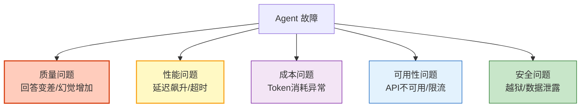
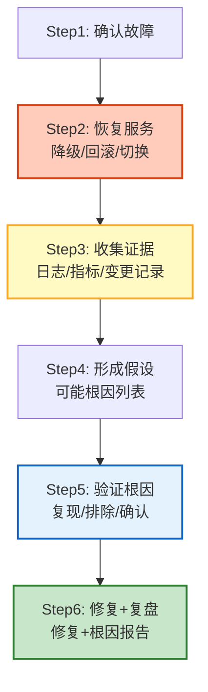

# 事件响应与根因分析指南

> Agent 线上出问题了——回答质量突然下降、延迟飙升、错误率上升。是模型变了？是数据变了？是 Prompt 被改了？还是流量突增？本指南系统讲解 LLM 应用的故障分类、事件分级、根因分析方法论，以及自动化诊断工具链。

---

## 1. LLM 应用故障分类

### 故障类型



### 故障与根因映射

| 故障表现 | 可能根因 | 排查方向 |
|---------|---------|---------|
| 回答质量下降 | 模型更新/Prompt 变更/数据漂移 | 对比版本、检查 Prompt 历史 |
| 延迟飙升 | 模型过载/网络问题/上下文过长 | 检查 Token 数、API 状态 |
| Token 成本异常 | 上下文累积/工具返回过长/模型切换 | 分析 Token 分布 |
| API 限流 | 流量突增/配额用尽 | 检查 RPM/TPM |
| 幻觉增加 | 检索质量差/模型降级/Prompt 松散 | 检查检索分数 |
| 工具调用失败 | API 变更/权限问题/参数格式 | 检查工具日志 |

---

## 2. 事件分级

```python
from dataclasses import dataclass
from enum import Enum

class Severity(Enum):
    P0 = "P0"  # 全面不可用
    P1 = "P1"  # 严重降级
    P2 = "P2"  # 部分功能受损
    P3 = "P3"  # 轻微影响
    P4 = "P4"  # 信息性

@dataclass
class IncidentClassifier:
    """事件分级器"""

    def classify(self, impact: dict) -> Severity:
        """根据影响分级"""
        affected_users = impact.get("affected_users", 0)
        error_rate = impact.get("error_rate", 0)
        latency_p95 = impact.get("latency_p95_ms", 0)
        cost_overrun = impact.get("cost_overrun", 0)

        # P0: 全面不可用
        if error_rate > 0.5 or affected_users > 1000:
            return Severity.P0

        # P1: 严重降级
        if error_rate > 0.2 or latency_p95 > 60000 or affected_users > 100:
            return Severity.P1

        # P2: 部分功能受损
        if error_rate > 0.05 or latency_p95 > 30000 or affected_users > 10:
            return Severity.P2

        # P3: 轻微影响
        if error_rate > 0.01 or latency_p95 > 10000 or cost_overrun > 1.5:
            return Severity.P3

        return Severity.P4

    def get_response_plan(self, severity: Severity) -> dict:
        """获取响应计划"""
        plans = {
            Severity.P0: {
                "response_time": "5分钟",
                "escalation": "立即通知全体",
                "actions": ["切换备用模型", "启用降级模式", "通知用户"],
            },
            Severity.P1: {
                "response_time": "15分钟",
                "escalation": "通知值班工程师",
                "actions": ["排查根因", "考虑回滚", "监控趋势"],
            },
            Severity.P2: {
                "response_time": "1小时",
                "escalation": "创建工单",
                "actions": ["分析日志", "定位问题"],
            },
            Severity.P3: {
                "response_time": "4小时",
                "escalation": "记录待处理",
                "actions": ["收集数据", "定期复查"],
            },
        }
        return plans.get(severity, plans[Severity.P3])
```

---

## 3. 根因分析方法论

### 五步根因分析法



### 变更分析

```python
@dataclass
class ChangeAnalyzer:
    """变更分析器：查找"什么变了""""

    async def find_recent_changes(self, incident_time: datetime) -> dict:
        """查找事件前的变更"""
        window_start = incident_time - timedelta(hours=24)

        changes = {
            "prompt_changes": await self._find_prompt_changes(window_start, incident_time),
            "model_changes": await self._find_model_changes(window_start, incident_time),
            "data_changes": await self._find_data_changes(window_start, incident_time),
            "config_changes": await self._find_config_changes(window_start, incident_time),
            "deploys": await self._find_deploys(window_start, incident_time),
            "traffic_changes": await self._find_traffic_changes(window_start, incident_time),
        }

        return changes

    async def _find_prompt_changes(self, start, end) -> list:
        """查找 Prompt 变更"""
        # 从 Prompt 注册中心查找
        changes = []
        # 检查哪些 Prompt 在时间窗口内被修改
        return changes

    async def _find_model_changes(self, start, end) -> list:
        """查找模型路由变更"""
        # 从模型路由配置中查找
        return []

    async def _find_data_changes(self, start, end) -> list:
        """查找知识库数据变更"""
        # 从数据管道日志中查找
        return []
```

### 指标关联分析

```python
@dataclass
class MetricCorrelator:
    """指标关联分析器"""

    async def correlate(self, incident_time: datetime) -> dict:
        """关联分析：哪些指标同时变化"""
        # 获取事件前后的指标
        before = await self._get_metrics(incident_time - timedelta(hours=1))
        after = await self._get_metrics(incident_time)

        correlations = []
        for metric_name in before:
            before_val = before[metric_name]
            after_val = after.get(metric_name, before_val)

            if before_val > 0:
                change_pct = (after_val - before_val) / before_val * 100

                if abs(change_pct) > 20:  # 变化超过 20%
                    correlations.append({
                        "metric": metric_name,
                        "before": before_val,
                        "after": after_val,
                        "change_pct": change_pct,
                        "direction": "↑" if change_pct > 0 else "↓",
                    })

        # 按变化幅度排序
        correlations.sort(key=lambda x: abs(x["change_pct"]), reverse=True)

        return {
            "correlated_metrics": correlations[:10],
            "hypothesis": self._generate_hypothesis(correlations),
        }

    def _generate_hypothesis(self, correlations: list) -> list:
        """基于指标变化生成根因假设"""
        hypotheses = []

        for c in correlations:
            if c["metric"] == "error_rate" and c["direction"] == "↑":
                hypotheses.append("错误率上升：可能是模型/API/数据问题")
            if c["metric"] == "latency_p95" and c["direction"] == "↑":
                hypotheses.append("延迟上升：可能是模型过载或上下文过长")
            if c["metric"] == "token_cost" and c["direction"] == "↑":
                hypotheses.append("成本上升：可能是上下文累积或工具返回过长")
            if c["metric"] == "quality_score" and c["direction"] == "↓":
                hypotheses.append("质量下降：可能是模型降级或 Prompt 变更")

        return hypotheses
```

---

## 4. 自动化诊断

### 自动诊断工具

```python
@dataclass
class AutoDiagnostician:
    """自动化诊断工具"""

    async def diagnose(self, incident: dict) -> dict:
        """自动诊断事件"""
        diagnosis = {
            "incident": incident,
            "checks": [],
            "root_cause_candidates": [],
        }

        # 1. 检查 API 可用性
        api_status = await self._check_api_status()
        diagnosis["checks"].append({"name": "API可用性", "result": api_status})

        # 2. 检查模型路由
        model_status = await self._check_model_routing()
        diagnosis["checks"].append({"name": "模型路由", "result": model_status})

        # 3. 检查 Prompt 版本
        prompt_status = await self._check_prompt_version()
        diagnosis["checks"].append({"name": "Prompt版本", "result": prompt_status})

        # 4. 检查数据新鲜度
        data_status = await self._check_data_freshness()
        diagnosis["checks"].append({"name": "数据新鲜度", "result": data_status})

        # 5. 指标关联分析
        correlations = await MetricCorrelator().correlate(
            datetime.fromisoformat(incident["timestamp"])
        )
        diagnosis["checks"].append({"name": "指标关联", "result": correlations})

        # 6. 变更分析
        changes = await ChangeAnalyzer().find_recent_changes(
            datetime.fromisoformat(incident["timestamp"])
        )
        diagnosis["checks"].append({"name": "变更分析", "result": changes})

        # 7. 生成根因候选
        diagnosis["root_cause_candidates"] = self._compile_candidates(diagnosis["checks"])

        return diagnosis

    def _compile_candidates(self, checks: list) -> list:
        """汇总根因候选"""
        candidates = []

        for check in checks:
            result = check["result"]
            name = check["name"]

            if name == "API可用性" and result.get("status") != "ok":
                candidates.append({
                    "root_cause": "API 不可用",
                    "confidence": "high",
                    "evidence": result,
                })

            if name == "Prompt版本" and result.get("recently_changed"):
                candidates.append({
                    "root_cause": f"Prompt 变更: {result.get('change_detail', '')}",
                    "confidence": "high",
                    "evidence": result,
                })

            if name == "指标关联":
                for h in result.get("hypothesis", []):
                    candidates.append({
                        "root_cause": h,
                        "confidence": "medium",
                        "evidence": result.get("correlated_metrics", []),
                    })

        return candidates
```

---

## 5. 事后复盘

### 根因报告模板

```python
@dataclass
class PostMortemGenerator:
    """事后复盘报告生成器"""

    def generate(self, incident: dict, diagnosis: dict, resolution: dict) -> str:
        """生成根因分析报告"""
        return f"""# 事件根因分析报告

## 事件概述
- 事件ID: {incident['id']}
- 严重级别: {incident.get('severity', '未知')}
- 发现时间: {incident['timestamp']}
- 恢复时间: {resolution.get('resolved_at', '未知')}
- 持续时间: {resolution.get('duration', '未知')}
- 影响范围: {incident.get('affected_users', '未知')} 用户

## 故障表现
{incident.get('description', '')}

## 根因分析
{self._format_candidates(diagnosis.get('root_cause_candidates', []))}

## 诊断过程
{self._format_checks(diagnosis.get('checks', []))}

## 恢复措施
{resolution.get('actions_taken', '')}

## 改进措施
1. {resolution.get('action_item_1', '待补充')}
2. {resolution.get('action_item_2', '待补充')}
3. {resolution.get('action_item_3', '待补充')}

## 经验教训
{resolution.get('lessons', '待补充')}
"""

    def _format_candidates(self, candidates: list) -> str:
        lines = []
        for i, c in enumerate(candidates):
            lines.append(f"{i+1}. [{c['confidence']}] {c['root_cause']}")
        return "\n".join(lines)

    def _format_checks(self, checks: list) -> str:
        lines = []
        for check in checks:
            lines.append(f"- {check['name']}: {check['result']}")
        return "\n".join(lines)
```

---

## 6. 检查清单

| 检查项 | 状态 |
|--------|------|
| 理解五类故障分类 | ☐ |
| 实现了事件分级器 | ☐ |
| 理解五步根因分析法 | ☐ |
| 实现了变更分析器 | ☐ |
| 实现了指标关联分析 | ☐ |
| 实现了自动诊断工具 | ☐ |
| 有事后复盘报告模板 | ☐ |
| 建立了改进措施跟踪 | ☐ |

---

## 7. 与其他知识库的关联

| 关联编号 | 文档 | 关系 |
|----------|------|------|
| 20 | 调试工具箱 | 调试 |
| 87 | Agent 决策回放与调试 | 回放 |
| 122 | LLM 应用 SRE 运维与事故响应 | SRE |
| 145 | 灾难恢复 | 灾难恢复 |
| 154 | SRE 运维与事故响应 | SRE |
| 167 | 排错指南 | 排错 |
| 177 | 灾难恢复与备份 | 灾备 |
| 200 | 日志分析与智能诊断 | 日志诊断 |
| 205 | 排错指南 | 排错 |
| 305 | 调试可视化 | 调试 |
| 362 | Agent 工具调用链追踪 | 调用链 |
| 380 | Agent 指标采集与监控面板 | 指标 |
| 390 | 分布式追踪与调用图谱 | 追踪 |
| 429 | Agent 可恢复性与容错编排 | 容错 |
| 445 | Agent 调试与可观测工具链 | 调试工具链 |
| 457 | LLMOps 与全生命周期运维 | LLMOps |
