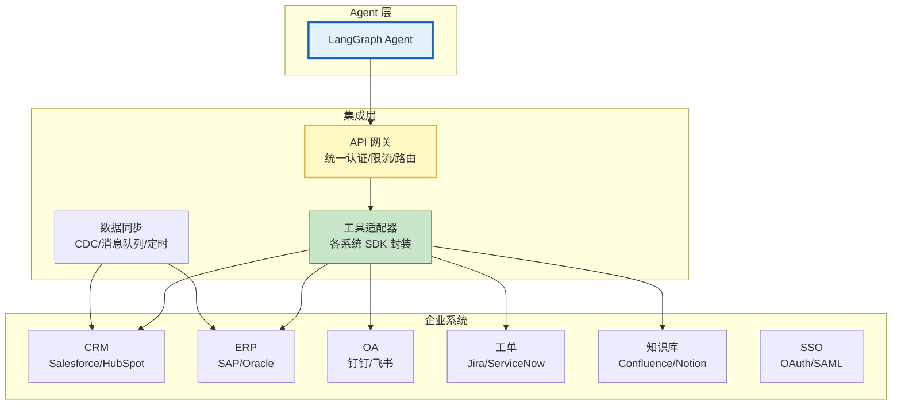

# 企业 Agent 集成与系统对接指南

> Agent 不是孤岛——它需要对接 CRM、ERP、OA、工单系统、知识库、SSO 认证、消息通知等企业系统。Agent 要从 Salesforce 读客户数据、在 Jira 创建工单、通过钉钉发通知、从 Confluence 检索文档。本指南系统讲解企业系统集成的架构模式、API 对接策略、数据同步机制，以及 LangChain 工具封装实践。

---

## 1. 企业集成架构

### 集成全景



### 集成模式

| 模式 | 方式 | 适用 | 延迟 |
|------|------|------|------|
| 实时 API | Agent 直接调用系统 API | 需要最新数据 | 低 |
| 数据同步 | 定时/CDC 同步到本地 | 需要大量数据查询 | 中 |
| 消息队列 | 事件驱动异步 | 解耦、削峰 | 异步 |
| 数据湖 | 全量同步到数据仓库 | 分析型查询 | 高 |
| 混合 | 实时+缓存+异步 | 生产推荐 | 混合 |

---

## 2. 企业系统工具封装

### CRM 集成（Salesforce 示例）

```python
from langchain_core.tools import tool
import httpx

@tool
def search_customer(name: str = "", email: str = "", phone: str = "") -> str:
    """搜索客户信息

    Args:
        name: 客户名称（模糊匹配）
        email: 客户邮箱
        phone: 客户电话
    """
    # Salesforce SOQL 查询
    token = await get_salesforce_token()

    conditions = []
    if name:
        conditions.append(f"Name LIKE '%{name}%'")
    if email:
        conditions.append(f"Email = '{email}'")
    if phone:
        conditions.append(f"Phone = '{phone}'")

    soql = f"SELECT Id, Name, Email, Phone, Account.Name FROM Contact"
    if conditions:
        soql += " WHERE " + " AND ".join(conditions)
    soql += " LIMIT 10"

    async with httpx.AsyncClient() as client:
        response = await client.get(
            f"https://yourInstance.my.salesforce.com/services/data/v58.0/query",
            params={"q": soql},
            headers={"Authorization": f"Bearer {token}"},
        )

    records = response.json().get("records", [])

    if not records:
        return "未找到匹配的客户"

    results = []
    for r in records:
        results.append(
            f"客户: {r['Name']}\n"
            f"  邮箱: {r.get('Email', 'N/A')}\n"
            f"  电话: {r.get('Phone', 'N/A')}\n"
            f"  公司: {r.get('Account', {}).get('Name', 'N/A')}\n"
            f"  ID: {r['Id']}"
        )

    return "\n---\n".join(results)

@tool
def create_opportunity(account_id: str, name: str, amount: float) -> str:
    """创建销售机会

    Args:
        account_id: 客户公司ID
        name: 机会名称
        amount: 预计金额
    """
    token = await get_salesforce_token()

    async with httpx.AsyncClient() as client:
        response = await client.post(
            "https://yourInstance.my.salesforce.com/services/data/v58.0/sobjects/Opportunity",
            headers={"Authorization": f"Bearer {token}"},
            json={
                "AccountId": account_id,
                "Name": name,
                "Amount": amount,
                "StageName": "Prospecting",
                "CloseDate": "2025-12-31",
            },
        )

    if response.status_code == 201:
        return f"销售机会已创建: {response.json()['id']}"
    return f"创建失败: {response.text}"
```

### 工单系统集成（Jira 示例）

```python
@tool
def create_jira_ticket(project: str, summary: str, description: str,
                       priority: str = "Medium") -> str:
    """创建 Jira 工单

    Args:
        project: 项目KEY（如 PROJ）
        summary: 标题
        description: 详细描述
        priority: 优先级 (Highest/High/Medium/Low/Lowest)
    """
    token = get_jira_token()

    async with httpx.AsyncClient() as client:
        response = await client.post(
            f"https://your-domain.atlassian.net/rest/api/3/issue",
            headers={
                "Authorization": f"Basic {token}",
                "Content-Type": "application/json",
            },
            json={
                "fields": {
                    "project": {"key": project},
                    "summary": summary,
                    "description": description,
                    "priority": {"name": priority},
                    "issuetype": {"name": "Task"},
                }
            },
        )

    if response.status_code == 201:
        data = response.json()
        return f"工单已创建: {data['key']}\n链接: https://your-domain.atlassian.net/browse/{data['key']}"
    return f"创建失败: {response.text}"

@tool
def search_jira_tickets(jql: str, max_results: int = 10) -> str:
    """搜索 Jira 工单

    Args:
        jql: JQL 查询语句（如 "project = PROJ AND status = Open"）
        max_results: 最大返回数
    """
    token = get_jira_token()

    async with httpx.AsyncClient() as client:
        response = await client.get(
            "https://your-domain.atlassian.net/rest/api/3/search",
            params={"jql": jql, "maxResults": max_results},
            headers={"Authorization": f"Basic {token}"},
        )

    issues = response.json().get("issues", [])

    if not issues:
        return "未找到匹配的工单"

    results = []
    for issue in issues:
        fields = issue["fields"]
        results.append(
            f"[{issue['key']}] {fields['summary']}\n"
            f"  状态: {fields['status']['name']}\n"
            f"  优先级: {fields['priority']['name']}\n"
            f"  负责人: {fields.get('assignee', {}).get('displayName', '未分配')}"
        )

    return "\n---\n".join(results)
```

### 消息通知集成（钉钉/飞书）

```python
@tool
def send_dingtalk_message(webhook: str, message: str, at_all: bool = False) -> str:
    """发送钉钉机器人消息

    Args:
        webhook: 钉钉机器人 Webhook 地址
        message: 消息内容
        at_all: 是否 @所有人
    """
    async with httpx.AsyncClient() as client:
        response = await client.post(webhook, json={
            "msgtype": "text",
            "text": {"content": message},
            "at": {"isAtAll": at_all},
        })

    if response.json().get("errcode") == 0:
        return "消息已发送"
    return f"发送失败: {response.text}"

@tool
def send_feishu_message(app_id: str, app_secret: str,
                        chat_id: str, message: str) -> str:
    """发送飞书消息

    Args:
        app_id: 飞书应用ID
        app_secret: 飞书应用密钥
        chat_id: 群聊ID
        message: 消息内容
    """
    # 1. 获取 access_token
    async with httpx.AsyncClient() as client:
        token_resp = await client.post(
            "https://open.feishu.cn/open-apis/auth/v3/tenant_access_token/internal",
            json={"app_id": app_id, "app_secret": app_secret},
        )
        token = token_resp.json()["tenant_access_token"]

    # 2. 发送消息
    async with httpx.AsyncClient() as client:
        response = await client.post(
            f"https://open.feishu.cn/open-apis/im/v1/messages?receive_id_type=chat_id",
            headers={"Authorization": f"Bearer {token}"},
            json={
                "receive_id": chat_id,
                "msg_type": "text",
                "content": json.dumps({"text": message}),
            },
        )

    if response.status_code == 200:
        return "消息已发送"
    return f"发送失败: {response.text}"
```

### 知识库集成（Confluence）

```python
@tool
def search_confluence(query: str, space: str = "", max_results: int = 5) -> str:
    """搜索 Confluence 文档

    Args:
        query: 搜索关键词
        space: 空间KEY（留空搜索全部）
        max_results: 最大返回数
    """
    token = get_confluence_token()

    cql = f'text ~ "{query}"'
    if space:
        cql += f' AND space = "{space}"'

    async with httpx.AsyncClient() as client:
        response = await client.get(
            "https://your-domain.atlassian.net/wiki/rest/api/content/search",
            params={"cql": cql, "limit": max_results},
            headers={"Authorization": f"Basic {token}"},
        )

    results = response.json().get("results", [])

    if not results:
        return "未找到相关文档"

    output = []
    for r in results:
        output.append(
            f"[{r['title']}]\n"
            f"  链接: https://your-domain.atlassian.net/wiki{r['_links']['webui']}\n"
            f"  类型: {r['type']}\n"
            f"  ID: {r['id']}"
        )

    return "\n---\n".join(output)
```

---

## 3. SSO 认证集成

```python
@dataclass
class SSOAuthenticator:
    """SSO 认证集成"""

    async def authenticate(self, token: str, provider: str = "oauth2") -> dict:
        """验证 SSO Token"""
        if provider == "oauth2":
            return await self._verify_oauth(token)
        elif provider == "saml":
            return await self._verify_saml(token)
        elif provider == "ldap":
            return await self._verify_ldap(token)

    async def _verify_oauth(self, token: str) -> dict:
        """验证 OAuth Token"""
        async with httpx.AsyncClient() as client:
            # 调用 SSO Provider 的 UserInfo 端点
            response = await client.get(
                "https://sso.company.com/oauth2/userinfo",
                headers={"Authorization": f"Bearer {token}"},
            )

        if response.status_code != 200:
            raise ValueError("SSO 认证失败")

        user_info = response.json()
        return {
            "user_id": user_info["sub"],
            "name": user_info.get("name", ""),
            "email": user_info.get("email", ""),
            "roles": user_info.get("roles", []),
            "department": user_info.get("department", ""),
        }
```

---

## 4. 数据同步

### CDC 数据同步

```python
@dataclass
class CDCSyncManager:
    """CDC（变更数据捕获）同步管理器"""

    async def sync_crm_to_local(self):
        """从 CRM 同步数据到本地向量库"""
        # 1. 获取上次同步位置
        last_sync = await self._get_last_sync_time("crm_contacts")

        # 2. 查询增量数据
        async with httpx.AsyncClient() as client:
            response = await client.get(
                "https://yourInstance.my.salesforce.com/services/data/v58.0/query",
                params={
                    "q": f"SELECT Id, Name, Email, Phone, LastModifiedDate "
                         f"FROM Contact WHERE LastModifiedDate > {last_sync}"
                },
                headers={"Authorization": f"Bearer {await get_salesforce_token()}"},
            )

        records = response.json().get("records", [])

        # 3. 更新向量库
        for record in records:
            if record["attributes"]["type"] == "Contact":
                await vectorstore.add_texts(
                    texts=[f"客户: {record['Name']}, 邮箱: {record.get('Email', '')}"],
                    metadatas=[{
                        "source": "salesforce",
                        "record_id": record["Id"],
                        "synced_at": datetime.utcnow().isoformat(),
                    }],
                )

        # 4. 更新同步位置
        await self._update_sync_time("crm_contacts", datetime.utcnow().isoformat())

        return {"synced_count": len(records)}
```

---

## 5. LangGraph 企业 Agent

```python
from langgraph.graph import StateGraph, START, END
from langgraph.prebuilt import create_react_agent

# 企业工具集
enterprise_tools = [
    search_customer,
    create_opportunity,
    create_jira_ticket,
    search_jira_tickets,
    send_dingtalk_message,
    send_feishu_message,
    search_confluence,
]

# 创建企业 Agent
enterprise_agent = create_react_agent(
    ChatOpenAI(model="gpt-4o", temperature=0),
    enterprise_tools,
    prompt="""你是企业助手，可以：
1. 查询客户信息（CRM）
2. 创建/搜索工单（Jira）
3. 发送通知（钉钉/飞书）
4. 搜索文档（Confluence）

根据用户需求选择合适的工具。操作前确认风险。"""
)

# 使用
result = enterprise_agent.invoke({
    "messages": [{
        "role": "user",
        "content": "帮我查一下客户张三的信息，然后给他创建一个跟进工单"
    }]
})
```

---

## 6. 集成安全

### 凭证管理

```python
@dataclass
class CredentialManager:
    """企业凭证管理"""

    # 从环境变量/密钥管理服务获取
    credentials: dict = field(default_factory=lambda: {
        "salesforce": {"client_id": "", "client_secret": "", "instance": ""},
        "jira": {"api_token": "", "domain": ""},
        "dingtalk": {"webhook": ""},
        "feishu": {"app_id": "", "app_secret": ""},
        "confluence": {"token": "", "domain": ""},
    })

    def get(self, system: str) -> dict:
        """获取凭证"""
        creds = self.credentials.get(system, {})
        # 生产环境从 Vault/KMS 获取
        return creds

    def validate(self, system: str) -> bool:
        """验证凭证是否有效"""
        creds = self.get(system)
        return all(v for v in creds.values())
```

### 数据脱敏

```python
async def sanitize_before_output(data: str, user_role: str) -> str:
    """根据角色脱敏数据"""
    if user_role != "admin":
        # 非管理员看不到敏感字段
        import re
        data = re.sub(r'\d{11}', '[手机号已隐藏]', data)
        data = re.sub(r'[\w.-]+@[\w.-]+', '[邮箱已隐藏]', data)
        data = re.sub(r'\d{16,19}', '[卡号已隐藏]', data)

    return data
```

---

## 7. 检查清单

| 检查项 | 状态 |
|--------|------|
| 理解企业集成五种模式 | ☐ |
| 实现了 CRM 工具封装 | ☐ |
| 实现了工单系统工具 | ☐ |
| 实现了消息通知工具 | ☐ |
| 实现了知识库搜索工具 | ☐ |
| 集成了 SSO 认证 | ☐ |
| 实现了 CDC 数据同步 | ☐ |
| 配置了凭证管理 | ☐ |
| 实现了数据脱敏 | ☐ |

---

## 8. 与其他知识库的关联

| 关联编号 | 文档 | 关系 |
|----------|------|------|
| 14 | LangChain 工具集成大全 | 工具集成 |
| 137 | LLM 网关与多模型 API 管理 | 网关 |
| 159 | LLM 应用 API 设计规范 | API 设计 |
| 183 | 事件驱动 Agent 架构 | 事件驱动 |
| 199 | Agent 工具集成大全 | 工具集成 |
| 243 | 工具链编排 | 工具编排 |
| 427 | MCP 协议与 LangChain 工具集成 | MCP |
| 434 | 自托管 LLM | 自托管 |
| 442 | Agent 身份认证与授权 | 认证 |
| 452 | 低代码 Agent 平台 | Dify 集成 |
