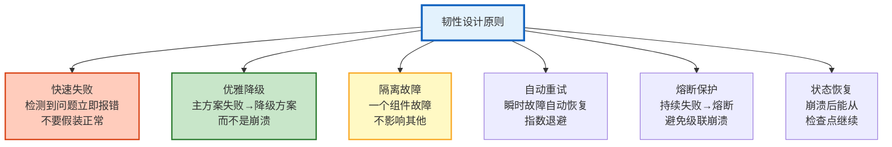

# Agent 可靠性与韧性工程指南

> Agent 在生产环境中会遇到各种异常：LLM API 超时、工具返回错误、用户输入恶意数据、网络抖动、模型幻觉。韧性工程就是让 Agent 在这些情况下仍然能"优雅地"继续工作——不崩溃、不给出有害回答、能自动恢复。本指南系统讲解韧性设计原则、异常处理模式、自动恢复策略，以及混沌工程在 Agent 中的应用。

---

## 1. 韧性设计原则

### 六大原则



### 故障分类与策略

| 故障类型 | 持续时间 | 影响 | 恢复策略 |
|---------|---------|------|---------|
| API 超时 | 秒级 | 单次请求失败 | 重试+退避 |
| API 限流 | 秒-分钟 | 请求被拒绝 | 排队+降速 |
| API 宕机 | 分钟-小时 | 所有请求失败 | 切换备用模型 |
| 工具失败 | 秒级 | 功能不可用 | 降级/替代工具 |
| 模型幻觉 | 永久 | 回答错误 | 事实校验+重试 |
| 网络分区 | 不定 | 不可达 | 重连+缓存兜底 |
| 数据损坏 | 不定 | 状态错误 | 校验+回滚 |
| OOM 崩溃 | 永久 | 进程终止 | 检查点恢复 |

---

## 2. 异常处理模式

### 分级异常处理

```python
from dataclasses import dataclass
from enum import Enum

class ErrorSeverity(Enum):
    TRANSIENT = "transient"    # 瞬时（重试可恢复）
    DEGRADED = "degraded"      # 降级（部分功能不可用）
    CRITICAL = "critical"       # 严重（需要人工介入）
    FATAL = "fatal"             # 致命（系统不可用）

@dataclass
class ResilientHandler:
    """韧性异常处理器"""

    async def handle(self, error: Exception, context: dict) -> dict:
        """处理异常"""
        severity = self._classify(error, context)

        if severity == ErrorSeverity.TRANSIENT:
            return await self._handle_transient(error, context)
        elif severity == ErrorSeverity.DEGRADED:
            return await self._handle_degraded(error, context)
        elif severity == ErrorSeverity.CRITICAL:
            return await self._handle_critical(error, context)
        else:
            return await self._handle_fatal(error, context)

    def _classify(self, error: Exception, context: dict) -> ErrorSeverity:
        """分类异常严重性"""
        error_type = type(error).__name__
        error_msg = str(error).lower()

        # 瞬时错误
        transient_types = ["TimeoutError", "ConnectionError", "RateLimitError"]
        if error_type in transient_types or "timeout" in error_msg:
            return ErrorSeverity.TRANSIENT

        # 降级错误
        if "tool" in error_msg or "function" in error_msg:
            return ErrorSeverity.DEGRADED

        # 严重错误
        if "authentication" in error_msg or "authorization" in error_msg:
            return ErrorSeverity.CRITICAL

        return ErrorSeverity.FATAL

    async def _handle_transient(self, error, context):
        """处理瞬时错误：重试"""
        return {
            "action": "retry",
            "max_retries": 3,
            "backoff": "exponential",
            "message": f"瞬时错误，将重试: {error}",
        }

    async def _handle_degraded(self, error, context):
        """处理降级错误：降级方案"""
        return {
            "action": "degrade",
            "fallback": "使用简化方案或缓存结果",
            "message": f"功能降级: {error}",
        }

    async def _handle_critical(self, error, context):
        """处理严重错误：通知+人工"""
        return {
            "action": "alert",
            "notify": True,
            "message": f"严重错误，需人工介入: {error}",
        }

    async def _handle_fatal(self, error, context):
        """处理致命错误：安全关闭"""
        return {
            "action": "shutdown",
            "save_state": True,
            "message": f"致命错误，安全关闭: {error}",
        }
```

### 优雅降级链

```python
@dataclass
class GracefulDegradation:
    """优雅降级链"""

    async def llm_with_fallback(self, prompt: str) -> str:
        """LLM 降级链：贵→便宜→缓存→默认"""
        # Level 1: 主模型（GPT-4o）
        try:
            return await self._call_model("gpt-4o", prompt, timeout=30)
        except Exception:
            pass

        # Level 2: 便宜模型（GPT-4o-mini）
        try:
            return await self._call_model("gpt-4o-mini", prompt, timeout=15)
        except Exception:
            pass

        # Level 3: 缓存
        cached = await self._check_cache(prompt)
        if cached:
            return cached + "\n[来源：缓存]"

        # Level 4: 默认回复
        return "抱歉，服务暂时不可用，请稍后重试。"

    async def tool_with_fallback(self, tool_name: str, args: dict) -> str:
        """工具降级链"""
        # Level 1: 主工具
        try:
            return await self._call_tool(tool_name, args)
        except Exception:
            pass

        # Level 2: 替代工具
        alternatives = {
            "web_search": ["duckduckgo", "bing_search"],
            "calculator": ["python_eval"],
        }
        for alt in alternatives.get(tool_name, []):
            try:
                return await self._call_tool(alt, args)
            except Exception:
                continue

        # Level 3: LLM 兜底（用模型"猜"结果）
        try:
            llm = ChatOpenAI(model="gpt-4o-mini")
            response = await llm.ainvoke(f"工具 {tool_name} 不可用，请根据你的知识回答：{args}")
            return response.content + "\n[注意：工具不可用，结果可能不准确]"
        except:
            pass

        # Level 4: 默认
        return f"工具 {tool_name} 暂时不可用"

    async def _call_model(self, model, prompt, timeout=30):
        import asyncio
        llm = ChatOpenAI(model=model, temperature=0)
        result = await asyncio.wait_for(llm.ainvoke(prompt), timeout=timeout)
        return result.content

    async def _check_cache(self, prompt):
        # 检查语义缓存
        return None

    async def _call_tool(self, tool_name, args):
        # 调用工具
        return f"结果: {args}"
```

---

## 3. 熔断器

```python
@dataclass
class CircuitBreaker:
    """三态熔断器"""

    state: str = "closed"           # closed | open | half_open
    failure_count: int = 0
    failure_threshold: int = 5
    recovery_timeout: float = 60.0
    last_failure_time: float = 0
    success_count_in_half_open: int = 0

    async def call(self, func, *args, **kwargs):
        """通过熔断器调用"""
        if self.state == "open":
            # 检查是否可以进入半开状态
            if time.time() - self.last_failure_time > self.recovery_timeout:
                self.state = "half_open"
                self.success_count_in_half_open = 0
            else:
                raise CircuitOpenError("熔断器开启中，请求被拒绝")

        try:
            result = await func(*args, **kwargs)

            if self.state == "half_open":
                self.success_count_in_half_open += 1
                if self.success_count_in_half_open >= 3:
                    self.state = "closed"
                    self.failure_count = 0

            return result

        except Exception as e:
            self.failure_count += 1
            self.last_failure_time = time.time()

            if self.state == "half_open":
                self.state = "open"  # 半开状态下失败，重新打开
            elif self.failure_count >= self.failure_threshold:
                self.state = "open"

            raise

    def get_state(self) -> dict:
        return {
            "state": self.state,
            "failure_count": self.failure_count,
            "threshold": self.failure_threshold,
            "recovery_timeout": self.recovery_timeout,
        }


class CircuitOpenError(Exception):
    pass
```

---

## 4. 背压与限流

```python
@dataclass
class BackpressureHandler:
    """背压处理：当系统过载时控制流量"""

    max_queue_size: int = 100
    current_queue: int = 0

    async def submit(self, task: dict) -> dict:
        """提交任务"""
        if self.current_queue >= self.max_queue_size:
            # 背压策略
            strategy = self._choose_strategy(task)
            if strategy == "reject":
                return {"status": "rejected", "reason": "系统过载，请稍后重试"}
            elif strategy == "degrade":
                return {"status": "degraded", "message": "使用简化模式"}
            elif strategy == "queue":
                # 等待队列空间
                await self._wait_for_capacity()

        self.current_queue += 1
        try:
            result = await self._execute(task)
            return {"status": "success", "result": result}
        finally:
            self.current_queue -= 1

    def _choose_strategy(self, task: dict) -> str:
        """选择背压策略"""
        priority = task.get("priority", "normal")
        if priority == "high":
            return "queue"  # 高优先级排队
        elif priority == "low":
            return "reject"  # 低优先级拒绝
        return "degrade"  # 普通：降级
```

---

## 5. 健康检查与自愈

```python
@dataclass
class HealthChecker:
    """健康检查与自愈"""

    checks: dict = field(default_factory=lambda: {
        "llm_api": {"healthy": True, "last_check": None, "latency": 0},
        "vector_db": {"healthy": True, "last_check": None, "latency": 0},
        "tools": {"healthy": True, "last_check": None, "latency": 0},
        "cache": {"healthy": True, "last_check": None, "latency": 0},
    })

    async def check_all(self) -> dict:
        """检查所有组件健康"""
        results = {}
        for component in self.checks:
            results[component] = await self._check_component(component)
        return results

    async def _check_component(self, component: str) -> dict:
        """检查单个组件"""
        start = time.time()
        try:
            if component == "llm_api":
                async with httpx.AsyncClient() as client:
                    resp = await client.get("https://api.openai.com/v1/models", timeout=5)
                healthy = resp.status_code == 200
            elif component == "vector_db":
                async with httpx.AsyncClient() as client:
                    resp = await client.get("http://localhost:6333/health", timeout=5)
                healthy = resp.status_code == 200
            else:
                healthy = True

            latency = (time.time() - start) * 1000
            self.checks[component] = {
                "healthy": healthy,
                "last_check": datetime.utcnow().isoformat(),
                "latency": latency,
            }
            return self.checks[component]

        except Exception as e:
            self.checks[component] = {
                "healthy": False,
                "last_check": datetime.utcnow().isoformat(),
                "error": str(e),
            }
            return self.checks[component]

    async def auto_heal(self):
        """自动自愈"""
        for component, status in self.checks.items():
            if not status.get("healthy"):
                print(f"⚠️ {component} 不健康，尝试自愈...")
                action = await self._heal_component(component)
                print(f"  → {action}")

    async def _heal_component(self, component: str) -> str:
        """自愈组件"""
        actions = {
            "llm_api": "切换到备用模型",
            "vector_db": "重启向量库连接",
            "tools": "重新加载工具",
            "cache": "清空缓存重建",
        }
        return actions.get(component, "无法自愈")
```

---

## 6. 混沌工程

```python
@dataclass
class AgentChaosEngineering:
    """Agent 混沌工程：主动注入故障测试韧性"""

    async def inject_latency(self, target: str, latency_ms: float):
        """注入延迟"""
        print(f"💉 注入延迟: {target} +{latency_ms}ms")

    async def inject_error(self, target: str, error_rate: float = 0.3):
        """注入错误"""
        print(f"💉 注入错误: {target} 失败率={error_rate}")

    async def inject_resource_pressure(self, target: str, memory_mb: int = 500):
        """注入资源压力"""
        print(f"💉 注入内存压力: {target} +{memory_mb}MB")

    async def run_experiment(self, name: str, hypotheses: str,
                              injection: callable, duration: int = 60):
        """运行混沌实验"""
        print(f"\n🧪 混沌实验: {name}")
        print(f"假设: {hypotheses}")
        print(f"持续时间: {duration}s")

        # 注入故障
        await injection()

        # 等待观察
        await asyncio.sleep(duration)

        # 检查稳态
        healthy = await HealthChecker().check_all()
        all_healthy = all(h.get("healthy") for h in healthy.values())

        return {
            "experiment": name,
            "hypothesis": hypotheses,
            "result": "稳态维持" if all_healthy else "系统降级",
            "passed": all_healthy,
        }
```

---

## 7. 检查清单

| 检查项 | 状态 |
|--------|------|
| 理解韧性六大原则 | ☐ |
| 实现了分级异常处理 | ☐ |
| 实现了优雅降级链 | ☐ |
| 实现了三态熔断器 | ☐ |
| 实现了背压处理 | ☐ |
| 实现了健康检查与自愈 | ☐ |
| 实现了混沌工程实验 | ☐ |

---

## 8. 与其他知识库的关联

| 关联编号 | 文档 | 关系 |
|----------|------|------|
| 23 | 错误处理最佳实践 | 错误处理 |
| 85 | 混沌工程实验 | 混沌 |
| 96 | Agent 自愈与自动恢复 | 自愈 |
| 108 | 断路器模式 | 熔断器 |
| 117 | LLM 应用混沌工程 | 混沌 |
| 139 | Agent 错误恢复与重试策略 | 重试 |
| 145 | 灾难恢复 | 灾难恢复 |
| 172 | Agent 自愈 | 自愈 |
| 188 | 容灾高可用 | 容灾 |
| 204 | Agent 自愈与自动恢复 | 自愈 |
| 256 | Agent 自愈 | 自愈 |
| 268 | 断路器 | 熔断 |
| 352 | 降级链断路器 | 降级 |
| 377 | 健康探针 | 健康检查 |
| 429 | Agent 可恢复性与容错编排 | 可恢复性 |
| 469 | 分布式 Agent | 分布式容灾 |
