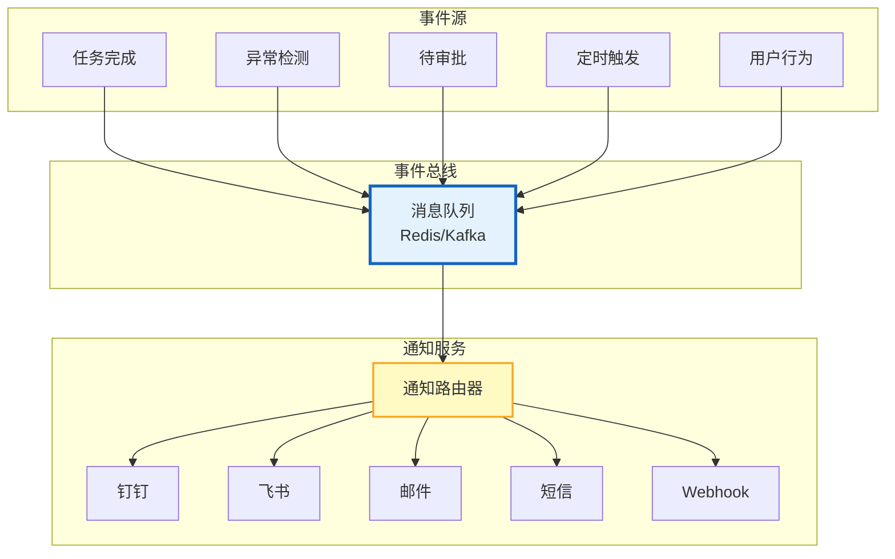

# Agent Webhook 与事件驱动通知指南

> Agent 需要主动通知用户——分析完成了、异常检测到了、审批待处理。被动等用户来问不如主动推送。本指南系统讲解 Webhook 架构、事件驱动通知系统、多渠道推送，以及可靠投递保障。

---

## 1. 事件驱动架构

### 核心架构



### 事件类型

| 事件类型 | 触发条件 | 通知对象 | 紧急度 |
|---------|---------|---------|--------|
| task_completed | 异步任务完成 | 任务提交者 | 低 |
| anomaly_detected | 检测到异常 | 运维团队 | 高 |
| approval_required | 需要审批 | 审批者 | 中 |
| threshold_exceeded | 预算/配额超限 | 管理员 | 高 |
| system_error | 系统错误 | 运维+开发 | 极高 |
| daily_report | 定时报告 | 订阅者 | 低 |
| security_alert | 安全事件 | 安全团队 | 极高 |

---

## 2. 通知路由器

```python
from dataclasses import dataclass, field
from enum import Enum
import asyncio

class NotificationChannel(Enum):
    DINGTALK = "dingtalk"
    FEISHU = "feishu"
    EMAIL = "email"
    SMS = "sms"
    WEBHOOK = "webhook"
    SLACK = "slack"
    IN_APP = "in_app"

class NotificationPriority(Enum):
    LOW = 0
    MEDIUM = 1
    HIGH = 2
    CRITICAL = 3

@dataclass
class Notification:
    """通知消息"""
    event_type: str
    title: str
    message: str
    priority: NotificationPriority = NotificationPriority.MEDIUM
    target_users: list = field(default_factory=list)
    target_channels: list = field(default_factory=list)
    metadata: dict = field(default_factory=dict)
    actions: list = field(default_factory=list)  # 可操作按钮
    timestamp: str = field(default_factory=lambda: datetime.utcnow().isoformat())

@dataclass
class NotificationRouter:
    """通知路由器"""

    # 渠道适配器
    channels: dict = field(default_factory=dict)

    # 路由规则
    routing_rules: list = field(default_factory=lambda: [
        # 按事件类型路由
        {"event": "anomaly_detected", "channels": ["dingtalk", "email"], "min_priority": "MEDIUM"},
        {"event": "approval_required", "channels": ["dingtalk"], "min_priority": "LOW"},
        {"event": "task_completed", "channels": ["webhook"], "min_priority": "LOW"},
        {"event": "security_alert", "channels": ["dingtalk", "sms", "email"], "min_priority": "HIGH"},
        # 按优先级路由
        {"priority": "CRITICAL", "channels": ["dingtalk", "sms", "email", "feishu"]},
        {"priority": "HIGH", "channels": ["dingtalk", "email"]},
        {"priority": "MEDIUM", "channels": ["dingtalk"]},
        {"priority": "LOW", "channels": ["in_app"]},
    ])

    async def route(self, notification: Notification):
        """路由通知到合适的渠道"""
        # 1. 用户偏好覆盖
        for user_id in notification.target_users:
            user_prefs = await self._get_user_preferences(user_id)
            channels = self._select_channels(notification, user_prefs)

            # 2. 并行发送到多个渠道
            tasks = []
            for channel in channels:
                adapter = self.channels.get(channel)
                if adapter:
                    tasks.append(adapter.send(notification, user_id))

            results = await asyncio.gather(*tasks, return_exceptions=True)

            # 3. 记录投递结果
            for channel, result in zip(channels, results):
                await self._record_delivery(notification, channel, result)

    def _select_channels(self, notification: Notification, user_prefs: dict) -> list:
        """选择通知渠道"""
        # 优先使用用户偏好
        if user_prefs.get("channels"):
            return user_prefs["channels"]

        # 按规则选择
        selected = set()

        for rule in self.routing_rules:
            if rule.get("event") == notification.event_type:
                if notification.priority.value >= NotificationPriority[rule["min_priority"]].value:
                    selected.update(rule["channels"])

            if rule.get("priority") == notification.priority.name:
                selected.update(rule["channels"])

        return list(selected) if selected else ["in_app"]

    async def _get_user_preferences(self, user_id: str) -> dict:
        """获取用户通知偏好"""
        # 从数据库获取用户设置的偏好渠道和免打扰时间
        return {"channels": ["dingtalk", "in_app"]}

    async def _record_delivery(self, notification: Notification, channel: str, result):
        """记录投递结果"""
        await db.notifications.insert({
            "event_type": notification.event_type,
            "channel": channel,
            "success": not isinstance(result, Exception),
            "timestamp": datetime.utcnow().isoformat(),
        })
```

---

## 3. Webhook 投递

### 可靠投递

```python
@dataclass
class WebhookDelivery:
    """Webhook 可靠投递"""

    max_retries: int = 3
    retry_delays: list = field(default_factory=lambda: [1, 5, 30])  # 秒

    async def deliver(self, webhook_url: str, payload: dict,
                      secret: str = "") -> dict:
        """可靠投递 Webhook"""
        # 添加签名
        headers = {"Content-Type": "application/json"}
        if secret:
            signature = self._sign_payload(json.dumps(payload, sort_keys=True), secret)
            headers["X-Signature"] = signature

        for attempt in range(self.max_retries):
            try:
                async with httpx.AsyncClient(timeout=10) as client:
                    response = await client.post(webhook_url, json=payload, headers=headers)

                if response.status_code == 200:
                    return {"success": True, "attempt": attempt + 1, "status": 200}

                if response.status_code >= 400 and response.status_code < 500:
                    # 4xx 客户端错误，不重试
                    return {"success": False, "reason": f"客户端错误 {response.status_code}", "attempt": attempt + 1}

            except Exception as e:
                if attempt < self.max_retries - 1:
                    delay = self.retry_delays[min(attempt, len(self.retry_delays) - 1)]
                    await asyncio.sleep(delay)
                else:
                    return {"success": False, "reason": str(e), "attempt": attempt + 1}

        return {"success": False, "reason": "重试耗尽", "attempt": self.max_retries}

    def _sign_payload(self, payload: str, secret: str) -> str:
        """签名"""
        import hmac
        import hashlib
        return hmac.new(secret.encode(), payload.encode(), hashlib.sha256).hexdigest()
```

### Webhook 注册管理

```python
@dataclass
class WebhookRegistry:
    """Webhook 注册管理"""

    webhooks: dict = field(default_factory=dict)

    async def register(self, webhook_id: str, url: str, events: list,
                       secret: str = "", user_id: str = "") -> dict:
        """注册 Webhook"""
        webhook = {
            "webhook_id": webhook_id,
            "url": url,
            "events": events,  # ["task_completed", "anomaly_detected"]
            "secret": secret,
            "user_id": user_id,
            "status": "active",
            "created_at": datetime.utcnow().isoformat(),
            "delivery_count": 0,
            "failure_count": 0,
            "last_delivery": None,
            "last_status": None,
        }
        self.webhooks[webhook_id] = webhook
        return webhook

    async def list_for_event(self, event_type: str) -> list:
        """获取订阅了指定事件的 Webhook"""
        return [
            wh for wh in self.webhooks.values()
            if event_type in wh["events"] and wh["status"] == "active"
        ]

    async def disable(self, webhook_id: str):
        """禁用 Webhook"""
        if webhook_id in self.webhooks:
            self.webhooks[webhook_id]["status"] = "disabled"

    async def health_check(self, webhook_id: str) -> dict:
        """健康检查"""
        wh = self.webhooks.get(webhook_id)
        if not wh:
            return {"healthy": False, "reason": "未注册"}

        if wh["delivery_count"] == 0:
            return {"healthy": True, "reason": "未发送过"}

        failure_rate = wh["failure_count"] / wh["delivery_count"]
        if failure_rate > 0.3:
            return {"healthy": False, "reason": f"失败率 {failure_rate:.1%}"}

        return {"healthy": True, "failure_rate": failure_rate}
```

---

## 4. 免打扰与频率控制

```python
@dataclass
class NotificationThrottle:
    """通知频率控制"""

    # 每用户每小时最大通知数
    max_per_hour: int = 10
    # 每用户每天最大通知数
    max_per_day: int = 50
    # 免打扰时间段
    quiet_hours: dict = field(default_factory=lambda: {"start": "22:00", "end": "08:00"})

    user_counters: dict = field(default_factory=dict)

    async def should_send(self, user_id: str, priority: NotificationPriority) -> tuple[bool, str]:
        """检查是否应该发送"""
        now = datetime.utcnow()

        # 紧急通知不受限制
        if priority == NotificationPriority.CRITICAL:
            return True, "紧急通知"

        # 免打扰检查
        current_hour = now.hour
        quiet_start = int(self.quiet_hours["start"].split(":")[0])
        quiet_end = int(self.quiet_hours["end"].split(":")[0])

        if quiet_start <= current_hour or current_hour < quiet_end:
            if priority.value < NotificationPriority.HIGH.value:
                return False, "免打扰时间"

        # 频率检查
        counter = self.user_counters.setdefault(user_id, {"hour": 0, "day": 0, "reset_hour": now.hour, "reset_day": now.date()})

        # 重置计数器
        if counter["reset_hour"] != now.hour:
            counter["hour"] = 0
            counter["reset_hour"] = now.hour
        if counter["reset_day"] != now.date():
            counter["day"] = 0
            counter["reset_day"] = now.date()

        if counter["hour"] >= self.max_per_hour:
            return False, "超过每小时限制"
        if counter["day"] >= self.max_per_day:
            return False, "超过每天限制"

        # 计数
        counter["hour"] += 1
        counter["day"] += 1

        return True, "允许发送"
```

---

## 5. 检查清单

| 检查项 | 状态 |
|--------|------|
| 理解事件驱动架构 | ☐ |
| 实现了通知路由器 | ☐ |
| 实现了 Webhook 可靠投递 | ☐ |
| 实现了 Webhook 注册管理 | ☐ |
| 实现了免打扰与频率控制 | ☐ |
| 实现了多渠道并行发送 | ☐ |
| 实现了投递结果记录 | ☐ |
| 实现了 Webhook 健康检查 | ☐ |

---

## 6. 与其他知识库的关联

| 关联编号 | 文档 | 关系 |
|----------|------|------|
| 22 | 事件驱动架构 | 事件驱动 |
| 47 | 事件驱动架构 | 事件驱动 |
| 84 | 优雅关闭与重启 | 优雅关闭 |
| 182 | 消息可靠性保障 | 可靠性 |
| 205 | 事件驱动 Agent 架构 | 事件驱动 |
| 214 | 消息可靠性保障 | 可靠性 |
| 227 | 事件驱动架构 | 事件驱动 |
| 259 | 事件驱动架构 | 事件驱动 |
| 254 | 消息可靠性 | 可靠性 |
| 330 | 消息总线 | 消息总线 |
| 367 | 事件溯源 CQRS | 事件溯源 |
| 458 | 人机协作 HITL | 审批通知 |
| 461 | 企业 Agent 集成 | 系统对接 |
| 485 | Agent 调度与定时任务 | 定时触发 |
