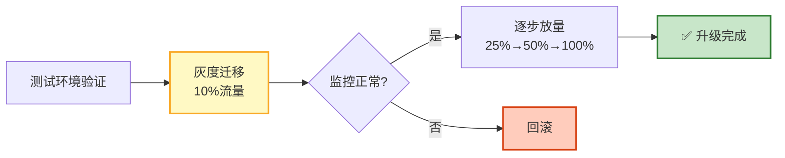

# Agent 版本兼容与平滑升级指南

> LangChain 0.1 → 0.2 → 0.3 API 变了、模型供应商更新了 API、Prompt 改了——升级一个东西可能让整个系统崩溃。本指南系统讲解版本兼容性策略、平滑升级路径、灰度迁移、回滚机制，以及依赖管理。

---

## 1. 版本兼容性问题

### 常见升级陷阱

```
陷阱1：LangChain 版本升级
  0.2: chain = LLMChain(llm=llm, prompt=prompt)
  0.3: chain = prompt | llm  # LCEL 方式
  → 代码不兼容，需要重写

陷阱2：模型 API 变更
  OpenAI: completion API → chat completion API
  → 所有调用方式改变

陷阱3：Prompt 变更
  v1 的 few-shot 示例在 v2 中不再适用
  → 质量可能下降

陷阱4：工具 Schema 变更
  工具参数从位置参数改为关键字参数
  → 调用方式改变

陷阱5：状态结构变更
  State v1: {"query": str, "results": list}
  State v2: {"query": str, "results": list, "metadata": dict}
  → 旧检查点无法恢复
```

---

## 2. 版本兼容策略

### 语义化版本

```python
@dataclass
class VersionCompatibility:
    """版本兼容性管理"""

    # 语义化版本：MAJOR.MINOR.PATCH
    # MAJOR: 不兼容的 API 变更
    # MINOR: 向后兼容的功能新增
    # PATCH: 向后兼容的 Bug 修复

    compatibility_matrix = {
        # (from_version, to_version) → 兼容性
        ("1.0", "1.1"): "compatible",      # MINOR 升级兼容
        ("1.0", "1.0.1"): "compatible",    # PATCH 兼容
        ("1.0", "2.0"): "breaking",         # MAJOR 不兼容
        ("1.1", "1.0"): "degraded",         # 降级可能功能缺失
    }

    def check_compatibility(self, current: str, target: str) -> dict:
        """检查兼容性"""
        key = (current, target)
        compat = self.compatibility_matrix.get(key, "unknown")

        return {
            "current": current,
            "target": target,
            "compatibility": compat,
            "action": self._get_action(compat),
        }

    def _get_action(self, compat: str) -> str:
        actions = {
            "compatible": "可直接升级",
            "breaking": "需要代码迁移",
            "degraded": "可能有功能缺失",
            "unknown": "需要测试验证",
        }
        return actions.get(compat, "需要测试验证")
```

### 兼容层

```python
@dataclass
class CompatibilityLayer:
    """兼容层：新旧 API 共存"""

    # 版本适配器
    adapters = {
        # LangChain 0.2 → 0.3
        "chain_invoke": {
            "v0.2": lambda chain, input: chain.run(input),
            "v0.3": lambda chain, input: chain.invoke(input),
        },
        # OpenAI completion → chat
        "llm_call": {
            "v1": lambda llm, prompt: llm(prompt),
            "v2": lambda llm, prompt: llm.invoke(prompt),
        },
    }

    def call(self, api_name: str, version: str, *args, **kwargs):
        """通过兼容层调用"""
        adapter = self.adapters.get(api_name, {}).get(version)
        if adapter:
            return adapter(*args, **kwargs)
        raise ValueError(f"不支持的 API: {api_name} v{version}")

    # 状态迁移器
    def migrate_state(self, old_state: dict, from_version: str, to_version: str) -> dict:
        """状态迁移"""
        migrations = {
            ("1.0", "1.1"): self._migrate_1_0_to_1_1,
            ("1.1", "2.0"): self._migrate_1_1_to_2_0,
        }

        migrator = migrations.get((from_version, to_version))
        if migrator:
            return migrator(old_state)

        return old_state  # 无需迁移

    def _migrate_1_0_to_1_1(self, state: dict) -> dict:
        """1.0 → 1.1: 添加 metadata 字段"""
        state["metadata"] = state.get("metadata", {})
        return state

    def _migrate_1_1_to_2_0(self, state: dict) -> dict:
        """1.1 → 2.0: 重命名字段"""
        if "query" in state:
            state["input"] = state.pop("query")
        return state
```

---

## 3. 平滑升级路径

### 升级阶段



### 灰度迁移实现

```python
@dataclass
class GradualMigration:
    """灰度迁移"""

    def __init__(self):
        self.traffic_split = 0.0  # 新版本流量比例

    async def route_request(self, request: dict) -> dict:
        """路由请求到新旧版本"""
        user_id = request.get("user_id", "")

        if self._should_use_new(user_id):
            return await self._call_new_version(request)
        else:
            return await self._call_old_version(request)

    def _should_use_new(self, user_id: str) -> bool:
        """决定是否使用新版本"""
        if self.traffic_split >= 1.0:
            return True

        hash_val = int(hashlib.md5(user_id.encode()).hexdigest(), 16) % 100
        return hash_val < self.traffic_split * 100

    async def _call_new_version(self, request: dict) -> dict:
        """调用新版本"""
        try:
            return await new_agent.ainvoke(request)
        except Exception as e:
            # 新版本失败 → 自动回退旧版本
            print(f"新版本失败，回退: {e}")
            return await self._call_old_version(request)

    async def _call_old_version(self, request: dict) -> dict:
        """调用旧版本"""
        return await old_agent.ainvoke(request)

    def increase_traffic(self, percentage: float):
        """增加流量"""
        self.traffic_split = min(1.0, self.traffic_split + percentage)
        print(f"新版本流量: {self.traffic_split:.0%}")

    def rollback(self):
        """回滚"""
        self.traffic_split = 0.0
        print("已回滚到旧版本")
```

---

## 4. 回滚机制

```python
@dataclass
class VersionRollback:
    """版本回滚"""

    async def rollback_agent(self, target_version: str) -> dict:
        """回滚 Agent 到指定版本"""
        # 1. 恢复 Prompt 版本
        await prompt_registry.activate(target_version)

        # 2. 恢复模型路由
        await model_router.set_version(target_version)

        # 3. 恢复工具配置
        await tool_config.restore(target_version)

        # 4. 恢复状态 Schema（如果需要迁移）
        await state_migrator.migrate_back(target_version)

        # 5. 验证
        health = await health_check()
        if not health["healthy"]:
            return {"success": False, "reason": "回滚后健康检查失败"}

        return {"success": True, "version": target_version}

    async def emergency_rollback(self):
        """紧急回滚"""
        # 立即切换到上一个稳定版本
        last_stable = await self._get_last_stable_version()
        return await self.rollback_agent(last_stable)
```

---

## 5. 依赖管理

```python
# requirements.txt — 精确版本控制
langchain==0.3.7          # 精确版本
langgraph==0.2.45
langchain-openai==0.2.0
langchain-community==0.3.0
openai==1.50.0
pydantic==2.9.0

# 依赖更新检查
async def check_dependency_updates():
    """检查依赖更新"""
    deps = {
        "langchain": ("0.3.7", "0.3.10"),  # (当前, 最新)
        "langgraph": ("0.2.45", "0.2.50"),
        "openai": ("1.50.0", "1.55.0"),
    }

    updates = []
    for pkg, (current, latest) in deps.items():
        if current != latest:
            # 检查是否有 breaking change
            changelog = await check_changelog(pkg, current, latest)
            updates.append({
                "package": pkg,
                "current": current,
                "latest": latest,
                "breaking": changelog.get("breaking", False),
                "recommendation": "测试后升级" if not changelog.get("breaking") else "需要代码迁移",
            })

    return updates
```

---

## 6. 检查清单

| 检查项 | 状态 |
|--------|------|
| 理解版本兼容性问题 | ☐ |
| 实现了兼容层 | ☐ |
| 实现了状态迁移 | ☐ |
| 实现了灰度迁移 | ☐ |
| 实现了回滚机制 | ☐ |
| 依赖版本精确锁定 | ☐ |
| 有升级测试流程 | ☐ |
| 有紧急回滚预案 | ☐ |

---

## 7. 与其他知识库的关联

| 关联编号 | 文档 | 关系 |
|----------|------|------|
| 08 | 版本演进与生态 | 版本演进 |
| 91 | Agent 工具版本管理 | 版本 |
| 197 | 版本演进生态 | 生态 |
| 221 | Agent 工具版本管理 | 版本 |
| 229 | 版本演进生态 | 演进 |
| 251 | 工具版本管理 | 版本 |
| 344 | 版本兼容 | 兼容 |
| 374 | 版本兼容与平滑迁移 | 迁移 |
| 481 | Agent 变更管理 | 变更 |
| 489 | Agent 容器化部署 | 部署 |
