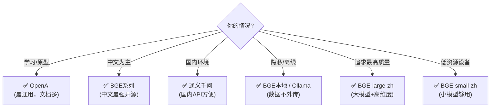

# Embedding 模型选择指南

> 向量化是 RAG 的基础。选对 Embedding 模型直接影响检索质量。

---

## 一、为什么 Embedding 模型很重要

```mermaid
graph TB
    subgraph Embedding的作用 {"Embedding 在 RAG 中的位置"}
        D["文档"] --> E1["Embedding模型<br/>→ 向量"]
        Q["查询"] --> E2["Embedding模型<br/>→ 向量"]
        E1 --> VDB["向量数据库"]
        E2 --> VDB
        VDB --> R["检索结果"]
        Note1["⚠️ 文档和查询<br/>必须用同一个模型"]
    end

    style E1 fill:'#FFF9C4'
    style E2 fill:'#FFF9C4'
    style VDB fill:'#F3E5F5'
    style Note1 fill:'#FFCDD2'
```

## 二、主流 Embedding 模型

### 2.1 API 模型

```python
# OpenAI Embeddings（需代理，最通用）
from langchain_openai import OpenAIEmbeddings
emb = OpenAIEmbeddings(model="text-embedding-3-small")  # 1536维
emb = OpenAIEmbeddings(model="text-embedding-3-large")  # 3072维

# 通义千问 Embeddings（国内可用）
from langchain_community.embeddings import DashScopeEmbeddings
emb = DashScopeEmbeddings(model="text-embedding-v2")  # 1536维
```

### 2.2 本地模型（免费，隐私好）

```python
# HuggingFace 开源模型（中文好）
from langchain_huggingface import HuggingFaceEmbeddings

# BGE系列（中文最强开源）
emb = HuggingFaceEmbeddings(model_name="BAAI/bge-small-zh-v1.5")    # 512维
emb = HuggingFaceEmbeddings(model_name="BAAI/bge-base-zh-v1.5")     # 768维
emb = HuggingFaceEmbeddings(model_name="BAAI/bge-large-zh-v1.5")    # 1024维

# E5系列（多语言）
emb = HuggingFaceEmbeddings(model_name="intfloat/multilingual-e5-small")

# GTE系列
emb = HuggingFaceEmbeddings(model_name="thenlper/gte-base-zh")
```

### 2.3 本地 Ollama

```python
from langchain_ollama import OllamaEmbeddings
emb = OllamaEmbeddings(model="nomic-embed-text")  # 本地运行
```

## 三、模型对比

```mermaid
graph TB
    subgraph 模型对比 {"Embedding 模型对比"}
        OAI["OpenAI text-embedding-3-small<br/>维度: 1536<br/>中文: ★★★★<br/>成本: $0.02/1M tokens<br/>需要: 网络+代理"]
        BGE_S["BAAI/bge-small-zh-v1.5<br/>维度: 512<br/>中文: ★★★★★<br/>成本: 免费<br/>需要: 本地运行(~200MB)"]
        BGE_B["BAAI/bge-base-zh-v1.5<br/>维度: 768<br/>中文: ★★★★★<br/>成本: 免费<br/>需要: 本地运行(~400MB)"]
        QWEN["通义千问 text-embedding-v2<br/>维度: 1536<br/>中文: ★★★★<br/>成本: 低<br/>需要: API Key"]
        OLLAMA["Ollama nomic-embed-text<br/>维度: 768<br/>中文: ★★★<br/>成本: 免费<br/>需要: Ollama"]
    end

    style BGE_S fill:'#C8E6C9'
    style BGE_B fill:'#C8E6C9'
    style OAI fill:'#E3F2FD'
    style QWEN fill:'#FFF9C4'
```

## 四、选型决策



## 五、维度的影响

| 维度 | 内存占用 | 检索速度 | 精度 | 适用场景 |
|------|---------|---------|------|---------|
| 512 | 小 | 快 | 中 | 小规模(<10万) |
| 768 | 中 | 中 | 中高 | 中规模(10万-100万) |
| 1024 | 大 | 中 | 高 | 大规模(100万+) |
| 1536 | 大 | 慢 | 高 | 追求精度 |
| 3072 | 很大 | 慢 | 最高 | 极致精度 |

## 六、注意事项

```mermaid
graph TB
    subgraph 注意事项 {"关键注意事项"}
        N1["⚠️ 文档和查询必须用同一个模型<br/>(否则向量空间不匹配)"]
        N2["⚠️ 切换模型需要重建向量库<br/>(不同模型的向量不兼容)"]
        N3["⚠️ 中文用中文优化模型<br/>(通用英文模型中文效果差)"]
        N4["⚠️ 维度越高≠效果越好<br/>(需要与数据量匹配)"]
    end

    style N1 fill:'#FFCDD2'
    style N2 fill:'#FFE0B2'
    style N3 fill:'#FFF9C4'
    style N4 fill:'#C8E6C9'
```
