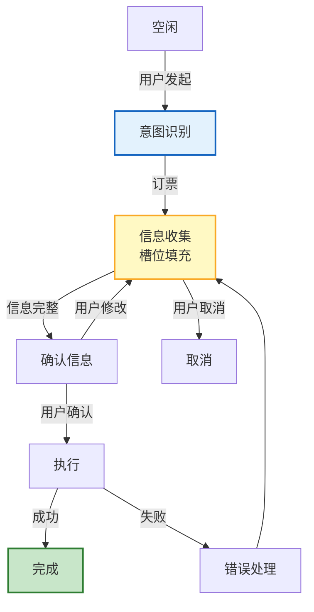

# Agent 对话状态机与槽位填充深度指南

> 用户说"帮我订一张明天去上海的机票"——Agent 需要知道：出发地？时间？舱位？这些信息不齐全时怎么追问？对话状态机和槽位填充就是解决"多轮对话中如何管理和收集必要信息"的问题。本指南深度讲解对话状态机设计、槽位填充策略、主动追问机制。

---

## 1. 对话状态机

### 状态机模型



### 状态定义

```python
from dataclasses import dataclass, field
from enum import Enum
from typing import Optional

class DialogState(Enum):
    IDLE = "idle"
    INTENT_RECOGNITION = "intent_recognition"
    SLOT_FILLING = "slot_filling"
    CONFIRMATION = "confirmation"
    EXECUTION = "execution"
    COMPLETED = "completed"
    ERROR = "error"
    CANCELLED = "cancelled"

@dataclass
class Slot:
    """槽位定义"""
    name: str
    description: str          # 槽位描述（用于追问）
    required: bool = True      # 是否必须
    value: Optional[str] = None
    possible_values: list = None  # 枚举值
    default: Optional[str] = None
    validator: Optional[str] = None  # 验证规则

@dataclass
class DialogContext:
    """对话上下文"""
    state: DialogState = DialogState.IDLE
    intent: str = ""
    slots: dict = field(default_factory=dict)
    history: list = field(default_factory=list)
    attempts: int = 0  # 尝试次数
    max_attempts: int = 3

# 订票场景的槽位定义
ticket_slots = {
    "origin": Slot(name="origin", description="出发城市", required=True),
    "destination": Slot(name="destination", description="目的地城市", required=True),
    "date": Slot(name="date", description="出发日期", required=True, validator="date"),
    "time": Slot(name="time", description="出发时间", required=False, default="不限"),
    "cabin": Slot(name="cabin", description="舱位", required=False,
                  possible_values=["经济舱", "商务舱", "头等舱"], default="经济舱"),
    "passengers": Slot(name="passengers", description="乘客人数", required=False, default="1"),
}
```

---

## 2. 槽位填充

### 槽位提取

```python
from langchain_openai import ChatOpenAI
from langchain_core.prompts import ChatPromptTemplate

@dataclass
class SlotFiller:
    """槽位填充器"""

    async def extract_slots(self, user_input: str, context: DialogContext) -> dict:
        """从用户输入中提取槽位"""
        llm = ChatOpenAI(model="gpt-4o-mini", temperature=0)

        # 已有槽位 + 待填充槽位
        filled = {k: v for k, v in context.slots.items() if v is not None}
        unfilled = [k for k, v in context.slots.items() if v is None]

        slot_descriptions = "\n".join([
            f"- {name}: {slot.description}" for name, slot in ticket_slots.items()
            if name in unfilled
        ])

        prompt = f"""从用户输入中提取信息，填充以下字段。

已有信息: {json.dumps(filled, ensure_ascii=False)}
待提取: {slot_descriptions}

用户输入: {user_input}

输出 JSON，只包含提取到的字段。提取不到的字段不要输出。"""

        response = await llm.ainvoke(prompt)

        try:
            extracted = json.loads(response.content)
        except json.JSONDecodeError:
            extracted = {}

        # 合并到上下文
        for key, value in extracted.items():
            if key in context.slots:
                context.slots[key] = value

        return extracted

    def get_missing_slots(self, context: DialogContext) -> list:
        """获取缺失的必须槽位"""
        missing = []
        for name, slot in context.slots.items():
            if slot.required and slot.value is None and slot.default is None:
                missing.append(name)
        return missing

    def generate_question(self, missing_slot: str) -> str:
        """为缺失槽位生成追问"""
        slot = ticket_slots.get(missing_slot)
        if not slot:
            return f"请提供{missing_slot}。"

        questions = {
            "origin": "请问您从哪个城市出发？",
            "destination": "请问您要去哪个城市？",
            "date": "请问您打算哪天出发？",
            "time": "您有偏好的出发时间吗？",
            "cabin": "您需要什么舱位？经济舱、商务舱还是头等舱？",
            "passengers": "请问几位乘客？",
        }
        return questions.get(missing_slot, f"请提供{slot.description}。")
```

---

## 3. 对话管理器

```python
@dataclass
class DialogManager:
    """对话管理器"""

    async def handle(self, user_input: str, context: DialogContext) -> dict:
        """处理用户输入"""
        context.history.append({"role": "user", "content": user_input})

        # 状态机路由
        if context.state == DialogState.IDLE:
            return await self._handle_idle(user_input, context)
        elif context.state == DialogState.SLOT_FILLING:
            return await self._handle_slot_filling(user_input, context)
        elif context.state == DialogState.CONFIRMATION:
            return await self._handle_confirmation(user_input, context)
        elif context.state == DialogState.EXECUTION:
            return await self._handle_execution(user_input, context)
        else:
            return await self._handle_idle(user_input, context)

    async def _handle_idle(self, user_input: str, context: DialogContext) -> dict:
        """处理空闲状态"""
        # 意图识别
        intent = await self._recognize_intent(user_input)

        if intent == "book_ticket":
            context.intent = intent
            context.state = DialogState.SLOT_FILLING
            # 初始化槽位
            context.slots = {name: Slot(name=s.name, description=s.description,
                                       required=s.required, possible_values=s.possible_values,
                                       default=s.default)
                            for name, s in ticket_slots.items()}
            # 设置默认值
            for name, slot in context.slots.items():
                if slot.default:
                    slot.value = slot.default

            # 尝试从第一句话提取
            await SlotFiller().extract_slots(user_input, context)

            # 继续槽位填充
            return await self._handle_slot_filling(user_input, context)
        else:
            return {"response": "您好，我可以帮您订机票。请告诉我您的出行计划。", "state": "idle"}

    async def _handle_slot_filling(self, user_input: str, context: DialogContext) -> dict:
        """处理槽位填充"""
        # 提取槽位
        filler = SlotFiller()
        await filler.extract_slots(user_input, context)

        # 检查缺失的必须槽位
        missing = filler.get_missing_slots(context)

        if not missing:
            # 所有必须槽位已填充
            context.state = DialogState.CONFIRMATION
            return await self._generate_confirmation(context)
        else:
            # 追问缺失槽位
            question = filler.generate_question(missing[0])
            return {"response": question, "state": "slot_filling", "missing": missing}

    async def _generate_confirmation(self, context: DialogContext) -> dict:
        """生成确认信息"""
        filled = {k: v.value for k, v in context.slots.items() if v.value}
        summary = "请确认以下信息：\n"
        for name, value in filled.items():
            summary += f"  {ticket_slots[name].description}: {value}\n"
        summary += "\n确认无误吗？（可以修改任意信息）"

        return {"response": summary, "state": "confirmation", "info": filled}

    async def _handle_confirmation(self, user_input: str, context: DialogContext) -> dict:
        """处理确认"""
        if any(kw in user_input for kw in ["确认", "对", "没问题", "是的"]):
            context.state = DialogState.EXECUTION
            return {"response": "正在为您预订...", "state": "executing"}
        elif any(kw in user_input for kw in ["改", "修改", "不对"]):
            context.state = DialogState.SLOT_FILLING
            return {"response": "请告诉我需要修改什么。", "state": "slot_filling"}
        elif any(kw in user_input for kw in ["取消", "不要了"]):
            context.state = DialogState.CANCELLED
            return {"response": "已取消。", "state": "cancelled"}
        else:
            return {"response": "请回复确认或修改。", "state": "confirmation"}

    async def _handle_execution(self, user_input: str, context: DialogContext) -> dict:
        """处理执行"""
        try:
            result = await self._execute_booking(context)
            context.state = DialogState.COMPLETED
            return {"response": f"预订成功！订单号：{result['order_id']}", "state": "completed"}
        except Exception as e:
            context.state = DialogState.ERROR
            context.attempts += 1
            if context.attempts >= context.max_attempts:
                return {"response": "多次尝试失败，请稍后重试。", "state": "error"}
            return {"response": f"预订失败：{e}，正在重试...", "state": "execution"}

    async def _recognize_intent(self, text: str) -> str:
        """意图识别"""
        if any(kw in text for kw in ["订票", "机票", "飞", "航班"]):
            return "book_ticket"
        return "unknown"

    async def _execute_booking(self, context: DialogContext) -> dict:
        """执行预订"""
        return {"order_id": "ORD-2025-001"}
```

---

## 4. 话题切换

```python
@dataclass
class TopicSwitcher:
    """话题切换处理"""

    async def detect_topic_switch(self, user_input: str, context: DialogContext) -> bool:
        """检测是否切换话题"""
        switch_indicators = ["对了", "换个话题", "另外", "我问你", "不说这个了"]
        return any(kw in user_input for kw in switch_indicators)

    async def handle_switch(self, user_input: str, context: DialogContext) -> dict:
        """处理话题切换"""
        # 保存当前上下文
        saved_context = context.__dict__.copy()

        # 重置到空闲
        context.state = DialogState.IDLE
        context.intent = ""

        return {
            "response": "好的，我们换个话题。之前的信息我帮你记着，随时可以回来。",
            "saved_context": saved_context,
        }
```

---

## 5. 检查清单

| 检查项 | 状态 |
|--------|------|
| 理解对话状态机模型 | ☐ |
| 实现了槽位定义 | ☐ |
| 实现了槽位提取（LLM） | ☐ |
| 实现了主动追问 | ☐ |
| 实现了确认机制 | ☐ |
| 实现了对话管理器 | ☐ |
| 处理了话题切换 | ☐ |
| 处理了错误重试 | ☐ |

---

## 6. 与其他知识库的关联

| 关联编号 | 文档 | 关系 |
|----------|------|------|
| 04 | Memory 与对话管理 | 对话管理 |
| 32 | 对话系统设计模式 | 对话模式 |
| 53 | RAG 多轮对话上下文管理 | 多轮 |
| 75 | RAG 多轮对话 | 多轮 |
| 136 | 多轮对话状态跟踪与流程控制 | 状态跟踪 |
| 174 | RAG 多轮对话上下文管理 | 上下文 |
| 206 | RAG 多轮对话 | 多轮 |
| 235 | 多轮对话 | 多轮 |
| 364 | 状态机设计模式 | 状态机 |
| 391 | 对话编排与多轮状态管理 | 编排 |
| 421 | 对话编排与多轮状态管理 | 编排 |
| 474 | Agent 会话管理与上下文工程 | 会话管理 |
