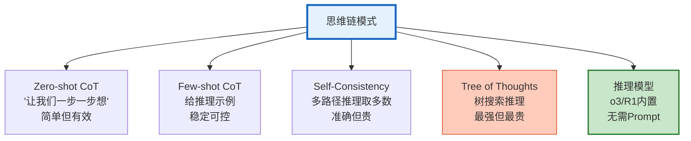

# Agent 推理链优化与思维链工程化指南

> LLM 直接回答可能出错——但如果让它"先想再答"，准确率显著提升。思维链（Chain-of-Thought）是把推理过程显式化的技术。本指南系统讲解 CoT 工程化、推理深度控制、推理链压缩、多路径推理，以及推理模型集成。

---

## 1. 思维链模式

### 五种推理模式



### 效果对比

| 模式 | 准确率 | 成本 | 延迟 | 适用 |
|------|--------|------|------|------|
| 直接回答 | 70% | 1x | 快 | 简单问题 |
| Zero-shot CoT | 80% | 1.2x | 中 | 通用 |
| Few-shot CoT | 85% | 1.3x | 中 | 特定领域 |
| Self-Consistency | 90% | 3-5x | 慢 | 高准确要求 |
| Tree of Thoughts | 92% | 10x+ | 很慢 | 复杂推理 |
| 推理模型 | 95% | 5-10x | 慢 | 数学/代码 |

---

## 2. CoT 工程化

### Zero-shot CoT

```python
from langchain_openai import ChatOpenAI
from langchain_core.prompts import ChatPromptTemplate

@dataclass
class CoTEngineer:
    """思维链工程化"""

    async def zero_shot_cot(self, question: str) -> str:
        """Zero-shot CoT：一句话触发"""
        llm = ChatOpenAI(model="gpt-4o-mini", temperature=0)

        prompt = f"""{question}

让我们一步一步思考。"""

        response = await llm.ainvoke(prompt)
        return response.content

    async def few_shot_cot(self, question: str) -> str:
        """Few-shot CoT：给推理示例"""
        llm = ChatOpenAI(model="gpt-4o-mini", temperature=0)

        prompt = ChatPromptTemplate.from_messages([
            ("system", """你是一个善于推理的助手。回答问题时先展示推理过程，再给出答案。

示例1：
问题：小明有5个苹果，吃了2个，又买了3个，现在有几个？
推理：小明有5个，吃了2个剩5-2=3个，又买了3个所以3+3=6个。
答案：6个

示例2：
问题：一个水池每分钟注水100升，每分钟漏水30升，水池容量5000升，多久注满？
推理：净注水速度=100-30=70升/分钟。5000÷70≈71.4分钟。
答案：约72分钟"""),
            ("human", "问题：{question}\n\n请先推理，再回答。"),
        ])

        chain = prompt | llm
        response = await chain.ainvoke({"question": question})
        return response.content
```

### Self-Consistency

```python
    async def self_consistency(self, question: str, num_paths: int = 5) -> dict:
        """多路径推理取多数"""
        llm = ChatOpenAI(model="gpt-4o-mini", temperature=0.8)  # 高温度产生不同推理路径

        # 生成多条推理路径
        tasks = [
            llm.ainvoke(f"{question}\n\n让我们一步一步思考。")
            for _ in range(num_paths)
        ]
        responses = await asyncio.gather(*tasks)

        # 提取最终答案
        answers = []
        for r in responses:
            answer = self._extract_answer(r.content)
            answers.append(answer)

        # 多数投票
        from collections import Counter
        vote = Counter(answers)
        best_answer = vote.most_common(1)[0][0]

        return {
            "answer": best_answer,
            "confidence": vote.most_common(1)[0][1] / num_paths,
            "all_answers": answers,
            "agreement": f"{vote.most_common(1)[0][1]}/{num_paths} 一致",
        }

    def _extract_answer(self, text: str) -> str:
        """提取最终答案"""
        import re
        # 尝试匹配 "答案：" 后面的内容
        match = re.search(r'答案[：:]\s*(.+)', text)
        if match:
            return match.group(1).strip()
        return text[-100:].strip()
```

### Tree of Thoughts

```python
    async def tree_of_thoughts(self, question: str, max_depth: int = 3,
                               branching: int = 3) -> str:
        """树搜索推理"""
        llm = ChatOpenAI(model="gpt-4o", temperature=0.7)

        # 生成初始思路
        thoughts = await self._generate_thoughts(llm, question, num=branching)

        for depth in range(max_depth):
            # 评估每个思路
            scored = []
            for thought in thoughts:
                score = await self._evaluate_thought(llm, question, thought)
                scored.append({"thought": thought, "score": score})

            # 选最好的继续展开
            scored.sort(key=lambda x: -x["score"])
            best = scored[:branching]

            # 展开下一层
            new_thoughts = []
            for item in best:
                children = await self._expand_thought(llm, question, item["thought"], num=branching)
                new_thoughts.extend(children)

            thoughts = new_thoughts

        # 最终评估选出最佳
        best = max(scored, key=lambda x: x["score"])
        return best["thought"]

    async def _generate_thoughts(self, llm, question: str, num: int) -> list:
        """生成多个初始思路"""
        tasks = [
            llm.ainvoke(f"为以下问题生成一个解决思路（思路{ i+1}）：\n{question}")
            for i in range(num)
        ]
        results = await asyncio.gather(*tasks)
        return [r.content for r in results]

    async def _evaluate_thought(self, llm, question: str, thought: str) -> float:
        """评估思路质量"""
        response = await llm.ainvoke(
            f"评估以下思路解决问题的可能性（0-1分）。只回答数字。\n问题: {question}\n思路: {thought}"
        )
        try:
            return float(response.content.strip())
        except:
            return 0.5

    async def _expand_thought(self, llm, question: str, thought: str, num: int) -> list:
        """展开思路"""
        tasks = [
            llm.ainvoke(f"基于以下思路继续推理（方向{i+1}）：\n{thought}")
            for i in range(num)
        ]
        results = await asyncio.gather(*tasks)
        return [r.content for r in results]
```

---

## 3. 推理深度控制

```python
@dataclass
class ReasoningDepthController:
    """推理深度控制：根据问题复杂度选择推理策略"""

    async def classify_complexity(self, question: str) -> str:
        """分类问题复杂度"""
        llm = ChatOpenAI(model="gpt-4o-mini", temperature=0)

        response = await llm.ainvoke(
            f"判断问题复杂度（simple/moderate/complex）。只回答一个词。\n问题: {question}"
        )
        complexity = response.content.strip().lower()
        return complexity if complexity in ["simple", "moderate", "complex"] else "moderate"

    async def reason(self, question: str) -> dict:
        """根据复杂度选择推理策略"""
        complexity = await self.classify_complexity(question)

        if complexity == "simple":
            # 简单：直接回答
            llm = ChatOpenAI(model="gpt-4o-mini", temperature=0)
            response = await llm.ainvoke(question)
            return {"method": "direct", "answer": response.content, "cost": "low"}

        elif complexity == "moderate":
            # 中等：Zero-shot CoT
            answer = await CoTEngineer().zero_shot_cot(question)
            return {"method": "zero_shot_cot", "answer": answer, "cost": "medium"}

        else:
            # 复杂：Self-Consistency 或推理模型
            result = await CoTEngineer().self_consistency(question, num_paths=3)
            return {"method": "self_consistency", "answer": result["answer"],
                    "confidence": result["confidence"], "cost": "high"}
```

---

## 4. 推理链压缩

```python
@dataclass
class ReasoningCompressor:
    """推理链压缩：减少推理 Token"""

    async def compress(self, reasoning: str, target_words: int = 100) -> str:
        """压缩推理过程"""
        if len(reasoning.split()) <= target_words:
            return reasoning

        llm = ChatOpenAI(model="gpt-4o-mini", temperature=0)
        response = await llm.ainvoke(
            f"将以下推理过程压缩到{target_words}字以内，保留关键逻辑。\n\n{reasoning}"
        )
        return response.content
```

---

## 5. 检查清单

| 检查项 | 状态 |
|--------|------|
| 理解五种推理模式 | ☐ |
| 实现了 Zero-shot CoT | ☐ |
| 实现了 Few-shot CoT | ☐ |
| 实现了 Self-Consistency | ☐ |
| 实现了 Tree of Thoughts | ☐ |
| 实现了推理深度控制 | ☐ |
| 实现了推理链压缩 | ☐ |
| 理解推理模型（o3/R1） | ☐ |

---

## 6. 与其他知识库的关联

| 关联编号 | 文档 | 关系 |
|----------|------|------|
| 21 | 高级 Prompt 技巧 | Prompt |
| 50 | Agent 推理链图解 | 推理链 |
| 71 | Agent 规划与推理链 | 规划 |
| 138 | Prompt 工程进阶模式与思维链 | CoT |
| 194 | Agent 推理链优化 | 优化 |
| 209 | Agent 规划与推理链深度 | 深度 |
| 232 | 规划推理链图解 | 图解 |
| 358 | 反思纠错 | 反思 |
| 428 | 推理模型与 Agent 集成 | 推理模型 |
