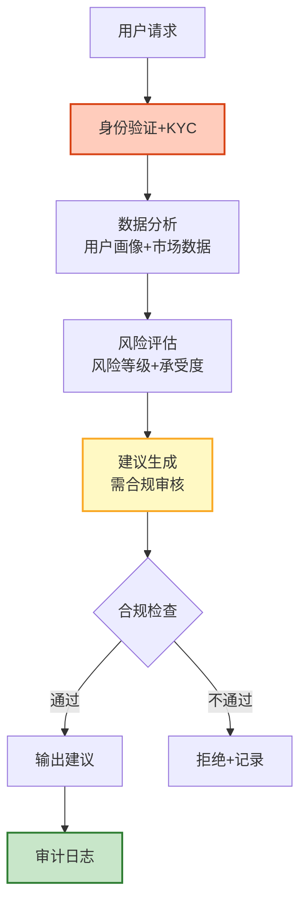

# Agent 金融风控与智能投顾指南

> 金融 Agent 需要在严格监管下运行：风控评估、投资建议、反欺诈、合规检查。每一步都需要审计追踪。本指南系统讲解金融 Agent 架构、风控模型、投资建议生成、反欺诈检测、以及金融合规要求。

---

## 1. 金融 Agent 架构

### 工作流



### 合规要求

| 要求 | 说明 |
|------|------|
| 适当性管理 | 只推荐与风险等级匹配的产品 |
| 信息披露 | 充分提示风险 |
| 投资者保护 | 不得承诺收益 |
| 反洗钱 | 大额交易报告 |
| 数据保护 | 金融数据加密 |

---

## 2. 风控评估

```python
@dataclass
class RiskAssessment:
    """风控评估器"""

    async def assess_user_risk(self, user_profile: dict) -> dict:
        """评估用户风险承受能力"""
        llm = ChatOpenAI(model="gpt-4o", temperature=0)

        prompt = f"""评估投资者风险承受能力。

投资者信息:
- 年龄: {user_profile.get('age')}
- 收入: {user_profile.get('income')}
- 投资经验: {user_profile.get('experience')}
- 投资期限: {user_profile.get('horizon')}
- 亏损承受: {user_profile.get('loss_tolerance')}

输出 JSON:
{{
    "risk_level": "R1保守/R2稳健/R3平衡/R4进取/R5激进",
    "max_stock_ratio": 0.3,
    "max_single_position": 0.1,
    "suitable_products": ["适合的产品类型"],
    "warnings": ["风险提示"],
    "disclaimer": "投资有风险，建议仅供参考"
}}"""

        response = await llm.ainvoke(prompt)
        return json.loads(response.content)

    async def check_credit(self, user_data: dict) -> dict:
        """信用评估"""
        llm = ChatOpenAI(model="gpt-4o", temperature=0)

        # 基于收入、负债、征信历史
        score = self._calculate_score(user_data)

        return {
            "credit_score": score,
            "level": "优秀" if score > 750 else "良好" if score > 650 else "一般" if score > 550 else "风险",
            "max_credit": int(user_data.get("income", 0) * (score / 750) * 6),
            "recommendation": "建议通过" if score > 650 else "建议拒绝",
        }

    def _calculate_score(self, data: dict) -> int:
        income = data.get("income", 0)
        debt_ratio = data.get("debt_ratio", 0.5)
        base = 600
        if income > 100000: base += 50
        if debt_ratio < 0.3: base += 50
        if debt_ratio > 0.6: base -= 100
        return min(850, max(300, base))
```

---

## 3. 智能投顾

```python
@dataclass
class RoboAdvisor:
    """智能投顾"""

    async def generate_portfolio(self, risk_level: str, amount: float,
                                  goal: str = "长期增值") -> dict:
        """生成投资组合建议"""
        llm = ChatOpenAI(model="gpt-4o", temperature=0.3)

        prompt = f"""生成投资组合建议。

风险等级: {risk_level}
投资金额: ¥{amount}
投资目标: {goal}

约束：
1. 不承诺收益
2. 充分提示风险
3. 分散投资
4. 符合适当性管理

输出 JSON:
{{
    "portfolio": [
        {{"asset": "资产类别", "ratio": 0.3, "expected_risk": "低/中/高", "rationale": "配置理由"}}
    ],
    "risk_disclosure": "风险提示",
    "rebalance_frequency": "季度/半年",
    "disclaimer": "投资有风险，仅供参考"
}}"""

        response = await llm.ainvoke(prompt)
        return json.loads(response.content)

    async def market_analysis(self, market_data: dict) -> dict:
        """市场分析"""
        llm = ChatOpenAI(model="gpt-4o", temperature=0.3)

        prompt = f"""分析当前市场状况。

市场数据: {json.dumps(market_data, ensure_ascii=False)[:2000]}

输出 JSON:
{{
    "market_sentiment": "乐观/中性/谨慎",
    "key_indicators": [{{"indicator": "...", "value": "...", "trend": "↑/↓/→"}}],
    "risks": ["风险因素"],
    "opportunities": ["机会因素"],
    "disclaimer": "不构成投资建议"
}}"""

        response = await llm.ainvoke(prompt)
        return json.loads(response.content)
```

---

## 4. 反欺诈检测

```python
@dataclass
class FraudDetector:
    """反欺诈检测器"""

    async def check_transaction(self, transaction: dict, user_history: list) -> dict:
        """检测交易欺诈"""
        # 规则引擎
        risk_score = 0
        reasons = []

        # 规则1：异常金额
        avg_amount = sum(t["amount"] for t in user_history) / max(len(user_history), 1)
        if transaction["amount"] > avg_amount * 5:
            risk_score += 30
            reasons.append("金额异常偏高")

        # 规则2：异常时间
        hour = transaction.get("hour", 12)
        if hour < 6 or hour > 23:
            risk_score += 20
            reasons.append("非常规时间交易")

        # 规则3：异地交易
        if transaction.get("location") != user_history[-1].get("location") if user_history else False:
            risk_score += 25
            reasons.append("异地交易")

        # LLM 深度分析
        if risk_score > 40:
            llm = ChatOpenAI(model="gpt-4o", temperature=0)
            response = await llm.ainvoke(
                f"分析以下交易是否有欺诈风险。输出JSON: {{\"risk\": \"high/medium/low\", \"reason\": \"...\"}}\n\n交易: {json.dumps(transaction, ensure_ascii=False)}"
            )

        return {
            "risk_score": risk_score,
            "level": "高风险" if risk_score > 60 else "中风险" if risk_score > 30 else "低风险",
            "action": "拦截" if risk_score > 60 else "人工审核" if risk_score > 30 else "放行",
            "reasons": reasons,
        }
```

---

## 5. 审计日志

```python
@dataclass
class FinancialAudit:
    """金融审计日志"""

    async def log(self, action: str, user_id: str, details: dict):
        """记录审计日志（不可篡改）"""
        import hashlib

        log_entry = {
            "timestamp": datetime.utcnow().isoformat(),
            "action": action,           # "credit_check"/"investment_advice"/"fraud_alert"
            "user_id": user_id,
            "details": details,
            "risk_level": details.get("risk_level", "unknown"),
            "compliance_check": details.get("compliant", True),
        }

        # 链式哈希
        prev_hash = await self._get_last_hash()
        log_entry["prev_hash"] = prev_hash
        log_entry["hash"] = hashlib.sha256(
            (prev_hash + json.dumps(log_entry, sort_keys=True)).encode()
        ).hexdigest()

        await db.audit_logs.insert(log_entry)
```

---

## 6. 检查清单

| 检查项 | 状态 |
|--------|------|
| 实现了用户风险评估 | ☐ |
| 实现了信用评估 | ☐ |
| 实现了投资组合建议 | ☐ |
| 实现了市场分析 | ☐ |
| 实现了反欺诈检测 | ☐ |
| 配置了合规检查 | ☐ |
| 有不可篡改审计日志 | ☐ |
| 所有建议有风险提示 | ☐ |

---

## 7. 与其他知识库的关联

| 关联编号 | 文档 | 关系 |
|----------|------|------|
| 26 | 智能金融风控 Agent | 风控 |
| 62 | 智能投资分析 Agent | 投资 |
| 143 | 信用评估 | 信用 |
| 451 | LLM 应用合规 | 合规 |
| 477 | Agent 数据安全 | 安全 |
| 480 | Agent 日志管理 | 日志 |
| 496 | Agent 经验沉淀 | 经验 |
| 501 | Agent 数据保护 | 隐私 |
