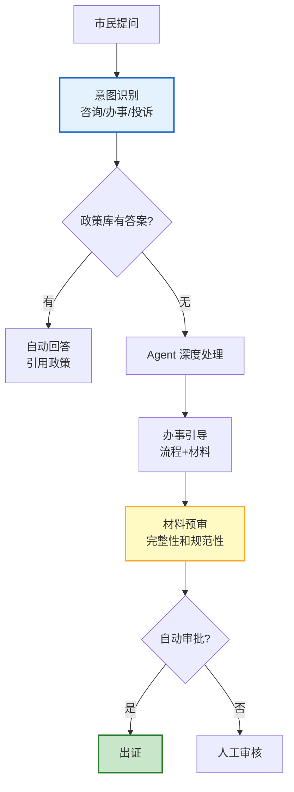

# Agent 智慧政务与公共服务指南

> 政务服务涉及审批、咨询、办事指南——流程复杂、政策频繁更新。Agent 能 7×24 回答政务咨询、引导办事流程、预审材料、智能审批。本指南系统讲解政务 Agent 架构、政策知识库、办事引导、材料预审、以及数据安全要求。

---

## 1. 政务 Agent 架构

### 工作流



---

## 2. 政策知识库

```python
@dataclass
class PolicyKnowledgeBase:
    """政策知识库"""

    async def ingest_policy(self, policy_doc: str, metadata: dict):
        """导入政策文件"""
        # 分块+向量化
        from langchain_text_splitters import RecursiveCharacterTextSplitter
        splitter = RecursiveCharacterTextSplitter(chunk_size=500, chunk_overlap=50)
        chunks = splitter.split_text(policy_doc)

        await vectorstore.add_texts(
            texts=chunks,
            metadatas=[{
                **metadata,
                "type": "policy",
                "effective_date": metadata.get("effective_date", ""),
                "department": metadata.get("department", ""),
                "policy_number": metadata.get("policy_number", ""),
            } for _ in chunks],
        )

    async def search_policy(self, query: str, department: str = None) -> list:
        """搜索政策"""
        filter_dict = {"type": "policy"}
        if department:
            filter_dict["department"] = department

        results = await vectorstore.asimilarity_search(query, k=5, filter=filter_dict)
        return results

    async def answer_with_citation(self, query: str) -> dict:
        """带政策引用的回答"""
        policies = await self.search_policy(query)

        llm = ChatOpenAI(model="gpt-4o", temperature=0.3)
        context = "\n\n".join([f"[政策{i+1}] {doc.page_content}" for i, doc in enumerate(policies)])

        response = await llm.ainvoke(f"""你是政务服务助手。基于政策文件回答市民问题。

政策文件:
{context}

市民问题: {query}

要求:
1. 只基于政策文件回答
2. 引用具体政策条款 [政策1] [政策2]
3. 如果政策不覆盖，说明并建议咨询相关部门
4. 语气正式、准确

回答:""")

        return {
            "answer": response.content,
            "cited_policies": [{"content": doc.page_content[:200], "source": doc.metadata} for doc in policies],
        }
```

---

## 3. 办事引导

```python
@dataclass
class ServiceGuideAgent:
    """办事引导 Agent"""

    services = {
        "身份证办理": {
            "required_docs": ["户口簿", "旧身份证（换领时）", "照片"],
            "process": ["到派出所", "填写申请表", "拍照", "缴费", "领取回执"],
            "fee": "20元",
            "duration": "60天",
            "location": "户籍所在地派出所",
        },
        "营业执照办理": {
            "required_docs": ["身份证", "住所证明", "公司章程", "股东信息"],
            "process": ["网上申请", "提交材料", "审核", "领取执照"],
            "fee": "免费",
            "duration": "3-5个工作日",
            "location": "市场监督管理局",
        },
    }

    async def guide(self, service_name: str) -> dict:
        """生成办事指南"""
        service = self.services.get(service_name)
        if not service:
            # LLM 推断
            llm = ChatOpenAI(model="gpt-4o-mini", temperature=0)
            response = await llm.ainvoke(
                f"提供{service_name}的办事指南，包括所需材料、流程、费用、时长。输出 JSON。"
            )
            return json.loads(response.content)

        return {
            "service": service_name,
            "required_documents": service["required_docs"],
            "process": service["process"],
            "fee": service["fee"],
            "estimated_duration": service["duration"],
            "location": service["location"],
            "tips": "建议提前预约，减少等待时间",
        }
```

---

## 4. 材料预审

```python
@dataclass
class DocumentPreChecker:
    """材料预审器"""

    async def check(self, service_name: str, submitted_docs: list) -> dict:
        """预审材料"""
        guide = await ServiceGuideAgent().guide(service_name)
        required = guide.get("required_documents", [])

        # 检查完整性
        submitted_names = [d.get("name", "") for d in submitted_docs]
        missing = [doc for doc in required if doc not in submitted_names]

        # LLM 检查规范
        llm = ChatOpenAI(model="gpt-4o", temperature=0)

        response = await llm.ainvoke(f"""预审办事材料。

服务: {service_name}
需要材料: {json.dumps(required, ensure_ascii=False)}
已提交: {json.dumps(submitted_docs, ensure_ascii=False)}

检查:
1. 材料是否齐全
2. 格式是否规范
3. 是否在有效期内
4. 信息是否一致

输出 JSON:
{{
    "complete": true/false,
    "missing": ["缺失的材料"],
    "issues": [{{"doc": "...", "issue": "...", "severity": "high/medium/low"}}],
    "recommendation": "建议"
}}""")

        result = json.loads(response.content)
        result["missing"] = missing if missing else result.get("missing", [])
        return result
```

---

## 5. 数据安全要求

```python
@dataclass
class GovDataSecurity:
    """政务数据安全"""

    rules = {
        "localization": "政务数据必须存储在境内",
        "encryption": "传输和存储均需加密",
        "access_control": "基于角色的访问控制（RBAC）",
        "audit": "所有操作可审计追溯",
        "anonymization": "统计数据脱敏后发布",
        "retention": "按法规保留，到期销毁",
    }

    async def check_compliance(self, feature: str) -> dict:
        return {
            "feature": feature,
            "compliant": True,
            "rules": list(self.rules.keys()),
            "note": "政务Agent需通过等保三级认证",
        }
```

---

## 6. 检查清单

| 检查项 | 状态 |
|--------|------|
| 实现了政策知识库 | ☐ |
| 实现了带引用的政策回答 | ☐ |
| 实现了办事引导 | ☐ |
| 实现了材料预审 | ☐ |
| 配置了政务数据安全 | ☐ |
| 所有回答引用政策来源 | ☐ |

---

## 7. 与其他知识库的关联

| 关联编号 | 文档 | 关系 |
|----------|------|------|
| 33 | 智能政务服务 Agent | 政务 |
| 444 | 优雅关闭 | 运维 |
| 451 | LLM 应用合规 | 合规 |
| 461 | 企业 Agent 集成 | 集成 |
| 477 | Agent 数据安全 | 安全 |
| 501 | Agent 数据保护 | 隐私 |
