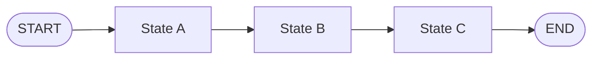
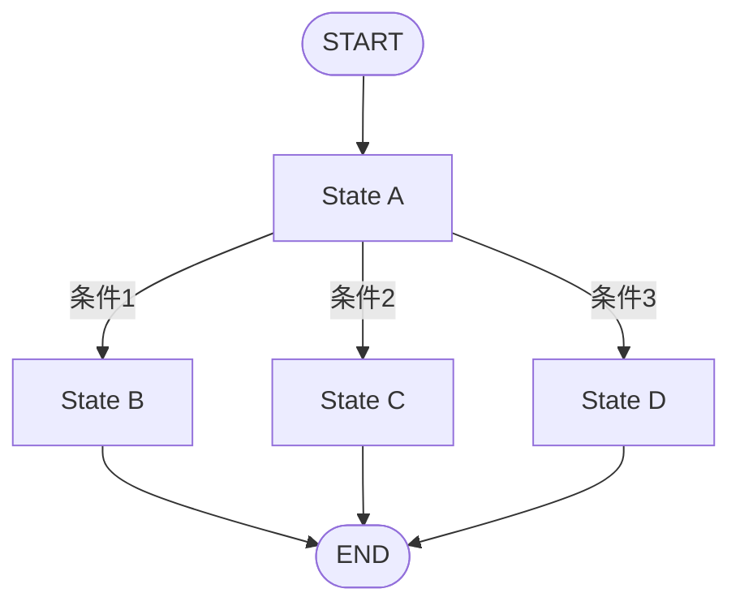
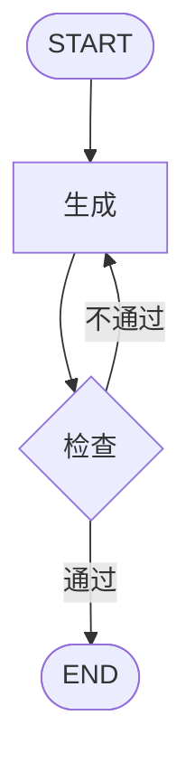
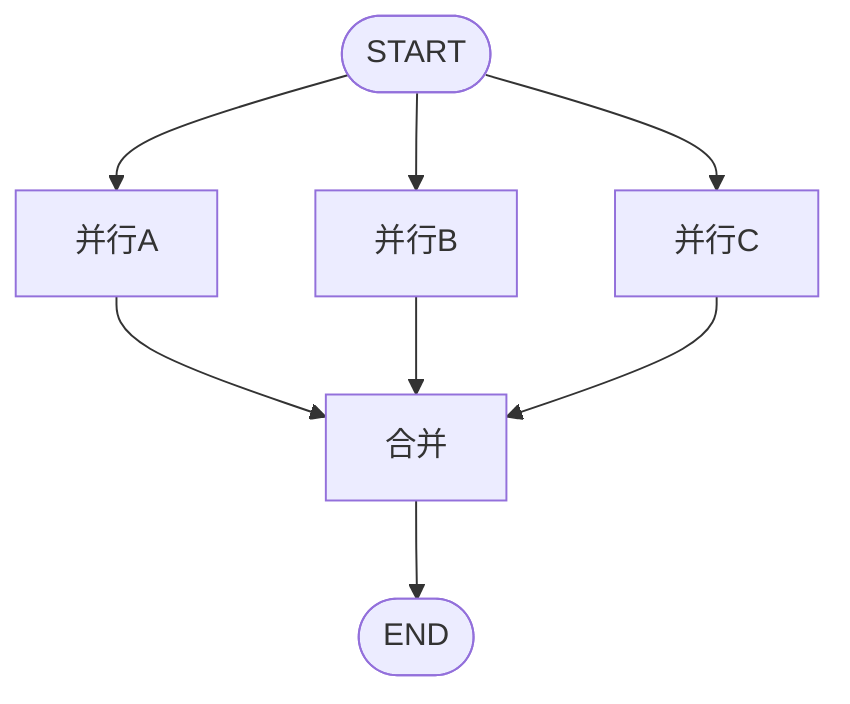
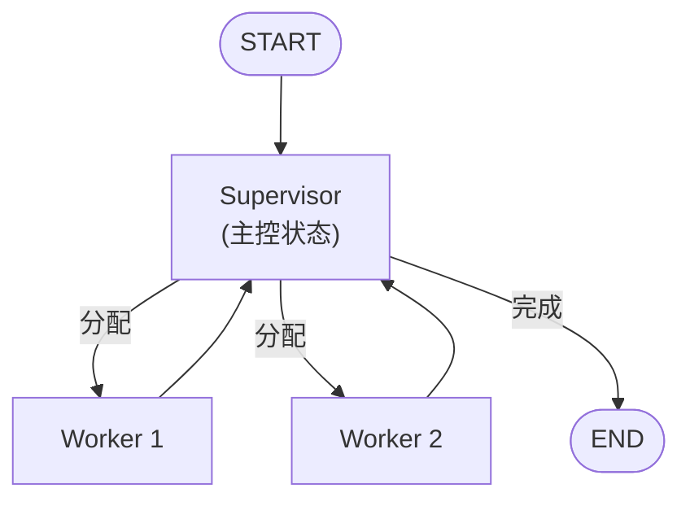
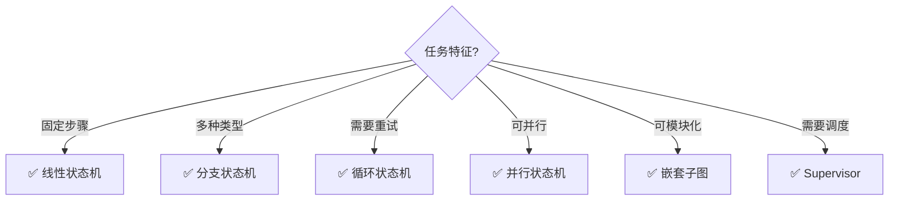

# LangGraph 状态机设计模式

> LangGraph 本质上是一个有限状态机。本指南从状态机视角梳理 LangGraph 的设计模式。

---

## 一、状态机视角

```mermaid
graph TB
    subgraph 状态机 {"LangGraph = 有限状态机(FSM)"}
        S["State: 当前状态<br/>(数据快照)"]
        N["Node: 状态转换函数<br/>(读取State→处理→返回更新)"]
        E["Edge: 状态转移规则<br/>(条件决定下一个状态)"]
        T["Transition: 状态迁移<br/>(Node执行+Reducer合并)"]
    end

    S --> N --> T --> E --> S

    style 状态机 fill:'#E3F2FD'
```

## 二、六种状态机模式

### 模式1：线性状态机



```python
graph.add_edge(START, "A")
graph.add_edge("A", "B")
graph.add_edge("B", "C")
graph.add_edge("C", END)
```

### 模式2：分支状态机



### 模式3：循环状态机



### 模式4：并行状态机



### 模式5：嵌套状态机（子图）

```mermaid
graph TB
    S([START]) --> SUB["子图状态机"]
    SUB --> E([END])

    subgraph 子图 {"子图内部"}
        S1["State 1"] --> S2["State 2"] --> S3["State 3"]
    end

    style 子图 fill:'#F3E5F5'
```

### 模式6：Supervisor状态机



## 三、状态转移设计

### 3.1 路由函数 = 状态转移函数

```python
def transition(state: State) -> str:
    """状态转移函数：根据当前State决定下一状态"""
    if state["stage"] == "collect" and state["slots_full"]:
        return "confirm"          # 信息齐全→确认
    elif state["stage"] == "confirm" and state["confirmed"]:
        return "execute"          # 确认→执行
    elif state["stage"] == "execute" and state["success"]:
        return "done"             # 执行成功→结束
    elif state["retry"] >= 3:
        return "fallback"         # 超过重试→降级
    else:
        return "retry"            # 默认→重试
```

### 3.2 状态转移表

| 当前状态 | 条件 | 目标状态 | 动作 |
|---------|------|---------|------|
| idle | 用户输入 | classify | 开始分类 |
| classify | 类型=知识 | retrieve | RAG检索 |
| classify | 类型=闲聊 | chat | 直接回复 |
| retrieve | 检索到 | generate | 生成回答 |
| retrieve | 未检索到 | fallback | 降级回答 |
| generate | 成功 | output | 输出 |
| generate | 失败×3 | fallback | 降级 |
| output | 完成 | idle | 回到空闲 |

## 四、状态不变量与验证

```python
def validate_state_transition(old_state: State, new_state: State) -> bool:
    """验证状态转移的合法性"""
    rules = {
        ("idle", "classify"): True,
        ("classify", "retrieve"): True,
        ("classify", "chat"): True,
        ("retrieve", "generate"): True,
        ("retrieve", "fallback"): True,
        ("generate", "output"): True,
        ("generate", "fallback"): True,
        ("output", "idle"): True,
    }
    return rules.get((old_state.get("stage"), new_state.get("stage")), False)
```

## 五、模式选择


