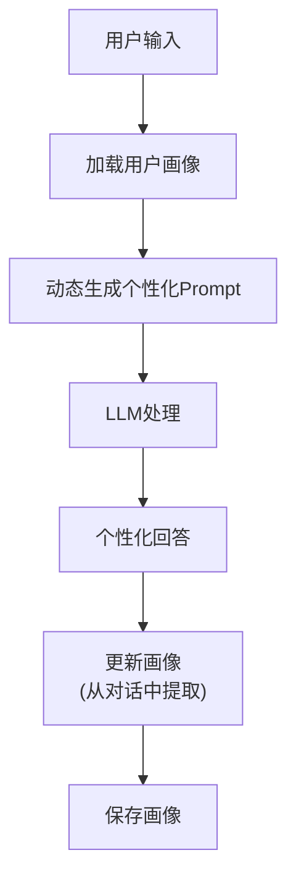

# 用户画像与个性化

> 让 LLM 应用"认识"每个用户——记住偏好、适配风格、提供个性化体验。

---

## 一、用户画像的价值

```mermaid
graph TB
    subgraph 无画像 {"无个性化"}
        U1["所有用户相同回复<br/>千篇一律的语气<br/>不记得用户偏好"]
    end

    subgraph 有画像 {"有个性化"}
        P1["按用户偏好调整语气<br/>记住用户身份和历史<br/>推荐相关内容<br/>主动引导"]
    end

    style 无画像 fill:'#FFCDD2'
    style 有画像 fill:'#C8E6C9'
```

## 二、用户画像数据结构

```python
from pydantic import BaseModel, Field
from typing import Optional

class UserProfile(BaseModel):
    """用户画像模型"""
    user_id: str
    name: Optional[str] = None
    language: str = "zh"              # 偏好语言
    tone: str = "friendly"           # 偏好语气: formal/friendly/casual
    expertise: str = "beginner"      # 专业水平: beginner/intermediate/expert
    interests: list[str] = []        # 兴趣领域
    history_summary: str = ""       # 对话历史摘要
    preferences: dict = {}           # 其他偏好

# 存储
class ProfileStore:
    """用户画像存储"""
    def __init__(self):
        self.profiles = {}  # 实际用数据库

    def get(self, user_id: str) -> UserProfile:
        return self.profiles.get(user_id, UserProfile(user_id=user_id))

    def update(self, user_id: str, **kwargs):
        profile = self.get(user_id)
        for k, v in kwargs.items():
            if hasattr(profile, k):
                setattr(profile, k, v)
        self.profiles[user_id] = profile

store = ProfileStore()
```

## 三、个性化对话实现

```python
from langchain_openai import ChatOpenAI
from langchain_core.prompts import ChatPromptTemplate

llm = ChatOpenAI(model="gpt-4o-mini", temperature=0.7)

def personalized_chat(user_id: str, message: str) -> str:
    """个性化对话"""
    profile = store.get(user_id)

    # 根据画像动态生成System Prompt
    tone_map = {
        "formal": "请用正式、专业的语气回答。",
        "friendly": "请用友好、亲切的语气回答。",
        "casual": "请用轻松、随意的语气回答。",
    }

    expertise_map = {
        "beginner": "用简单的语言和比喻解释。",
        "intermediate": "可以使用专业术语但需解释。",
        "expert": "直接使用专业术语，深入分析。",
    }

    system_prompt = f"""你是AI助手。

用户信息：
- 姓名: {profile.name or '未知'}
- 语言: {profile.language}
- 语气偏好: {tone_map.get(profile.tone, '')}
- 专业水平: {expertise_map.get(profile.expertise, '')}
- 兴趣: {', '.join(profile.interests) or '未知'}

历史摘要: {profile.history_summary or '无'}
"""

    prompt = ChatPromptTemplate.from_messages([
        ("system", system_prompt),
        ("human", "{input}"),
    ])

    chain = prompt | llm
    return chain.invoke({"input": message}).content
```

## 四、画像自动更新

```python
def update_profile_from_conversation(user_id: str, conversation: str):
    """从对话中自动提取并更新用户画像"""
    profile = store.get(user_id)

    prompt = ChatPromptTemplate.from_template(
        """分析以下对话，提取用户画像信息：
        对话：{conversation}

        当前画像：{profile}

        请输出更新的画像信息（JSON格式）：
        - name: 用户姓名(如果提到)
        - language: 偏好语言
        - tone: 语气偏好(formal/friendly/casual)
        - expertise: 专业水平(beginner/intermediate/expert)
        - interests: 兴趣列表
        - history_summary: 对话摘要(不超过100字)
        """
    )
    chain = prompt | llm
    result = chain.invoke({"conversation": conversation, "profile": profile.model_dump()})

    import json
    try:
        updates = json.loads(result.content)
        store.update(user_id, **updates)
    except:
        pass
```

## 五、个性化架构



## 六、选型建议

| 场景 | 个性化程度 | 实现方案 |
|------|-----------|---------|
| 简单FAQ | 低 | 不需要个性化 |
| 客服聊天 | 中 | 记住姓名+语气偏好 |
| 教育助手 | 高 | 记住水平+学习历史 |
| 个人助手 | 高 | 完整画像+主动推荐 |
| 团队工具 | 低 | 只区分角色权限 |
