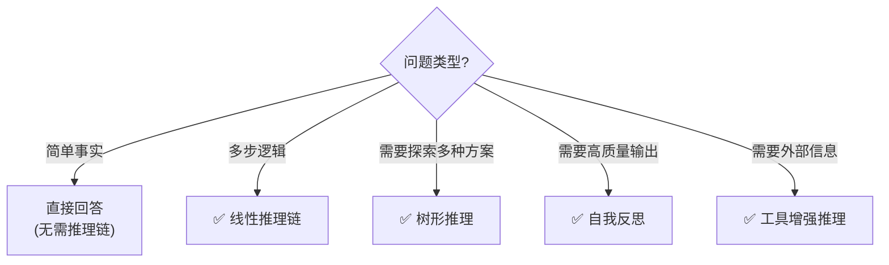

# Agent 规划与推理链

> 高级 Agent 不是"一步到位"，而是先规划再执行、逐步推理。本指南覆盖推理链设计模式。

---

## 一、推理链的价值

```mermaid
graph TB
    subgraph 直接回答 {"❌ 直接回答（无推理链）"}
        U["问题: '如果A比B大，B比C大，C比D大，那A和D谁大？'"]
        U --> LLM1["LLM直接回答"]
        LLM1 --> A1["答案可能出错 ❌"]
    end

    subgraph 推理链 {"✅ 推理链（逐步推理）"}
        U2["问题: 同上"]
        U2 --> S1["Step1: A>B"]
        S1 --> S2["Step2: B>C → A>B>C"]
        S2 --> S3["Step3: C>D → A>B>C>D"]
        S3 --> A2["A>D ✅ 正确"]
    end

    style 直接回答 fill:'#FFCDD2'
    style 推理链 fill:'#C8E6C9'
```

## 二、推理链的四种模式

```mermaid
graph TB
    subgraph 四种模式 {"推理链四种模式"}
        M1["1. 线性推理链<br/>Step1→Step2→Step3→答案"]
        M2["2. 树形推理<br/>多分支探索→选最优"]
        M3["3. 自我反思推理<br/>生成→评价→改进→答案"]
        M4["4. 工具增强推理<br/>推理+工具调用交替"]
    end

    style M1 fill:'#C8E6C9'
    style M2 fill:'#E3F2FD'
    style M3 fill:'#FFF9C4'
    style M4 fill:'#F3E5F5'
```

## 三、线性推理链实现

```python
from langchain_openai import ChatOpenAI
from langchain_core.prompts import ChatPromptTemplate
from langchain_core.output_parsers import StrOutputParser
from langgraph.graph import StateGraph, START, END
from typing import TypedDict

llm = ChatOpenAI(model="gpt-4o-mini", temperature=0)

class ReasoningState(TypedDict):
    question: str
    steps: list[str]    # 推理步骤
    answer: str

def reason_step(state: ReasoningState) -> dict:
    """执行一步推理"""
    history = "\n".join(f"Step{i+1}: {s}" for i, s in enumerate(state.get("steps", [])))

    prompt = ChatPromptTemplate.from_template(
        """你是一个逻辑推理专家。逐步解决以下问题。

        问题：{question}

        已完成的推理步骤：
        {history}

        请输出下一步推理（如果已有足够信息得出结论，输出"结论：XXX"）：
        """
    )
    chain = prompt | llm | StrOutputParser()
    result = chain.invoke({
        "question": state["question"],
        "history": history or "(开始推理)"
    })

    steps = state.get("steps", [])
    steps.append(result)

    return {"steps": steps}

def should_continue(state: ReasoningState) -> str:
    """检查是否得出结论"""
    last_step = state.get("steps", [])[-1] if state.get("steps") else ""
    if "结论" in last_step or len(state.get("steps", [])) >= 5:
        return "done"
    return "continue"

def answer_node(state: ReasoningState) -> dict:
    """生成最终答案"""
    last_step = state["steps"][-1]
    # 提取结论
    if "结论：" in last_step:
        answer = last_step.split("结论：")[-1].strip()
    else:
        answer = last_step
    return {"answer": answer}

# 构建图
graph = StateGraph(ReasoningState)
graph.add_node("reason", reason_step)
graph.add_node("answer", answer_node)
graph.add_edge(START, "reason")
graph.add_conditional_edges("reason", should_continue, {
    "continue": "reason",  # 循环推理
    "done": "answer"
})
graph.add_edge("answer", END)

app = graph.compile()

# 使用
result = app.invoke({
    "question": "一个商店有23个苹果，上午卖了8个，下午又进了15个，晚上卖了12个，还剩多少？",
    "steps": [],
    "answer": "",
})
print("推理步骤:")
for i, s in enumerate(result["steps"], 1):
    print(f"  Step{i}: {s[:100]}")
print(f"\n答案: {result['answer']}")
```

## 四、树形推理实现

```python
def tree_of_thought(question: str, llm, n_branches: int = 3) -> str:
    """树形推理：生成多个思路→评估→选最优"""
    # Step 1: 生成多个思路
    gen_prompt = ChatPromptTemplate.from_template(
        "为以下问题生成{n}种不同的解决思路，每种2-3句：\n{question}\n\n思路："
    )
    thoughts = (gen_prompt | llm | StrOutputParser()).invoke({
        "question": question, "n": n_branches
    })

    # Step 2: 评估每个思路
    eval_prompt = ChatPromptTemplate.from_template(
        "评估以下解决思路，选出最优的。1-{n}分。\n思路：{thoughts}\n\n最优思路编号和理由："
    )
    evaluation = (eval_prompt | llm | StrOutputParser()).invoke({
        "thoughts": thoughts, "n": n_branches
    })

    # Step 3: 基于最优思路生成答案
    answer_prompt = ChatPromptTemplate.from_template(
        "基于以下思路和评估，给出最终答案：\n问题：{question}\n思路：{thoughts}\n评估：{eval}\n\n答案："
    )
    return (answer_prompt | llm | StrOutputParser()).invoke({
        "question": question, "thoughts": thoughts, "eval": evaluation
    })
```

## 五、推理链 + 工具调用

```mermaid
graph TB
    subgraph 推理工具交替 {"推理链+工具调用交替模式"}
        R1["推理: 需要计算"] --> T1["工具: calculator"]
        T1 --> R2["推理: 得到结果，继续"]
        R2 --> R3["推理: 需要搜索"]
        R3 --> T2["工具: web_search"]
        T2 --> R4["推理: 信息齐全"]
        R4 --> A["最终答案 ✅"]
    end

    style 推理工具交替 fill:'#E3F2FD'
```

## 六、模式选择



## 七、成本与效果

| 模式 | LLM调用 | 效果提升 | 延迟 | 适用 |
|------|---------|---------|------|------|
| 直接回答 | 1次 | 基线 | 低 | 简单问题 |
| 线性推理 | 2-5次 | +15-25% | 中 | 逻辑推理 |
| 树形推理 | 3-5次 | +20-30% | 中高 | 创意/策略 |
| 自我反思 | 3-6次 | +15-25% | 中 | 高质量输出 |
| 工具增强 | 变化 | +30%+ | 高 | 需要外部数据 |
