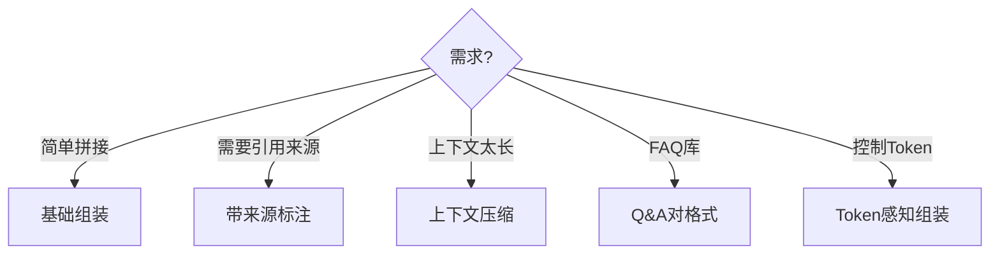

# RAG 上下文组装与压缩

> 检索到文档后如何组装上下文、控制Token、保留关键信息？这份指南覆盖上下文组装的工程实践。

---

## 一、上下文组装的位置

```mermaid
graph TB
    subgraph RAG流程 {"RAG流程中的上下文组装"}
        R["检索Top-K文档"] --> ASSEMBLE["上下文组装<br/>(本指南)"]
        ASSEMBLE --> P["填充Prompt模板"]
        P --> LLM["LLM生成"]
        LLM --> A["回答"]
    end

    style ASSEMBLE fill:'#FFF9C4'
```

## 二、组装策略

### 2.1 基础组装（拼接）

```python
def assemble_basic(docs: list, max_chars: int = 4000) -> str:
    """基础组装：简单拼接"""
    parts = []
    total = 0
    for doc in docs:
        if total + len(doc.page_content) > max_chars:
            break
        parts.append(doc.page_content)
        total += len(doc.page_content)
    return "\n\n".join(parts)
```

### 2.2 带来源标注的组装

```python
def assemble_with_sources(docs: list) -> str:
    """带来源标注"""
    parts = []
    for i, doc in enumerate(docs, 1):
        source = doc.metadata.get("source", "未知")
        parts.append(f"[片段{i} | 来源: {source}]\n{doc.page_content}")
    return "\n\n---\n\n".join(parts)
```

### 2.3 按相关度排序的组装

```python
def assemble_by_relevance(docs_with_scores: list) -> str:
    """按相关度排序后组装（分数低的排后面/截断）"""
    # docs_with_scores: [(doc, score), ...]
    # FAISS的分数越低越相似，所以排序
    sorted_docs = sorted(docs_with_scores, key=lambda x: x[1])
    return "\n\n".join(doc.page_content for doc, _ in sorted_docs[:3])
```

### 2.4 上下文压缩

```python
from langchain_openai import ChatOpenAI
from langchain_core.prompts import ChatPromptTemplate
from langchain_core.output_parsers import StrOutputParser

llm = ChatOpenAI(model="gpt-4o-mini", temperature=0)

def compress_context(docs: list, question: str, target_tokens: int = 1500) -> str:
    """用LLM压缩上下文：保留与问题相关的部分"""
    full_context = "\n\n".join(d.page_content for d in docs)

    # 如果不太长，不需要压缩
    if len(full_context) < target_tokens * 4:
        return full_context

    # 用LLM压缩
    prompt = ChatPromptTemplate.from_template(
        """从以下文档中提取与问题最相关的信息，去除无关内容。
        保留关键事实和数字。输出精简后的内容。

        问题：{question}
        文档：{context}

        精简内容："""
    )
    chain = prompt | llm | StrOutputParser()
    return chain.invoke({"question": question, "context": full_context[:8000]})
```

## 三、上下文格式化

### 3.1 不同格式对比

```mermaid
graph TB
    subgraph 格式 {"上下文组装格式选择"}
        F1["纯文本拼接<br/>简单但无结构<br/>适合: 短文档"]
        F2["带来源标注<br/>可追溯引用<br/>适合: 需引用"]
        F3["结构化(Q&A对)<br/>FAQ格式<br/>适合: FAQ库"]
        F4["Markdown<br/>保留标题层级<br/>适合: 长文档"]
    end

    style F1 fill:'#C8E6C9'
    style F2 fill:'#E3F2FD'
    style F3 fill:'#FFF9C4'
```

### 3.2 FAQ 格式组装

```python
def assemble_faq(docs: list) -> str:
    """FAQ格式组装（保持Q-A对完整）"""
    parts = []
    for doc in docs:
        # 假设每个doc是一个Q-A对
        parts.append(doc.page_content)
    return "\n\n".join(parts)
```

## 四、Token 感知组装

```python
import tiktoken

def token_aware_assemble(docs: list, max_tokens: int = 2000) -> tuple[str, int]:
    """按Token限制组装上下文"""
    encoding = tiktoken.get_encoding("cl100k_base")
    parts = []
    current_tokens = 0

    for doc in docs:
        doc_tokens = len(encoding.encode(doc.page_content))
        if current_tokens + doc_tokens > max_tokens:
            # 尝试截断最后一个文档
            remaining = max_tokens - current_tokens
            if remaining > 100:  # 至少100 tokens才值得加
                truncated = encoding.decode(encoding.encode(doc.page_content)[:remaining])
                parts.append(truncated + "...[截断]")
                current_tokens = max_tokens
            break
        parts.append(doc.page_content)
        current_tokens += doc_tokens

    return "\n\n".join(parts), current_tokens
```

## 五、组装策略选择


