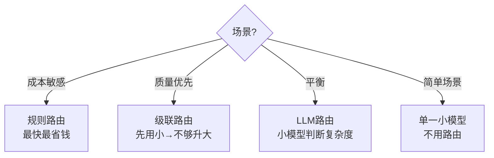

# 多模型智能路由

> 不同任务用不同模型——简单问题用小模型，复杂推理用大模型，节省成本。

---

## 一、为什么需要多模型路由

```mermaid
graph TB
    subgraph 单模型 {"❌ 所有任务用同一模型"}
        S1["简单FAQ → GPT-4o → $0.016/次 ❌太贵"]
        S2["复杂推理 → GPT-4o → $0.016/次 ✅合理"]
    end

    subgraph 多模型 {"✅ 按任务复杂度路由"}
        M1["简单FAQ → GPT-4o-mini → $0.001/次 ✅省钱"]
        M2["复杂推理 → GPT-4o → $0.016/次 ✅合理"]
        M3["代码生成 → DeepSeek → $0.002/次 ✅便宜"]
    end

    style 单模型 fill:'#FFCDD2'
    style 多模型 fill:'#C8E6C9'
```

## 二、路由策略

```mermaid
graph TB
    subgraph 路由策略 {"三种路由策略"}
        R1["策略1: 规则路由<br/>关键词/长度判断"]
        R2["策略2: LLM路由<br/>小模型判断复杂度<br/>→分发到大/小模型"]
        R3["策略3: 级联路由<br/>先用小模型<br/>不够好再用大模型"]
    end

    style R1 fill:'#C8E6C9'
    style R2 fill:'#E3F2FD'
    style R3 fill:'#F3E5F5'
```

### 2.1 规则路由

```python
from langchain_openai import ChatOpenAI

class RuleModelRouter:
    """基于规则的多模型路由"""
    def __init__(self):
        self.models = {
            "simple": ChatOpenAI(model="gpt-4o-mini", temperature=0),
            "complex": ChatOpenAI(model="gpt-4o", temperature=0),
        }

    def route(self, question: str) -> str:
        """根据规则判断用哪个模型"""
        # 简单判断
        if len(question) < 50 and any(w in question for w in ["你好", "谢谢", "再见"]):
            return "simple"
        if any(w in question for w in ["分析", "推理", "比较", "设计", "规划"]):
            return "complex"
        # 默认用小模型
        return "simple"

    def invoke(self, question: str):
        model_key = self.route(question)
        model = self.models[model_key]
        print(f"→ 路由到: {model_key} ({model.model})")
        return model.invoke(question)
```

### 2.2 LLM 路由

```python
from langchain_core.prompts import ChatPromptTemplate
from langchain_core.output_parsers import StrOutputParser

class LLMModelRouter:
    """用LLM判断复杂度，路由到不同模型"""
    def __init__(self):
        self.router_llm = ChatOpenAI(model="gpt-4o-mini", temperature=0)
        self.models = {
            "simple": ChatOpenAI(model="gpt-4o-mini", temperature=0),
            "complex": ChatOpenAI(model="gpt-4o", temperature=0),
        }

        self.router_prompt = ChatPromptTemplate.from_template(
            """判断以下问题的复杂度，只返回 simple 或 complex：
            simple: 简单问答、翻译、分类、格式转换
            complex: 多步推理、代码生成、创意写作、深度分析

            问题：{question}
            复杂度："""
        )

    def invoke(self, question: str):
        # 用小模型判断复杂度
        chain = self.router_prompt | self.router_llm | StrOutputParser()
        complexity = chain.invoke({"question": question}).strip().lower()

        if complexity not in self.models:
            complexity = "simple"

        model = self.models[complexity]
        print(f"→ 路由: {complexity} ({model.model})")
        return model.invoke(question)
```

### 2.3 级联路由

```python
class CascadeRouter:
    """级联路由：先用小模型，不够好再用大模型"""
    def __init__(self):
        self.small = ChatOpenAI(model="gpt-4o-mini", temperature=0)
        self.large = ChatOpenAI(model="gpt-4o", temperature=0)
        self.eval_llm = ChatOpenAI(model="gpt-4o-mini", temperature=0)

    def invoke(self, question: str):
        # 先用小模型
        response = self.small.invoke(question)

        # 评估回答质量
        eval_prompt = ChatPromptTemplate.from_template(
            "判断回答质量是否合格(1=合格 0=不合格)：\n问题：{q}\n回答：{a}\n判断："
        )
        chain = eval_prompt | self.eval_llm | StrOutputParser()
        quality = chain.invoke({"q": question, "a": response.content[:500]})

        if "1" in quality[:3]:
            print(f"→ 小模型足够 ✅")
            return response
        else:
            print(f"→ 小模型不够，升级大模型 ⬆️")
            return self.large.invoke(question)
```

## 三、成本对比

| 策略 | 100次调用成本 | 质量 | 延迟 |
|------|------------|------|------|
| 全用GPT-4o | $1.60 | 高 | 高 |
| 全用GPT-4o-mini | $0.10 | 中 | 低 |
| 规则路由 | ~$0.30 | 中高 | 中 |
| LLM路由 | ~$0.12 | 中高 | 中(多1次小调用) |
| 级联路由 | ~$0.15 | 高 | 中(大部分小模型) |

## 四、策略选择


