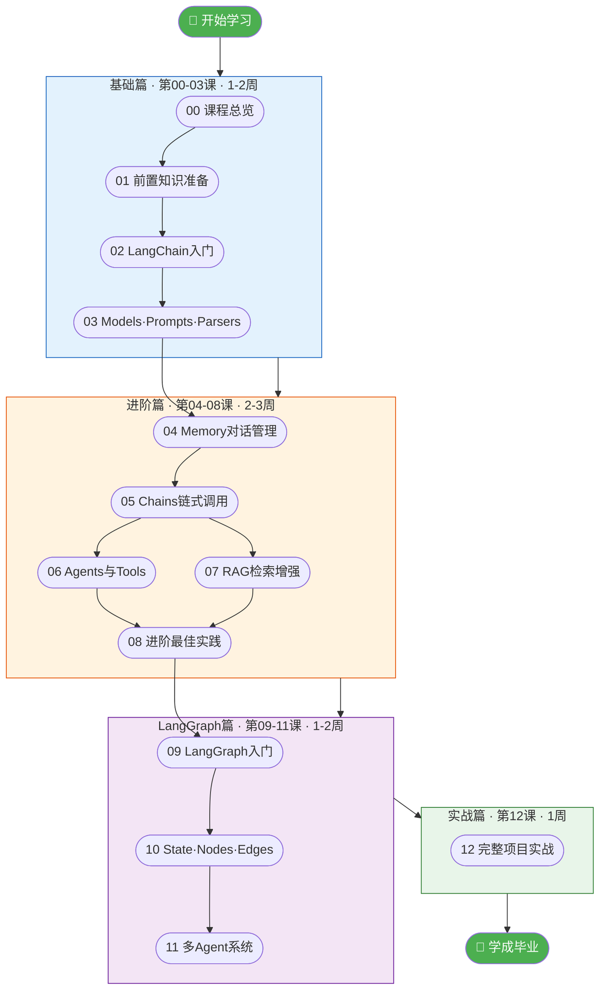
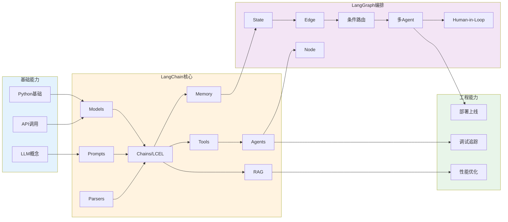
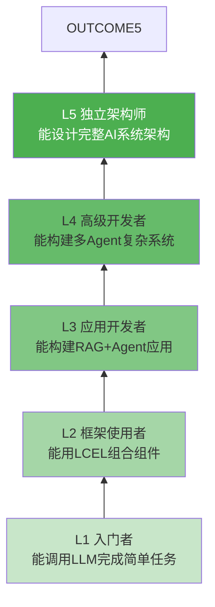

# 学习路线全景图

> 用一张图看懂整个学习体系的结构和路径。本页是所有图解的索引。

---

## 一、学习路线全景



## 二、知识体系关系图

每个知识点不是孤立的，它们之间有清晰的依赖关系：



## 三、能力成长阶梯



| 等级 | 对应课程 | 能力描述 |
|------|----------|----------|
| L1 | 00-02 | 能安装环境、调用 LLM 完成单次问答 |
| L2 | 03-05 | 能组合 Prompt+LLM+Parser，使用 LCEL 管道 |
| L3 | 06-08 | 能构建带记忆、工具调用、RAG 的智能应用 |
| L4 | 09-11 | 能用 LangGraph 构建多步骤、多 Agent 工作流 |
| L5 | 12 | 能独立设计并交付完整的 AI 应用项目 |

## 四、图解索引

| 图解文档 | 对应课程 | 核心内容 |
|----------|----------|----------|
| [01-LangChain生态架构图解](01-LangChain生态架构图解.md) | 第 02 课 | 包结构、模块关系、数据流 |
| [02-LCEL数据流图解](02-LCEL数据流图解.md) | 第 05 课 | 管道串联、类型流转、Runnable 体系 |
| [03-RAG全流程图解](03-RAG全流程图解.md) | 第 07 课 | 加载→分割→向量化→检索→生成 |
| [04-Agent工作原理图解](04-Agent工作原理图解.md) | 第 06 课 | ReAct 循环、Tool Calling 流程 |
| [05-Memory机制图解](05-Memory机制图解.md) | 第 04 课 | 消息管理、历史持久化、多用户隔离 |
| [06-LangGraph图结构图解](06-LangGraph图结构图解.md) | 第 09-10 课 | State/Node/Edge、条件路由、循环 |
| [07-多Agent架构图解](07-多Agent架构图解.md) | 第 11 课 | 协作模式、消息传递、Supervisor |
| [08-技术选型决策树](08-技术选型决策树.md) | 全局 | Chain vs Agent、选模型、选向量库 |

## 五、如何使用图解

```mermaid
graph LR
    A[学习新课] --> B&#123;概念不清楚?&#125;
    B -->|是| C[查阅对应图解]
    B -->|否| D[继续学习]
    C --> E[看图理解原理]
    E --> F[回到课程继续]
    F --> D
    D --> G&#123;做练习时卡住?&#125;
    G -->|是| H[查知识库API速查]
    G -->|否| I[完成练习]
    H --> I

    style C fill:#FFF9C4
    style H fill:#FFF9C4
```

> 💡 **建议**：每学完一课后，打开对应的图解文档过一遍，用图形化的方式巩固理解。图解中的 Mermaid 图表在 GitHub、VS Code、Typora 等 Markdown 编辑器中可直接渲染。
