# RAG 全流程图解

> 用图解完整展示检索增强生成（RAG）的离线建库和在线问答两个阶段。

---

## 一、RAG 全局架构

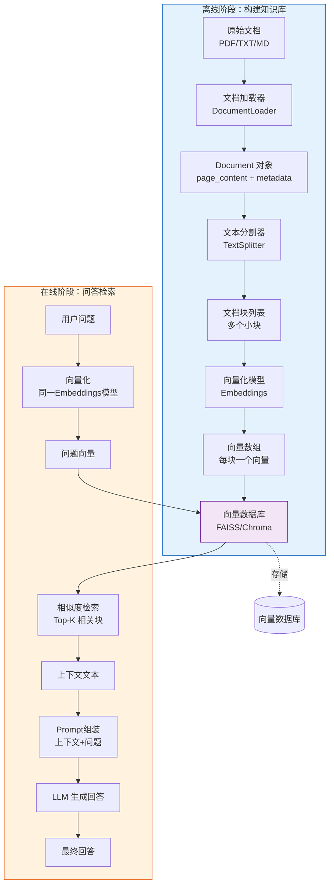

## 二、离线阶段详解

### Step 1：文档加载

```mermaid
graph LR
    subgraph 输入
        F1[report.pdf]
        F2[notes.txt]
        F3[guide.md]
        F4[网页URL]
    end

    subgraph 加载器
        L1["PyPDFLoader"]
        L2["TextLoader"]
        L3["UnstructuredMarkdownLoader"]
        L4["WebBaseLoader"]
    end

    subgraph 输出
        D1["Document(page_content='...', metadata=&#123;'source': 'report.pdf', 'page': 0&#125;)"]
        D2["Document(page_content='...', metadata=&#123;'source': 'notes.txt'&#125;)"]
        D3["Document(page_content='...', metadata=&#123;'source': 'guide.md'&#125;)"]
        D4["Document(page_content='...', metadata=&#123;'source': 'https://...'&#125;)"]
    end

    F1 --> L1 --> D1
    F2 --> L2 --> D2
    F3 --> L3 --> D3
    F4 --> L4 --> D4

    style 输入 fill:#E3F2FD
    style 加载器 fill:#FFF9C4
    style 输出 fill:#C8E6C9
```

### Step 2：文档分割

为什么需要分割？LLM 的上下文窗口有限，且检索时只需要最相关的片段，不需要整篇文档。

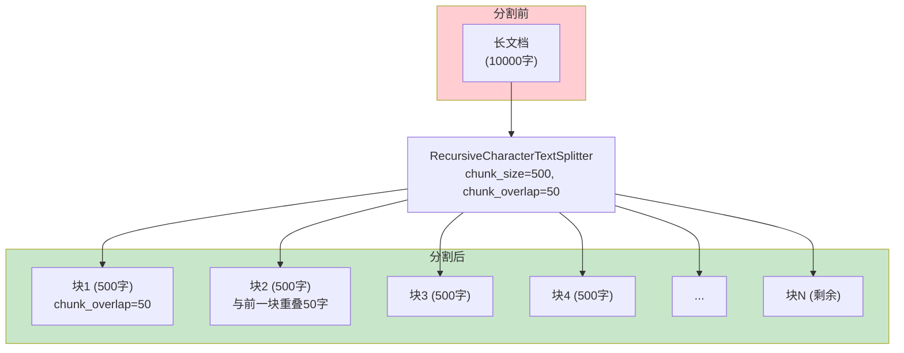

### chunk_size 和 overlap 的效果

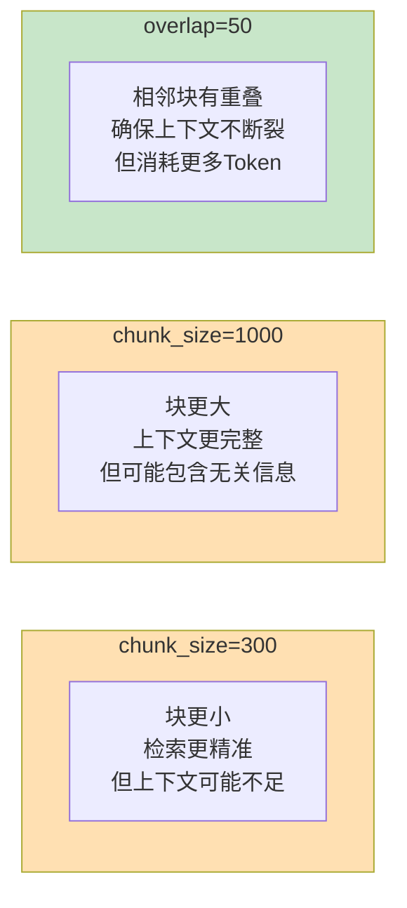

### Step 3：向量化

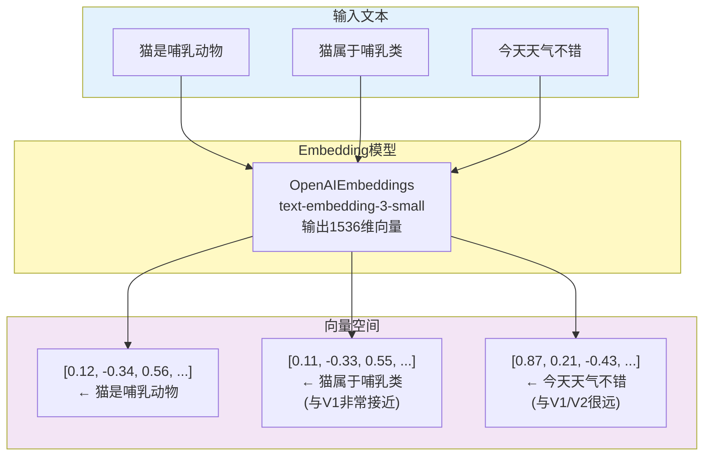

### Step 4：存入向量数据库

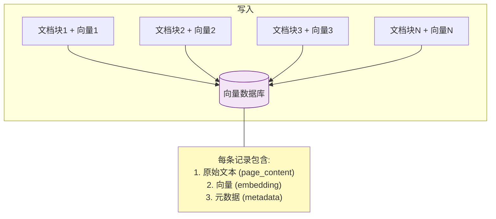

## 三、在线阶段详解

### 检索过程

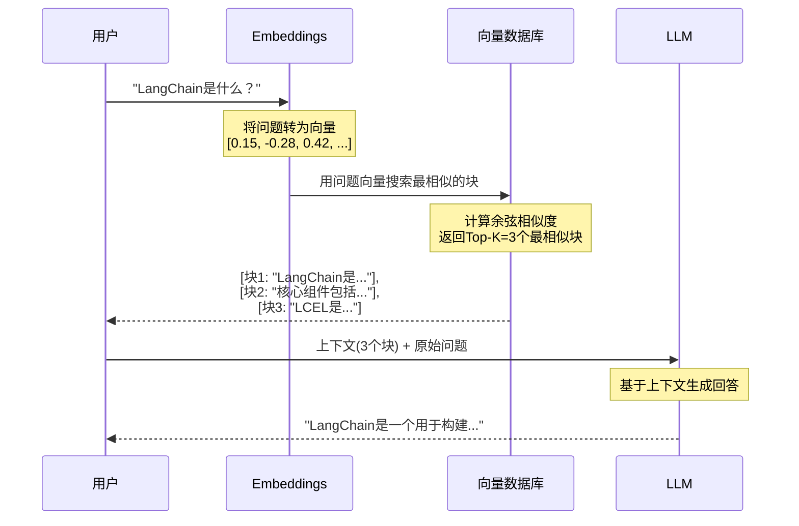

### 相似度搜索原理

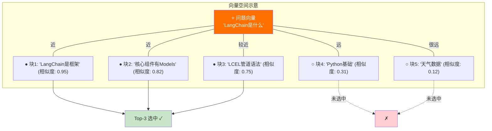

### 生成回答

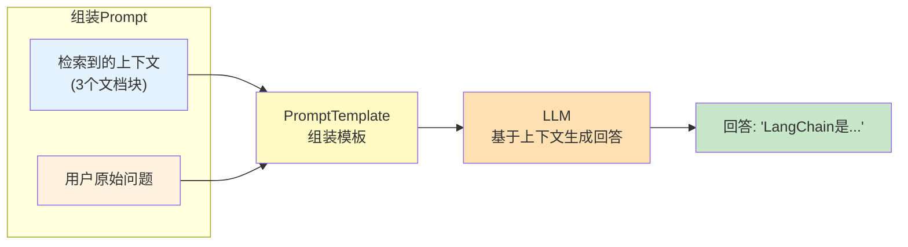

## 四、RAG 数据流完整链路

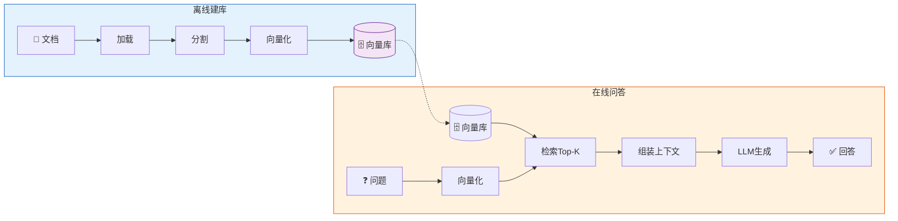

## 五、检索优化策略对比

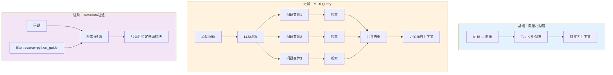

## 六、chunk_size 调参决策

```mermaid
graph TD
    Q&#123;"检索效果不好?"&#125;
    Q -->|"结果不相关<br/>包含太多无关信息"| S1["减小 chunk_size<br/>300-400"]
    Q -->|"结果太碎片化<br/>上下文不完整"| S2["增大 chunk_size<br/>800-1000"]
    Q -->|"句子在中间断裂"| S3["增大 overlap<br/>50-100"]
    Q -->|"Token消耗太大"| S4["减小 chunk_size<br/>或减小 k 值"]
    Q -->|"中文效果差"| S5["调整分隔符<br/>加入中文标点"]

    style S1 fill:#FFE0B2
    style S2 fill:#FFE0B2
    style S3 fill:#C8E6C9
    style S4 fill:#FFCDD2
    style S5 fill:#F3E5F5
```
