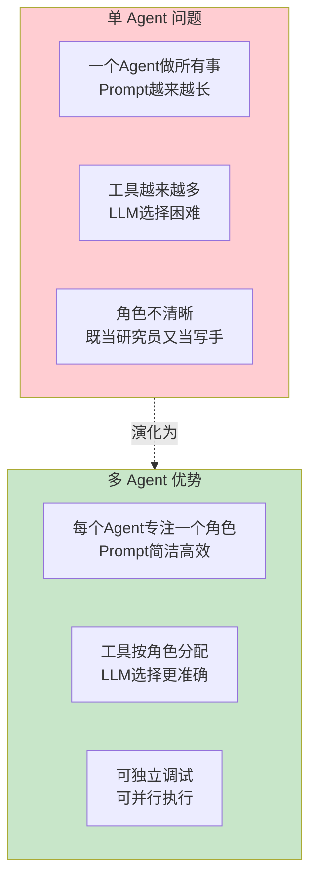
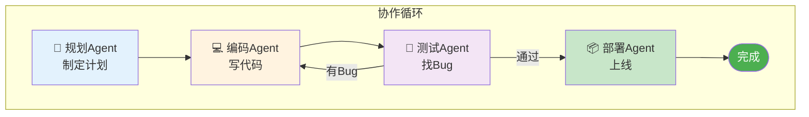
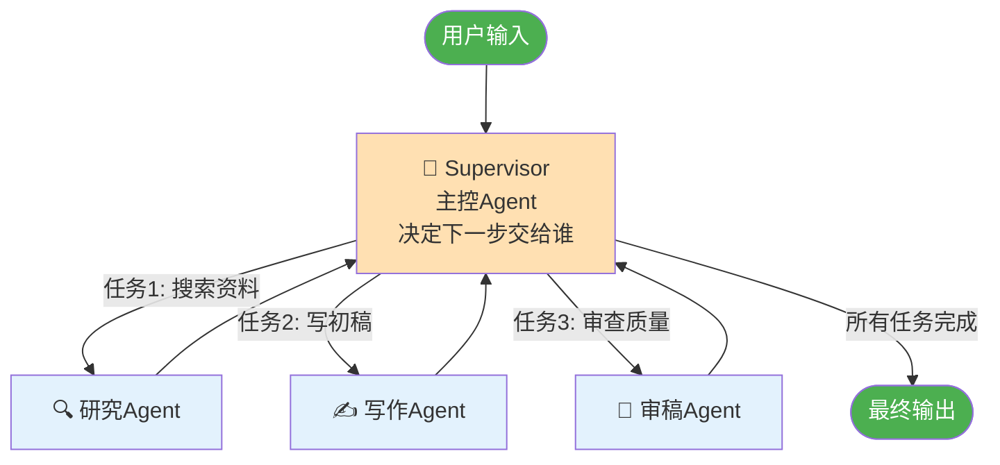
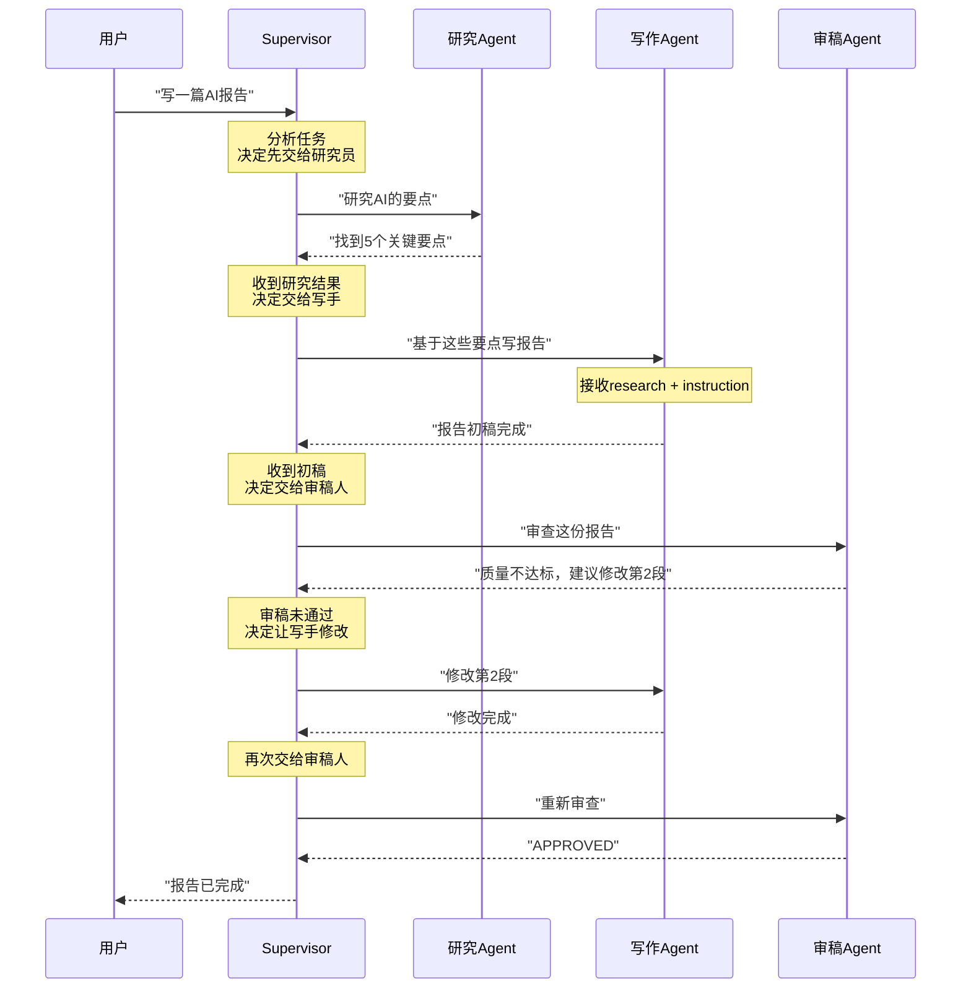
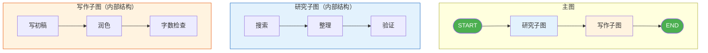

# 多 Agent 架构图解

> 理解多 Agent 系统的协作模式、通信方式和编排策略。

---

## 一、为什么需要多 Agent



## 二、四种经典架构模式

### 模式一：串联式（流水线）


特点：顺序执行，前一个的输出是后一个的输入

### 模式二：路由式（分发器）

```mermaid
graph TB
    U([用户输入]) --> R&#123;"路由器Agent<br/>判断问题类型"&#125;
    R -->|"技术问题"| A1["技术支持Agent"]
    R -->|"账单问题"| A2["财务Agent"]
    R -->|"一般咨询"| A3["客服Agent"]
    R -->|"投诉"| A4["投诉处理Agent"]
    A1 --> O([输出])
    A2 --> O
    A3 --> O
    A4 --> O

    style U fill:#4CAF50,color:#fff
    style O fill:#4CAF50,color:#fff
    style R fill:#FFF9C4
```

特点：根据输入类型分派给不同专家 Agent

### 模式三：协作式（互相交流）



特点：Agent 之间可以反复交流，形成协作循环

### 模式四：Supervisor 模式（层级调度）



特点：主控 Agent 动态调度子 Agent，子 Agent 完成后回到主控

## 三、Agent 通信方式

```mermaid
graph TB
    subgraph 方式一 ["方式一：共享 State"]
        S["State<br/>&#123;messages: [...], <br/>research: '...', <br/>draft: '...'&#125;"]
        A1["Agent A"] -->|写入| S
        A2["Agent B"] -->|读取| S
        A3["Agent C"] -->|读取+写入| S
    end

    subgraph 方式二 ["方式二：消息传递"]
        A_B["Agent A"] -->|"AIMessage"| A_C["Agent B"]
        A_C -->|"AIMessage"| A_D["Agent C"]
    end

    subgraph 方式三 ["方式三：Supervisor 转发"]
        SUP2["Supervisor"]
        SUB1["Agent A"] -->|结果| SUP2
        SUP2 -->|转发结果| SUB2["Agent B"]
    end

    style 方式一 fill:#E3F2FD
    style 方式二 fill:#FFF3E0
    style 方式三 fill:#F3E5F5
```



## 四、完整示例：研究-写作-审稿系统

```mermaid
graph TB
    START([用户: '写一篇关于AI的报告']) --> INIT

    subgraph 状态初始化
        INIT["State:<br/>&#123;topic: 'AI', research: '',<br/>draft: '', review: '',<br/>revision_count: 0&#125;"]
    end

    INIT --> R

    subgraph 研究阶段
        R["🔬 研究Agent<br/>收集AI相关要点"]
        R --> R_OUT["State更新:<br/>&#123;research: 'AI的3个要点...'&#125;"]
    end

    R_OUT --> W

    subgraph 写作阶段
        W["✍️ 写作Agent<br/>基于research写报告"]
        W --> W_OUT["State更新:<br/>&#123;draft: '报告内容...',<br/>revision_count: +1&#125;"]
    end

    W_OUT --> RV

    subgraph 审稿阶段
        RV["📝 审稿Agent<br/>审查报告质量"]
        RV --> RV_OUT["State更新:<br/>&#123;review: 'APPROVED' or 'NEEDS_REVISION'&#125;"]
    end

    RV_OUT --> DECISION&#123;"审查通过?"&#125;

    DECISION -->|"NEEDS_REVISION<br/>且 revision_count < 3"| W
    DECISION -->|"APPROVED"| F

    subgraph 定稿阶段
        F["📦 定稿Agent<br/>输出最终报告"]
    end

    F --> END([完成])
    DECISION -->|"超过最大修改次数"| F

    style START fill:#4CAF50,color:#fff
    style END fill:#4CAF50,color:#fff
    style R fill:#E3F2FD
    style W fill:#FFF3E0
    style RV fill:#F3E5F5
    style F fill:#C8E6C9
    style DECISION fill:#FFF9C4
```

## 五、Supervisor 调度详解



## 六、子图组织复杂系统



## 七、模式选择决策

```mermaid
graph TD
    Q1&#123;"任务类型?"&#125;
    Q1 -->|"固定步骤、顺序执行"| S1["串联式"]
    Q1 -->|"不同类型的问题"| S2["路由式"]
    Q1 -->|"需要反复修改优化"| S3["协作式"]
    Q1 -->|"步骤不确定、需动态调度"| S4["Supervisor模式"]

    Q2&#123;"Agent数量?"&#125;
    Q2 -->|"2-3个"| S1 & S3
    Q2 -->|"4个以上"| S2 & S4

    Q3&#123;"是否需要并行?"&#125;
    Q3 -->|"是"| P1["用并行边<br/>多个Agent同时工作"]
    Q3 -->|"否"| P2["用串联边<br/>顺序执行"]

    style S1 fill:#E3F2FD
    style S2 fill:#FFF9C4
    style S3 fill:#FFE0B2
    style S4 fill:#F3E5F5
```

## 八、多 Agent 通信数据流

```mermaid
graph TB
    subgraph Agent间消息流转
        U["用户消息"] --> AG1["Agent A<br/>(规划)"]
        AG1 -->|"'我已经规划好了<br/>方案1...' "| AG2["Agent B<br/>(执行)"]
        AG2 -->|"'执行完成<br/>结果如下...' "| AG3["Agent C<br/>(验证)"]
        AG3 -->|"'发现2个问题<br/>需要修改...' "| AG2
        AG3 -->|"'验证通过'"| O["最终输出"]
    end

    subgraph State变化
        S1["初始State:<br/>&#123;messages: [用户消息]&#125;"]
        S2["Agent A后:<br/>&#123;messages: [用户, AI-A]&#125;"]
        S3["Agent B后:<br/>&#123;messages: [用户, AI-A, AI-B]&#125;"]
        S4["Agent C后:<br/>&#123;messages: [用户, AI-A, AI-B, AI-C]&#125;"]
        S5["循环后:<br/>&#123;messages: [用户, AI-A, AI-B,<br/>AI-C, AI-B', AI-C']&#125;"]

        S1 --> S2 --> S3 --> S4
        S4 --> S5
    end

    style U fill:#E3F2FD
    style O fill:#C8E6C9
    style S1 fill:#FFF9C4
    style S5 fill:#FFE0B2
```


