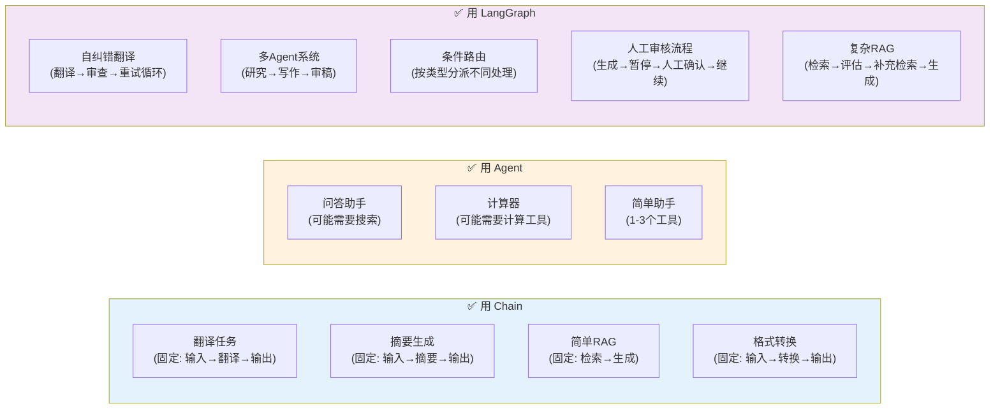
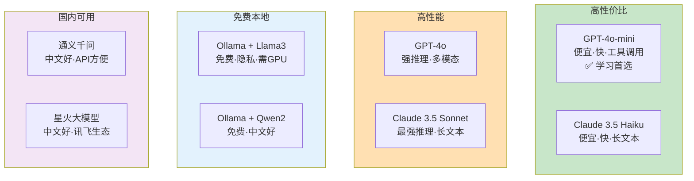

# 技术选型决策树

> 面对多种选择时，用决策树帮你快速做出合理的技术决策。

---

## 一、Chain vs Agent vs LangGraph

这是最常遇到的选择题：

```mermaid
graph TD
    START["开始选型"] --> Q1

    Q1&#123;"流程是否固定?<br/>每步做什么是否提前知道?"&#125;
    Q1 -->|"是，步骤固定"| Q2&#123;"需要分支或循环吗?"&#125;
    Q1 -->|"否，需要LLM决定"| Q3&#123;"任务复杂度?"&#125;

    Q2 -->|"不需要"| CHAIN["✅ 用 Chain (LCEL)<br/>prompt | llm | parser"]
    Q2 -->|"需要条件分支或循环"| LANGGRAPH["✅ 用 LangGraph"]

    Q3 -->|"简单: 1-2个工具<br/>单轮决策"| AGENT["✅ 用 Agent<br/>create_tool_calling_agent"]
    Q3 -->|"复杂: 多步骤<br/>多Agent协作<br/>需要状态管理"| LANGGRAPH

    Q3 -->|"需要多Agent协作"| MULTI["✅ 用 LangGraph<br/>构建多Agent图"]

    style CHAIN fill:#C8E6C9
    style AGENT fill:#FFE0B2
    style LANGGRAPH fill:#F3E5F5
    style MULTI fill:#E1BEE7
```

### 详细场景对照



## 二、模型选择决策树

```mermaid
graph TD
    START["选择模型"] --> Q1

    Q1&#123;"预算敏感?"&#125;
    Q1 -->|"是"| Q2&#123;"需要Tool Calling?"&#125;
    Q1 -->|"否"| Q3

    Q2 -->|"需要"| Q4["✅ GPT-4o-mini<br/>便宜且支持工具调用"]
    Q2 -->|"不需要"| Q5["✅ GPT-4o-mini<br/>或本地Ollama"]

    Q3&#123;"任务复杂度?"&#125;
    Q3 -->|"高难度推理"| Q6&#123;"中文为主?"&#125;
    Q3 -->|"一般任务"| Q4

    Q6 -->|"是"| Q7&#123;"能访问国外API?"&#125;
    Q6 -->|"否"| Q8["✅ GPT-4o"]

    Q7 -->|"能"| Q8
    Q7 -->|"不能"| Q9["✅ 通义千问/星火<br/>或本地Ollama+Qwen"]

    Q4 --> END
    Q5 --> END
    Q8 --> END
    Q9 --> END

    style Q4 fill:#C8E6C9
    style Q8 fill:#C8E6C9
    style Q9 fill:#C8E6C9
```

### 模型对比总览



## 三、向量数据库选择

```mermaid
graph TD
    START["选择向量数据库"] --> Q1

    Q1&#123;"使用场景?"&#125;
    Q1 -->|"学习/原型开发"| FAISS["✅ FAISS<br/>本地·零配置·够快"]
    Q1 -->|"中小型应用"| Q2&#123;"已有什么基础设施?"&#125;
    Q1 -->|"大规模生产"| Q3&#123;"预算?"&#125;

    Q2 -->|"有PostgreSQL"| PG["✅ pgvector<br/>复用现有数据库"]
    Q2 -->|"无特殊要求"| CHROMA["✅ Chroma<br/>轻量·易用·持久化"]

    Q3 -->|"有预算"| PINECONE["✅ Pinecone<br/>全托管·自动扩缩"]
    Q3 -->|"想自部署"| MILVUS["✅ Milvus<br/>开源·可扩展"]

    style FAISS fill:#C8E6C9
    style CHROMA fill:#C8E6C9
    style PG fill:#E3F2FD
    style PINECONE fill:#FFE0B2
    style MILVUS fill:#F3E5F5
```

## 四、Memory 策略选择

```mermaid
graph TD
    START["选择Memory策略"] --> Q1

    Q1&#123;"对话轮数?"&#125;
    Q1 -->|"短对话 (<10轮)"| FULL["✅ 全量保留<br/>简单直接"]
    Q1 -->|"中等对话 (10-50轮)"| WINDOW["✅ 窗口截断<br/>保留最近N轮"]
    Q1 -->|"长对话 (50+轮)"| Q2&#123;"需要记住早期信息?"&#125;

    Q2 -->|"需要"| HYBRID["✅ 摘要+窗口<br/>旧对话摘要+近期完整"]
    Q2 -->|"不需要"| WINDOW

    Q3&#123;"需要持久化?"&#125;
    Q3 -->|"开发调试"| MEM["✅ 内存存储<br/>ChatMessageHistory"]
    Q3 -->|"个人项目"| FILE["✅ 文件存储<br/>FileChatMessageHistory"]
    Q3 -->|"生产应用"| Q4&#123;"高并发?"&#125;

    Q4 -->|"是"| REDIS["✅ Redis<br/>快+持久"]
    Q4 -->|"否"| SQL["✅ SQLite/PostgreSQL<br/>持久+可查询"]

    style FULL fill:#C8E6C9
    style WINDOW fill:#C8E6C9
    style HYBRID fill:#FFE0B2
    style MEM fill:#E3F2FD
    style REDIS fill:#F3E5F5
    style SQL fill:#FFF9C4
```

## 五、Output Parser 选择

```mermaid
graph TD
    START["选择Output Parser"] --> Q1

    Q1&#123;"需要什么输出格式?"&#125;
    Q1 -->|"纯文本字符串"| STR["✅ StrOutputParser<br/>最简单"]
    Q1 -->|"JSON字典"| Q2&#123;"需要类型校验?"&#125;
    Q1 -->|"列表"| LIST["✅ CommaSeparatedListOutputParser"]

    Q2 -->|"不需要"| JSON["✅ JsonOutputParser<br/>返回dict"]
    Q2 -->|"需要"| PYDANTIC["✅ PydanticOutputParser<br/>返回Pydantic对象"]

    STR --> END["完成"]
    JSON --> END
    PYDANTIC --> END
    LIST --> END

    style STR fill:#C8E6C9
    style JSON fill:#E3F2FD
    style PYDANTIC fill:#FFE0B2
    style LIST fill:#F3E5F5
```

## 六、RAG 参数调优决策

```mermaid
graph TD
    PROBLEM["RAG效果不好"] --> Q1&#123;"什么问题?"&#125;

    Q1 -->|"检索结果不相关"| Q2&#123;"chunk_size多大?"&#125;
    Q2 -->|">500"| S1["减小chunk_size到300"]
    Q2 -->|"<300"| Q3&#123;"overlap多大?"&#125;
    Q3 -->|"=0"| S2["增加overlap到50"]
    Q3 -->|">0"| S3["调整分隔符<br/>加入中文标点"]

    Q1 -->|"上下文不完整"| Q4&#123;"chunk_size多大?"&#125;
    Q4 -->|"<400"| S4["增大chunk_size到800"]
    Q4 -->|">400"| S5["增大overlap到100"]

    Q1 -->|"幻觉严重"| Q5&#123;"k值多大?"&#125;
    Q5 -->|">5"| S6["减小k到2-3<br/>减少噪声"]
    Q5 -->|"<3"| S7["在Prompt中强调<br/>'只基于上下文回答'"]

    Q1 -->|"Token消耗大"| Q6&#123;"k值多大?"&#125;
    Q6 -->|">3"| S8["减小k到2"]
    Q6 -->|"<3"| S9["减小chunk_size"]

    style S1 fill:#C8E6C9
    style S2 fill:#C8E6C9
    style S3 fill:#C8E6C9
    style S4 fill:#FFE0B2
    style S5 fill:#FFE0B2
    style S6 fill:#F3E5F5
    style S7 fill:#F3E5F5
    style S8 fill:#E3F2FD
    style S9 fill:#E3F2FD
```

## 七、部署方式选择

```mermaid
graph TD
    START["选择部署方式"] --> Q1

    Q1&#123;"什么场景?"&#125;
    Q1 -->|"个人脚本/命令行"| SCRIPT["✅ 直接 python 运行"]
    Q1 -->|"给团队用API"| Q2&#123;"框架?"&#125;
    Q1 -->|"Web应用"| Q3&#123;"用LangGraph?"&#125;

    Q2 -->|"LangChain"| FASTAPI["✅ FastAPI + uvicorn<br/>自己包装API"]
    Q2 -->|"LangGraph"| LG_PLATFORM["✅ LangGraph Platform<br/>一键部署"]

    Q3 -->|"是"| LG_PLATFORM
    Q3 -->|"否"| Q4&#123;"复杂度?"&#125;
    Q4 -->|"简单"| STREAMLIT["✅ Streamlit<br/>快速原型UI"]
    Q4 -->|"复杂"| FULL["✅ FastAPI + 前端<br/>完整应用"]

    style SCRIPT fill:#C8E6C9
    style FASTAPI fill:#E3F2FD
    style LG_PLATFORM fill:#F3E5F5
    style STREAMLIT fill:#FFE0B2
    style FULL fill:#FFF9C4
```

## 八、学习路径决策

```mermaid
graph TD
    START["我是零基础"] --> Q1

    Q1&#123;"每天能学多久?"&#125;
    Q1 -->|"1-2小时"| P1["6-8周完整学完<br/>按课程顺序"]
    Q1 -->|"30分钟"| P2["10-12周学完<br/>节奏更慢"]

    Q1 --> Q2&#123;"目标是?"&#125;
    Q2 -->|"快速上手做项目"| FAST["重点学: 01→02→03→05→07→12<br/>跳过进阶细节"]
    Q2 -->|"系统掌握"| FULL["按顺序学完全部12课"]
    Q2 -->|"已有基础查漏补缺"| REF["直接看图解+知识库<br/>按需查阅"]

    Q3&#123;"卡住了怎么办?"&#125;
    Q3 -->|"概念不懂"| K1["→ 查图解"]
    Q3 -->|"代码报错"| K2["→ 查知识库排错指南"]
    Q3 -->|"API不会用"| K3["→ 查知识库API速查"]
    Q3 -->|"不知道选什么"| K4["→ 查本页决策树"]

    style P1 fill:#C8E6C9
    style P2 fill:#C8E6C9
    style FAST fill:#FFE0B2
    style FULL fill:#E3F2FD
    style REF fill:#F3E5F5
```
