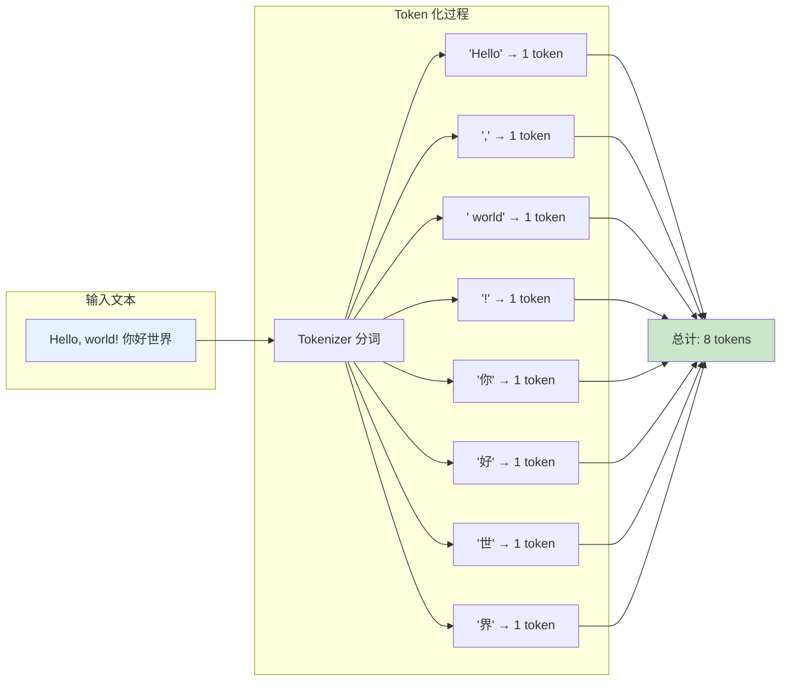
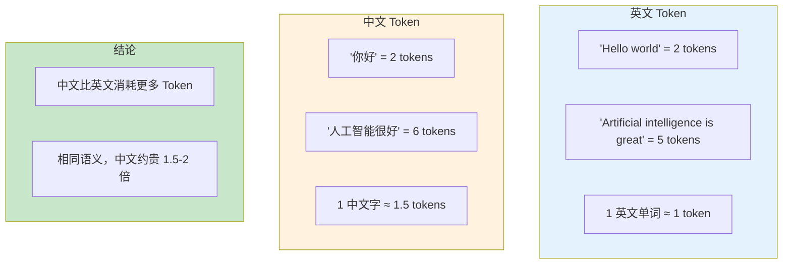
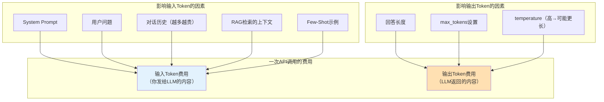
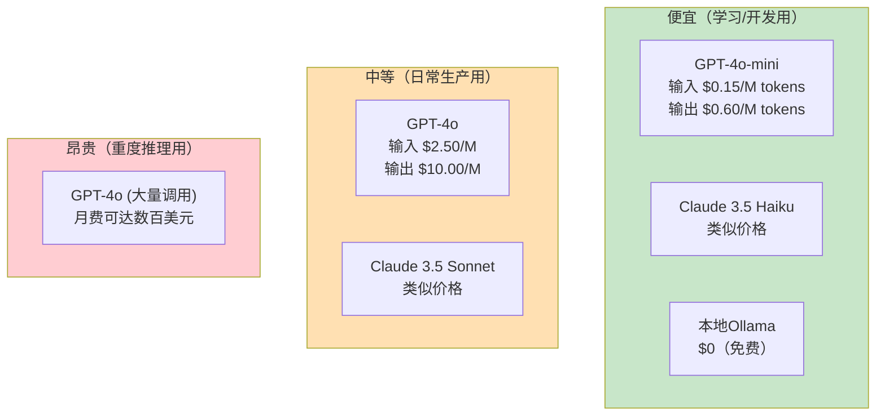
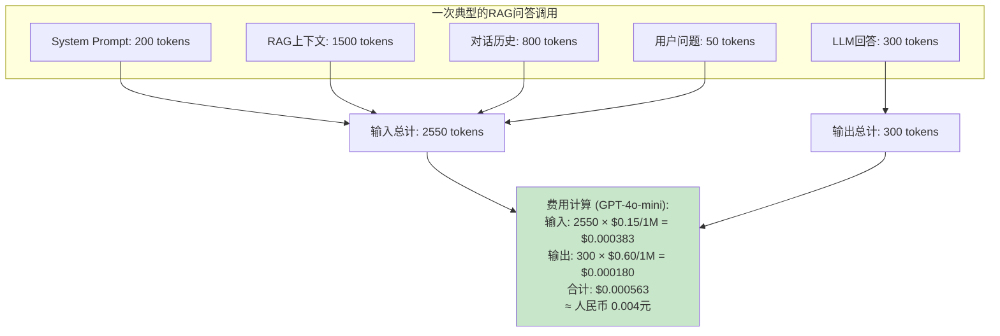
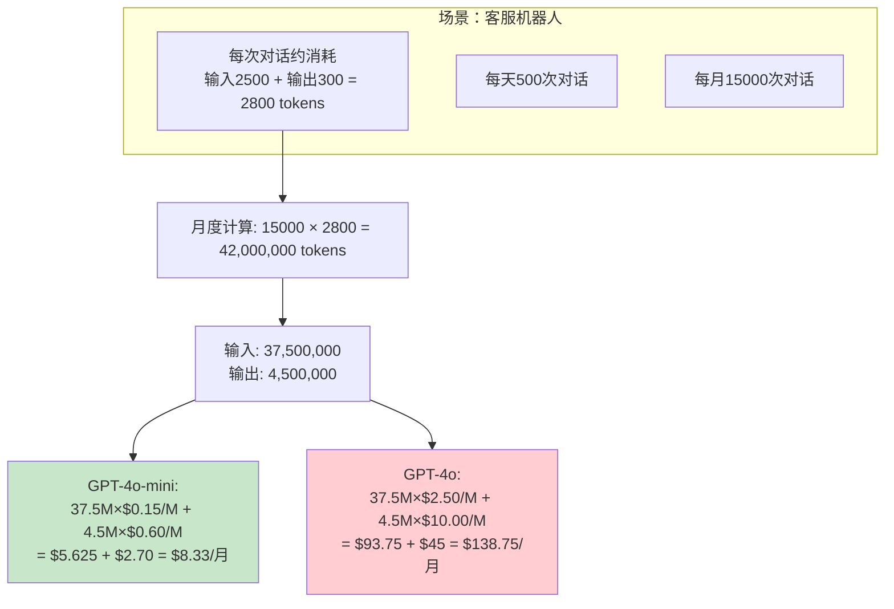
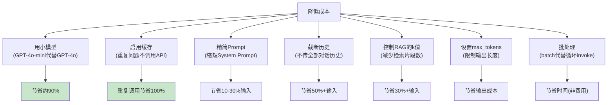

# Token 与成本可视化图解

> 理解 Token 计数方式和 LLM 调用成本结构，学会估算和控制费用。

---

## 一、Token 是什么



### 中英文 Token 对比



## 二、成本结构



### 各模型价格对比（参考值）



> ⚠️ 价格可能有变动，请以 [OpenAI 定价页](https://openai.com/pricing) 为准。

## 三、成本计算实例



### 月度成本估算



## 四、省钱策略



## 五、Token 统计代码

```python
# 运行时统计 Token
from langchain_openai import ChatOpenAI

llm = ChatOpenAI(model="gpt-4o-mini")
response = llm.invoke("解释什么是递归")

usage = response.usage_metadata
print(f"输入Tokens: &#123;usage['input_tokens']&#125;")
print(f"输出Tokens: &#123;usage['output_tokens']&#125;")
print(f"总Tokens: &#123;usage['total_tokens']&#125;")

# 估算成本
INPUT_PRICE = 0.15 / 1_000_000  # $0.15 per 1M
OUTPUT_PRICE = 0.60 / 1_000_000  # $0.60 per 1M
cost = (usage['input_tokens'] * INPUT_PRICE +
        usage['output_tokens'] * OUTPUT_PRICE)
print(f"本次成本: $&#123;cost:.6f&#125;")
```
