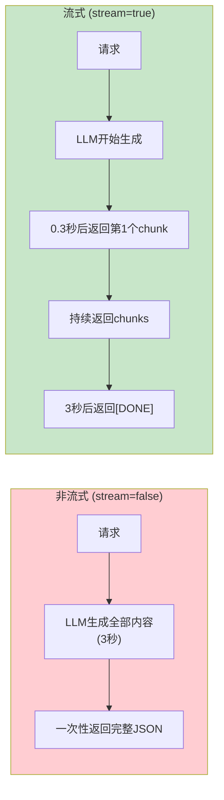
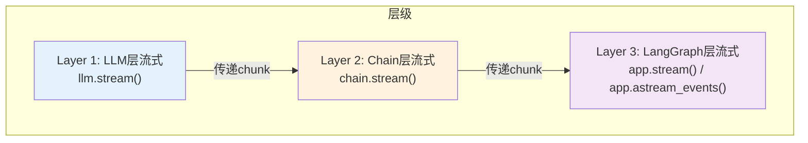
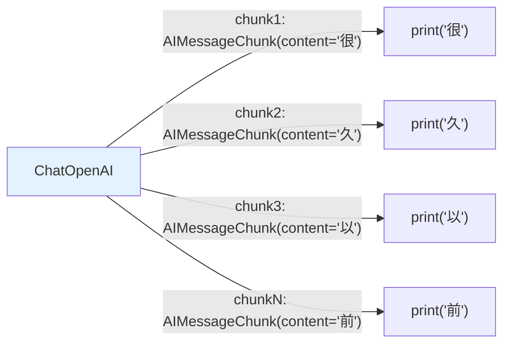
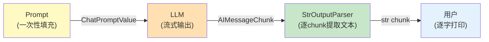
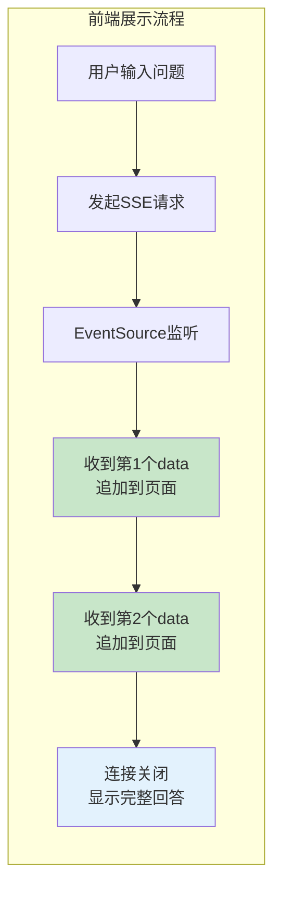
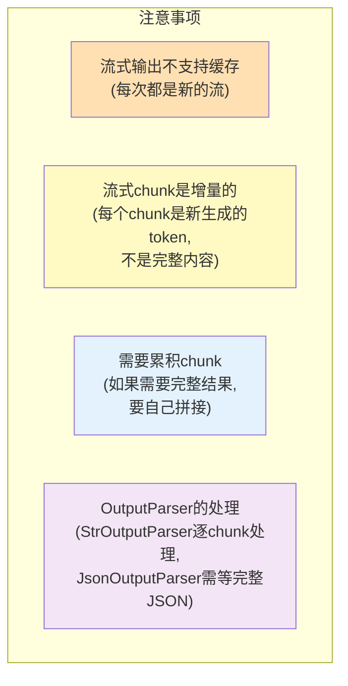

# 流式输出原理图解

> 理解 LLM 流式输出的底层原理、SSE 协议和前端展示方式。

---

## 一、流式输出的底层原理

```mermaid
sequenceDiagram
    participant U as 用户代码
    participant SDK as LangChain SDK
    participant API as OpenAI API
    participant M as LLM模型

    U->>SDK: chain.stream(input)
    SDK->>API: POST /chat/completions &#123;stream: true&#125;
    API->>M: 开始生成

    M-->>API: Token 1 ("你")
    API-->>SDK: data: &#123;"choices": [&#123;"delta": &#123;"content": "你"&#125;&#125;]&#125;
    SDK-->>U: yield "你"

    M-->>API: Token 2 ("好")
    API-->>SDK: data: &#123;"choices": [&#123;"delta": &#123;"content": "好"&#125;&#125;]&#125;
    SDK-->>U: yield "好"

    M-->>API: Token 3 ("！")
    API-->>SDK: data: &#123;"choices": [&#123;"delta": &#123;"content": "！"&#125;&#125;]&#125;
    SDK-->>U: yield "！"

    M-->>API: [DONE]
    API-->>SDK: 流结束
    SDK-->>U: 迭代结束
```



### 关键：stream=true 参数



## 二、invoke vs stream vs batch

```mermaid
graph TB
    subgraph invoke ["invoke - 单条同步"]
        I1["输入1条"] --> I2["等待全部完成"]
        I2 --> I3["返回完整结果<br/>(AIMessage对象)"]
    end

    subgraph stream ["stream - 流式"]
        S1["输入1条"] --> S2["立即开始返回"]
        S2 --> S3["逐token yield"]
        S3 --> S4["返回生成器"]
    end

    subgraph batch ["batch - 批量并发"]
        B1["输入N条"] --> B2["内部并发请求"]
        B2 --> B3["等待全部完成"]
        B3 --> B4["返回N条完整结果"]
    end

    subgraph astream ["astream - 异步流式"]
        A1["输入1条"] --> A2["异步yield"]
        A2 --> A3["不阻塞事件循环"]
    end

    style invoke fill:#E3F2FD
    style stream fill:#C8E6C9
    style batch fill:#FFF3E0
    style astream fill:#F3E5F5
```



### 首字延迟对比

```
invoke:  ───────●█████████████████████────  (首字: 3.0s)
stream:  ──●████████████████████████████   (首字: 0.3s)
```

## 三、LangChain 各层级的流式



### Layer 1: LLM 直接流式

```python
for chunk in llm.stream("讲个故事"):
    print(chunk.content, end="", flush=True)
```



### Layer 2: Chain 流式

```python
chain = prompt | llm | StrOutputParser()

for chunk in chain.stream(&#123;"topic": "AI"&#125;):
    print(chunk, end="", flush=True)
```



### Layer 3: LangGraph 流式

```mermaid
graph TB
    subgraph LangGraph流式模式
        M1["app.stream()<br/>节点级别流式<br/>每执行完一个节点输出一次"]
        M2["app.astream_events()<br/>事件级别流式<br/>捕获LLM的token级别输出"]
    end

    subgraph stream输出 ["app.stream() 输出"]
        S1["&#123;'node_a': &#123;...&#125;&#125;<br/>(节点A完成)"]
        S2["&#123;'node_b': &#123;...&#125;&#125;<br/>(节点B完成)"]
        S3["&#123;'node_c': &#123;...&#125;&#125;<br/>(节点C完成)"]
    end

    subgraph astream_events输出 ["app.astream_events() 输出"]
        E1["event: on_chain_start"]
        E2["event: on_chat_model_stream<br/>data: chunk('你')"]
        E3["event: on_chat_model_stream<br/>data: chunk('好')"]
        E4["event: on_chain_end"]
    end

    style M1 fill:#E3F2FD
    style M2 fill:#F3E5F5
```



## 四、前端展示：SSE 协议

```mermaid
sequenceDiagram
    participant F as 前端浏览器
    participant S as FastAPI服务端
    participant L as LLM

    F->>S: POST /chat/stream &#123;question: "什么是AI?"&#125;
    
    Note over S: 设置 StreamingResponse<br/>media_type = "text/event-stream"

    S->>L: astream 请求

    loop SSE 事件流
        L-->>S: chunk "A"
        S-->>F: data: A\n\n
        Note over F: EventSource.onmessage<br/>追加 "A" 到页面

        L-->>S: chunk "I"
        S-->>F: data: I\n\n
        Note over F: 追加 "I"
    end

    L-->>S: [DONE]
    S-->>F: [连接关闭]
    Note over F: 流结束
```



### SSE 数据格式

```
data: 第一个chunk\n\n
data: 第二个chunk\n\n
data: 第三个chunk\n\n
```

每个 `data:` 是一条事件，用 `\n\n` 分隔。前端用 EventSource API 接收。

## 五、前端消费流式数据

```javascript
// 前端 JavaScript (EventSource API)
const eventSource = new EventSource('/chat/stream?question=什么是AI?');

let fullAnswer = '';

eventSource.onmessage = function(event) &#123;
    fullAnswer += event.data;
    document.getElementById('answer').innerText = fullAnswer;
&#125;;

eventSource.onerror = function() &#123;
    eventSource.close();
&#125;;
```



## 六、流式输出注意事项



### 累积完整结果

```python
# 流式输出时累积完整结果
full_text = ""
for chunk in chain.stream(&#123;"topic": "AI"&#125;):
    print(chunk, end="", flush=True)
    full_text += chunk  # 累积

print(f"\n\n完整结果: &#123;full_text&#125;")
```

### JSON 流式的特殊处理

```mermaid
graph TB
    subgraph JSON流式问题
        J1["LLM输出JSON:<br/>'&#123;\"name\": \"张三\", \"age\": 28&#125;'"]
        J2["流式chunks:<br/>'&#123;', '\"na', 'me\"', ': \"', '张三', ...
        J3["问题: 中间的chunk<br/>不是合法JSON"]
    end

    subgraph 解决方案
        S1["方案1: 等全部完成再解析<br/>(先累积再parse)"]
        S2["方案2: 用partial JSON parser<br/>(JsonOutputParser支持)"]
    end

    style JSON流式问题 fill:#FFCDD2
    style 解决方案 fill:#C8E6C9
```

```python
# 方案1：先累积再解析（简单可靠）
full_text = ""
for chunk in chain.stream(&#123;"input": "提取信息"&#125;):
    full_text += chunk

import json
result = json.loads(full_text)

# 方案2：JsonOutputParser 支持部分解析
# chain = prompt | llm | JsonOutputParser()
# 在流式模式下会尝试部分解析
```
