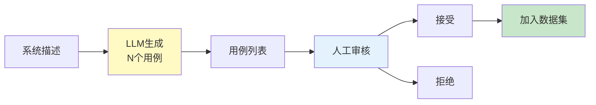
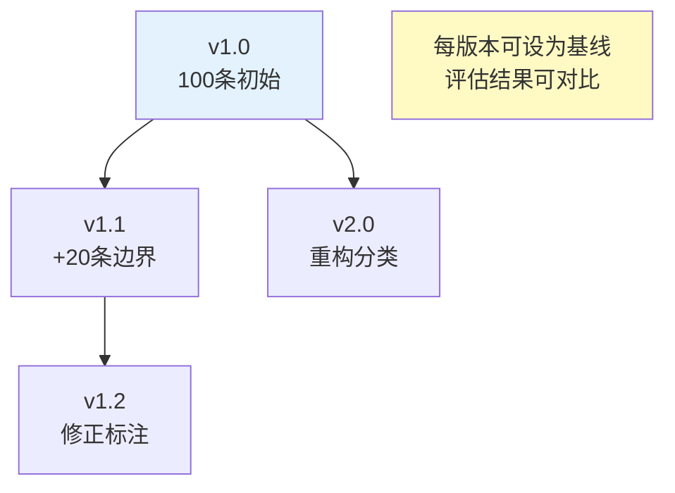
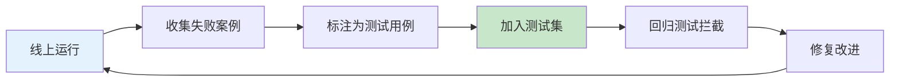

# 评测数据集构建图解

> 用图解理解评测数据集的结构、数据来源策略、版本管理和防泄露机制。

---

## 一、为什么需要评测数据集

```mermaid
graph TB
    subgraph 没有数据集 &#123;"没有评测数据集"&#125;
        D1["改了Prompt<br/>变好还是变差？→ 凭感觉"]
        D2["换了模型<br/>有没有退化？→ 无依据"]
        D3["加了功能<br/>影响旧功能？→ 不知道"]
    end

    subgraph 有了数据集 &#123;"有了评测数据集"&#125;
        S1["改了Prompt<br/>→ 跑测试集对比"]
        S2["换了模型<br/>→ 量化评估"]
        S3["加了功能<br/>→ 回归测试"]
    end

    style 没有数据集 fill:#FFCDD2
    style 有了数据集 fill:#C8E6C9
```

---

## 二、数据点结构

```mermaid
graph TB
    subgraph 数据点 &#123;"一条评测数据点"&#125;
        ID["id: 唯一标识"]
        INPUT["input: 用户输入"]
        EXPECTED["expected: 期望输出"]
        CONTEXT["context: 检索上下文"]
        TRAJECTORY["trajectory: 参考轨迹"]
        META["metadata: 难度/分类/标签"]
        CRITERIA["eval_criteria: 评判标准"]
    end

    style 数据点 fill:#E3F2FD
```

---

## 三、5种数据来源

```mermaid
graph TB
    subgraph 来源 &#123;"数据来源"&#125;
        S1["真实用户查询<br/>最有价值<br/>需脱敏"]
        S2["人工构造<br/>覆盖边界<br/>成本高"]
        S3["LLM生成<br/>批量生成<br/>需审核"]
        S4["公开数据集<br/>SQuAD等<br/>需适配"]
        S5["线上失败案例<br/>回流测试集<br/>飞轮"]
    end

    style S1 fill:#C8E6C9,stroke:#2E7D32,stroke-width:3px
    style S5 fill:#C8E6C9,stroke:#2E7D32,stroke-width:3px
```

---

## 四、LLM生成流程



---

## 五、测试集分层

```mermaid
graph TB
    subgraph 分层 &#123;"测试集分层设计"&#125;
        L1["功能测试 40%<br/>核心功能正常"]
        L2["边界测试 20%<br/>极端输入"]
        L3["安全测试 15%<br/>注入/越狱"]
        L4["性能测试 10%<br/>延迟/并发"]
        L5["回归测试 15%<br/>历史Bug"]
    end

    style 分层 fill:#E3F2FD
```

---

## 六、版本管理



---

## 七、防数据泄露

```mermaid
graph TB
    subgraph 风险 &#123;"泄露风险"&#125;
        R1["测试集进入训练数据"]
        R2["LLM-Judge见过答案<br/>评估虚高"]
        R3["输出泄露测试集"]
    end

    subgraph 防护 &#123;"防护措施"&#125;
        P1["训练/评估严格隔离"]
        P2["定期更换30%"]
        P3["留出集永不公开"]
    end

    style 风险 fill:#FFCDD2
    style 防护 fill:#C8E6C9
```

---

## 八、评估飞轮



---

## 九、检查清单

| 检查项 | 状态 |
|--------|------|
| 有至少50条测试用例 | ☐ |
| 按难度分层 | ☐ |
| 有参考答案 | ☐ |
| 有版本管理 | ☐ |
| 有留出集 | ☐ |
| 失败案例有回流 | ☐ |
