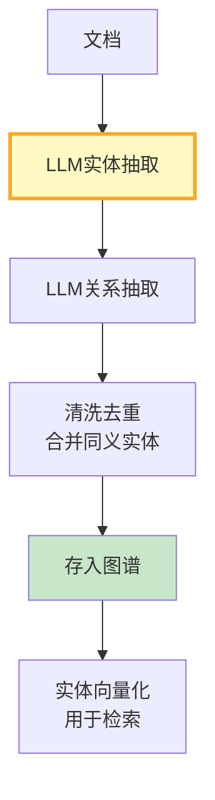
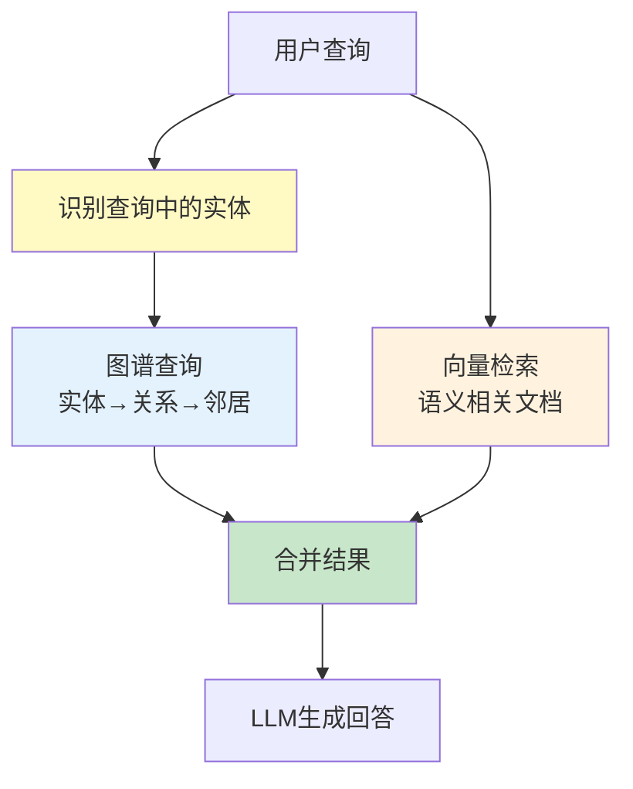
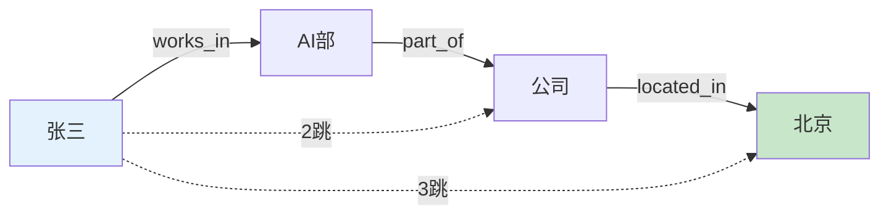

# 知识图谱构建流程图解

> 用图解理解知识图谱三要素、构建流程和 GraphRAG 混合检索。

---

## 一、GraphRAG vs 纯向量RAG

```mermaid
graph LR
    subgraph 向量RAG &#123;"纯向量RAG"&#125;
        VQ["'张三的同事'"] --> V["找相似文档"] --> VR["❌ 没有关系信息"]
    end

    subgraph GraphRAG &#123;"GraphRAG"&#125;
        GQ["'张三的同事'"] --> G["图谱: 张三→colleague→?"] --> GR["✅ 李四、王五"]
    end

    style 向量RAG fill:#FFCDD2
    style GraphRAG fill:#C8E6C9
```

---

## 二、知识图谱三要素

```mermaid
graph TB
    E["Entity 实体<br/>节点"] --> R["Relation 关系<br/>边"]
    R --> A["Attribute 属性<br/>节点特征"]

    ZS["张三<br/>&#123;age:30&#125;"] -->|"works_in"| AI["AI部"]
    LS["李四"] -->|"colleague_of"| ZS

    style E fill:#E3F2FD
    style R fill:#FFF3E0
    style A fill:#C8E6C9
```



---

## 三、构建流程



---

## 四、混合检索流程



---

## 五、多跳查询



---

## 六、检查清单

| 检查项 | 状态 |
|--------|------|
| 理解三要素 | ☐ |
| 能用LLM抽取实体关系 | ☐ |
| 能做多跳查询 | ☐ |
| 实现了GraphRAG | ☐ |
