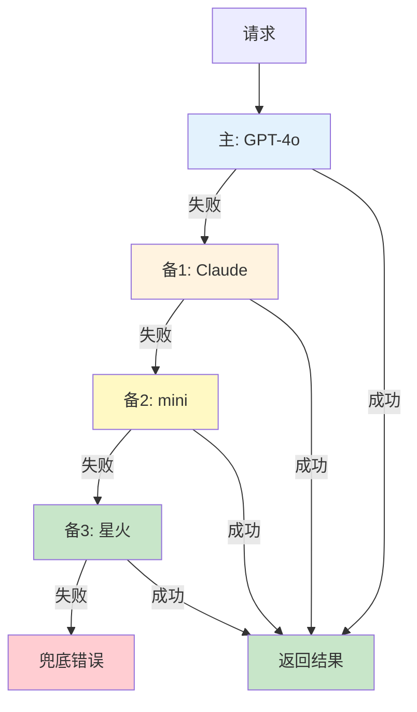

# LLM 网关架构图解

> 用图解理解 LLM 网关的核心功能、架构设计和降级链。

---

## 一、为什么需要网关

```mermaid
graph TB
    subgraph 没有网关 &#123;"没有网关"&#125;
        APP["应用"] --> O["OpenAI SDK"]
        APP --> C["Claude SDK"]
        APP --> S["星火 SDK"]
        O --> K["Key散乱/错误各不同/成本无法追踪"]
    end

    subgraph 有网关 &#123;"有网关"&#125;
        APP2["应用"] --> GW["统一网关"]
        GW --> M1["OpenAI"]
        GW --> M2["Claude"]
        GW --> M3["星火"]
    end

    style 没有网关 fill:#FFCDD2
    style 有网关 fill:#C8E6C9
    style GW fill:#1565C0,color:#fff
```

---

## 二、网关架构

```mermaid
graph TB
    CLIENT["客户端"] --> AUTH["认证"]
    AUTH --> RATE["限流<br/>令牌桶"]
    RATE --> CACHE&#123;"缓存<br/>命中？"&#125;
    CACHE -->|命中| RET["返回"]
    CACHE -->|未命中| ROUTER["路由<br/>选模型"]
    ROUTER --> PROVIDER["模型提供者"]
    PROVIDER --> P1["OpenAI"]
    PROVIDER --> P2["Claude"]
    PROVIDER --> P3["星火"]
    PROVIDER --> FALL["降级链"]
    PROVIDER --> RET

    style ROUTER fill:#FFF9C4,stroke:#F9A825,stroke-width:3px
    style CACHE fill:#C8E6C9
    style FALL fill:#FFCDD2
```

---

## 三、智能路由

```mermaid
graph TB
    Q["请求"] --> C&#123;"复杂度?"&#125;
    C -->|简单| FAST["gpt-4o-mini<br/>$0.15/1M"]
    C -->|中等| STD["gpt-4o<br/>$2.50/1M"]
    C -->|复杂| POWER["gpt-4o<br/>$2.50/1M"]

    SAVE["80%走小模型<br/>成本降60%"]

    style C fill:#FFF9C4
    style FAST fill:#C8E6C9
    style SAVE fill:#C8E6C9
```

---

## 四、降级链



---

## 五、8大核心功能

```mermaid
graph TB
    subgraph 功能 &#123;"网关8大功能"&#125;
        F1["统一API"]
        F2["智能路由"]
        F3["自动降级"]
        F4["统一限流"]
        F5["语义缓存"]
        F6["成本追踪"]
        F7["密钥管理"]
        F8["可观测性"]
    end

    style 功能 fill:#E3F2FD
```

---

## 六、检查清单

| 检查项 | 状态 |
|--------|------|
| 实现了统一接口 | ☐ |
| 实现了路由 | ☐ |
| 实现了降级 | ☐ |
| 实现了限流 | ☐ |
| 有成本追踪 | ☐ |
