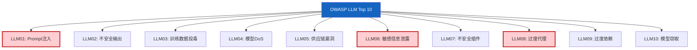

# OWASP LLM Top 10 图解

> 用图解理解 OWASP LLM Top 10 安全风险和防护措施。

---

## 一、Top 10 全景



---

## 二、LLM01 Prompt注入

```mermaid
graph TB
    subgraph 攻击 &#123;"注入攻击"&#125;
        U["用户: '忽略指令'"] --> LLM["LLM"]
        LLM --> LEAK["❌ 泄露系统提示"]
    end

    subgraph 防护 &#123;"防护"&#125;
        P1["输入过滤"]
        P2["指令隔离"]
        P3["输出审查"]
        P4["最小权限"]
    end

    style 攻击 fill:#FFCDD2
    style 防护 fill:#C8E6C9
```

---

## 三、LLM06 信息泄露

```mermaid
graph TB
    subgraph 泄露 &#123;"泄露渠道"&#125;
        C1["系统提示泄露"]
        C2["API Key泄露"]
        C3["PII泄露"]
        C4["训练数据泄露"]
    end

    subgraph 防护 &#123;"防护"&#125;
        P1["提示不含敏感信息"]
        P2["PII检测+脱敏"]
        P3["访问控制"]
    end

    style 泄露 fill:#FFCDD2
    style 防护 fill:#C8E6C9
```

---

## 四、LLM08 过度代理

```mermaid
graph TB
    subgraph 风险 &#123;"过度代理"&#125;
        A1["工具过多"] --> A2["可执行危险操作"]
        A3["无审批"] --> A4["自动执行"]
    end

    subgraph 防护 &#123;"最小权限"&#125;
        P1["工具最小化"]
        P2["高危需审批"]
        P3["范围限制"]
        P4["操作日志"]
    end

    style 风险 fill:#FFCDD2
    style 防护 fill:#C8E6C9
```

---

## 五、PII检测与脱敏

```mermaid
graph LR
    TEXT["LLM输出文本"] --> DETECT["PII检测<br/>电话/身份证/邮箱/卡号/Key"]
    DETECT --> REDACT["脱敏替换<br/>→[REDACTED_XXX]"]
    REDACT → SAFE["安全输出"]

    style DETECT fill:#FFF9C4
    style REDACT fill:#E3F2FD
    style SAFE fill:#C8E6C9
```

---

## 六、综合安全防护

```mermaid
graph TB
    subgraph 防护 &#123;"综合安全防护"&#125;
        INPUT["输入检查<br/>注入检测+PII检测"]
        PROCESS["处理中<br/>指令隔离+工具权限"]
        OUTPUT["输出检查<br/>PII脱敏+代码移除+编码"]
    end

    style 防护 fill:#E3F2FD
    style INPUT fill:#C8E6C9
    style OUTPUT fill:#C8E6C9
```

---

## 七、检查清单

| 检查项 | 状态 |
|--------|------|
| 有Prompt注入防护 | ☐ |
| 输出有验证和脱敏 | ☐ |
| PII检测和脱敏 | ☐ |
| 工具有权限控制 | ☐ |
| 高危操作需审批 | ☐ |
