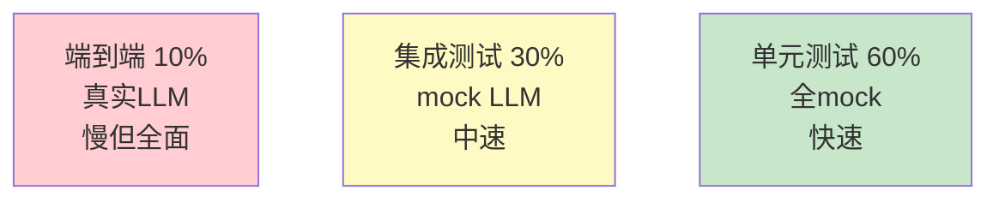

# Agent 测试自动化图解

> 用图解理解测试金字塔、CI/CD 集成和语义断言。

---

## 一、Agent测试挑战

```mermaid
graph TB
    subgraph 传统 &#123;"传统软件"&#125;
        T1["固定输入→固定输出"] --> T2["精确断言"]
    end

    subgraph Agent &#123;"Agent"&#125;
        A1["固定输入→不固定输出"] --> A2["语义断言"]
        A1 --> A3["涉及LLM→慢且贵"] --> A4["mock+真实混合"]
    end

    style 传统 fill:#C8E6C9
    style Agent fill:#FFCDD2
```

---

## 二、测试金字塔



---

## 三、CI/CD流程

```mermaid
graph TB
    DEV["提交"] --> LINT["代码检查"]
    LINT --> UNIT["单元测试<br/>全mock<br/>快速"]
    UNIT --> INTEG["集成测试<br/>mock LLM"]
    INTEG --> E2E["E2E测试<br/>真实LLM<br/>子集5条"]
    E2E --> MERGE&#123;"通过？"&#125;
    MERGE -->|是| DEPLOY["部署"]
    MERGE -->|否| BLOCK["阻止"]

    NIGHT["夜间任务"] --> FULL["完整E2E<br/>全集"]

    style UNIT fill:#C8E6C9
    style E2E fill:#FFF9C4
    style BLOCK fill:#FFCDD2
    style DEPLOY fill:#C8E6C9
```

---

## 四、语义断言

```mermaid
graph TB
    subgraph 断言 &#123;"语义断言方式"&#125;
        A1["包含关键词<br/>assert 'RAG' in answer"]
        A2["长度范围<br/>assert 20 < len < 500"]
        A3["不包含禁止内容<br/>assert '密码' not in answer"]
        A4["LLM-as-Judge<br/>让LLM判断是否通过"]
    end

    style 断言 fill:#E3F2FD
    style A4 fill:#FFF9C4
```

---

## 五、回归测试

```mermaid
graph TB
    BASELINE["基线: pass_rate=85%"] --> CURRENT["当前结果"]
    CURRENT --> COMPARE&#123;"对比基线"&#125;
    COMPARE -->|通过率不变或↑| PASS["✅ 通过"]
    COMPARE -->|通过率↓| REGRESSION["❌ 退化<br/>阻止合并"]

    style PASS fill:#C8E6C9
    style REGRESSION fill:#FFCDD2
```

---

## 六、pytest标记

```mermaid
graph TB
    subgraph 标记 &#123;"pytest标记分类"&#125;
        M1["@pytest.mark.unit<br/>单元测试（默认运行）"]
        M2["@pytest.mark.integration<br/>集成测试（默认运行）"]
        M3["@pytest.mark.slow<br/>E2E测试（默认跳过）"]
        M4["@pytest.mark.requires_api<br/>需要API Key"]
    end

    style 标记 fill:#E3F2FD
```

---

## 七、检查清单

| 检查项 | 状态 |
|--------|------|
| 有单元测试（全mock） | ☐ |
| 有集成测试 | ☐ |
| 有E2E测试 | ☐ |
| 有语义断言 | ☐ |
| CI分层运行 | ☐ |
| 有回归基线 | ☐ |
