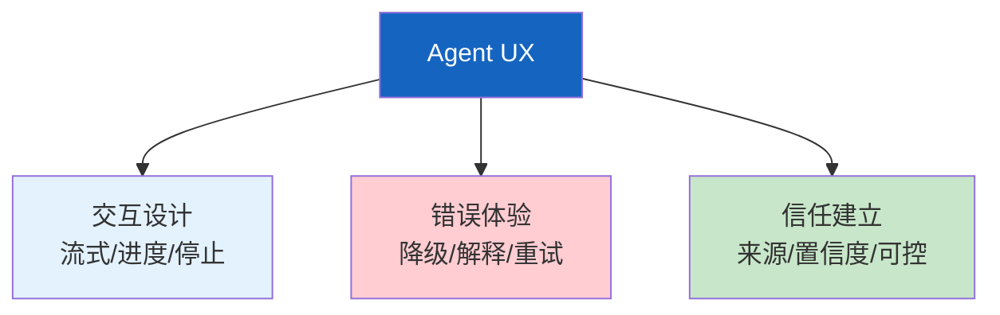
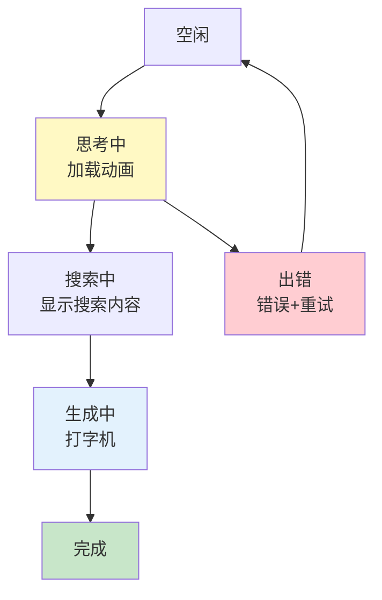
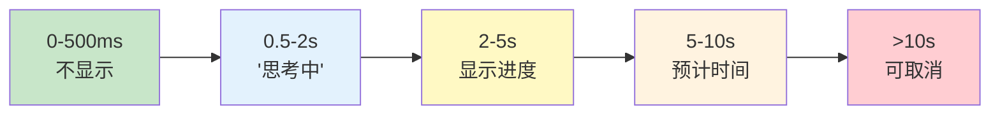

# Agent 用户体验设计图解

> 用图解理解 Agent UX 的三个维度、响应状态流和错误体验设计。

---

## 一、UX三个维度



---

## 二、响应状态流



---

## 三、加载状态时间线



---

## 四、错误体验原则

```mermaid
graph TB
    subgraph 原则 &#123;"错误体验5原则"&#125;
        E1["不说技术错误<br/>用人话解释"]
        E2["给下一步建议<br/>'可以重试'"]
        E3["保留已有内容<br/>不清空"]
        E4["提供人工兜底<br/>'转人工'"]
        E5["可重试<br/>不卡死"]
    end

    style 原则 fill:#C8E6C9
```

---

## 五、信任建立5法

```mermaid
graph TB
    subgraph 信任 &#123;"建立信任"&#125;
        T1["引用来源<br/>标注信息出处"]
        T2["置信度展示<br/>高/中/低"]
        T3["渐进信任<br/>先低风险"]
        T4["用户可控<br/>可修改/撤销"]
        T5["透明决策<br/>展示推理过程"]
    end

    style 信任 fill:#C8E6C9
```

---

## 六、检查清单

| 检查项 | 状态 |
|--------|------|
| 有流式输出 | ☐ |
| 有工具进度 | ☐ |
| 错误用人话 | ☐ |
| 有停止按钮 | ☐ |
| 标注来源 | ☐ |
| 展示置信度 | ☐ |
