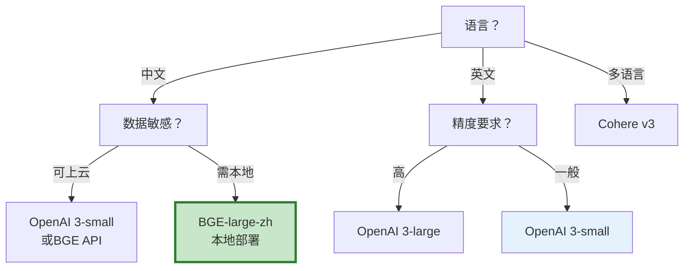
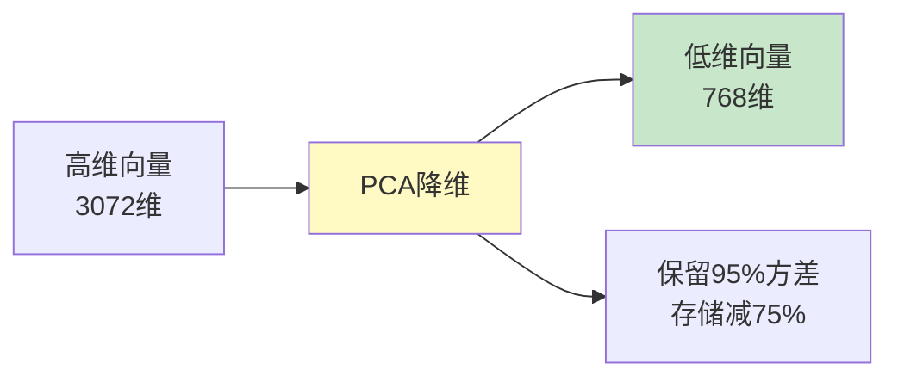

# Embedding 模型选型图解

> 用图解理解 Embedding 模型对比、维度权衡和选型决策。

---

## 一、主流模型对比

```mermaid
graph TB
    subgraph 模型 &#123;"主流Embedding模型"&#125;
        M1["OpenAI 3-small<br/>1536维<br/>通用英文"]
        M2["OpenAI 3-large<br/>3072维<br/>高精度"]
        M3["BGE-large-zh<br/>1024维<br/>中文最强"]
        M4["Cohere v3<br/>1024维<br/>多语言"]
        M5["GTE-large<br/>1024维<br/>开源免费"]
    end

    style M3 fill:#C8E6C9,stroke:#2E7D32,stroke-width:3px
```

---

## 二、维度权衡

```mermaid
graph TB
    subgraph 维度 &#123;"维度选择"&#125;
        D1["768维<br/>小/快/精度低"]
        D2["1024维<br/>平衡推荐"]
        D3["1536维<br/>精度高/大/慢"]
        D4["3072维<br/>最高/最贵"]
    end

    style D2 fill:#C8E6C9,stroke:#2E7D32,stroke-width:3px
```

---

## 三、评估指标

```mermaid
graph TB
    subgraph 指标 &#123;"评估Embedding质量"&#125;
        M1["召回率<br/>Top-K中相关的比例"]
        M2["精确率<br/>结果中相关的比例"]
        M3["MRR<br/>第一个相关文档的排名倒数"]
        M4["延迟<br/>嵌入耗时"]
        M5["成本<br/>$/1M tokens"]
    end

    style 指标 fill:#E3F2FD
```

---

## 四、选型决策



---

## 五、PCA降维



---

## 六、检查清单

| 检查项 | 状态 |
|--------|------|
| 用真实数据评估 | ☐ |
| 对比了多个模型 | ☐ |
| 考虑了维度 | ☐ |
| 考虑了语言 | ☐ |
| 考虑了数据敏感 | ☐ |
