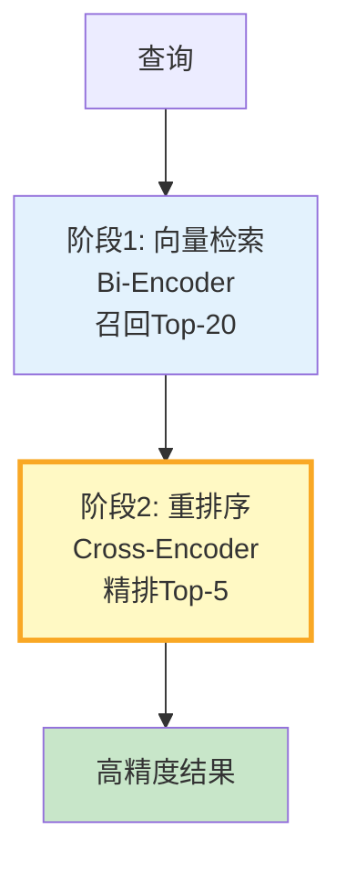

# RAG 重排序流程图解

> 用图解理解 Bi-Encoder vs Cross-Encoder、两阶段检索和效果对比。

---

## 一、为什么需要重排序

```mermaid
graph TB
    subgraph 问题 &#123;"向量检索精度有限"&#125;
        Q["查询"] → BI["Bi-Encoder<br/>各自编码"]
        BI → SIM["cosine相似度<br/>丢失交互"]
        SIM → R1["Top-1可能不准"]
    end

    subgraph 解决 &#123;"重排序提升精度"&#125;
        Q2["查询"] → RET["向量检索Top-20"]
        RET → CROSS["Cross-Encoder<br/>联合编码精排"]
        CROSS → R2["Top-1更准"]
    end

    style 问题 fill:#FFCDD2
    style 解决 fill:#C8E6C9
```

---

## 二、Bi-Encoder vs Cross-Encoder

```mermaid
graph TB
    subgraph Bi &#123;"Bi-Encoder"&#125;
        Q1["查询→向量A"] → S1["cosine(A,B)"]
        D1["文档→向量B"] → S1
        S1 → R1["快/精度中/大规模召回"]
    end

    subgraph Cross &#123;"Cross-Encoder"&#125;
        Q2["查询"] → CONCAT["拼接→Transformer"]
        D2["文档"] → CONCAT
        CONCAT → R2["慢/精度高/小规模精排"]
    end

    style Bi fill:#E3F2FD
    style Cross fill:#C8E6C9
```

---

## 三、两阶段检索



---

## 四、效果对比

| 方案 | 召回率 | MRR | 延迟 |
|------|--------|-----|------|
| 无重排序 | 70% | 0.45 | 5ms |
| 有重排序 | 85% | 0.65 | 55ms |

---

## 五、检查清单

| 检查项 | 状态 |
|--------|------|
| 理解Bi vs Cross区别 | ☐ |
| 实现了两阶段检索 | ☐ |
| 评估了重排序效果 | ☐ |
