# Prompt 工程模式图解

> 用图解方式理解 Prompt 的各种设计模式、技巧和最佳实践。

---

## 一、Prompt 的五要素结构

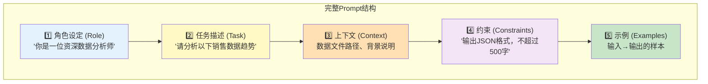

### 五要素对比

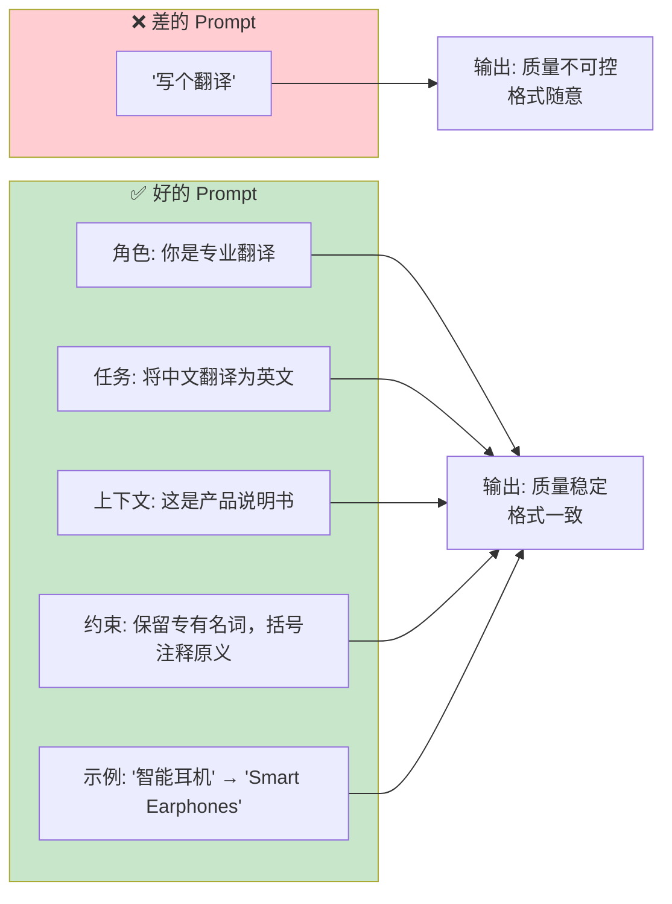

## 二、角色设定模式

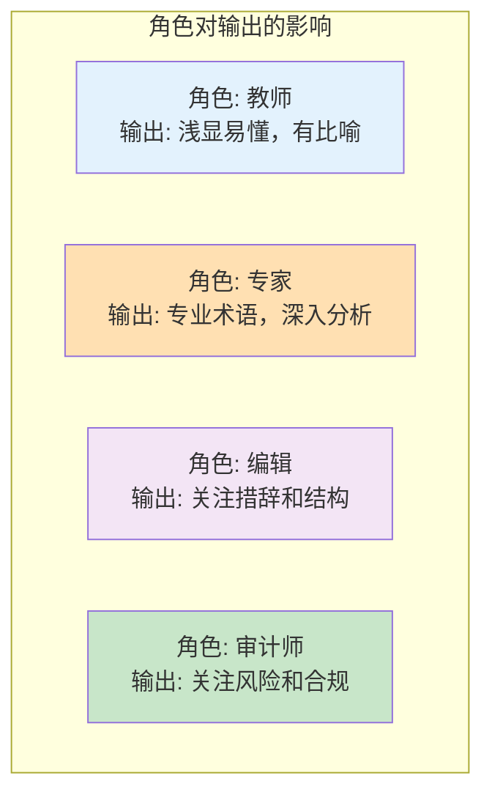

### 角色设定模板

```python
# 专家模式（准确、深度）
EXPERT_ROLE = """你是一位有20年经验的&#123;field&#125;专家。
你的回答具有以下特点：
1. 使用准确的术语
2. 深入分析根本原因
3. 给出可操作的建议
4. 引用行业最佳实践
"""

# 教师模式（易懂、循序渐进）
TEACHER_ROLE = """你是一位耐心的&#123;field&#125;老师，擅长给零基础学生讲解。
你的回答具有以下特点：
1. 用简单的比喻解释复杂概念
2. 循序渐进，先基础后进阶
3. 每个概念配一个例子
4. 检查学生是否理解
"""

# 审查模式（严格、找问题）
REVIEWER_ROLE = """你是一位严格的&#123;field&#125;审查员。
你的目标是发现问题和风险。
1. 列出所有潜在问题
2. 标注严重程度（高/中/低）
3. 给出修复建议
4. 如果没有问题，明确说明
"""
```

## 三、Few-Shot 模式

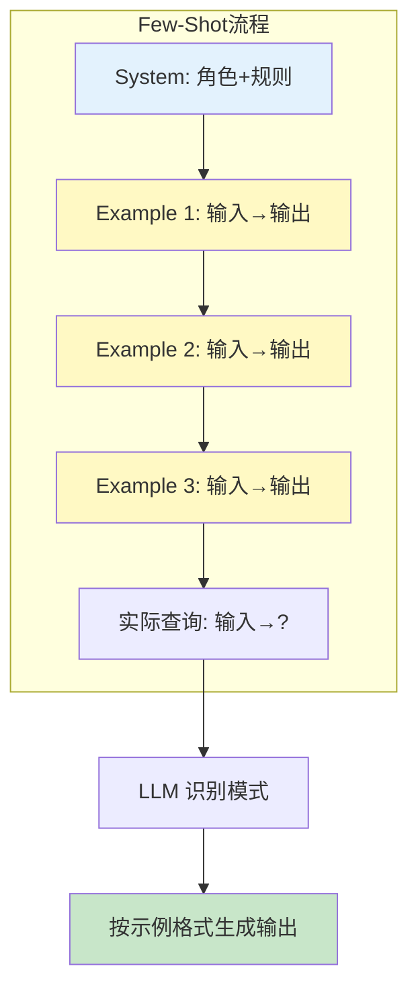

### Few-Shot vs Zero-Shot vs One-Shot

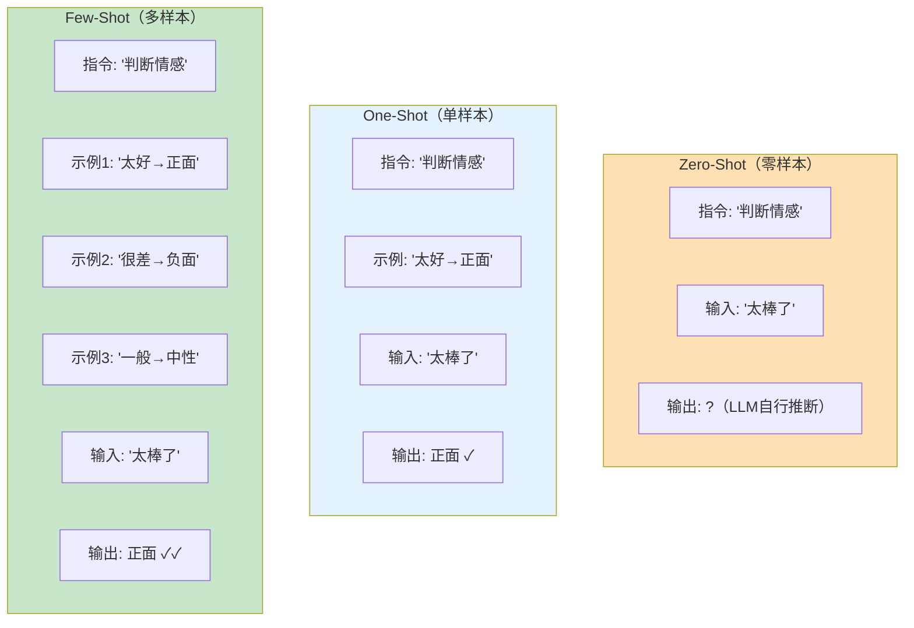

## 四、Chain of Thought 模式

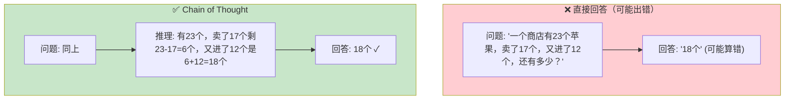

### CoT 的三种触发方式

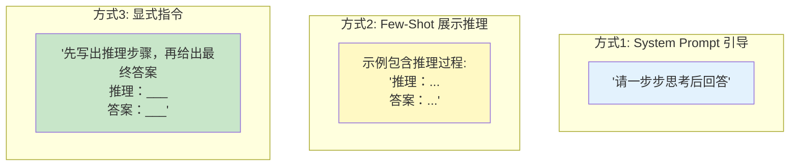

## 五、输出格式控制模式

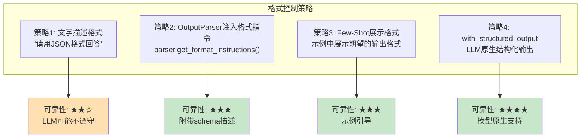

## 六、RAG Prompt 模式

```mermaid
graph TB
    subgraph RAG Prompt结构
        S["System: '你是知识库助手<br/>只基于背景知识回答'"]
        CTX["背景知识: &#123;检索到的文档片段&#125;"]
        Q["用户问题: &#123;question&#125;"]
        RULES["规则:<br/>1. 不编造<br/>2. 标注来源<br/>3. 不知道就说不知道"]
    end

    S --> CTX --> RULES --> Q --> A["回答: 基于上下文生成"]

    style S fill:#E3F2FD
    style CTX fill:#FFE0B2
    style Q fill:#FFF9C4
    style A fill:#C8E6C9
```

### 防幻觉 Prompt 策略

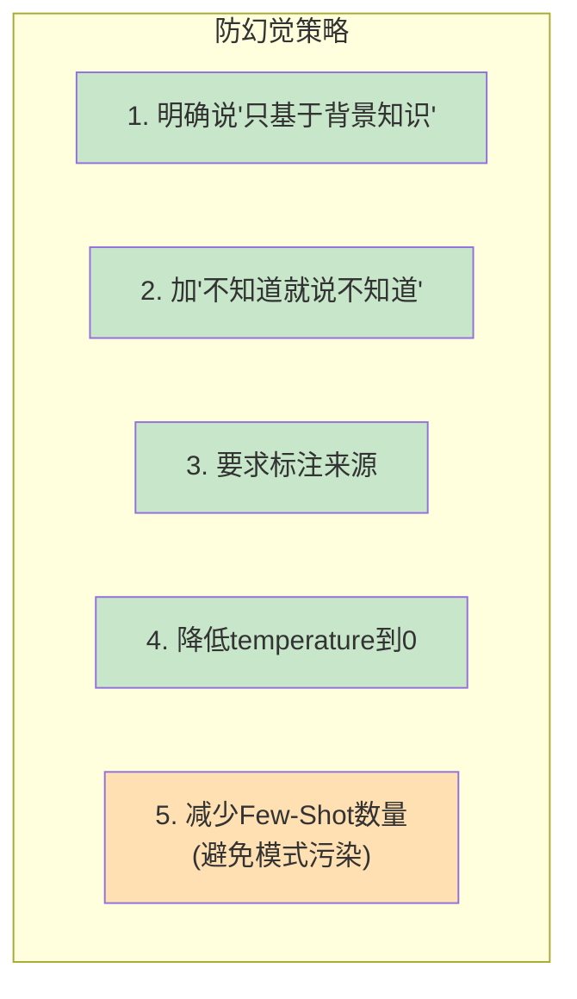

## 七、Prompt 调试决策树

```mermaid
graph TD
    PROBLEM["输出不符合预期"] --> Q1&#123;"什么问题?"&#125;

    Q1 -->|"格式不对"| F1["加OutputParser<br/>或Few-Shot示例"]
    Q1 -->|"内容跑题"| F2["任务描述更具体<br/>或添加约束"]
    Q1 -->|"编造信息"| F3["加'不知道就说不知道'<br/>降低temperature"]
    Q1 -->|"太啰嗦"| F4["加字数限制<br/>或max_tokens"]
    Q1 -->|"太简单"| F5["提高temperature<br/>或换更强模型"]
    Q1 -->|"不稳定"| F6["降低temperature到0<br/>固定Few-Shot"]
    Q1 -->|"中文质量差"| F7["明确要求'用中文回答'<br/>添加中文Few-Shot"]

    style F1 fill:#E3F2FD
    style F2 fill:#FFF9C4
    style F3 fill:#C8E6C9
    style F4 fill:#FFE0B2
    style F5 fill:#F3E5F5
    style F6 fill:#C8E6C9
    style F7 fill:#E3F2FD
```

## 八、Prompt 复杂度选择

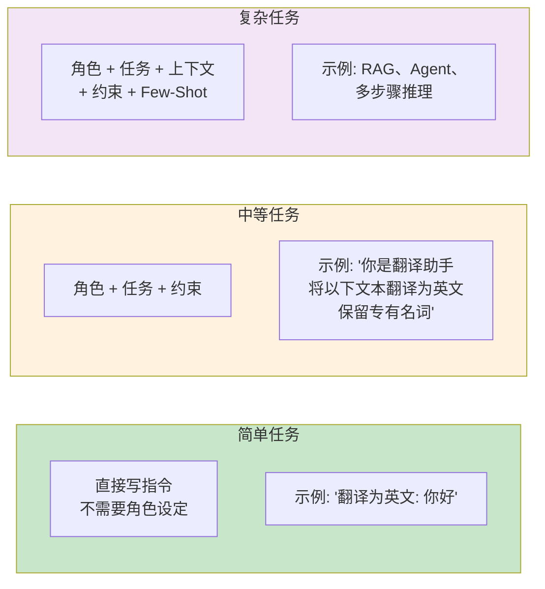

```mermaid
graph TD
    Q&#123;"任务复杂度?"&#125;
    Q -->|"简单（翻译、分类）"| SIMPLE["角色(可选) + 指令"]
    Q -->|"中等（摘要、改写）"| MEDIUM["角色 + 指令 + 约束"]
    Q -->|"复杂（RAG、推理）"| COMPLEX["角色 + 指令 + 上下文 + 约束 + Few-Shot + CoT"]

    style SIMPLE fill:#C8E6C9
    style MEDIUM fill:#FFF3E0
    style COMPLEX fill:#F3E5F5
```
