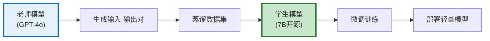
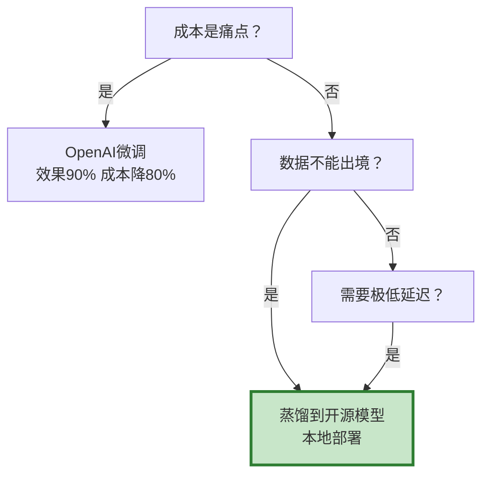

# 模型蒸馏流程图解

> 用图解理解蒸馏原理、数据生成和效果评估。

---

## 一、蒸馏原理



---

## 二、数据来源

```mermaid
graph TB
    subgraph 来源 &#123;"蒸馏数据来源"&#125;
        D1["真实用户查询<br/>质量最高"]
        D2["LLM生成<br/>量大需审核"]
        D3["公开数据集<br/>需适配"]
    end

    style D1 fill:#C8E6C9,stroke:#2E7D32,stroke-width:3px
```

---

## 三、蒸馏效果

```mermaid
graph TB
    subgraph 对比 &#123;"蒸馏前后对比"&#125;
        BEFORE["老师模型<br/>效果: 100%<br/>成本: $2.50/1M<br/>延迟: 2s"]
        AFTER["学生模型<br/>效果: 85-90%<br/>成本: $0.25/1M<br/>延迟: 0.3s"]
    end

    style BEFORE fill:#FFCDD2
    style AFTER fill:#C8E6C9
```

---

## 四、部署方式

```mermaid
graph TB
    subgraph 部署 &#123;"两种部署方式"&#125;
        OLLAMA["Ollama<br/>简单部署<br/>低并发"]
        VLLM["vLLM<br/>高并发<br/>批处理"]
    end

    style OLLAMA fill:#E3F2FD
    style VLLM fill:#FFF3E0
```

---

## 五、选型决策



---

## 六、检查清单

| 检查项 | 状态 |
|--------|------|
| 理解蒸馏原理 | ☐ |
| 能生成蒸馏数据 | ☐ |
| 能评估蒸馏效果 | ☐ |
| 能本地部署 | ☐ |
