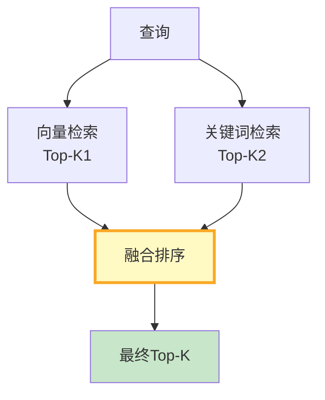

# RAG 混合检索图解

> 用图解理解向量检索与关键词检索的互补、混合检索架构和权重调优。

---

## 一、两种检索互补

```mermaid
graph TB
    subgraph 向量 &#123;"向量检索"&#125;
        V1["✅ 懂语义"]
        V2["❌ 精确匹配差"]
    end

    subgraph 关键词 &#123;"关键词检索"&#125;
        K1["❌ 不懂语义"]
        K2["✅ 精确匹配强"]
    end

    subgraph 混合 &#123;"混合检索"&#125;
        H1["✅ 两者兼得"]
    end

    style 向量 fill:#E3F2FD
    style 关键词 fill:#FFF3E0
    style 混合 fill:#C8E6C9,stroke:#2E7D32,stroke-width:3px
```

---

## 二、混合检索架构



---

## 三、权重策略

```mermaid
graph TB
    subgraph 权重 &#123;"权重按场景"&#125;
        W1["自然语言问答<br/>向量0.7 + 关键词0.3"]
        W2["ID/代码搜索<br/>向量0.3 + 关键词0.7"]
        W3["通用场景<br/>向量0.5 + 关键词0.5"]
    end

    style 权重 fill:#E3F2FD
```

---

## 四、效果对比

```mermaid
graph TB
    V["纯向量<br/>召回72%"] vs K["纯关键词<br/>召回65%"]
    H["混合检索<br/>召回88%"]

    style V fill:#E3F2FD
    style K fill:#FFF3E0
    style H fill:#C8E6C9,stroke:#2E7D32,stroke-width:3px
```

---

## 五、融合方式

```mermaid
graph TB
    subgraph 融合 &#123;"两种融合方式"&#125;
        F1["加权融合<br/>分数归一化后加权求和<br/>需要调权重"]
        F2["RRF融合<br/>按排名倒数加权<br/>不需要归一化"]
    end

    style 融合 fill:#E3F2FD
    style F2 fill:#C8E6C9,stroke:#2E7D32,stroke-width:3px
```

---

## 六、检查清单

| 检查项 | 状态 |
|--------|------|
| 理解两种检索优劣 | ☐ |
| 实现了混合检索 | ☐ |
| 能调权重 | ☐ |
| 评估了效果 | ☐ |
