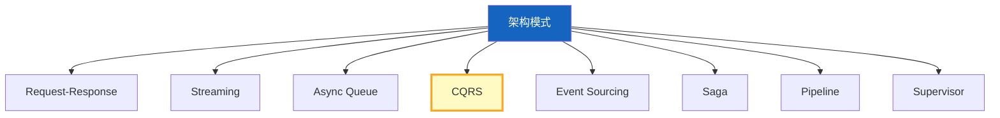
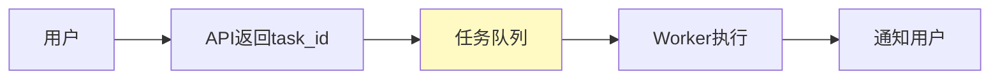
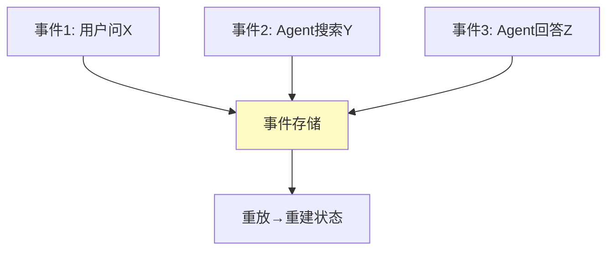
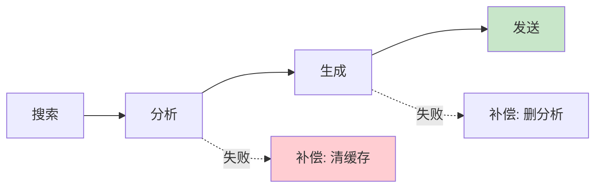
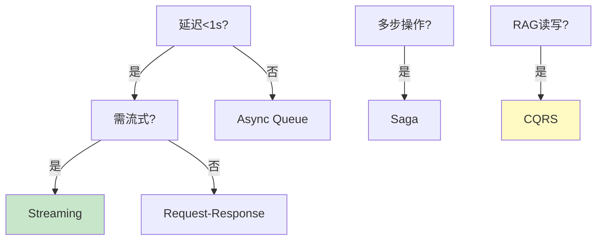

# LLM 应用架构模式图解

> 用图解理解 8 种架构模式的核心思想和选型决策。

---

## 一、8种模式总览



---

## 二、CQRS（读写分离）

```mermaid
graph TB
    subgraph 写 &#123;"写路径(离线)"&#125;
        W1["文档→ETL→嵌入→向量库"]
    end
    subgraph 读 &#123;"读路径(在线)"&#125;
        R1["查询→检索→生成"]
    end

    style 写 fill:#E3F2FD,stroke:#1565C0,stroke-width:3px
    style 读 fill:#C8E6C9,stroke:#2E7D32,stroke-width:3px
```

---

## 三、Async Queue



---

## 四、Event Sourcing



---

## 五、Saga



---

## 六、选型决策



---

## 七、检查清单

| 检查项 | 状态 |
|--------|------|
| 理解8种模式 | ☐ |
| 知道CQRS在RAG的应用 | ☐ |
| 理解Event Sourcing | ☐ |
| 能根据场景选模式 | ☐ |
